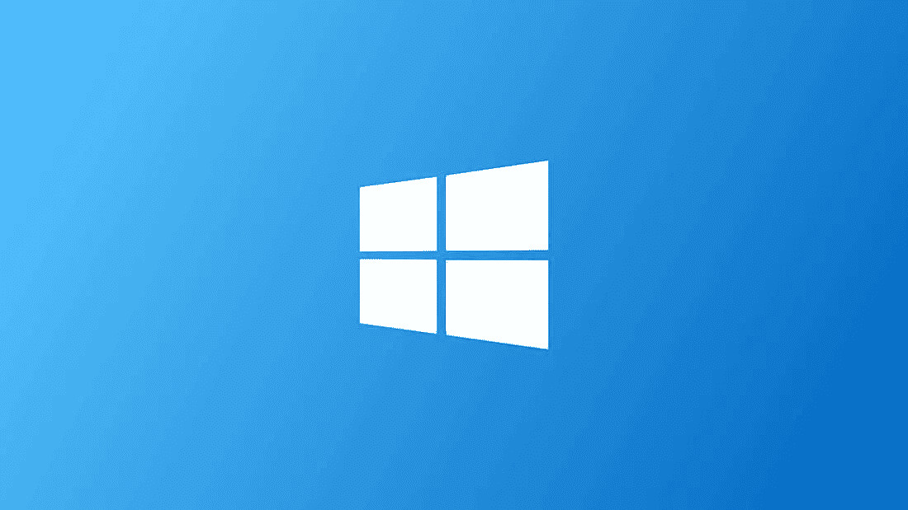

# 您的操作系统是否受到保护，免受威胁？

> 原文：<https://medium.com/nerd-for-tech/is-your-operating-system-secured-and-protected-from-threats-75a9fc337bce?source=collection_archive---------26----------------------->

照片 b[y Luis Villasm](https://unsplash.com/@villxsmil?utm_source=medium&utm_medium=referral)il o[n unslap](https://unsplash.com?utm_source=medium&utm_medium=referral)sh

随着越来越复杂的计算机系统，计算机技术变得越来越复杂。操作系统、编程人员和系统分析人员所犯的错误或缺乏经验会导致潜在的安全隐患。计算机病毒、网络攻击、垃圾邮件、系统漏洞、网络窃取信息、虚假有害信息、网络犯罪等。是计算机安全的突出问题

很多人认为安全和保护，这两个词可以随便用。但两者意思不同。

安全性仅向适当的用户授予系统访问权限，并且涉及外部威胁。而保护处理对系统资源的访问，并且涉及内部威胁。保护和安全需要 CPU、软件、内存等计算机资源。受到保护。这延伸到操作系统以及系统中的数据。这可以通过确保操作系统的完整性、机密性和可用性来实现。系统必须受到保护，防止未经授权的访问(安全性差)、病毒、蠕虫等。让我们来谈谈一些程序威胁和系统威胁。

# 程序威胁

操作系统的进程和内核按照指令执行指定的任务。如果一个用户程序让这些进程执行恶意任务，那么它就被称为**程序威胁**。程序威胁的一个常见例子是安装在计算机上的程序，该程序可以存储用户凭证并通过网络将其发送给黑客。以下是一些众所周知的程序威胁列表。

*   **特洛伊木马**—此类程序会捕获用户登录凭证并存储起来，然后发送给恶意用户，这些恶意用户随后可以登录计算机并访问系统资源。
*   **活板门**——如果一个被设计为按要求工作的程序在其代码中有一个安全漏洞，并在用户不知情的情况下执行非法操作，那么它就被称为有一个活板门。
*   **逻辑炸弹**——逻辑炸弹是一种程序只有在满足特定条件时才会出现错误行为的情况，否则它将作为真正的程序运行。更难察觉。
*   **病毒**——顾名思义，病毒可以在计算机系统上进行自我复制。它们非常危险，可以修改/删除用户文件，使系统崩溃。病毒通常是嵌入在程序中的一小段代码。当用户访问该程序时，病毒开始嵌入到其他文件/程序中，并可能使用户无法使用系统

# 系统威胁

系统威胁是指滥用系统服务和网络连接使用户陷入困境。系统威胁可用于在整个网络上发起程序威胁，称为程序攻击。系统威胁造成了这样一种环境，即操作系统资源/用户文件被滥用。以下是一些众所周知的系统威胁列表。

*   **Worm**—Worm 是一个进程，它会通过极度使用系统资源来降低系统性能。Worm 进程生成多个副本，其中每个副本使用系统资源，阻止所有其他进程获得所需的资源。蠕虫程序甚至可以关闭整个网络。
*   **端口扫描**—端口扫描是一种机制或手段，黑客可以通过它来检测系统漏洞，从而对系统进行攻击。
*   **拒绝服务**—拒绝服务攻击通常会阻止用户合法使用系统。例如，如果拒绝服务攻击浏览器的内容设置，用户可能无法使用互联网。

# 安全性不是你的操作系统的特性

尽管一些操作系统供应商声称，安全性不是一个可以内置到操作系统中的特性，原因很简单，安全性不是一个可以“添加”或“取走”的商品。

假设既没有技术的全面融合，也没有任何明确的论据来证明一种操作系统比其他操作系统“更安全”，那么回答哪个操作系统更好这个问题的最佳方式是什么呢？当涉及到关键的安全特性，如内置的反恶意软件工具、沙箱、系统保护和代码签名时，操作系统之间肯定存在差异。一个操作系统明显比其他的好吗？让我们看看他们是如何堆叠的。先说不同 OS 系统的安全性。

# **Windows 是最安全的平台吗？**

Windows 操作系统

许多人认为，在讨论的所有三个操作系统中，Windows 是最不安全的平台，仅仅是因为其庞大的用户规模。由于大约 80%的用户使用 Windows，恶意软件编写者和黑客肯定会将 Windows 作为目标，而不是其他任何平台。众所周知，人们一生都在使用 Windows。基本上，与 Linux 或 macOS 相比，Windows 受到病毒威胁的可能性更大，因为 Windows 提供了更大的攻击范围。

# Linux 是最安全的平台吗？

Linux 操作系统

许多行业专家都认为 Linux 比 Windows 和 macOS 都更安全。正如前面所暗示的，数字攻击者通常不会以 Linux 为目标，因为它的使用率很低。与 Windows 和 macOS 相比，它的市场份额只有最低的个位数。根据一些报道，它的市场份额不到 3%。基本上，Linux 鼓励用户使用他们平台内的工具，而不是访问一个可疑的网站来下载某些东西，消除了在这个过程中感染病毒的风险。

# 麦金塔是最安全的平台吗？

mac 操作系统

传言说，你不可能在 macOS 上受到病毒攻击，因为它有非常干净的记录。嗯，macOS 比 Windows 更安全，不是因为它有一些突破性的安全机制，而是因为与 Windows 相比攻击更少。也就是说，它确实提供了一个安全的平台，使威胁无法访问核心文件，从而造成巨大的破坏。在 macOS 上，应用程序也保证是沙盒化的。威胁基本上被封装在计算机的其余部分之外，防止它们被缓解。它的工作原理类似于 macOS 的高效杀毒软件。

最终，所有的操作系统都实现了沙箱、代码签名等等来维护数字卫生。这是显而易见的一点，但事实是，漏洞仍然存在。信不信由你，最近一项揭露骗子的研究发现，近 84%的黑客使用非技术策略来获取机密信息。因此，你使用什么操作系统并不重要。通过利用社会工程，黑客将很容易笑到最后。

# 了解保护设备免受安全威胁的 18 种方法。

## 1.使用防病毒保护和防火墙。

Windows 和 macOS 有内置的防火墙，这种软件旨在在你的信息和外界之间建立一道屏障。防火墙防止对您的企业网络的未经授权的访问，并提醒您任何入侵企图。上网前，请确保防火墙已启用。您也可以从 Cisco、Sophos 或 Fortinet 等公司购买硬件防火墙，这取决于您的宽带路由器，它也有一个内置的防火墙来保护您的网络。如果您的企业规模较大，您可以购买额外的企业网络防火墙。

## **2。安装杀毒软件。**

计算机病毒和恶意软件无处不在。诸如 *Bitdefender、* [Panda Free Antivirus](https://www.pandasecurity.com/mediacenter/panda-security/panda-cloud-antivirus-free-now-panda-free-antivirus/) 、 [Malwarebytes](https://www.malwarebytes.com/) 和 [Avast](https://www.avast.com/en-us/index#mac) 等反病毒程序保护您的计算机免受可能威胁您操作系统的未授权代码或软件的攻击。病毒可能具有容易发现的效果，例如，它们可能会降低计算机速度或删除关键文件，或者它们可能不太明显。

## 3.安装反间谍软件软件包。

间谍软件是一种特殊的软件，秘密监视和收集个人或组织信息。它被设计为难以检测和删除，并倾向于发送不想要的广告或搜索结果，旨在将您引向某些(通常是恶意的)网站。

一些间谍软件会记录下每次击键，以获取密码和其他财务信息。反间谍软件专门针对这种威胁，但它通常包含在主要的反病毒软件包中，如来自 [Webroot](https://www.webroot.com/us/en) 、 [McAfee](https://www.mcafee.com/en-us/index.html) 和 [Norton](https://us.norton.com/) 的软件包。反间谍软件包通过扫描所有传入信息和阻止威胁来提供实时保护。

## 4.使用复杂的密码。

使用安全的密码是防止网络入侵的最重要的方法。你的密码越安全，黑客就越难入侵你的系统。更安全往往意味着更长、更复杂。使用至少有八个字符以及数字、大小写字母和计算机符号组合的密码。黑客们有很多工具可以在几分钟内破解简单的密码。

不要使用可识别的单词或组合来表示生日或其他可以与您联系在一起的信息。也不要重复使用密码。如果你需要记住的密码太多，可以考虑使用密码管理器，比如 [Dashlane](https://www.dashlane.com/) 、[粘性密码](https://www.stickypassword.com/)、 [LastPass](https://www.lastpass.com/) 或者[密码 Boss](https://www.passwordboss.com/) 。

## 5.让您的操作系统、应用和浏览器保持最新。

总是给你的操作系统安装新的更新。大多数更新包括安全修复，防止黑客访问和利用您的数据。应用程序也是如此。今天的网络浏览器越来越复杂，尤其是在隐私和安全方面。除了安装全新的更新之外，请务必检查您的浏览器安全设置。

## 6.忽略垃圾邮件。

当心来自未知方的电子邮件，不要点击其中的链接或打开附件。收件箱垃圾邮件过滤器在捕捉最明显的垃圾邮件方面已经变得相当不错。但是，模仿您的朋友、同事和受信任的企业(如您的银行)的更复杂的网络钓鱼电子邮件变得越来越常见，所以请留意任何看起来或听起来可疑的东西。

## 7.备份您的计算机。

如果您的公司还没有备份您的硬盘，您应该立即开始备份。备份您的信息至关重要，以防黑客成功入侵并破坏您的系统。

## 8.关掉它。

许多企业，尤其是那些运行 web 服务器的企业，总是“所有系统都在运行”。然而，如果你不是在经营一家复杂的基于互联网的公司，那么在夜间或者长时间不工作的时候关掉你的机器。总是开着会让你的电脑更容易被黑客发现和利用；关机会中断黑客可能已经与您的网络建立的连接，并消除任何可能的危害。

## 9.使用虚拟化。

不是每个人都需要走这条路，但如果你访问粗略的网站，预计将受到间谍软件和病毒的轰炸。虽然避免浏览器衍生入侵的最佳方式是避开不安全的网站，但虚拟化允许你在虚拟环境中运行浏览器，如 [Parallels](https://www.parallels.com/) 或 [VMware Fusion](https://www.vmware.com/products/fusion/fusion-evaluation.html) ，它绕过你的操作系统，使其更加安全。

## 10.保护您的网络。

路由器通常不会启用最高安全设置。设置网络时，请登录路由器，并使用安全的加密设置来设置密码。这可以防止入侵者渗透到您的网络中并破坏您的设置。

## 11.使用双因素身份验证。

密码是抵御电脑黑客的第一道防线，但第二层可以增强保护。许多网站允许您启用双因素身份验证，这提高了安全性，因为它要求您在登录时除了密码之外，还要键入数字代码(发送到您的电话或电子邮件地址)。

## 12.使用加密。

即使网络罪犯能够访问您的网络和文件，加密也可以阻止他们访问任何信息。你可以用 [BitLocker](https://docs.microsoft.com/en-us/windows/security/information-protection/bitlocker/bitlocker-overview) (Windows)或 [FileVault](https://support.apple.com/en-us/HT204837) (Mac)加密你的 Windows 或 macOS 硬盘，加密任何包含敏感信息的 u 盘，使用 VPN 加密网络流量。只在加密网站购物；你可以通过地址栏中的“https”和一个关闭的挂锁图标立即发现它们。

# 如何保护您的手机免受安全威胁

## 13.关闭蓝牙。

不使用蓝牙时，请将其关闭。让你的蓝牙处于休眠状态，为电脑黑客打开了另一扇后门。

## 14.不要使用不安全的公共 Wi-Fi。

无密码、广泛使用的 Wi-Fi 网络没有安全功能。因此，他们是电脑黑客的首要目标。

## 15.获取安全应用程序。

在你的手机上安装一个安全应用程序，就像你应该在你的电脑上安装一个防火墙、杀毒软件和反间谍软件一样。流行的选项包括 Avast、卡巴斯基移动反病毒软件和 Bitdefender。

## 16.使用更好的密码。

像 0000 和 1234 这样的解锁码很容易记住，但也很容易猜到。相反，选择随机生成的六位数密码。

## 17.关闭自动完成功能。

自动完成功能可以猜测您正在键入的内容，并为您完成单词、短语或其他信息。虽然方便，但这个工具几乎把你的电子邮件地址、邮寄地址、电话号码和其他重要信息交给了黑客。关掉它。

## 18.清除您的浏览历史。

你的手机浏览器也有浏览历史。经常清理它——包括 cookies 和缓存文件——如果黑客侵入你的手机，给他们尽可能少的信息。

因此，真正重要的是一个可靠的安全系统，它具有一系列保护功能，可以防止您的设备受到任何可以想象到的攻击，无论使用的是什么操作系统。