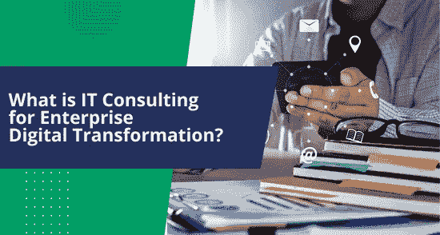

# 面向企业数字化转型的 IT 咨询

> 原文：<https://medium.com/nerd-for-tech/it-consulting-for-enterprise-digital-transformation-5e900093e233?source=collection_archive---------4----------------------->

现代企业正迅速走向流程的数字化。因此，越来越多的公司正在通过有效的 IT 战略实现流程优化、工作流程加速和提高盈利能力。

数字化转型对企业来说是一个新概念。许多企业尚未完全了解转型的潜力。到 2022 年，全球在数字化转型上的支出将达到 1.8 万亿美元。预计到 2025 年将超过 2.8 万亿美元。

公司必须创造一个欢迎变化的实验生态系统。在[值得信赖的企业软件开发公司](https://www.botreetechnologies.com/enterprise-software-development-company)的帮助下，快速计划和执行端到端转换的公司将在竞争中远远落后。

> **阅读更多:** [**创业公司为什么要与 IT 咨询公司合作？**](https://www.botreetechnologies.com/blog/why-should-startups-partner-with-it-consulting-firms/)

# 数字化转型的 IT 咨询意味着什么？

数字化转型咨询是一种以设计为导向的方法，旨在实施最新技术来优化流程、改善客户体验、提高客户满意度等。

[技术咨询公司](https://www.botreetechnologies.com/blog/top-technology-consulting-companies/) 在企业的数字化转型之旅中用他们的专业知识帮助企业。此外，它们还能帮助企业从传统商业模式向数字商业模式转型。

战略咨询服务，如 BoTree Technologies，帮助客户实施 ERP，重新设计现有周期，组装新的 IT 基础设施，云部署和 ML 解决方案。

一个顶级的软件开发公司将会有合适的专业知识和经验来指导你的组织，帮助你成为市场领导者。

# IT 咨询公司如何帮助企业数字化转型？

虽然数字化转型之旅对一家公司来说至关重要，但大约 30%的公司只能成功度过这一阶段。这是因为几个不确定性和阻力正在快速形成。这就产生了一个有问题的情况，并且需要一个集中的方法来处理转换项目。

以下是 [IT 咨询服务](https://www.botreetechnologies.com/it-consulting-services)实现数字化转型的一些方法

1.  **将变革视为业务转型**

*   顾问们不仅仅将这种变化视为流程优化的机会，而是将这种变化视为业务转型。
*   在转型过程中，客户应该拥有最高的偏好。 [IT 咨询](https://www.botreetechnologies.com/blog/what-does-it-consulting-company-actually-do/)服务识别所有摩擦点，然后实施端到端的转变。

**2。采用敏捷方法**

*   敏捷性对于任何转型都至关重要。为了确保成功的数字化转型，必须鼓励实验文化，让创新思想能够蓬勃发展。
*   [顶级 IT 顾问](https://www.botreetechnologies.com/blog/what-to-consider-while-hiring-an-it-consultant/) 采用敏捷方法，因为它允许在开发过程中进行试验和一致的变更。它提供了更好的控制、更高的生产质量和消费者满意度。

**3。系统评估**

*   IT 顾问提供对当前系统和流程的总体评估。它们有助于确定潜在的差距，在这些差距中，转型可以带来巨大的业务收益。
*   作为一个局外人，顾问们公平地评估摩擦点。这有助于准确评估数字化转型中需要立即关注的方面。

**4。问题的识别**

*   [IT 咨询服务](https://www.botreetechnologies.com/blog/top-5-benefits-of-hiring-it-consulting-services/)评估系统并识别问题。他们挖掘出这种情况背后的根本原因，因为他们有多年的行业经验。
*   识别有助于确定哪些流程需要进行数字化。

**5。战略发展**

*   IT 咨询合作伙伴通过创建突出计划和解决方案的转型计划来帮助实现数字化转型。有效的 IT 战略是数字化转型的路线图。
*   对于任何一家提供 IT 咨询的[软件咨询公司](https://botreetechnologies.medium.com/top-10-software-consulting-companies-for-enterprise-software-development-needs-43bfaa4d1515) ，战略都是最好的咨询工具之一。顾问在避免哪些陷阱和最佳实施方法方面经验丰富。

**6。实施和监测**

*   在数字化转型过程中，实施是 IT 顾问工作的重要组成部分。顾问设计、开发和测试解决方案，然后协助实施。
*   [顶级 IT 咨询服务](https://botreetechnologies.medium.com/top-10-it-consulting-services-companies-in-the-world-c8184b24fc07)不仅仅是解决方案实施。他们帮助客户维护传统替代品的数字系统。他们不断更新和监督 IT 系统。

# IT 咨询为企业数字化转型带来的好处

*   **创造更好的客户体验**
*   数字技术改变了消费者与品牌交易的方式。他们可以随时访问产品和服务。社交媒体等数字工具有助于公司直接向客户销售产品，并获得及时反馈。
*   IT 咨询主导的数字化转型支持对海量消费者数据的分析。这些基于 AI/ML 的[数字化转型工具](https://www.botreetechnologies.com/blog/digital-transformation-4-strategies-to-set-the-right-goals/)帮助企业做出更好的决策。
*   **面临竞争**
*   [IT 咨询公司](https://www.botreetechnologies.com/blog/7-reasons-to-hire-a-professional-it-consulting-company/)帮助数字化转型，以便在市场中保持相关性。它改进了业务流程，使组织获得了竞争优势。
*   [IT 咨询](https://www.botreetechnologies.com/blog/top-5-benefits-of-hiring-it-consulting-services/)帮助企业数字化，以更好地利用大数据进行战略决策和追求组织目标。
*   人工智能驱动的组织
*   人工智能的势头越来越大。根据 Gartner 的预测，基于人工智能的企业数字解决方案将在 2022 年达到 620 亿美元，比 2021 年增长 21.3%。人工智能允许企业保护其用户的信息。该信息可用于在其他决策中决定最佳通信策略。
*   IT 公司部署人工智能工具来帮助营销人员进行更个性化的营销活动。 [87%的营销人员](https://www.marketo.com/engagement-marketing/)报告称，当他们使用人工智能工具进行个性化活动时，效果更好。
*   **变革管理**
*   数字化转型有很多风险，其实施面临刚性阻力。[数字化转型咨询公司](https://www.botreetechnologies.com/blog/it-consulting-firms-to-help-digital-transformation/) 帮助将风险降至最低，同时为员工提供所需的培训和意识，以减少摩擦。
*   他们确保转型只会带来积极的、被广泛接受的颠覆。
*   **咨询支持**
*   一些最好的 IT 咨询服务为企业领导提供了适当的指导。IT 顾问研究业务并提出解决问题领域的独特方法。
*   公司雇佣顾问是为了公司的最大利益。因此，他们还充当专家顾问，使企业在行业格局中保持正轨。

> **阅读更多:** [**创业公司如何克服 IT 战略挑战？**](https://www.botreetechnologies.com/blog/it-strategy-challenges/)

# 结论

数字化转型充满挑战。但是不管这个过程有多复杂，努力都是值得的。寻求运营转型的组织必须咨询值得信赖的数字化转型咨询公司。**IT 公司拥有丰富的经验、知识和专业技能，能够简化您的运营数字化。**

**IT 顾问从最终消费者的角度设想一切，因此设计出减少摩擦的解决方案。他们还控制着变革可能带来的混乱和不满。**

***原载于 2022 年 10 月 31 日 https://www.techinsightnews.com**的* [*。*](https://www.techinsightnews.com/what-is-it-consulting-for-enterprise-digital-transformation/)**