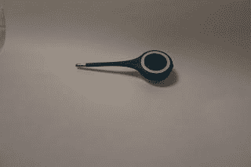

# 这是一个可弯曲的电子温度计

> 原文：<https://medium.com/nerd-for-tech/its-a-bendy-electronic-thermometer-93498bed8861?source=collection_archive---------22----------------------->

能够测量你的体温总是有用的，尤其是当世界处于疫情的时候，发烧的早期迹象可能意味着是否需要帮助。

[Kinsa](https://kinsahealth.com) 是一家美国公司，生产带有应用程序的温度计，他们声称他们的任务是“通过了解传染病在何时何地开始传播来阻止传染病的传播”，他们有一张 HeathWeather 地图(目前似乎只有美国有)。

有两种温度计，一种是入耳式的，一种是插入口腔、腋下或直肠的(未测试)。它有一个带金属尖端的柔性杆，连接到包含电子设备、电池(CR2032)和带背光的显示器的圆形顶部。

配套应用程序在 iOS 和 Android 上可用，并允许不同用户的多个配置文件。设备在使用前必须与应用程序配对。

背光很亮，这使得它很难显示显示，但它可以通过应用程序设置的摄氏或华氏显示。

这真的很容易使用，只需按下按钮，3 破折号将出现在显示器上，然后插入相关的孔。在很短的时间内，温度将被读取并出现在显示器和应用程序中，在那里它可以被分配给用户，温度显示为时间线，可以与卫生专业人员共享。

温度计完全通过了 FDA 的认证。

它可以直接通过 [Kinsa 健康商店](https://kinsahealth.com/shop)在线购买，价格非常合理，为 24.99 美元(不过在将运往英国的大型购物网站上可能会更便宜)。

【http://eurotechnews.blogspot.com】最初发表于**。**