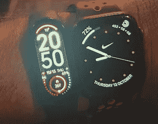
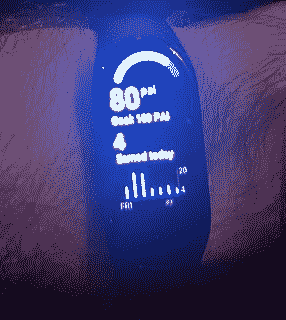
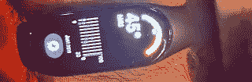

# 更大更亮，新款小米智能 Band 7

> 原文：<https://medium.com/nerd-for-tech/its-bigger-and-brighter-the-new-xiaomi-smart-band-7-ceb5b14f0a4f?source=collection_archive---------6----------------------->

小米(mi)更新了他们的健身追踪器小米 SmartBand 7。它有中国版和全球版，唯一真正的区别是中国版支持 NFC 支付(通过支付宝)。如果你幸运的话，支付宝可能会接受你的信用卡作为支付类型，然后你就可以通过 band 使用它了。两个版本都支持多种语言。

326 ppi AMOLED 屏幕增加到了 1.62 英寸，现在更亮了(它可能会令人分心)，比 Band 6 显示屏增加了 25%。随附的 USB 电缆末端有一个磁性连接器，可将连接器与带子对齐，并将其固定在适当的位置进行充电。

电池寿命是 15 天，但如果打开各种功能，如一些连续读数，电池寿命将大大减少。

Apple Watch 旁边的 Band 7

除了标准的黑色表带之外，还有多种表带可供选择。

通过 Mi Fit 应用程序(现更名为 Zepp Life 应用程序)可将 100 多张表盘下载到手表上。他们中的一些人可能很有中国人的个性，对西方市场来说似乎很奇怪。

该带具有以下“健康”功能

*   SpO2 监测
*   呼吸训练
*   心率监测
*   睡眠监测
*   压力监控
*   女性健康

SpO2(血氧含量)和心率监测与睡眠监测一样是连续的(即，无需告诉带您要睡觉)。

Band 7 支持 120 种运动模式，其中一些模式将尝试自动切换，可用于 50 米以下的游泳(但不包括潜水)。训练时估计 VO2 和恢复时间以及有氧和无氧运动时间。标准运动可直接访问，而其他运动可通过“所有”健身程序访问。

他们是

*   运转

> 户外跑步
> 
> 步行
> 
> 踏车
> 
> 室内步行
> 
> 竞走

*   自行车运动

> 户外自行车运动
> 
> 室内自行车运动
> 
> 适用于越野赛的自行车

游泳

> 游泳池游泳
> 
> 鳍泳
> 
> 艺术游泳
> 
> 户外锻炼
> 
> 钓鱼；捕鱼
> 
> 滑板
> 
> 轮滑
> 
> 攀岩运动
> 
> 跑酷

*   室内锻炼

> 即兴表演
> 
> 椭圆训练
> 
> 划手
> 
> 室内健身
> 
> HIIT
> 
> 核心培训
> 
> 有氧组合
> 
> 力量
> 
> 拉伸
> 
> 爬楼梯
> 
> 灵活性
> 
> 步进器(向前)
> 
> 步进器(向后)
> 
> 体育的
> 
> 瑜珈
> 
> 普拉提健身法
> 
> 有氧运动法
> 
> 大众体操
> 
> 有氧运动组合
> 
> 交叉训练
> 
> 纺纱
> 
> 单杠
> 
> 双杠
> 
> 战斗绳索

*   跳舞

> 芭蕾舞
> 
> 肚皮舞
> 
> 方块舞
> 
> 街舞
> 
> 舞厅
> 
> 跳舞
> 
> 尊巴
> 
> 拉丁舞
> 
> 爵士舞
> 
> 民间舞蹈
> 
> 嘻哈音乐
> 
> 钢管舞
> 
> 霹雳舞
> 
> 现代舞

*   战斗训练

> 剑道
> 
> 空手道
> 
> 拳击
> 
> 柔道
> 
> 摔跤
> 
> 太极
> 
> 泰拳
> 
> 跆拳道
> 
> 武术
> 
> 踢拳击
> 
> 柔术
> 
> 围墙

*   球类训练

> 网球
> 
> 足球
> 
> 板球
> 
> 棒球
> 
> 保龄球
> 
> 壁球
> 
> 篮球
> 
> 垒球
> 
> 门球
> 
> 排球
> 
> 乒乓球
> 
> 手球
> 
> 羽毛球
> 
> 沙滩排球
> 
> 壁球
> 
> 台球
> 
> 塞帕克·塔克拉夫
> 
> 躲避球
> 
> 水球
> 
> 冰球
> 
> 羽毛球
> 
> 五人制足球
> 
> 粗麻袋
> 
> 地掷球
> 
> 日航阿莱

*   水上运动

> 航行
> 
> 赛艇运动
> 
> 龙舟
> 
> 皮艇运动
> 
> 浮潜
> 
> 流动骑行

*   冬季锻炼

> 冰上溜石游戏
> 
> 滑冰
> 
> 室内滑冰

*   休闲锻炼

> 呼啦圈
> 
> 飞盘
> 
> 飞镖游戏
> 
> 放风筝
> 
> 拔河比赛
> 
> 羽毛球
> 
> 电子竞技
> 
> 空中步行者
> 
> 活跃的
> 
> 推圆盘游戏
> 
> 桌上足球
> 
> 生长激素

*   纸板和卡片

> 象棋
> 
> 国际跳棋
> 
> 重量
> 
> 桥
> 
> 棋盘游戏

*   其他人

> 跳绳
> 
> 箭术
> 
> 马术

至少可以说，乐队在棋盘游戏中实际测量的东西是有问题的。其他运动模式似乎可以工作，它可以在不切换到那个模式的情况下开始行走和跑步。

与其他昂贵得多的设备相比，跟踪是合理的。

很好，小米现在已经在他们的国际**商店中添加了许多产品，包括在英国版本中零售价为 54.99 英镑的智能手环 7([**【mi.com】**](http://mi.com/)检测你的位置，并使用它来提供本地商店)。肩带要 9.99 英镑(它们确实会断，扣子也可能会断)。**

**你也可以去你友好的中国网站购买，价格要便宜得多(尽管最近价格有所变化，运费可能会更贵，而且会在销售点增加增值税)。**