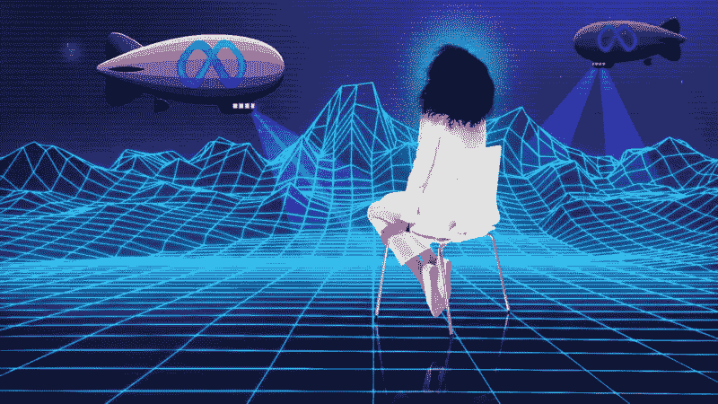

# 在元宇宙做女人很难。但是有一条出路

> 原文：<https://medium.com/nerd-for-tech/its-hard-to-be-a-woman-in-metaverse-but-there-is-a-way-out-6891d943f39?source=collection_archive---------6----------------------->

图片来源:Ars Technicia

是的，在最近推出的虚拟世界元宇宙(原名脸书)中做一个女人真的很难。

最近，社交媒体平台上流传着一些有趣的消息，一名女性测试者在脸书的元宇宙被人摸了。

在一篇文章中，43 岁的妮娜·简·帕特尔女士声称去年 12 月在虚拟现实中被“摸索”,她站出来解释了自己的可怕经历。

帕特尔太太吓坏了，她惊恐地看到和听到她的化身——电脑生成的她自己的版本——在一场旷日持久的攻击中被三个真实的男性角色通过虚拟现实耳机强行抓走。

> **她说:**“我以一个和我长得一模一样的头像进入了元宇宙地平线场馆——一个中年人，金发碧眼，穿着牛仔裤和长袖上衣。
> 
> 你进入的空间是一个大厅，作为剧院的门厅。在 60 秒内，三个男性化身——他们都有男性的声音——向我走来，并不恰当地触摸了我。
> 
> 在我知道发生了什么之前，他们正在截图他们触摸我的头像，我的上半身和下半身。在这样做的时候，他们会说“不要假装你不喜欢它。”
> 
> 我试图离开，但他们跟着我。我不知道这些人是谁，也没有时间留下来调查。

尽管住在伦敦南部的帕特尔夫人以前见过元宇宙邪恶的一面，但根据已发表的新闻，这已经不是第一次了。

元宇宙是虚拟现实、增强现实和视频等技术功能的混合体，用户“生活”在数字世界中。元宇宙的支持者设想它的用户在虚拟世界中工作、娱乐，并与人保持联系。

这些先进技术的开发是为了创造新的方法，让人们为了更伟大的事业与虚拟现实互动。然而，它正被一些人用于邪恶的目的。

所以现在的问题是:如何在未来避免这种情况？有办法摆脱吗？

# **技术的问题及其后果**

元宇宙的困难在于，使虚拟现实成为潜在变革性技术的那些特性，也使它变得极其危险。

元宇宙放大了二维互联网的沉浸式特征，特别是通过使用增强和虚拟现实。然而，更大的吸收意味着互联网目前的所有危害都将被放大。

人们对元宇宙的反应是即时的，情绪反应类似于如果它发生在离线世界，他们会经历的，即使是今天非常初级的虚拟和增强现实设备。

当有人在元宇宙摸你时，你感到的恐惧一点也不真实。

当回忆在虚拟现实中制造的记忆，回忆一段“真实”世界的经历时，人的大脑会有类似的反应；同样，他们的身体对虚拟现实中的事件做出反应，就像他们在现实世界中一样，在紧张的情况下心率会加快。这正是发生在最近成为头条新闻的女性身上的事情。

长期以来，脸书一直强调高层次的参与，并尽可能创建一个广泛的全球“社区”。该公司目前的重心似乎忽视了这些警告，尽管这种做法的危险多年来一直显而易见。

# **元宇宙的内容审核**

尽管 Meta 的现任首席技术官 Andrew Bosworth 说,[在元宇宙](https://news.yahoo.com/facebook-says-harassment-metaverse-existential-135041004.html?guccounter=1&guce_referrer=aHR0cHM6Ly93d3cuZ29vZ2xlLmNvbS8&guce_referrer_sig=AQAAADzWfwTKaBlIbt0u8QTtNlHpmhaYxZkcLl2_ySCbYiq_DOq1W7AdFUi0ymMM3p5n1Y0VZqq9MetObG3KIdokJSNzB8WkMdOEVBQsRlKz_-ifI6grqIvCtwzRyIzeNWczOziZ4j4gKR24VhtUi7W5gskdP-jQs0ZgxOMS-EruH2gk)的内容节制“几乎是不可能的”,但他也要求互联网捍卫者想出某种成功的元宇宙节制策略。

甚至告密者 Frances Haugen 也表示担心，如果不加监管，脸书的新沉浸式平台可能会加剧该公司当前的安全问题。

***那么如何才能让这个虚拟平台安全呢？***

一些技术巨头花费大量资金来保护他们的用户免受不适当和危险信息的影响。事实证明，保护一个拥有海量用户生成内容的不断扩张的游戏环境是一个巨大的难题。但是像 Cogito Tech LLC 或 Anolytics.ai 这样的内容调节公司正在有效地管理这项艰巨的任务。

企业正试图在提供身临其境的下一代体验与遵守消费者保护规则之间寻求最佳平衡。在这种情况下，内容审核服务非常有用。这些服务是一种工具，可以用来创建和实施有效的安全策略，保护在线社区，同时允许他们进行交互和发挥创造力。

# **用人类元素释放人工智能的力量**

随着用户生成材料的增加，人工智能(AI)已经成为一种重要的调节工具。然而，人工智能无法自行调节；它需要符合伦理的规则和模式。企业必须将人类和人工智能调节的混合模型集成到他们的平台中，以获得更可预见的成功。

# **结论**

由于元宇宙，社区可以有难忘和愉快的经历，特别是在定期社交活动不可用的时候。

允许一个完全不受控制的环境是一种危险的做法；然而，在维护一个安全的社区生态的同时，平衡用户贡献他们自己的素材的愿望是一项艰巨的任务。

除了娱乐之外，用户还有保护他们的网络社区免受潜在危险信息侵害的重要义务。一个成功的[内容审核](https://www.cogitotech.com/services/content-moderation)平台可以提供社区规范和道德人工智能的正确融合，为每个人创造一个安全的区域。