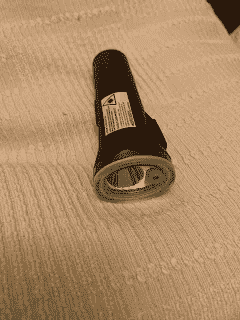
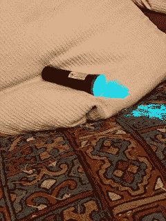

# 是时候勇往直前了(贝丽尔

> 原文：<https://medium.com/nerd-for-tech/its-time-to-blaze-ahead-well-beryl-fc6b5fa3d2f0?source=collection_archive---------23----------------------->

绿柱石(Blaze 也是)已经开始发售他们新的正面白光/激光组合，现在称为 Laseerlight Core。它比老式激光灯小得多，通过一根绕在车把上的硅带连接。有两个用于连接到芯部的夹子的插入件，以应对不同的管宽度。

表壳现在是塑料的，而不是铝的，它的设计也更小了，尽管光是 400 流明，还有绿色激光，可以将自行车的形状投射到道路上。

有 4 种模式日间闪光，脉冲，100%固体，50%固体和激光打开或关闭。电池应该可以持续 41 小时(据 Beryl 称)。

不知道为什么 iPhone 让绿色激光看起来有点蓝，但它确实是绿色的。

原来的 Laserlight 售价 125 英镑，但新的[核心](https://beryl.cc/shop/laserlight-core)售价 69.99 英镑，体积更小，因此可以很容易地从自行车上取下，放入背包或袋子中，不会占用太多空间。

【http://eurotechnews.blogspot.com】最初发表于**。**