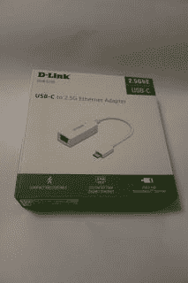

# 是时候以 2，500 Mb/s 的速度移动这些位了

> 原文：<https://medium.com/nerd-for-tech/its-time-to-move-those-bits-at-2-500-mb-s-3c4abcd23177?source=collection_archive---------21----------------------->

不知道为什么人们喜欢引用 2，500 mA (2.5A)这样的数字来表示充电器和其他设备，谢天谢地，D-Link 已经宣布了 DUB-E250 a USB-C 到 2.5G 以太网适配器。

D-Link USB-C 以太网适配器盒

打开盒子，会看到一个大的塑料支架，适配器被牢牢地固定在里面(尽管是一个完整的塑料包装的 was)和一个多种语言的纸质有限保修(没人会看得懂)。

D-Link USB-C 2.5G 以太网适配器

适配器有一个塑料矩形，一端是以太网插座，另一端是标准 USB-C 连接器。

它就是这样工作的，将它插入 PC、Mac 或 Linux 机器的 USB C 端口，一个以太网设备就出现了，支持高达 2.5Gb/s 的网络。没有驱动程序，没有安装。

不幸的是，当时没有 2.5G 基础设施可供其接入，但它也可以在 1G 网络交换机仅以 1Gb/s 的速度运行的情况下完美地工作。我可能会在一个带有 USB-C 端口的 iPadPro 上尝试，看看是否有任何东西被检测到，如果有，就升级博客。

它的在线价格约为 30 英镑，如果你有大量数据要在 PC 设备和网络上传输，那么它是一个不错的选择，尽管大多数消费硬件仍只有 1Gb/s，升级不会有任何好处。

未来，当消费者确实转向 2.5G 甚至 10G 时，这可能是你的(更现实地说，可能是需要接入数据中心网络并监控和访问服务的“技术人员”的好设备，或者是公司恢复工作并更新网络的好设备。

*最初发表于*[*【http://eurotechnews.blogspot.com】*](https://eurotechnews.blogspot.com/2021/04/its-time-to-move-those-bits-at-2500-mbs.html)*。*