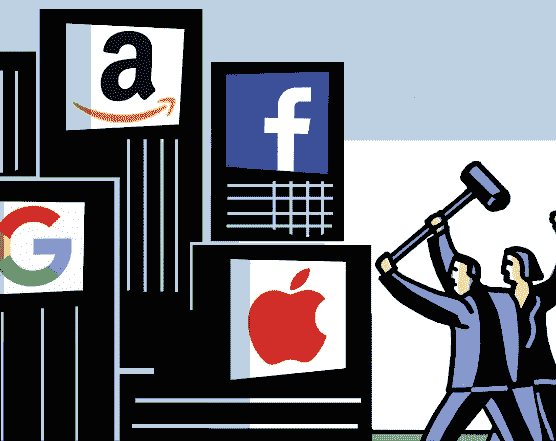

# 是时候控制大型科技公司了，莉娜·可汗是这个职位的合适人选

> 原文：<https://medium.com/nerd-for-tech/its-time-to-rein-in-big-tech-and-lina-khan-is-the-right-person-for-the-job-580537cecfd7?source=collection_archive---------23----------------------->

大型科技公司已经大到不在乎了吗？是时候向他们扔反垄断水池了吗？还有，为什么莉娜·可汗是挑战大科技的最佳人选。

Bilaterals.org

像谷歌、亚马逊、脸书和苹果这样的大型科技公司已经变得太大而不在乎了吗？他们的业务创造了数十亿美元的收入，他们的股价处于历史高点，他们是不是在“铁路运输”(这个词被故意用来指与镀金时代强盗大亨的相似之处，他们现在喜欢大技术，因为对竞争对手的蛮横而闻名)小企业和消费者都在寻找他们说了算的垄断天堂。

虽然美国在垄断问题上有好有坏的经历，并作为一个相信“自由市场力量”的国家发展，但目前的情况在历史上是少有的。例如，所有大型科技公司都在全球运营，因此，除非受到特定国家法规的挑战，否则都会绕开当地法律。第二，他们在美国很少纳税或不纳税，因为他们转移到避税天堂和离岸实体，这使他们能够逃避在他们经营的大多数国家纳税。第三，当他们免费提供大部分服务时，他们经常指出他们的业务实现了“更大的利益”。因此，如果拜登政府真的认真对待“控制”大型科技公司，它必须做好功课，然后充满活力地前进。

正是在这种背景下，[任命 Lina Khan](https://www.bbc.com/news/technology-57501579) 为美国美国联邦贸易委员会的负责人，不得不被誉为试图控制大型科技公司的重要一步。凭借无可挑剔的资历和发表的针对大型科技的论文，她一直是[对大型科技](https://www.nytimes.com/2021/06/16/technology/lina-khan-big-tech.html)最严厉的批评者之一，随着她在联邦贸易委员会的新工作，她很可能会继续她的“讨伐”。具体来说，她的论文[关于亚马逊](https://www.yalelawjournal.org/note/amazons-antitrust-paradox)的反垄断做法值得一读，因为它细致入微地“记录”了亚马逊如何滥用其市场力量，并利用“消费者福利”作为追求公然垄断商业战略的挡箭牌。

如前所述，大型科技公司已经变得太大而不在乎，尽管有任何针对它们的潜在行动，但它们对政府举措的态度仍然“沾沾自喜”，并相信它们会获胜。这种自我信念是他们拥有太多权力和太少责任的结果，如果 Lina Khan 必须对大型科技公司采取惩罚性行动，她会被解雇。已经有五个独立的法案在众议院提出，并得到了“直截了当”的回应，称任何反对大型科技的行为都是违宪的。

因此，这更是在任何针对大型科技公司的反垄断行动之前保持谨慎和充分准备的原因。然而，这并不意味着联邦贸易委员会或国会应该避免在“为时已晚”之前“控制”大型科技公司。已经有人担心脸书在选举干预中的作用，谷歌对搜索和新闻的近乎完全的控制，以及亚马逊对电子商务零售的众所周知的“垄断”。到目前为止提到的这些和其他原因足以让联邦贸易委员会和拜登政府现在采取行动或以后后悔。

话虽如此，联邦贸易委员会和它的委员们在起诉大型科技公司时需要“在同一页或同一像素上”。此外，就对反托拉斯行为的法律和行政制裁而言，没有什么可以替代国会的行动。此外，必须有一个更广泛的联盟来反对大型科技公司，并形成一个更广泛的消费者主导的基础，以承担其垄断倾向。因此，实际上，虽然 Lina Khan 是这一职位的最佳人选，但她不应该发动“孤狼之战”，只有通过一致、协调和有凝聚力的行动，才能遏制大型技术公司。