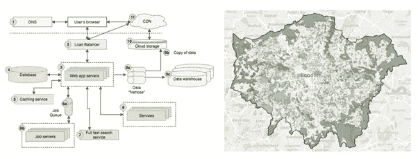
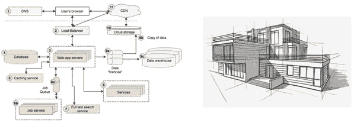
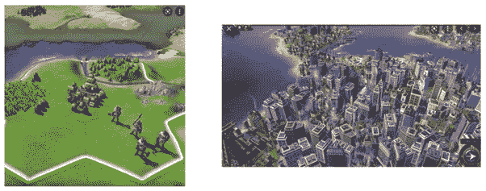
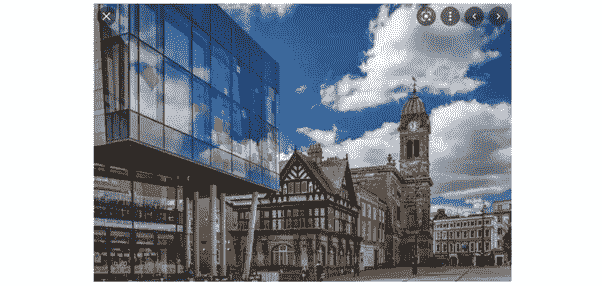
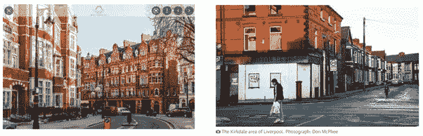

# 是时候停止说“软件架构”了

> 原文：<https://medium.com/nerd-for-tech/its-time-to-stop-saying-software-architecture-f38653a40cdf?source=collection_archive---------0----------------------->

系统图与城市地图

“架构”是软件工程中一个非常常见的类比，也是一个非常成功的类比。如此成功，以至于我们在软件世界中有了“架构师”这个角色。做建筑师很酷！有人记得《黑客帝国》里的“建筑师”吗？是的，这很酷，但是，**为什么**我们要从建筑的角度来思考？

*   可能因为两者都与“建造”某样东西有关。
*   有一个设计位。可能就是这个原因吧。
*   这不完全是工程学，有一点“艺术”(甚至对某些人来说是黑色艺术)。

这些都可以，但还是不够好。作为一个类比，它是没有用的。有许多地方行不通。

# 建筑失败在哪里？

至此你大概明白了。我不喜欢软件架构这个术语。我们“做软件的人”和他们“设计建筑的人”都画图表来传达我们的想法。我认为相似之处就到此为止了。

拿**的生产流程**来说。建设是一个“瀑布”过程。建筑师是一个在建筑工程开始前创造设计和详细蓝图的人，这样工程师们就可以精确到毫米并实施。没有哪个正常人会再做那样的软件了。

或者拿“业务”和“开发者”之间的**关系**来说。它假设架构师是弥合业务和开发人员之间的鸿沟所必需的，因此将每个人都压制在他们自己的位置上。

系统图与建筑草图

当我想到一个软件系统时，我会想到以下这些事情:

*   它是由一起工作的程序组成的。
*   这些程序相互利用，有时它们相互依赖。
*   不同的群体设计、制作和运行这些程序。
*   随着时间的推移，它会进化。“**时间**和时间带来的**层**在软件系统中有着巨大的作用。

如果有什么不同的话，它们组成了一个“进化的生态系统”,而不是一个“机制”或一个已经完成的建筑。**所以，我有一个更好的建议:👇**

# 一个软件系统实际上就像一个城市

我知道你在这一点上的想法，它同样是俗气的😁但是，有些奶酪比其他的要好。如果你不相信我，请听听史密斯夫妇的故事。

**双双进化**

从乡村到大城市

作为一个生态系统，它在变化和成长。你从一个单独的住宅开始，然后发展成一个村庄。它继续说道:

住宅>村庄>城镇>城市>大都市区>国家/帝国

它的制作永远不会结束。它会随着时间的推移而变化，并且通常会增长。

**新老同住**

新旧建筑融合在一起

这是德比大教堂季度的照片(*取自*[*)https://dcms . shorthandstories . com/derbycathedral Quarter/index . html*](https://dcms.shorthandstories.com/DerbyCathedralQuarter/index.html))。它展示了一个非常新的建筑和一个非常旧的建筑并排在一起。当然，它们在本季度共享相同的基础架构，并构成整个季度。

随着系统随着时间的推移而进化，新旧共存。无论是基础设施还是上层建筑都是如此。当你想要做出改变的时候，你会看到一层又一层不同的实现、库、**风格和人们过去的决定。**

不用说，当你做事的时候，你会留下自己的印记。

**上流社会 vs 贫民**

肯辛顿(富人)对柯克代尔(穷人)

就像**高档社区**一样，这里有每个人都想参与的热门项目。投资在那里进行，最好的新技术总是在那里。

有**稳定的郊区**，枯燥但生活按自己的节奏流动。

此外，还有**贫困社区**。没有人爱，贫穷，年老，没有人喜欢住在那里。没有投资，没有新的发展。

**两者都有吓人的地方**

一个黑暗的小巷，类似于一个可怕的，危险的，但仍然有效的应用程序

黑暗的小巷，法律不适用的粗暴街区。你害怕接触的复杂脆弱的旧程序，更不用说看代码了。没有人想去那里。

除非你是蝙蝠侠😉

**移民/中产阶级化**

有时，贫困的社区坐拥金矿，他们无法提取价值。我们想用更好的基础设施、更好的建筑、更好的道路和交通连接、更新的框架、语言、CI/CD 管道等来升级它们。等等。

中产阶级化和移民项目都不容易。存在人力成本、文化冲突、意想不到的后果、与承诺不符的结果。尽管如此，我们还是坚持这样做，这是有原因的。我们都在学习做得更好。

城市，风景从未停止，它们总是像我们的软件系统一样进化。有许多人向他们注入生命。它们服务于许多目的，并且有许多方法来设计和运行一个城市/软件系统。

我可以继续说下去。我看得越多，我看到的相似之处就越多。然而，我确信如果我反过来看，也有许多不同之处。

我的希望是，在未来的某一天，我们的领域将有足够的历史和自己的故事，我们不需要类比来思考它。在那之前，我们需要切换到一个比架构更好的类比，允许我们考虑共存、时间/历史、人的因素、治理和我们软件生态系统中的许多其他事情。这就是为什么在考虑软件系统时，“城市”是一个更好的比喻。

这篇文章是基于我在**货币超市对我的同事的一次闪电式谈话。在软件世界中尝试“架构”类比是一种愚蠢/有趣的尝试。我试着想出一个更好的。**