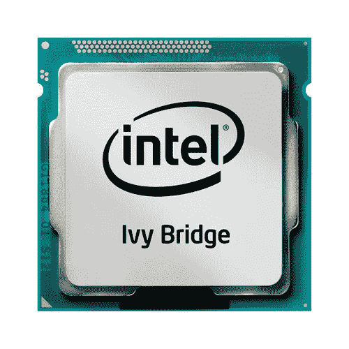
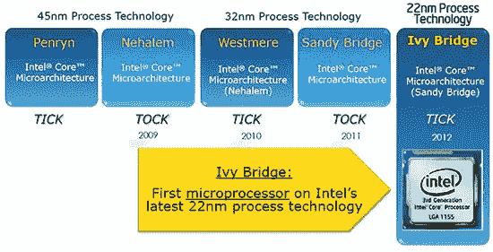
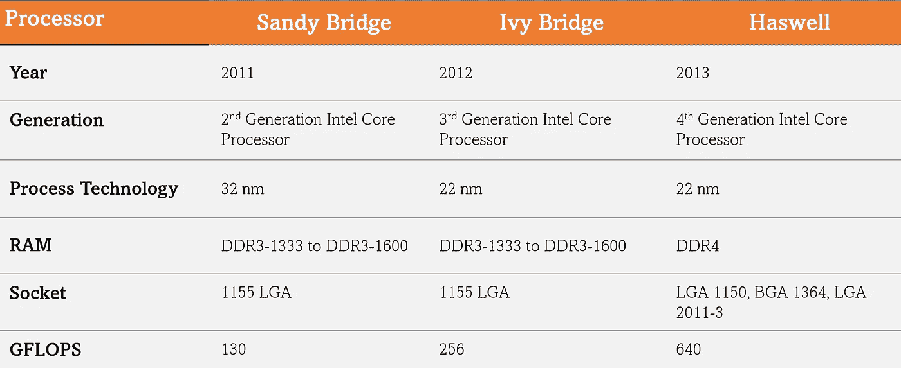
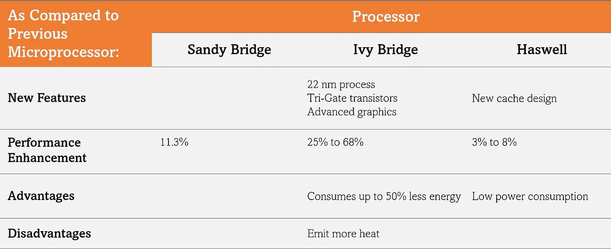

# 常春藤桥

> 原文：<https://medium.com/nerd-for-tech/ivy-bridges-1020d3c25b24?source=collection_archive---------33----------------------->

大家好！今天在这个博客中，我将讨论一点关于常春藤桥。我实际上被要求将这个主题作为我的数字电子和计算机架构评估的一部分，但是如果我在这方面研究了这么多，为什么不也写一点呢？

> 你可以在这里访问我在常春藤桥的演讲:[**https://www . slide share . net/raksharawat 2/Ivy-Bridge-248738301**](https://www.slideshare.net/RakshaRawat2/ivy-bridge-248738301)

# **常春藤桥是什么？**

英特尔常春藤桥

因此，Ivy Bridge 基本上是“第三代”英特尔酷睿处理器(酷睿 i3、i5 和 i7)的代号。它由英特尔于 2012 年 9 月推出。它出现在第二代英特尔酷睿处理器(即 Sandy Bridge)之后，第四代英特尔酷睿处理器(即 Haswell)之前。它使用了 22 纳米处理器技术，作为对上一代(Sandy Bridge) 32 纳米技术的增强。这也是英特尔第一个在其产品中使用三栅极晶体管的微架构。

> 为了更好地了解 Ivy Bridges，我们需要了解什么是处理器以及它们的作用:

# **什么是处理器？**

简而言之，处理器或微处理器，或中央处理器(CPU)基本上是执行计算机运行计算的集成电子电路。它们包含了计算机中央处理器的所有功能。它们就像 PC 的大脑，负责所有直接和间接的工作。例如，它执行算术、逻辑、输入/输出(I/O)或我们从操作系统(OS)传递给它的任何其他基本指令。

处理器的四个主要功能包括提取、解码、执行和回写。

> 回到英特尔这一代处理器，英特尔遵循“滴答”模式来升级其处理器。在每一代中，它都通过增强模型的某些特性来提高模型的性能。以下是英特尔遵循的详细微架构路线图:

# **英特尔微架构路线图**

英特尔是一家美国跨国公司，也是世界第二大半导体芯片制造商。它为计算机系统制造商提供处理器。例如，我们的笔记本电脑，如苹果、联想、惠普和戴尔等。

英特尔的处理器升级周期实际上遵循“滴答”模式。随着每一次“滴答”,公司都向更小的制造工艺迈进，然后随着交替的“滴答”周期，英特尔推出了新的处理器微体系结构。

英特尔的微架构路线图:滴答模型

比如上图，打个勾，制程工艺也在缩小，先是 2010 年 45 然后 32，然后随着常春藤桥的发展，缩小到 22 nm。同样，每一款 tock 都引入了新的处理器，2009 年的 Nehalem 架构，2011 年的 sandy bridge。

> 现在，由于这个博客是关于常春藤桥的，将常春藤桥与其前身桑迪桥和继任者哈斯威尔进行比较:

# **比较**

下表对这些功能进行了概述:

桑迪大桥、常春藤大桥和哈斯韦尔的比较

1.  **年份:**2011 年推出桑迪大桥，2012 年推出常春藤大桥，2013 年推出哈斯威尔。
2.  **一代:** Sandy Bridge 是第二代英特尔酷睿处理器的常用名称，Ivy Bridge 是第三代英特尔酷睿处理器的代号，Haswell 是第四代英特尔酷睿处理器的代号。
3.  **制程工艺:** Sandy Bridge 采用了 32nm 制程工艺，而 Ivy Bridge 的情况下制程工艺缩水至 22 nm。Haswell 还采用了 22 纳米处理器技术。
4.  **RAM:** Sandy Bridge 和 Ivy Bridge 使用相同的 RAM，DDR 3–1333 到 DDR 3–1600，而 RAM 用 Haswell 改进为 DDR4。
5.  **插座:** Sandy Bridge 和 Ivy Bridge 使用相同的插座，1155 LGA，而 Haswell 使用了一些新的插座，如 LGA 1150、BGA 1364 和 LGA 2011–3。
6.  **GFLOPS:**GFLOPS 数量随世代增加，桑迪布里奇 130 个，常春藤布里奇 256 个，哈斯韦尔 640 个。

下表总结了与前代处理器相比的新特性:

与前几代相比，处理器的特性

1.  **新特性:**随着 Ivy Bridge 的推出，制程工艺从 32nm (Sandy Bridge)缩小到 22nm。此外，它使用三栅极晶体管，从而降低了功耗，提高了效率，增强了处理器的性能。图形核心也进行了重新设计，使 GPU 性能提高了约 60%。Haswell 从 Ivy Bridges 引入了新的缓存设计。
2.  **性能提升:**型号处理器性能每一代都在不断提升。首先，在引入 Sandy Bridge 时，性能提高了 11.3 %，然后使用 Ivy Bridge，性能可以从 25%进一步提高到 68 %，再使用 Haswell，性能可以从 3 %提高到 8 %。
3.  **优缺点:**常春藤桥比桑迪桥的优点是消耗的能量最多少 50%但缺点是可能比桑迪桥散发更多的热量。同样，Haswell 优于 Ivy Bridge 的优势在于功耗更低，因此也可用于超便携设备。

> 常春藤桥的更多优点和缺点如下:

# **好处**

以下是常春藤桥的好处:

1.  **尺寸更小:** Ivy Bridges 采用先进的 22 纳米制程技术，包含在更小的芯片中，因此与前几代处理器相比，尺寸更小。
2.  **可靠:** Ivy bridges 比前几代产品更可靠，因为它们更便宜，使用的能源少得多，适合主流用户，并且可用于一般用途。
3.  **良好的存储容量:** Ivy bridges 自带良好的存储容量，也可以用于高级语言。
4.  **不贵:** Ivy bridges 比其他型号便宜，但不影响性能。
5.  **提供系统支持:** Ivy bridges 为系统以及用户和程序员提供了许多不同的支持。例如，它最多支持 8 个 USB 3.0 端口和 9 个 3 Gbps SATA 端口。
6.  **更好的电源效率:** Ivy Bridges 也具有更好的电源效率和增强的电池寿命。

# **弊端**

以下是使用 Ivy Bridges 的缺点:

1.  **散发更多热量:**常春藤桥可能会比上一代的桑迪桥散发更多热量。
2.  需要冷却:常春藤桥比桑迪桥散发更多的热量，所以它需要冷却和良好的空调。否则，其功能将受到影响。
3.  **灵敏度:**由于时钟速度较慢，常春藤桥也有点敏感。但同样，这将取决于我们使用的程序类型。例如，Premiere Pro 对时钟速度很敏感，因此如果它得不到正确支持，性能和结果都会受到影响。

# **结论**

Ivy Bridges 指的是第三代英特尔酷睿处理器。它引入了一些新功能，最重要的是 22 纳米工艺技术和三栅极晶体管的使用。在这篇博客中，我简要地讨论了什么是常春藤桥，它们与其他几代人有什么不同，它们的优点和缺点等等。总之，我可以说 Ivy Bridges 在功能和性能方面都优于前几代处理器。它们也很可靠，适合一般用途。但与此同时，它们在 2012 年推出，自那以来，许多新一代处理器已经推出，如 Haswell。现在，英特尔大约有 10 代处理器，每一代处理器的性能和效率都会提高。因此，用户可以投资它们而不是常春藤桥。还有，常春藤桥在 2015 年停产了。

> 有关更多详细信息，您可以访问下面的参考资料:

# **参考文献**

1.  [https://en . Wikipedia . org/wiki/Ivy _ Bridge _(微架构)](https://en.wikipedia.org/wiki/Ivy_Bridge_(microarchitecture))
2.  【https://ecomputertips.com/what-is-3rd-generation-processor/ 
3.  [https://www.itechtics.com/processor-generations/](https://www.itechtics.com/processor-generations/)
4.  [https://www.techspot.com/guides/502-intel-ivy-bridge/](https://www.techspot.com/guides/502-intel-ivy-bridge/)
5.  [https://www . slide share . net/hajraazam/core-i3i5i 7-和-i9-处理器](https://www.slideshare.net/hajraazam/core-i3i5i7-and-i9-processors)
6.  [https://en . wiki chip . org/wiki/Intel/micro architectures/ivy _ bridge _(client)](https://en.wikichip.org/wiki/intel/microarchitectures/ivy_bridge_(client))
7.  [https://www.slideshare.net/RemusSinorchian/intel-ivy-bridge](https://www.slideshare.net/RemusSinorchian/intel-ivy-bridge)
8.  [https://software . Intel . com/content/www/us/en/develop/articles/an-overview-of-the-6th-generation-Intel-core-processor-code-named-sky lake . html](https://software.intel.com/content/www/us/en/develop/articles/an-overview-of-the-6th-generation-intel-core-processor-code-named-skylake.html)
9.  [https://www . legit reviews . com/Intel-core-i7-3770k-3-5 GHz-ivy-bridge-processor-review _ 1914](https://www.legitreviews.com/intel-core-i7-3770k-3-5ghz-ivy-bridge-processor-review_1914)