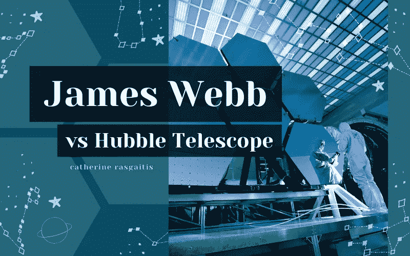

# 詹姆斯·韦伯 vs 哈勃望远镜

> 原文：<https://medium.com/nerd-for-tech/james-webb-vs-hubble-telescope-ddd7a4d310cb?source=collection_archive---------6----------------------->

## 用一双全新的“眼睛”观察我们的宇宙

照片由 [Pixabay](https://www.pexels.com/@pixabay) 拍摄，由 [Pixabay](https://www.pexels.com/photo/high-angle-view-of-a-man-256381/) 提供

现代工程师已经从[伽利略·伽利雷](https://crasgaitis.medium.com/the-astronomical-influence-of-galileos-telescope-9d874263af4a)的原始折射望远镜取得了巨大的进步。从那时起，由于艾萨克·牛顿的重要贡献，工程师们已经能够开发出可靠的反射望远镜，可以部署到外层空间。