# 带有 IntelliJ Maven 项目的 Java Faker 测试文章系列第 8 部分中的软件开发工程师]

> 原文：<https://medium.com/nerd-for-tech/java-faker-with-intellij-maven-project-software-development-engineer-in-test-article-series-part-4e161344a9ad?source=collection_archive---------3----------------------->

到目前为止，我已经写了 7 篇关于软件测试结构的文章。从这篇文章开始，我将开始软件测试的技术部分。你可以从[T3 这里 T5 看之前的文章。](https://kicchi.medium.com/)

我假设读者知道用 java 编码，并且熟悉 IntelliJ IDE。

技术先决条件:

*   必须安装 IntelliJ IDE。
*   必须安装 JDK。

> **问题:什么是 Java Faker？**

Java Faker 是一个伪数据生成器。

> **问题:我们为什么需要它？**

为了执行软件测试，我们几乎总是需要在测试步骤中使用数据。

例如，您正在测试一个“用电子邮件注册”功能。

您需要在电子邮件文本框中输入电子邮件地址。您需要有效和无效的电子邮件地址来测试消极和积极的测试场景。

多亏了 Java Faker，您总是可以填充一个**随机有效的**电子邮件地址用于您的测试。

> **问题:开发者用吗？**

有时候。他们使用 Java Faker 进行单元测试。像 SDET 一样，他们也需要在单元测试中测试有效的电子邮件地址。

而且，如果数据库或者 API 还没有准备好，开发者需要样本数据的时候可以使用 Java Faker 的随机数据。

> **Java Faker 在哪里？去哪里找？**

Java Faker 是一个公共的 Java 工具。它在 [**GitHub**](https://github.com/DiUS/java-faker) 上有一个公共存储库。而且还有 [**Java Faker**](http://dius.github.io/java-faker/apidocs/index.html) 的文档页面。

> **如何使用 Java Faker？**

首先，您必须将 Java Faker 作为依赖项添加到您的项目中。

> **什么项目？**

任何用 Java 编码的项目。

> **怎么加？**

按照图片将 Java Faker 添加到 IntelliJ Maven 项目中:

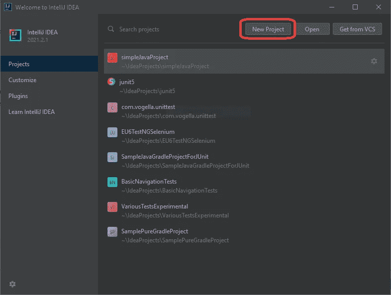

打开 IntelliJ >单击新建项目

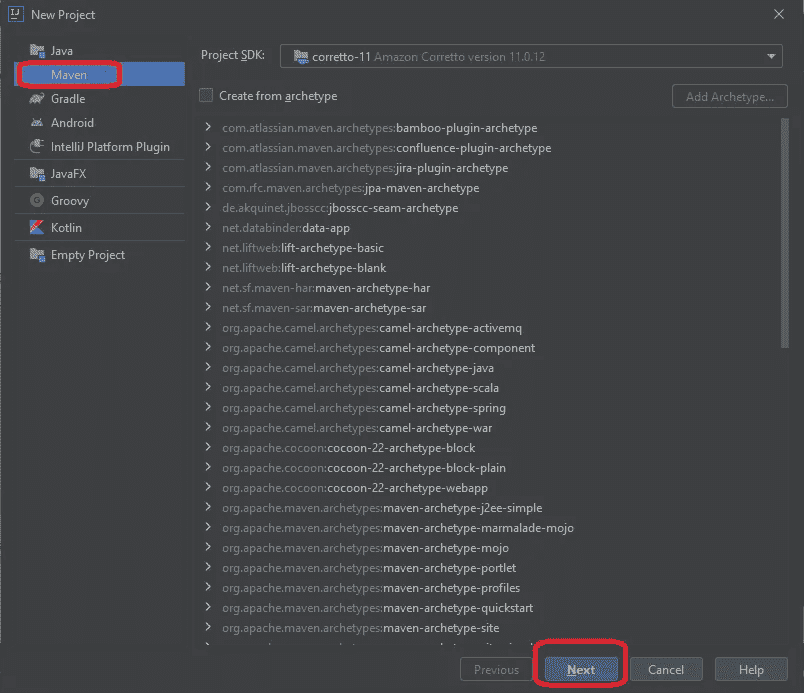

选择 Maven >单击下一步

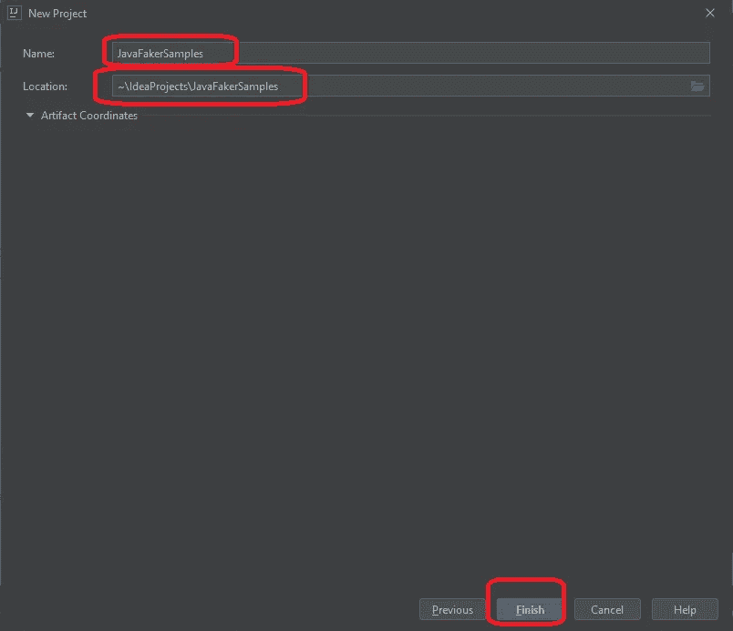

命名您的项目

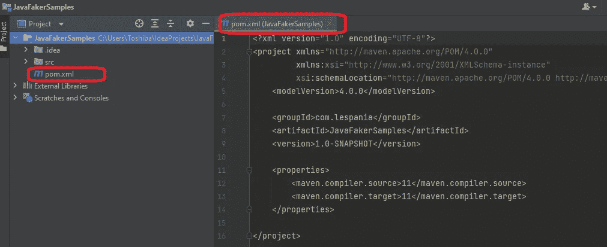

默认项目视图和 pom.xml 文件内容

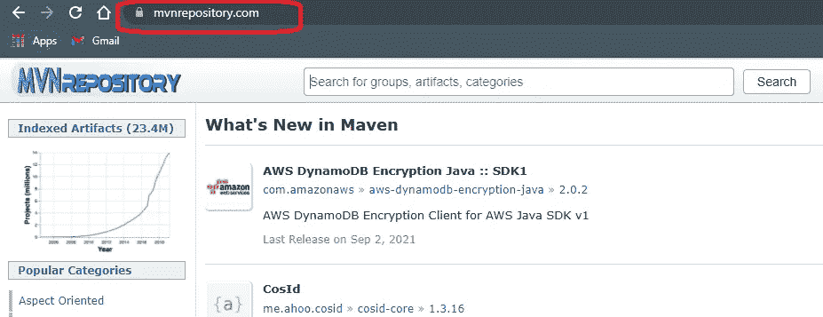

要添加 Java Faker，请在您的互联网浏览器中访问 mvnrepository.com

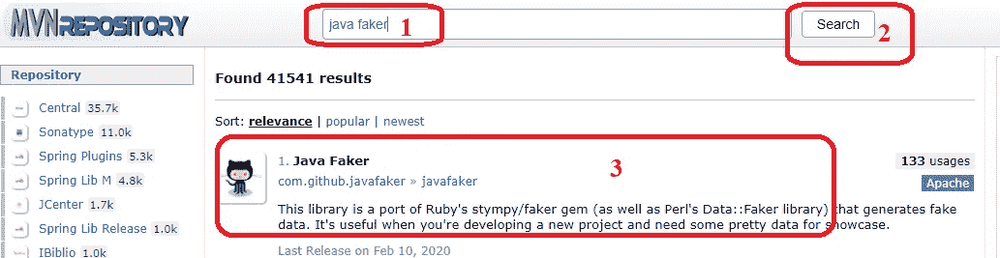

搜索 Java Faker，点击第一个结果

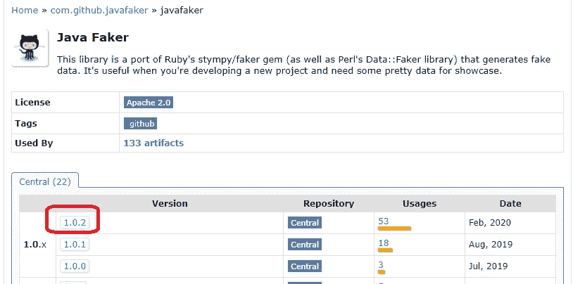

点击最高的绿色版本

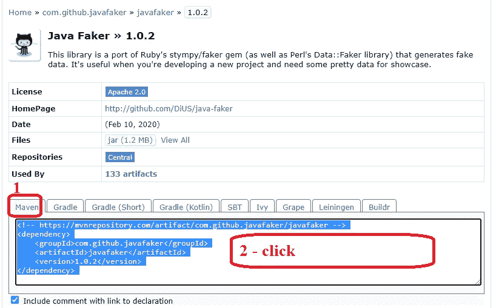

点击 Maven 标签并在框内点击，它将复制内容

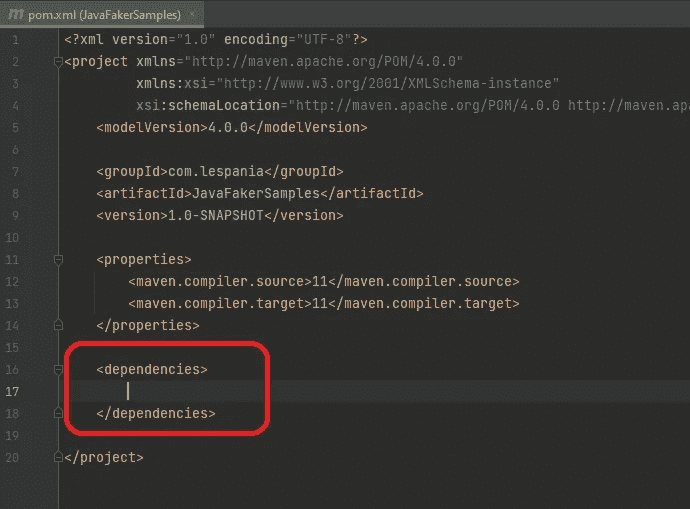

如图所示，创建“依赖关系”标签对

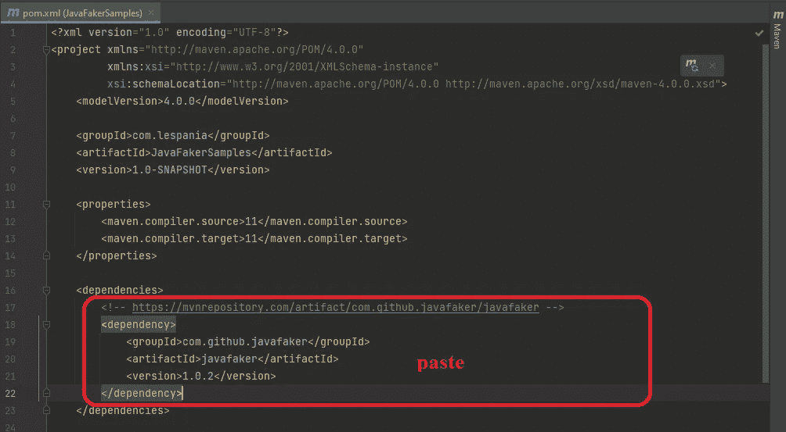

只需粘贴复制的依赖内容

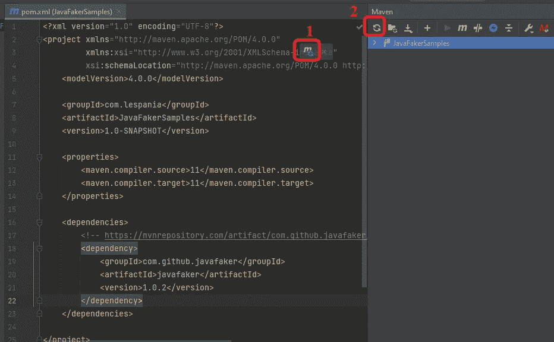

单击 1 或者打开 Maven 端窗口，然后单击 2 从存储库中获取依赖项

在 src>main>java 下创建一个新类

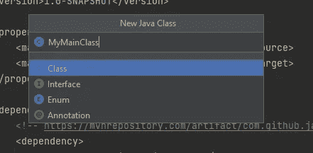

给你的班级命名

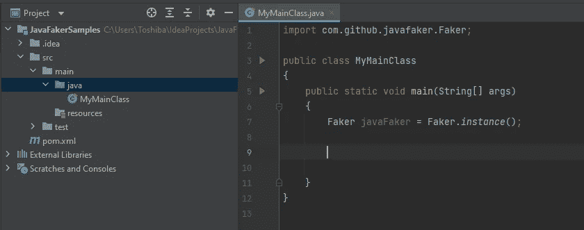

向您的类中添加一个 main 方法

现在，我们将 Java Faker 库添加到我们的项目中。

正如你在最后一张图中看到的，我们创建了一个 Faker 对象。

正如您从类的顶部注意到的，Faker 类是在我们刚刚作为依赖项添加的“com.github.javafaker”包中定义的。

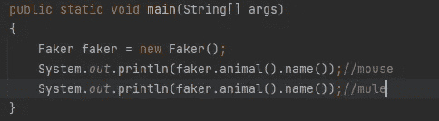

简单的 Faker 用法

在上图中；创建一个 Faker 对象并生成一个动物名称。如您所见，代码相同，但输出不同。所以 Faker 是随机产生的。

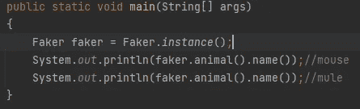

伪造对象创建的另一种方式

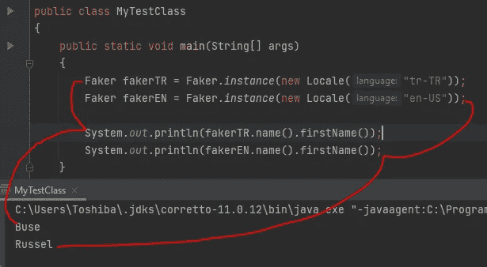

Java Faker 本地化

在上图中，有两个不同的 Faker 对象；一个是用**土耳其本地**创建的，另一个是用**美国本地**创建的。如您所见，名字的生成因实例的本地设置而异。

> **在 Java Faker 中我们有什么样的主题，比如动物和名字？**

根据文档，这些是主要的数据主题:

*   地址
*   古老的
*   动物
*   应用
*   青少年饥饿力量
*   艺术家
*   电影《阿凡达》
*   回到未来
*   航空
*   篮球
*   啤酒
*   牛仔骑士
*   书
*   弯曲件
*   商业
*   ChuckNorris
*   猫
*   密码
*   硬币
*   颜色
*   贸易
*   公司
*   秘密党员
*   日期和时间
*   人口统计学的
*   疾病
*   狗
*   龙珠
*   沙丘
*   教师
*   电子竞技
*   英格兰足球
*   文件
*   金融
*   食物
*   老友记
*   有趣的名字
*   龙的游戏
*   性别
*   黑客
*   哈利波特
*   赶时髦的人
*   银河系漫游指南
*   穴居矮人
*   如何遇见你的母亲
*   id 号码
*   互联网
*   职位
*   卡梅洛特
*   LeagueOfLegends
*   勒博斯基
*   指环王
*   洛雷姆
*   马茨
*   音乐
*   名字
*   民族
*   数字
*   选择
*   看守
*   电话号码
*   摄影
*   口袋妖怪
*   公主新娘
*   关系术语
*   RickAndMorty
*   知更鸟
*   岩石带
*   莎士比亚
*   啜饮
*   SlackEmoji
*   空间
*   占星学
*   StarTrek
*   股票
*   超级英雄
*   组
*   双峰
*   大学
*   天气
*   巫师
*   尤达
*   塞尔达

> 那些主要话题会产生什么样的数据？

它们都生成字符串数据。

那些类中有方法。这些方法生成的数据大多没有参数。

例如，在 Address 类中有一个方法

*街道地址()*

还有一个带有布尔参数的重载版本

*街道地址(boolean includeSecondary)*

让我们看看输出:

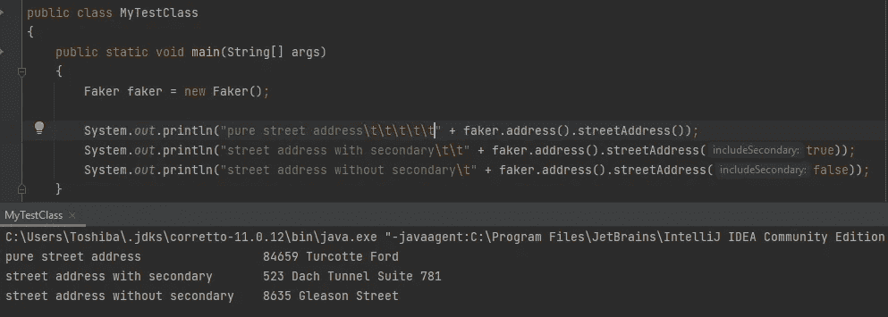

街道地址函数重载

> 所有这些主类中的所有这些方法是什么？

我也有同样的好奇心。然后，我写了几个代码来获得所有可用的 Java 反射方法。我**迭代**没有**参数**的**主类**和它们的**方法**。我用一个默认的 Faker 对象和一个土耳其本地化的 Faker 对象运行这些方法。因此，在最后，我可以得到一个基于两个不同本地化版本的**样本输出列表。默认的本地是 EN。还有那个短项目的 GitHub:[**Java faker samples**](https://github.com/khicchi/JavaFakerSamples/blob/for_remote_public_repository/src/main/java/MyMainClass.java)。只需将该类复制到您的项目中，或者克隆 all 存储库。**

我将 JavaFakerSamples 项目的输出放在一个 Google 电子表格中: [**没有参数的 JavaFaker 方法输出 EN/TR**](https://docs.google.com/spreadsheets/d/1Jcqm9O18-pLN0rgP0JQLmpgGXFvx_sGbS2XnvsFOPFI/edit?usp=sharing) 。

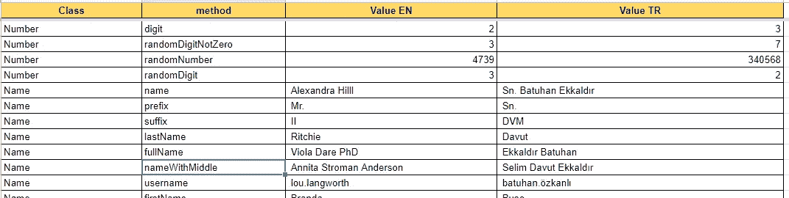

Faker 输出文档的屏幕截图

有了这个输出，您可以对 Faker 方法有所了解，并且熟悉本地化的输出。

> **还有什么？我们完成了 Java Faker 吗？**

通过 Faker 对象可以使用一些有用的函数。

**numerify** 方法返回一个字符串，参数中的' # '字符用随机数替换。

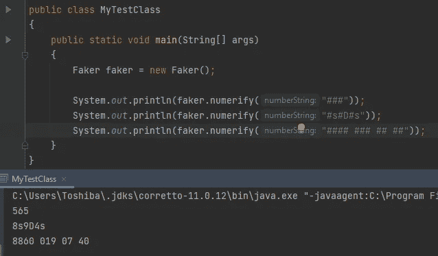

数值化方法示例

方法返回一个带“？”的字符串参数中的字符，替换为随机字符。

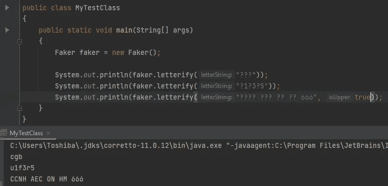

letterify 方法示例

方法返回一个带“？”的字符串参数中的字符用随机字符替换，而“#”字符用随机数替换。

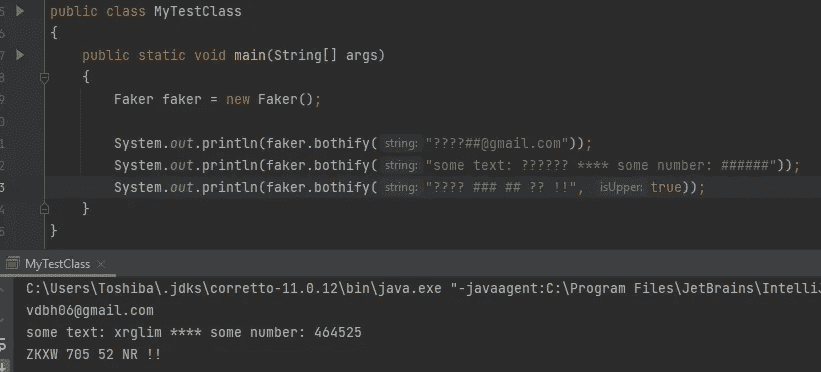

bothify 方法示例

regexify 方法根据输入的 regex 模式返回一个随机序列。

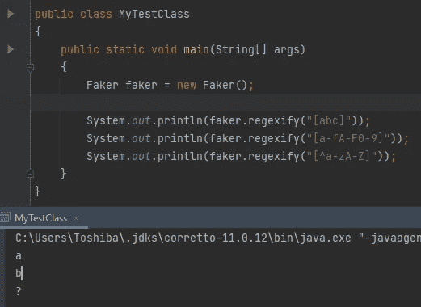

regexify 方法示例

最后，我想分享一下随机服务输出:

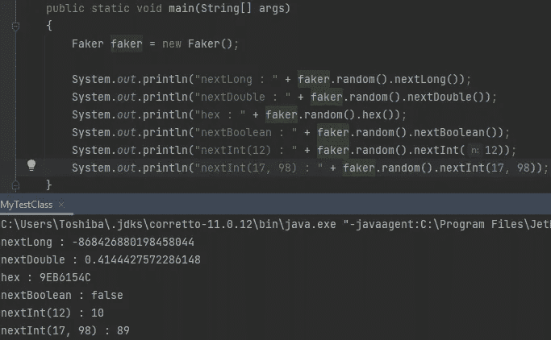

随机服务样本

> 好的。我们生成了许多不同的数据。我有随机生成数据的能力。在哪里使用它们？

在下面的文章中，我们将使用这些数据。这是我们测试的唯一准备。