# Java 浮点舍入误差及解决方法

> 原文：<https://medium.com/nerd-for-tech/java-floating-representation-and-solution-floating-point-round-off-error-930e1a4060b5?source=collection_archive---------1----------------------->

根据应用程序的数学需求，您可能需要格外小心，以确保您的运算在浮点(双精度)精度方面提供您想要的结果。

在计算中，浮点数是一种广泛使用的重要数据类型。然而，许多用户不知道在几乎所有计算机硬件中用来存储和处理这些数据的标准。

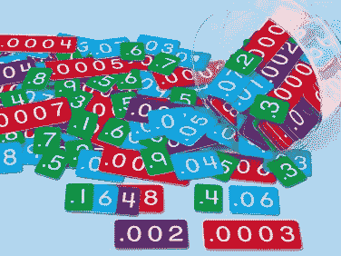

> **IEEE 浮点运算标准** ( **IEEE 754** )是电气和电子工程师协会 (IEEE)于 1985 年制定的[浮点运算](https://en.wikipedia.org/wiki/Floating-point_arithmetic)的[技术标准](https://en.wikipedia.org/wiki/Technical_standard)。标准[解决了在各种浮点实现中发现的许多问题](https://en.wikipedia.org/wiki/Floating-point_arithmetic#IEEE_754_design_rationale)，这些问题使得它们难以可靠地使用[和便携地使用](https://en.wikipedia.org/wiki/Software_portability)。许多硬件[浮点单元](https://en.wikipedia.org/wiki/Floating-point_unit)使用 IEEE 754 标准。- **维基**

有几种不同的方法来表示浮点数，但在大多数情况下，IEEE 754 是最有效的。

**IEEE 754 的三个基本组件如下:**

1.  **尾数的符号**——顾名思义，简单明了。正数用 0 表示，负数用 1 表示。
2.  **偏差指数**–指数字段中必须显示正负指数。将偏差加到实际指数上，以获得存储的指数。
3.  **规格化尾数-** 尾数是科学记数法或浮点数的一部分，由其有效位数组成。这里我们只有两个数字，即 0 和 1。因此，规格化尾数是小数点左边只有一个 1 的尾数。

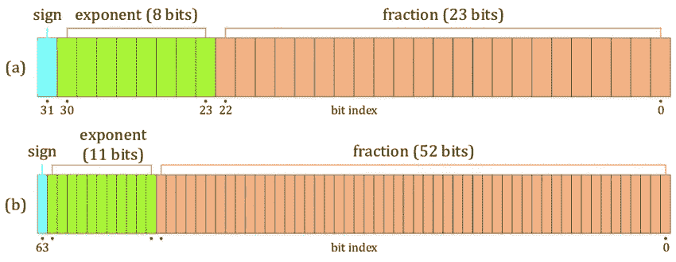

IEE 754 格式

**单精度**

*   32 位

> 1 位符号
> 
> 8 位指数
> 
> 23 位小数(尾数)

**双精度**

*   64 位

> 1 位符号
> 
> 11 位指数
> 
> 52 位小数(尾数)

**长双精度**

*   80 位

> 1 位符号
> 
> 15 位指数
> 
> 52 位小数(尾数)

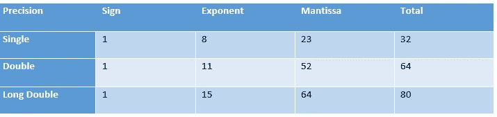

IEE 754 标准表示浮点

**下面是一个使用 double 损失精度的例子:**

> 公共类 DoubleForCurrency {
> 
> 公共静态 void main(String[] args) {
> 
> 双总和= 0.2；
> 
> for(int I = 0；我< 100; i++) {
> 
> total += 0.2;
> 
> }System.out.println(“total = “ + total);
> 
> }
> 
> }

**预期产量是多少？**

> 预期产出:总计= 20.20

**现在编译并运行代码，看看实际输出是什么。**

> 实际产出:总计= 20.199999999999996

## 结果应该是 20.20，但是由于浮点运算，结果是 20.199999999996。这是精确度的损失(或意义的损失)。

我将举另一个例子，看看这种表示是如何工作的。

# **问题——将 9.1 转换成二进制！**

## 步骤 01:首先我们分开整数部分和小数部分。

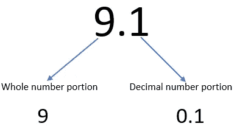

## 步骤 02:将整数部分(9)转换成二进制。

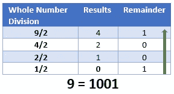

将 9 转换成二进制

## 步骤 03:将小数部分(0.1)转换为二进制。

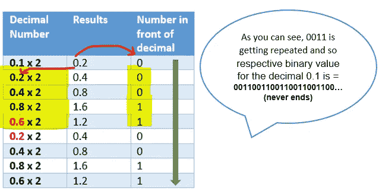

0.1 十进制到二进制的转换

## 9.1 的最终二进制表示如下:

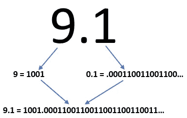

9.1 的二进制表示

## 步骤 04:二进制表示的科学符号

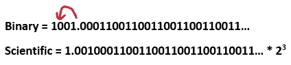

9.1 的科学表示

我们把小数点放在前面。

## 步骤 05:将其转换为 IEEE 754 标准

> 第一位是**符号**，
> ，这意味着，如果该值为负(负-)，则变为 1，如果该值为正(正+)，则变为 0。
> 
> 接下来，我们有 8 个位来表示指数部分，我们可以表示⁸数。(即-128 到 127)。这个 127 叫做**“指数偏差”。**

指数偏差的意思是，每当我们有一个正数( **2 的 3 次方**)时。我们把它加到 127 中，取二进制形式。

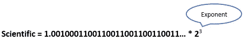

科学表征的指数值

在我们的例子中，
我们有 2 的 3 次方。所以我们的**指数值是 3。因此，我们将值(3)加入到**偏差中。****

**127 + 3 = 130**

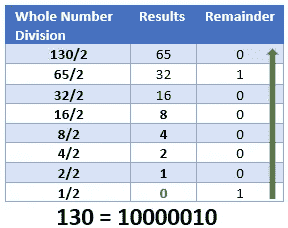

130 的二进制版本

130 的指数值是 10000010

> **尾数**-尾数部分来自**1.001 0001100110011001100110011……*2** ，我们取正好 23 位。我们可以跳过第一位(小数点前的数字)，因为它对于所有的数字总是 1。
> 
> ***尾数为 001 000110011001100110011 ……***

**所以，IEE 标准的 9.1 值如下。**

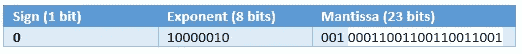

9.1 的二进制形式

到目前为止，它没有出现任何问题，但是让我们试着从 IEEE 754 计算器中得到 9.1 的二进制表示。

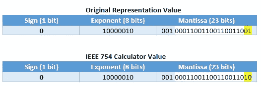

原始值和计算值的比较

因此，您可以看到后两位数字中的两种表示法之间的差异。**所以，这就叫“计算机中的浮点舍入问题”。如果我们确实没有使用适当数据类型，这在我们的编程语言中会产生非常意想不到的结果。**

# IEEE 计算器值和原始值如何变得不同？

在 IEEE 754 中有一个规则叫做**舍入**，计算尾数时，如果值大于 23 位，则检查第 24 位。如果第 24 位是“1”，则规则规定我们必须将“1”加到第 23 位以舍入该值。因此，在上述示例中，由于该值大于 23 位，并且第 24 位的值为“1”，因此我们必须在第 23 位添加一个额外的“1”。

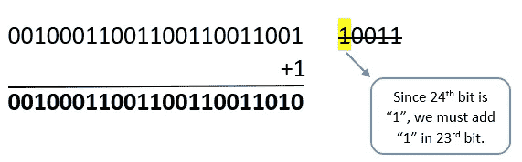

尾数四舍五入

# 让我们把二进制值转换回原来的浮点值，看看我们是否得到 9.1！

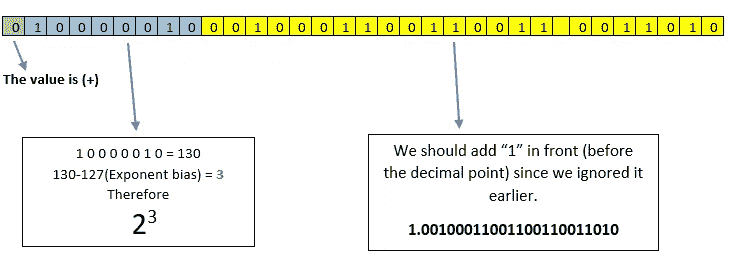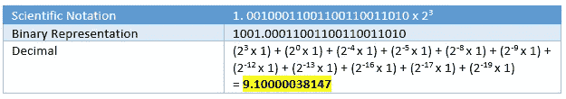

十进制表示

因此，当我们将 9.1 计算机存储为 IEEE 754 标准时，由于 IEEE 754 格式中发生的舍入，在进行计算时，它将产生不同的值，即 9.10000038147。这就是为什么我们在之前的某些测试场景中出现了意想不到的结果(货币类为 double)。因此，我们可以得出结论，对于货币等敏感数据的计算，我们不应该使用 float 或 double。

# 解决方案？

## 怎样才能准确的做浮点运算？

为了避免像货币这样的精确计算中的浮点舍入问题，Java 引入了 BigDecimal 类。我们可以用 BigDecimal 代替 float 或者 double。这个类支持算术、比较、散列、舍入、操作和格式转换。通过指定舍入模式，我们可以返回准确的预期结果。这个类可以非常精确地处理非常小和非常大的浮点数。

**现在让我们考虑如何使用 BigDecimal 解决上述问题！**

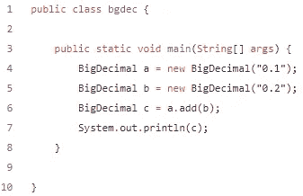

解决方案 1 使用 BigDecimal

> 输出:0.3

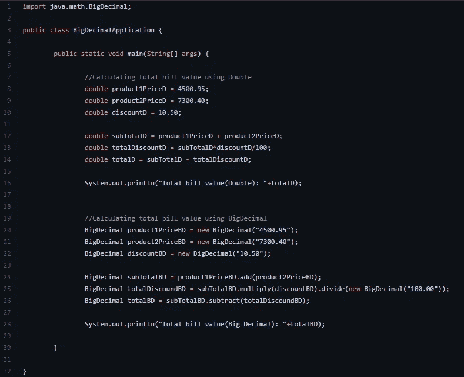

解决方案 2 使用 BigDecimal

> 产量:10，562.20825

**总之，在设计应用程序时，我们必须密切注意为变量分配数据类型。根据您的需要，选择适当的数据类型，如 int、float、double、long 或 big decimal。**

# 参考

1.  2016，IEEE 浮点数标准。【文章】-[https://www . IAS . AC . in/public/Volumes/reso/021/01/0011-0030 . pdf](https://www.ias.ac.in/public/Volumes/reso/021/01/0011-0030.pdf)
2.  2020.*计算机如何处理浮点数|十进制到 IEEE 754 浮点表示法*。[视频]-[https://www.youtube.com/watch?v=2VM028vpguU&t = 7s](https://www.youtube.com/watch?v=2VM028vpguU&t=7s)
3.  Wikihow.com。2021.*如何将一个数从十进制转换成 IEEE 754 浮点表示*。【在线】-[https://www . wikihow . com/Convert-a-Number-from-Decimal-to-IEEE-754-Floating-Point-Representation](https://www.wikihow.com/Convert-a-Number-from-Decimal-to-IEEE-754-Floating-Point-Representation)