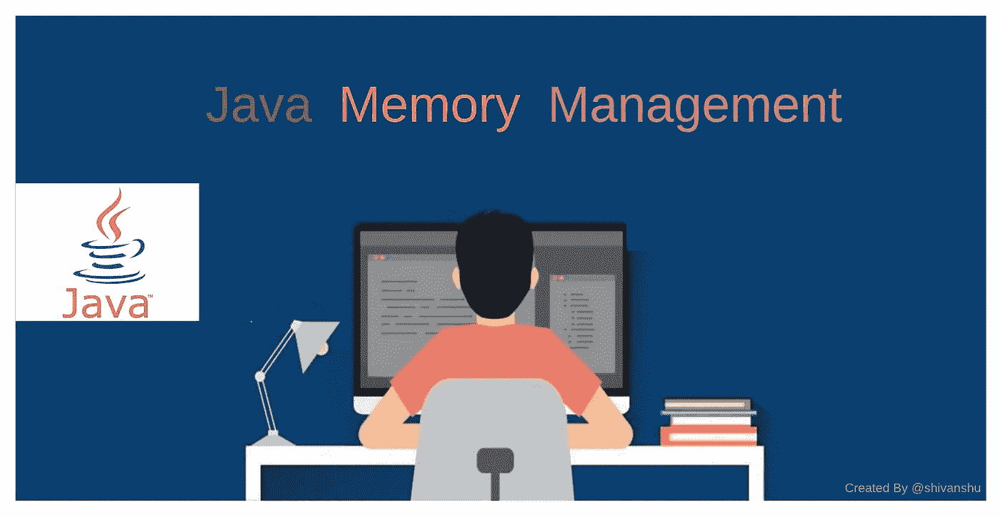
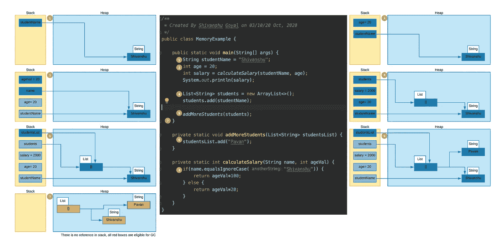
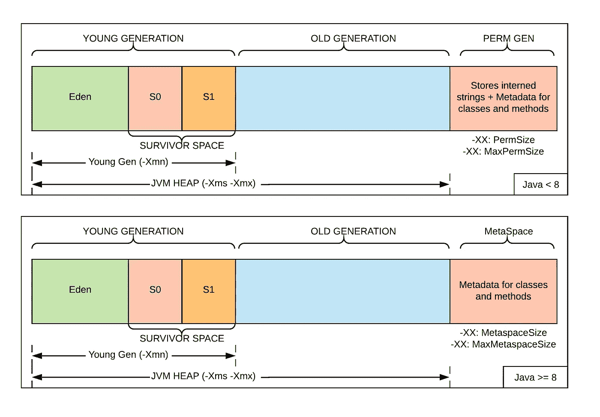

# Java 内存解释

> 原文：<https://medium.com/nerd-for-tech/java-memory-explained-43de6de157be?source=collection_archive---------1----------------------->

每个 Java 应用程序都需要内存才能在 JVM 上运行。该内存取自运行应用程序的系统的可用 **RAM** 。有两种内存:堆栈和堆。

# 堆

它是 RAM 中用来存储 Java 中的临时变量或原始数据类型的区域。它还存储在堆中物理创建的对象的引用。

它以**后进先出(LIFO)** 格式存储函数创建的变量，并在函数退出时释放所有分配的内存。

在 Java 中，堆栈是为每个线程管理的，所以它的作用域在线程内。与堆的大小相比，它更小。

堆栈更快，因为与堆相比，内存分配/释放更简单。

当方法调用发生时，将在该线程的堆栈上创建一个新的堆栈框架。堆栈将包含局部变量、参数、返回地址等。

# 许多

这是一个较大的 RAM 区域，用于动态内存分配。所有 Java 对象都存储在堆中，对象的范围是整个应用程序。

内存管理由我们在 heap 中管理，但未使用的对象由**垃圾收集器**自动清除。

一个程序如何在栈和堆中给 Java 变量和对象分配内存？

# 堆划分:年轻一代和老一代

垃圾收集在堆内存上运行，以**移除没有任何引用的对象**。引用意味着堆栈中没有指针指向堆中某处存在的对象。

堆分为 **2 个部分**:年轻一代和老一代进行高效的垃圾收集。**年轻一代**(堆的第一部分)进一步分为三部分:

*   **伊甸园**是对象在**第一次初始化**时存储的地方。比 S0 和 S1 的总和还要大。
*   **Survivor 0 (S0)** 是运行次要 GC 时对象移入的位置。当 Eden 空间已满时，运行次要 GC。不使用的对象被从年轻一代中移除，而使用过的对象被移动到幸存者空间。
*   **幸存者 1 (S1)**

为年轻一代对象设置阈值以被认为是老一代。当阈值被突破时，对象被移动到老一代。

**老一代(****堆 **)** 的第二部分是用来**存放长寿命对象**。它也需要被垃圾收集。这是由名为**主 GC** 的进程完成的。**

****

**堆分裂成年轻和老一代**

# **需要记住的要点**

1.  **在 Java 8 中，PermGen 被重命名为元空间，这个元空间有一个无限制的默认最大大小。相反，Java 7 和更早版本的 PermGen 在 32 位 JVM 上的默认最大大小是 64 MB，在 64 位版本上是 82 MB。**
2.  **在 Java 7 之前，被拘留的字符串通常保存在 PermGen 中。这有时会导致以下异常:`**java.lang.OutOfMemoryError: PermGen** space`**
3.  **每当需要调整 PermGen/Metaspace 的大小时，JVM 都会像处理标准堆一样进行。调整这些空间的大小需要一个完整的 GC。**
4.  **如果**栈**中没有剩余内存用于存储函数调用或局部变量，JVM 将抛出`**java.lang.StackOverFlowError**`，而如果没有更多**堆空间**用于创建对象，JVM 将抛出`**java.lang.OutOfMemoryError**: Java Heap Space`。**
5.  ****-Xss** 设置线程堆栈大小。线程堆栈是分配给每个 Java 线程供其内部使用的内存区域。这是线程存储其本地执行状态的地方。堆栈的默认值因平台而异。**
6.  ****-Xms** 和 **-Xmx** 用于定义堆内存的启动初始和最大大小。**
7.  **所有 Java 对象都存储在堆内存中。**
8.  ****字符串是不可变的**，每当一个新的字符串值赋给一个变量，堆中就会创建一个新的对象，栈中的引用变量指向堆中的那个位置。**

# **结论**

**我试图写 Java 应用程序如何在 RAM 中为它的变量和对象分配内存。程序的哪个部分存储在内存的哪个部分？在我的下一篇文章中，我将尝试讲述 Java 中的垃圾收集是如何工作的。**

**感谢阅读！**