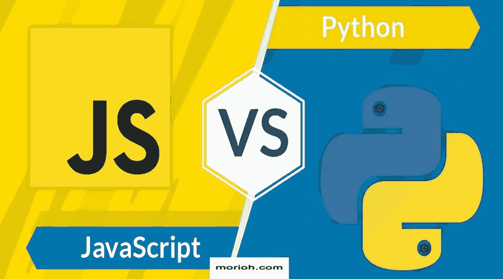

# 2021 年你该学哪个？

> 原文：<https://medium.com/nerd-for-tech/java-script-vs-python-b8de2aabc425?source=collection_archive---------1----------------------->

# JavaScript VS Python？

## 哪个最适合你的工作？

图片来自-[https://morioh.com/p/3eb8f8179df2](https://morioh.com/p/3eb8f8179df2)

世界上有如此多的编程语言，但要知道哪种语言适合您的项目可能有点困难。选择正确的语言对于以最少的资源获得最佳性能至关重要，所以今天我们将比较和对比两种最流行的语言 Python 和 Java Script，并解释哪种情况最适合它们。

Java script 被评为 2019 年最受欢迎的语言开发人员语言。有许多包和框架建立在 Java Script 的基础上，其中一些最受欢迎的是 react、view、angular 和 Nodejs 等

Python 也是最顶尖的编程语言之一编程语言事实上它是目前世界上发展最快的语言 Python 已经稳定地发展了 20 年左右实际上在过去的 5 年里经历了指数级的增长因为它已经被采纳为数据科学和机器学习的主要语言

Java Script 和 Python 在语言细节上有一些相似之处，但是这两种编码语言的核心用例有很大的不同

## 让我们从 JavaScript 开始

首先要知道的是，Java Script 与 Java 不同，Java 是一种通用的个人脚本语言，而 Java Script 是一种高级客户端脚本语言，用于使网站具有交互性，例如，当访问网站时，组成页面的 HTML 和 Java Script 被发送到计算机，并通过 web 浏览器运行。Java 脚本类型化，这意味着允许转换，例如当你定义一个整型变量并向其添加一个字符串时，结果被转换为一个字符串，Java 脚本编码语法考虑 c 风格在 if 语句的其他词中，其他循环和方面基于 c 和 c++作为相同操作的语法，如果你还不熟悉 c 或 c++ Java 脚本将有一个更陡峭的学习曲线 Java Script 的主要用途它通过文档对象模型或 DOM 与 HTML 交互有多容易如果你不喜欢 DOM，它是一个系统它是一个用于表示网页的 HTML 文件结构的系统这意味着所有网页这意味着网页的所有部分都以树状结构链接在一起，所以它们可以很容易地使用脚本语言如 Java Script 来引用和修改。

让我们看看 Python

Python 是一种通用的服务器端编程语言，它在幕后为网站工作，大多数网站会使用服务器端编程语言来完成一些任务，但在中央加载页面并不是必需的，而在中央加载页面则需要 Java 脚本和 HTML。当访问者登录网站时，网站通常会使用 python 等服务器端编程语言来跟踪用户名和密码。该语言用于从保存用户凭证的数据库中存储和检索用户凭证，如果一个网站使用 python，那么 Django 包就有可能被使用，这是因为 Django 是 python 最流行的服务器端 web 框架网站之一，与 Java script 不同，Python 被认为是强类型的，所以如果我尝试给出与 Java Script 相同的例子，将字符串添加到整数中 Python 解释器实际上会抛出一个错误，我必须显式地将整数转换为字符串，然后我可以将它加在一起以获得相同的结果。Python 也有不同的编码语法。一个明显的区别是，Python 不是像 c 风格的 Java 脚本那样依赖括号，而是使用缩进来对编码块进行分组。Python 语法通常比 Java 脚本更直观和用户友好，尤其是对于一个新程序员来说。 同样重要的是要知道，python 也将其自身与其他服务器编程语言分开，因为它易于使用并且在分析数据方面非常强大。这是机器学习、数据科学、其他数学和分析领域的语言。流行的机器学习包，如 pi torch 和 scikit learning，都是为 Python 开发的。另外，你可能听说过流行的数值包，如 Pandas 和 Numpy。

别忘了留下你的回答。✌

大家敬请关注！！想把我的故事发到你的邮箱，请订阅我的新闻信。

感谢您的阅读！不要忘记给你的掌声，分享你的回答，并与朋友分享！