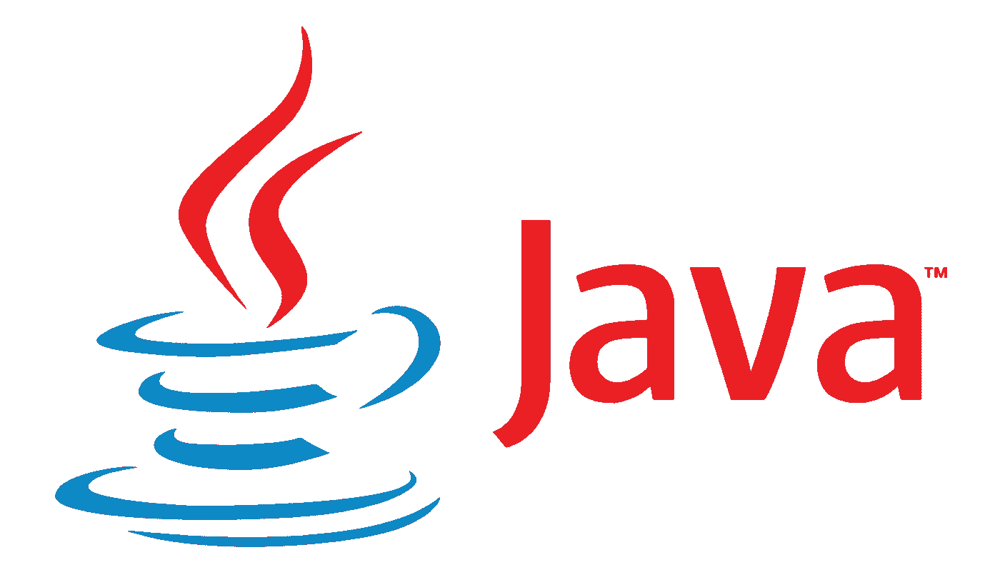

# Java 理论与实践

> 原文：<https://medium.com/nerd-for-tech/java-theory-and-practice-7e213b1f5fc2?source=collection_archive---------0----------------------->

在这个教程系列中，我将会用非常讲解的例子来讲解 Java 中的一些基础理论和高级理论。如果我遗漏了什么，请随时添加评论和建议。

> 注意:这是一个正在进行的系列，我将在未来添加和更新更多的主题和每个主题的要点。

# Java 多线程

 [## Java 多线程

### 同时执行几个程序的能力叫做多任务处理。在系统术语中称为…

medium.com](/swlh/java-multithreading-b8dd4771a902) 

# Java 中的异常

 [## Java 中的异常

### 有哪些错误？

kasunprageethdissanayake.medium.com](https://kasunprageethdissanayake.medium.com/exceptions-in-java-913cf8e144ec) 

# Java 设计模式

 [## Java 设计模式

### 设计模式在软件开发人员中非常流行。设计模式是对常见问题的一种很好的解决方案

kasunprageethdissanayake.medium.com](https://kasunprageethdissanayake.medium.com/java-design-patterns-a45a1ce56a2) 

# Java 8 中的 Lambda 表达式

 [## Java 8 中的 Lambda 表达式(第 1 部分)

### Lambda 是一种新的编程结构，它让你以一种完全不同的范式构建 Java 应用程序。这个…

kasunprageethdissanayake.medium.com](https://kasunprageethdissanayake.medium.com/lambda-expressions-in-java-8-part-1-9de06c295723)  [## Java 8 中的 Lambda 表达式(第 2 部分)

### 之前我们学习了函数式编程和面向对象编程的区别。在这个…

kasunprageethdissanayake.medium.com](https://kasunprageethdissanayake.medium.com/lambda-expressions-in-java-8-part-2-83985d18115c)  [## Java 8 中的 Lambda 表达式(第 3 部分)

### 在本教程中，我们将学习更多关于 Lambda 表达式的知识，并在 Netbeans IDE 中执行一些示例…

kasunprageethdissanayake.medium.com](https://kasunprageethdissanayake.medium.com/lambda-expressions-in-java-8-part-3-32070eb99ad7)  [## Java 8 中的 Lambda 表达式(第 4 部分)

### 在本教程中，我们将学习 Lambda 表达式的向后兼容性以及更多关于…

kasunprageethdissanayake.medium.com](https://kasunprageethdissanayake.medium.com/lambda-expressions-in-java-8-part-4-ad3fe41f4be0) 

# 字符串在 Java 中是不可变的

 [## 字符串在 Java 中是不可变的

### 在本教程中，我将解释为什么字符串是不可变的，不可变的对象，以及如何使用新的关键字与…

kasunprageethdissanayake.medium.com](https://kasunprageethdissanayake.medium.com/strings-are-immutable-in-java-8a8b96412ed) 

# Java 中的标记接口

 [## Java 中的标记接口

### 在本教程中，我将解释 Java 中的标记接口以及标记接口的使用。

kasunprageethdissanayake.medium.com](https://kasunprageethdissanayake.medium.com/marker-interfaces-in-java-aeed063596cc) 

# Java 中的“super”与“this”

 [## Java 中的“super”与“this”

### 在本教程中，我将解释 Java 中“super”和“this”关键字的区别，以及在什么情况下…

kasunprageethdissanayake.medium.com](https://kasunprageethdissanayake.medium.com/super-vs-this-in-java-aafc75a1feba) 

# Java 中的可比与比较器

 [## Java 中的可比与比较器

### 在这篇文章中，我将解释一下比较器和可比器之间的区别。以及何时使用…

kasunprageethdissanayake.medium.com](https://kasunprageethdissanayake.medium.com/comparable-vs-comparator-in-java-623b7435e06) 

享受你的咖啡吧。对你有好处！

谢谢大家！祝你好运！