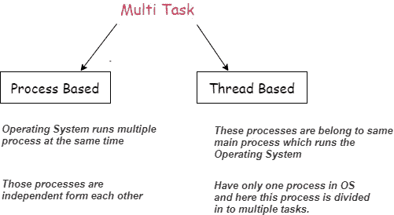
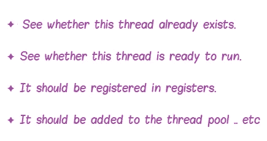
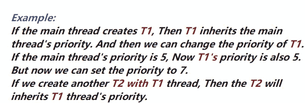
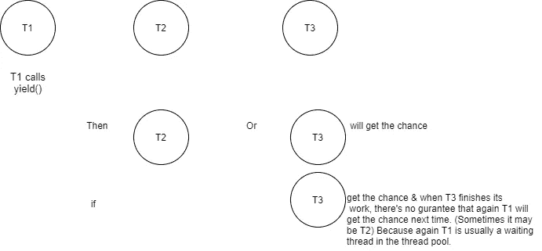

# Java 线程！

> 原文：<https://medium.com/nerd-for-tech/java-threads-d9ae5e231419?source=collection_archive---------6----------------------->


# 我们能否增加线程的数量，并将进程缩短到 1 秒或 2 秒？那是多线程吗？

我们通过一个小例子来寻找这个问题的答案。

```
Validate      = 2s
Preparation   = 3s
Currancy rate = 4s
Update model  = 2s
Save          = 4s
              -----
               15s
//So Can we use 5 threads and take this to 3 seconds? 
No! That's not possible as there are dependency tasks here.✦ *But we may do these tasks parallelly by using 2 different threads for first 2 steps.(Because all last 3 are dependency tasks) Then you could cut down the time little bit shorter than 15s.*✦✦✦ **So accordingly there's no way that you can increase the no of threads and cutdown the process upto 1s or 2s and That's not Multi Threading.**
```

# **多线程 **

多线程可以定义为多个进程/多任务。



**重要...**

*如果您正在使用数量为* ***n*** *的文件，并且没有任何依赖关系，您希望将其工作时间缩短到最低，而这无法通过超过线程数甚至超过****【n .****(当然，您可以使用 n 个线程，但不能超过 n 个)来实现，因为使用相同的线程来完成相同的任务是没有意义的。*

# ***我们怎样才能创建一个线程？***

◾️通过扩展线程类

◾️通过实现一个可运行的接口

# 如果子类扩展了线程类会怎么样？

让我们通过一个简单的例子来理解这一点


所以如果你想把这个 Runner 转换成一个线程，那么你必须从一个 thread 类扩展 Runner 类。所以当它扩展一个 thread 类时，Runner-Sportsman 关系就会破裂。(我们可以通过实现 Runnable 接口来创建线程来解决这个问题)

> 一些与线程相关的隐藏场景

> ***场景 1️⃣***

**扩展线程类的时候一定要覆盖 run()吗？**

```
Output - It will execute. But nothing will happen.
```

*程序在这里发生:*

✦当转到应用程序类中的 start()方法；它将转到 Printer 类并检查 start()方法。

✦但是因为在 Printer 类中没有 start 方法，所以它转到它的父类(Thread 类)并检查 start()方法。

✦因为在 Thread 类中有一个 start()方法，它将进入 Thread 类中的这个 start()方法。

✦Within 启动()，他们调用运行()。

✦:所以它再次来到打印机类，检查是否有任何 run()方法。因为没有 run()方法，所以它转到 Thread 类并检查那里是否有可用的 run()方法。

✦，然后它将执行线程类中的 run()方法。


但是如果你正在实现一个可运行的接口，你必须覆盖接口中的所有方法，包括 run()方法。

> ***场景 2️⃣***

**当多次执行下面的程序时，每次执行都会有不同的顺序。为什么？**

*在执行时，没有办法知道主线程或子线程会先执行，因为没有这样的规则。*

*当启动一个线程时，它会将我们的线程添加到线程调度器中。而这个线程调度器如何工作完全取决于 JRE(最后是它的 JVM)。并且这个顺序从 JVM 到 JVM 是变化的。*

> ***场景 3️⃣***

**这个 start()方法有什么必要？那么如果我们直接调用 run 方法而不调用 start 方法会怎么样呢？**

*让我们使用下面的代码示例来理解这个场景:*

```
OUTPUT - It will always execute the child class first before executing the main.
```

*根据这个场景，我们没有 2 个线程。*


*start()方法的使用:*

*✦✦✦✦在启动线程之前，它做一些如下的任务，*



但是如果我们调用一个 start 方法，我们不需要做上面的任何任务，JVM 会做的。所以最后 ***当调用 start()方法时，JVM 做必要的事情并调用 run 方法。***

> ***场景 4️⃣***

如果我们在 printer 类(一个扩展了 thread 类的类)中覆盖一个 start 方法会发生什么？

*所以在这里，Printer 类有一个 start 方法。所以它将在调用主类中的 start 方法时被执行。*

*当覆盖 start 方法时，它会阻止创建新线程。(因为它阻止调用线程类的 start 方法)*

*通过使用超级。start()，我们可以覆盖 start 方法，也将能够创建一个线程。*

> ***Scenario5️⃣***

如果我们重载 run 方法会发生什么？

什么都不会发生，它会创建一个线程。因为***start 方法总是会不带参数的调用 run 方法。***

> ***Scenario6️⃣***

**主线程终止会发生什么？会影响子线程吗？**

没有！尽管主线程终止了，子线程可以继续执行。

*但是如果我们想让子线程在主线程终止后终止，我们就得把子线程设置成守护线程。* ***(。setDaemon(true))***


# 如何通过实现可运行接口☛来创建线程

下面的代码片段展示了通过实现 Runnable 接口来创建线程类的方法。

所以当这个类实现 Runnable 接口来给出线程行为时，这个类没有 start 方法来调用。因此，我们必须从 thread 类创建一个实例，然后将 Runnable 实例传递给它，如下所示。

# Thread 类的构造函数

✦螺纹()

✦线程(可运行目标)

✦线程(可运行目标，字符串名称)

✦线程(字符串名称)

✦线程(线程组组，可运行目标)

✦线程(线程组组，可运行目标，字符串名称)

✦线程(线程组组，可运行目标，字符串名称，长堆栈大小)

✦线程(线程组组，字符串名称)

# 线程优先级

在 java 中，线程优先级的范围是从 1 到 10。最高线程优先级是 10，最低线程优先级是 1。

主线程的默认线程优先级是 5。此后，我们创建的任何线程都将继承父线程的值。



如果设置的优先级超出了期望的范围，会发生什么情况？

*抛出非法参数异常。*

**如果两个线程拥有相同的优先级会发生什么？**

不会发生什么事情。线程调度器将选择一个线程来运行。

# 线程生命周期


图片说明:线程的生命周期

> ***螺纹连接方法***

线程连接方法允许等待，直到另一个线程完成它的执行。

join 方法中的三个不同的重载函数如下

✯ .加入()

✯ .加入(长毫秒)

✯ .join(长毫秒，int 纳秒)

任何线程进入等待状态后，都无法直接进入运行状态。因此它必须再次进入“就绪/可运行”状态。

下面是线程可以进入可运行状态的情况。

*✯✯✯* ***是否超时。***

*✯✯✯* ***如果另一个线程完成了它的任务。***

****如果有人打断了等待状态。****

# *Thread yield()方法*

*★产量法是原生法。*

*★可用于调试场景。(当我们想给特定场景更多机会时)*

*当一个线程使用让步方法时，那个 ***给线程调度器一个信号，给其他线程一个机会。*** 因此，如果线程调度程序决定给予机会，那么调用 yield 方法的特定线程将进入其“等待状态”，另一个线程将执行。*

*示例:*

**

# *线程 sleep()方法*

*★没有不带参数的方法。*

*★可以等待一定的给定时间。*

*★有两个不同的方法签名。*

1.  *。睡眠(长毫秒)⇾这是一个本地方法*
2.  *。(长毫秒睡眠，nanoseconds)⇾这是**而不是**一个原生方法*

*★当调用 sleep()时，*

*⇾线程在特定的给定时间内进入等待状态。如果等待时间到期或发生任何中断，则返回 ***。****

# *线程中断()方法*

*★一次中断只对一个睡眠时刻有效。*

*★如果我们在一个没有休眠的线程上调用一个中断方法，⇾中断会一直等到那个线程进入“休眠”或“等待”状态，然后会戳到那个线程。*

****参考文献****

*[](https://www.geeksforgeeks.org/java-concurrency-yield-sleep-and-join-methods/) [## Java 并发性——yield()、sleep()和 join()方法——GeeksforGeeks

### Java Concurrency - yield()、sleep()和 join()方法我们可以通过使用一个…

www.geeksforgeeks.org](https://www.geeksforgeeks.org/java-concurrency-yield-sleep-and-join-methods/) [](https://www.w3schools.com/java/java_threads.asp) [## Java 线程

### 线程允许程序通过同时做多件事情来更有效地运行。螺纹可用于…

www.w3schools.com](https://www.w3schools.com/java/java_threads.asp)*