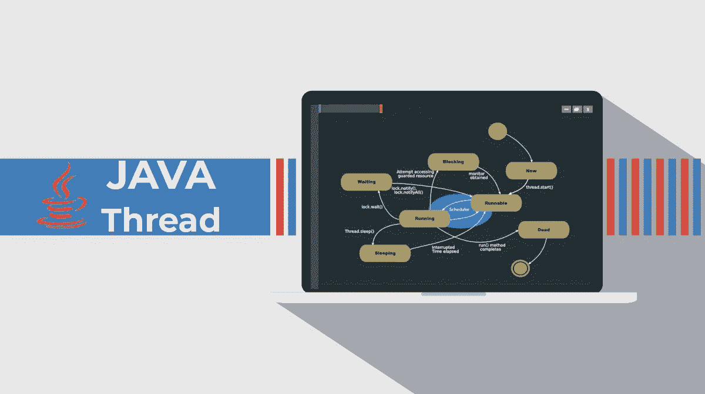
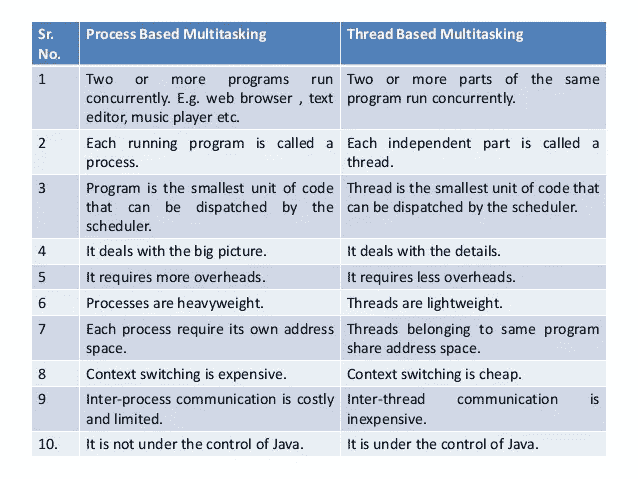
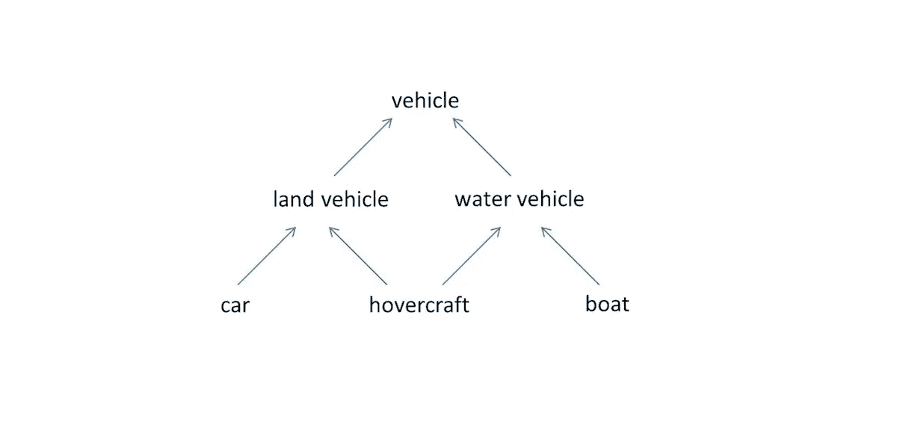
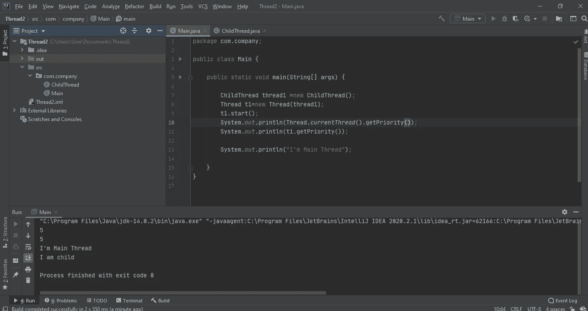
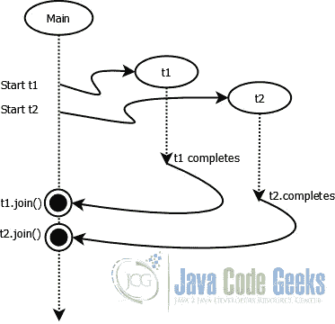
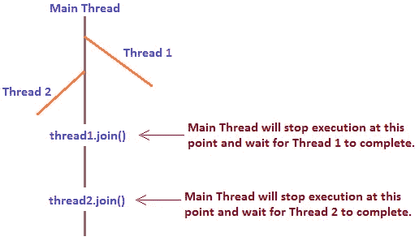

# Java 线程从零到英雄

> 原文：<https://medium.com/nerd-for-tech/java-threads-from-zero-to-hero-4001da5d2727?source=collection_archive---------14----------------------->



什么是线程？

线程意味着执行的底线。那么多线程意味着多重执行层。

多任务可以分为两种类型。

1.  基于流程
2.  基于线程

**基于流程的**

举个例子，你边听音乐边输入一个 word 文档。所以如果你停止播放音乐，不会影响你打字。同样，如果您停止键入 word 文档，也不会影响您的音乐播放。想想你在下载电影的时候玩游戏。与上面的场景相同。都是相互独立的。

**螺纹基础**

在基于线程中，这些线程属于同一个项目或同一个主进程。操作系统将此视为一个进程。在这个过程中，我们将它分成多个任务。



# 线程生命周期


# 线程类的构造函数

1.  **螺纹**()
2.  **线程**(字符串 str)
3.  **螺纹**(可运行 r)
4.  **线程**(可运行 r，字符串 str)
5.  **线程** ( **线程组**组，**可运行**目标)
6.  **线程** ( **线程组**组，**可运行**目标，字符串名称)
7.  **线程**(**Thread group**group， **Runnable** target，String name，long stackSize)
8.  **线程** ( **线程组**组，**字符串**名称)

# 如何在 Java 中创建线程

在 java 中有两种方法可以创建线程，

1.  扩展线程类
2.  实现可运行的接口

**1。扩展线程类**

我们可以扩展 Thread 类，在 run 方法中，我们可以编写应该由线程完成的任务。

```
public class ChildThread extends Thread{

    @Override
    public void run() {
        //tasks to do by thread
    }
}
```

然后在我们的主类中，我们可以创建一个新的线程并启动它。

```
public class Main {

    public static void main(String[] args) {

        ChildThread thread1 =new ChildThread();
        thread1.start();
        System.*out*.println("I'm Main Thread");
    }
}
```

所以当我们这样做时，实际上是 ChildThread 类检查它是否包含任何 start 方法。然后，由于它不包含开始方法，它将转到线程类的父类，检查它是否包含开始方法。所以父类包含了 start 方法，在 start 方法中调用 run 方法。所以我们的 ChildThread 类检查我有没有 run 方法。然后是，因为它包含一个 run 方法，所以它将被执行。

当我们启动一个线程时，我们不能保证执行的顺序。当你启动一个线程时，它所做的是，如果它满足所有的要求，它将添加到你的线程调度器中。所以线程调度器如何工作完全取决于你的 JVM。

这里有一些令人困惑的地方。我把它作为问答格式放在下面

必须覆盖 run 方法吗？

> 不，当我们使用线程类扩展时，不一定要覆盖 Run 方法。

我们可以调用 run 方法而不是 start 方法吗？

> 是的，您可以调用 run 方法，但是这样您就没有机会创建新的线程了。这就像普通的方法调用。

**你能覆盖启动方法吗？**

> 答案是肯定的，你可以重写 start 方法，但是它会阻止创建新的线程。

**但是我们能在创建新线程的时候覆盖 start 方法吗？**

> 是的，我们可以。我们只需将 super.start()放在 override start 方法中，它就会完成这项工作。

我们可以重载 run 方法吗？

> 是的，我们可以重载 run 方法，但是线程类 start 方法总是不带参数地执行 run 方法。

**2。实现可运行接口**

```
public class ChildThread implements Runnable{

    @Override
    public void run() {
        //tasks to do by thread
    }
}
```

当我们使用 Runnable 接口实现时，必须覆盖 run 方法。同样，当我们实现 Runnable 接口时，我们不能像在 Extend 中那样在 main 类中创建线程并启动线程。因为没有开始方法。**所以在这里我们必须从 Thread 类创建一个实例(对象),并且必须将 runnable 接口传递给它。然后只有我们可以开始线程。**

```
public class Main {

    public static void main(String[] args) {

        ChildThread thread1 =new ChildThread();
        Thread t1=new Thread(thread1);
        t1.start();
        System.*out*.println("I'm Main Thread");
    }
}
```

# 何时使用 Extend 和 Runnabale

正如我在上面提到的，大多数人知道有两种方法可以创建线程，但是大多数人不知道什么时候使用从线程类扩展和实现 Runnable 接口。所以简单地说，如果你和下面的类有任何关系，那么你应该创建实现 Runnable 接口的线程。因为从线程类扩展会打破那些关系。



如果类之间没有任何关系，那么可以创建扩展 Thread 类的线程或者实现 Runnable 接口。由你决定。

# 守护线程

守护线程是一个**低优先级线程，在后台**运行，执行垃圾收集等任务。java.lang.Thread 类为 java 守护进程线程提供了两种方法。

```
public final void setDaemon(boolean on)
public final boolean isDaemon()
```

大多数人认为，当你的主线程终止你的 java 程序时，你的 Java 程序也终止了。这是完全错误的，因为主线程可能完成了它的工作，但它允许子线程继续它的工作。但是如果一个子线程是一个守护线程，当主线程结束的时候，这个子线程(守护子线程)也会被终止。

简单地说，当所有非守护线程都被执行时，程序终止。如果你的子线程是一个守护线程，那么主线程不会等到子线程完成它的工作。

# 线程优先级

线程优先级不是索引。线程优先级总是从 1 开始，以 10 结束。

1=最低优先级

10 =最高优先级

我们可以设置一个线程优先级，并从下面的方法中得到一个线程优先级。

```
public final void setPriority(int newPriority)
public final int getPriority()
```

例子

```
ChildThread thread1 =new ChildThread();
Thread t1=new Thread(thread1);
t1.start();
t1.setPriority(7);
System.*out*.println(t1.getPriority());
```

在任何应用程序中**主线程的默认优先级是 5** 。因为没有人在创建那个线程，只有系统在创建主线程。**在你创建的任何线程之后，它都会继承父线程的优先级值**



**这是另一个令人困惑地方，因为线程优先级从 1 开始，从 10 结束，如果你给的优先级值超过了这个限制会发生什么呢？**

> 简单地回答这个问题，它将抛出一个异常，称为非法参数异常

# 线程中使用的方法(加入、睡眠、让步、中断)

## **1。Join()**

join 方法允许一个线程等待另一个线程完成它的执行



螺纹连接有三种方法。

```
public final void join()
public final synchronized void join(long millis)
public final synchronized void join(long millis, int nanos)
```

## 2.睡眠()

当我们使用 sleep 方法时，线程会在给定的时间内进入等待状态。睡觉有两种方法。

```
public static void sleep(long milliseconds)
public static void sleep(long milliseconds, int nanoseconds)
```

**sleep(long 毫秒)**方法让一个线程只休眠特定的毫秒。

**sleep(long 毫秒，int 纳秒)**方法让一个线程休眠几个特定的毫秒加纳秒。

## 3.中断()

thread 类的 interrupt()方法用于中断线程。如果有任何线程处于休眠或等待状态(即调用了 sleep()或 wait()，那么使用 interrupt()方法，我们可以通过抛出 InterruptedException 来中断线程执行。

## 4.产量()

每当线程调用 yield 方法时，它都会向线程调度器发出提示/信号，表明它准备暂停执行。所以当前正在执行的线程将会停止，给其他等待的线程一个机会。

# 线程同步

多线程程序经常会遇到这样的情况:多个线程试图访问相同的资源，最终产生错误的和不可预见的结果。有两种类型的线程同步。

1.  互斥的
2.  协作(java 中的线程间通信)

由于这篇博客几乎很长，包含了关于 Java 线程的大部分信息，我将另外发表一篇关于线程同步的博客。所以保持联系。

# 参考

由 Krishantha Dinesh 制作的 Java 视频系列中的线程。

[](https://www.tutorialspoint.com/what-is-the-use-of-thread-sleep-method-in-java) [## Java 中的 Thread.sleep()方法有什么用？

### sleep()方法是线程类的一个静态方法，它让线程休眠/停止工作一段特定的时间…

www.tutorialspoint.com](https://www.tutorialspoint.com/what-is-the-use-of-thread-sleep-method-in-java) [](https://www.geeksforgeeks.org/joining-threads-in-java/) [## 在 Java 中连接线程

### java.lang.Thread 类提供 join()方法，该方法允许一个线程等待另一个线程完成它的…

www.geeksforgeeks.org](https://www.geeksforgeeks.org/joining-threads-in-java/)  [## Java-Java point 中的守护线程

### java 中的守护线程是一个服务提供者线程，为用户线程提供服务。它的生命依赖于…

www.javatpoint.com](https://www.javatpoint.com/daemon-thread)