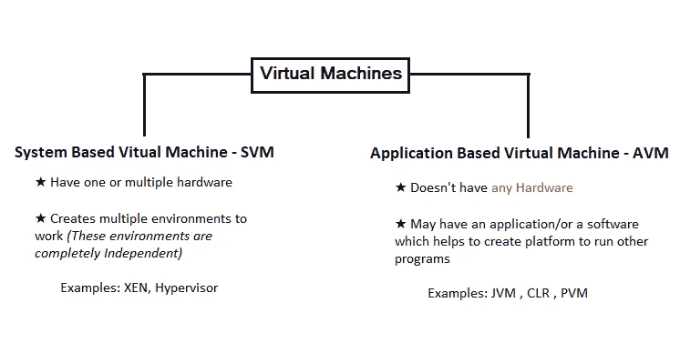
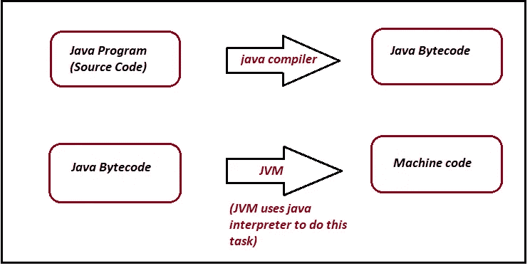
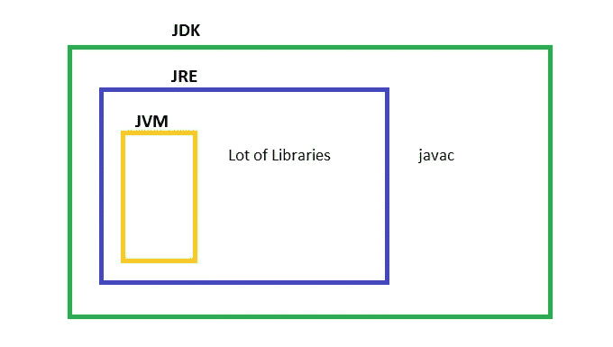
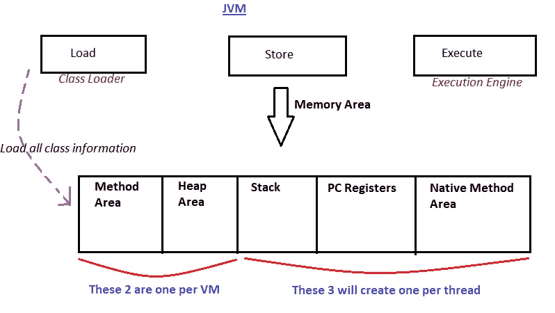
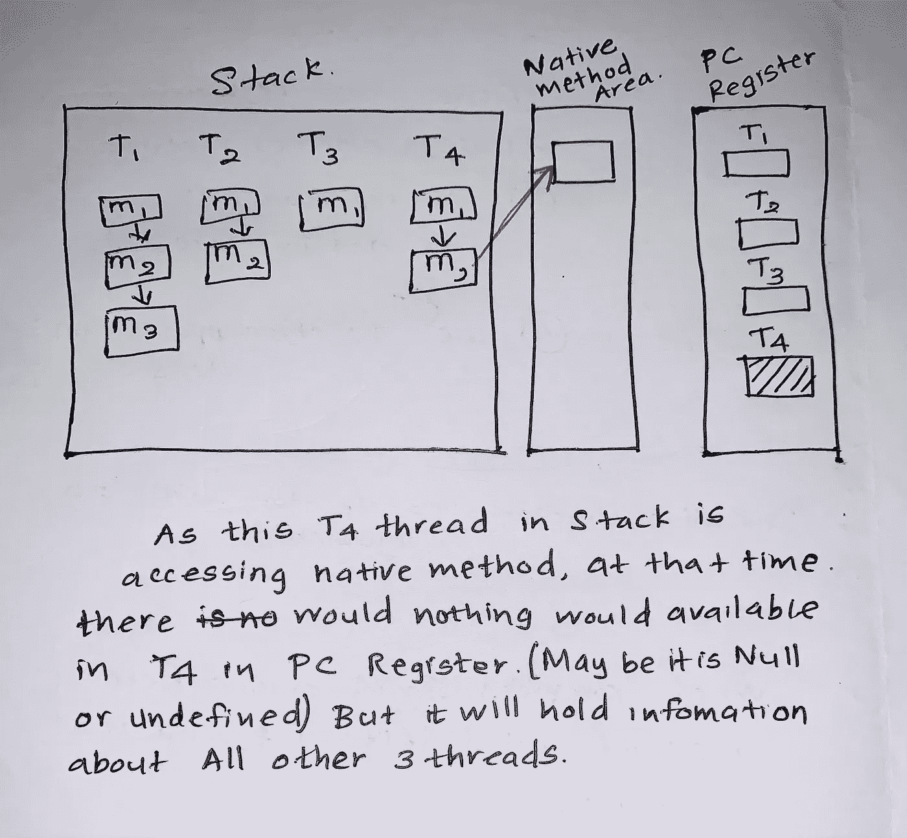
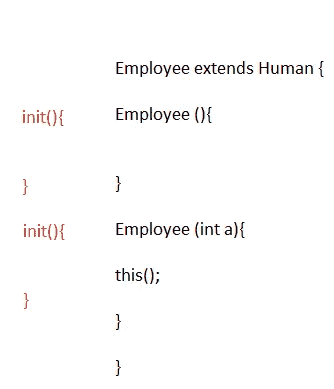
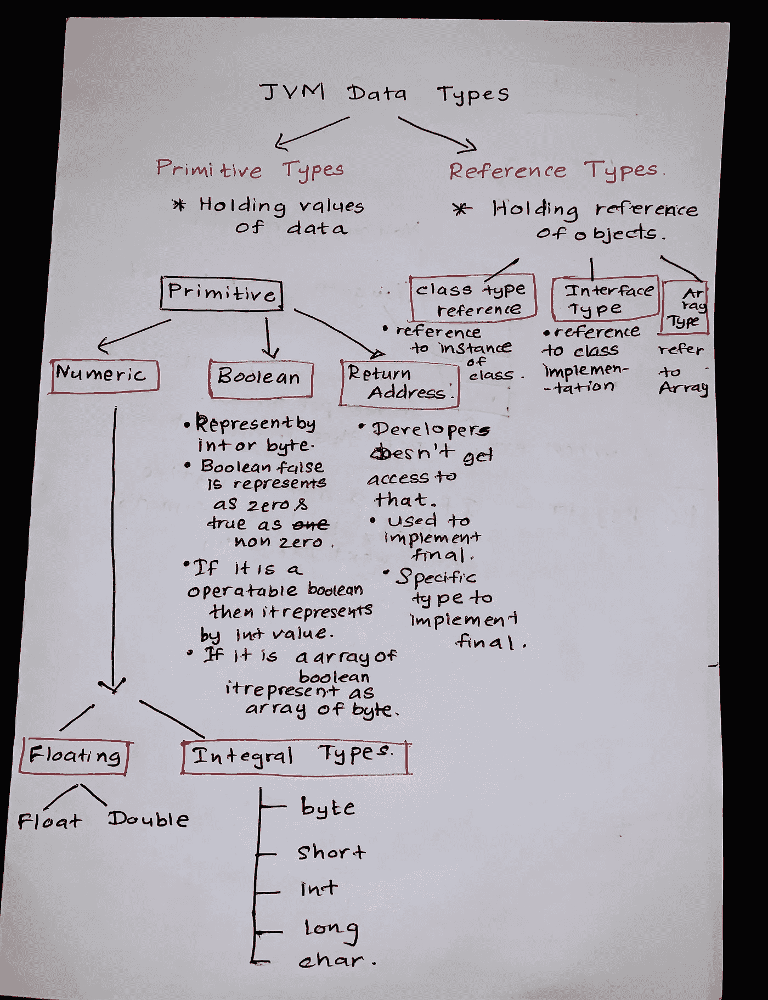

# JAVA 虚拟机！🙄

> 原文：<https://medium.com/nerd-for-tech/java-virtual-machine-8f3e223e6ca6?source=collection_archive---------15----------------------->

> **让我们来理解一下虚拟的概念。**

图片说明:男子参与虚拟游戏

虚拟→现实中没有“虚拟”的意思。这意味着它并不实际存在。

> **那么什么是“虚拟机”？**🙄

机器是帮助我们完成任务的装置。

所以， ***【虚拟机】*** 就是说*有一个机器但那不是真实的。*

图片说明:两种类型的虚拟机

> **让我们转到“Java 虚拟机”**

✦ Java 虚拟机(JVM)完全是一个规范。它规定了事情应该如何做。

✦下载 JRE 时，JVM 自带 JRE。

✦安装 JRE 的时候，会部署所有可以创建 JVM 的代码。JRE 是紧密依赖于平台的。

✦:当我们执行一个 java 程序时，它会创建一个 JVM 实例，然后 JVM 会把字节码转换成机器码。

✦没有程序执行的时间，在那个特定的时间，没有 JVM 实例在计算机上运行。(只有 JDK 和 JRE 在那里)

✦:当我们启动一个 java 程序时，它会在计算机中创建一个 JVM 实例。

✦:如果在那个特定的时间段，我们没有在计算机中执行任何程序，那么计算机中就没有 JVM 实例，只有 JDK 和 JRE。

✦:当我们启动一个 java 程序时->它会在计算机上创建一个 JVM 实例。

图片说明:java 程序如何转换成机器码

# **线程(线程允许程序通过同时做多件事来更有效地运行)**

*🔵守护线程:它是一个低优先级线程，执行垃圾收集之类的任务。这个守护线程用于支持任务。*

*🔵非守护线程:它类似于主线程。当 JVM 启动时- >它创建非守护线程。*

# 这个 JVM 在什么时候终止:

*不存在非守护线程时的🟢。*

*🟢一个应用程序可以自杀，所以它可以调用系统的退出方法。*

# JVM 中的组件

1.  *)分类装载器—装载*
2.  *)存储区—存储*
3.  *)执行引擎—执行*

图片说明:JDK、JRE 和 JVM 的架构

图片说明:JVM 架构(参考:[https://javatutorial.net/jvm-explained](https://javatutorial.net/jvm-explained))

> ***存储区***

图片说明:JVM 的结构

🟨方法区- *本将保留* ***类信息***

🟨堆区- *这个会保存* ***对象信息***

🟨堆栈区- *这将保存* ***局部变量和方法信息***

🟨 PC Registry- *这应该保存 java 方法的信息，而不是本地方法的信息。它保存了关于* ***下一次执行*** *的信息，如果它不是本地方法*

🟨本地方法区- *提供保存信息* ***本地方法、方法信息和其他东西*** 的设施

图片说明:堆栈、PC 寄存器和本机方法区域之间的连接

> ***分类器***

有两种类型的类装入器。它们是引导类加载器和自定义类加载器。

Classloader 有三个阶段， ***加载，链接，*** 和 ***初始化。***

🔹*加载*:加载类之前，

〰️It 读出了完全限定的类名。

〰️It 读取直系父母信息。

〰️It 读取这是一个类、一个接口还是一个枚举。(枚举代表一组常数)

〰️It 阅读可变信息。

然后，它将类文件加载到内存区域。当它被加载时，JVM 从类类型创建一个对象。

🔹*链接*:这又分为 3。

1.  **验证**:检查这个类文件执行起来是否安全。并且 JVM 中有一个字节码验证器，从它检查的字节码验证器；

✬ *这是否来自一个有效的编译器。*

✬ *这是否有一个正确的格式。*

✬ *这个类文件是否有正确的结构。*

如果所有这些都不满足，它将抛出一个“验证异常”。如果成功了，下一步就是准备。

**2。准备:**在这个阶段，如果我们在类中使用任何实例级变量或静态变量，它将分配默认值。

这意味着如果它是 int，它将赋值 0，如果它是 boolean，它将赋值 false，如果它是 object，它将赋值 null。

**3。解决方法:**在这个阶段，将 ***用直接链接替换符号链接。***

例 1: 我们有“雇员”、“学生 1”、“动物”..像物体一样。但是机器不理解那些和，它会把所有那些对象都当成 ***业务对象*** 或 ***特定领域*** 对象。由于 JVM 不理解这个雇员、学生等是谁，所以这个 JVM 在到达机器级别之前用直接链接替换了那些符号链接。

**例 2:** *员工 a =新员工()；*

所以在这里的解析部分，它用这个新创建的 Employee 对象保留的特定内存位置来替换我们使用 *Employee* 的所有地方。

🔹*初始化*:在这里赋实值。如果有静态块，它就会执行。每个类在被使用之前都必须被初始化。

有些观点认为积极使用类。

1️⃣新关键词

2️⃣调用静态方法

3️⃣为静态字段赋值

如果类是初始类，则为 4️⃣(有一个 main 方法)

5️⃣如果使用反射 API 来加载类(getInstance)

6️⃣实例子类

如果该类符合上述任何一项，则应该通过初始化过程；如果不符合，则不需要通过初始化过程。

***初始化一个类的 4 种方式:***

✸使用新关键字

✸使用 clone()方法(clone()→指创建一个类对象的精确副本)

✸使用反射 API(获取实例)

✸使用 Io.objectinputstream 类

> ***当初始化子类时，父类得到初始化！为什么* ❓❓❓❓**

编译 JVM 时，为我们类的每个构造函数创建 init()方法。

**所以“init()”有— >代码来调用默认构造函数的 init 方法，有代码来初始化实例变量，最后有字节码用于特定的实现。**

**如果构造函数中没有 this()，这时“init()”有→代码来调用父类默认构造函数的 init 方法，有代码来初始化实例变量，最后，它有字节码用于特定的实现。**

所以在 init 方法中可以有 3 种代码，它们是

> ***执行引擎***

字节码的执行发生在这里。

图片说明:执行引擎的组件

🔹*解释器* -读取并解释(转换)字节码为机器代码。并且一个接一个地顺序执行。

🔹 *JIT 编译器*——这是为了克服解释器的缺点而引入的，也就是“执行缓慢”。JIT 通过在运行时将字节码编译成本机代码来提升 java 程序的性能。

🔹*垃圾收集器* -它自动确定 java 程序没有使用的内存区域，并回收这些内存区域用于其他用途。

# JVM 中的数据类型

JVM 中有两种数据类型，分别是 ***原始类型*** 和 ***引用类型。***

> ***图元类型***

它保存数据的值。有三种类型作为**数字、布尔、**和**返回地址。**

🔹 ***数字*** :又分为 2 种，分别为**浮点型**和**整数型。**

浮动分为**浮动**和**双浮动。**

整数分为 5 个作为**字节，Short，Int，Long，**和 **Char。**

🔹 ***布尔*** :这由 **int** 或 **byte** 表示。布尔**假**表示为**零**而**真**表示为**非零**。如果它是一个**可操作的布尔型**，它由 **int 值**表示。如果它是布尔型的**数组，那么它被表示为字节的**数组。****

🔹 ***返回地址*** :这是**开发者无法访问的**。而这是一款**具体型号来实现最终的。**

> ***引用类型***

它保存对对象的引用。有**类类型引用、**对象类型引用、**数组类型引用三种类型。**

🔹 ***类类型引用*** :引用类的一个实例。

🔹 ***对象类型引用*** :对类实现的引用。

🔹 ***数组类型引用*** :引用数组。

图片说明:JVM 数据类型

# W***ord Size***

字长只是一个基数/单位。用于表示处理器可以寻址多少内存。(至少应该有 32 位大小)。字长由特定的实现方式决定。

> **2 规则决定字号**

1.  应该能够保存任何原始数据类型。
2.  两个单词应该能够携带长值或双精度值。