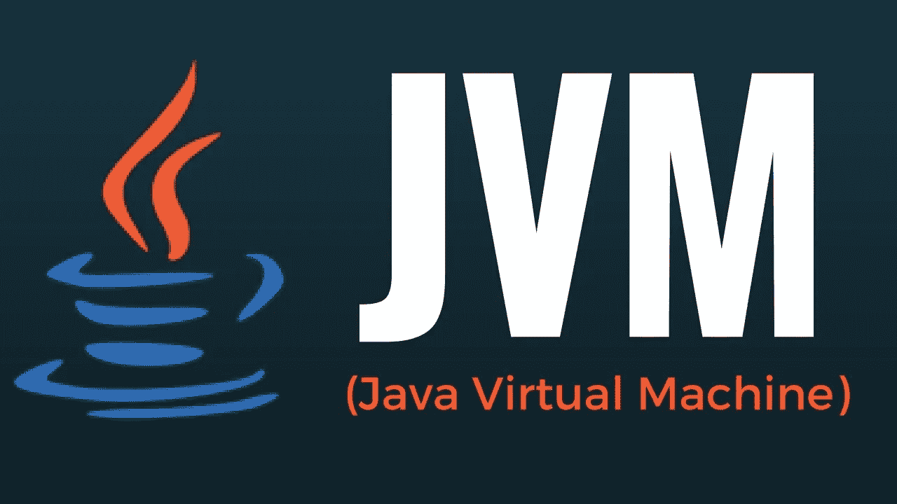
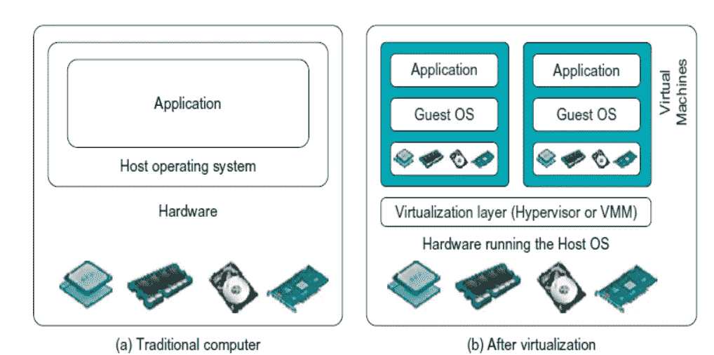
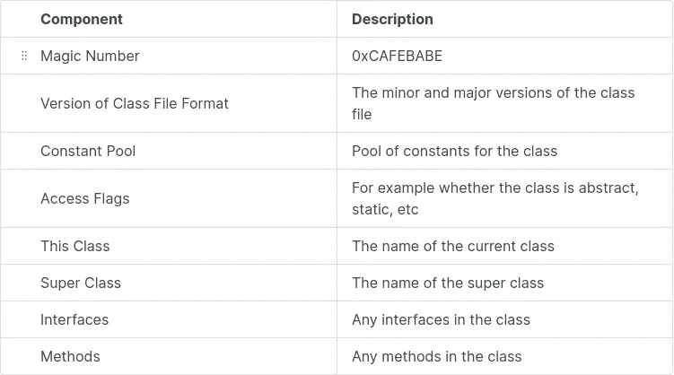
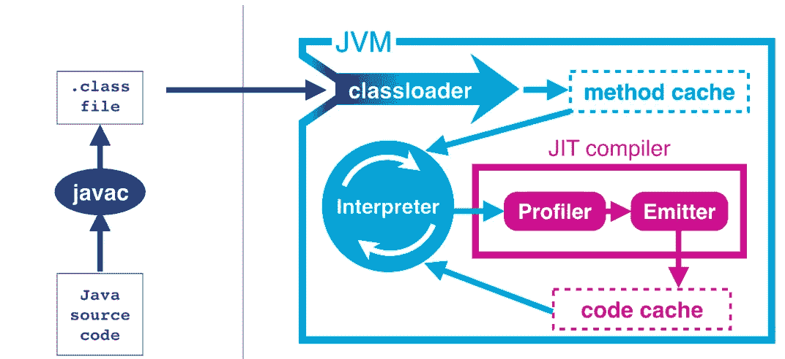

# Java 虚拟机:剖析

> 原文：<https://medium.com/nerd-for-tech/java-virtual-machine-anatomy-196638478e50?source=collection_archive---------3----------------------->

Java 是当今世界使用最广泛的技术平台之一。使用 java 或 JVM 的一些技术有。

*   **Apache spark** 用于大数据处理，数据分析运行在 JVM 之上。
*   **用于数据流的 Apache nifi** 在内部使用 JVM。
*   **React native** 在现代 web 和移动应用开发中使用 JVM 和 java 线程。

这个清单还在继续。



**虚拟化**

JVM 基于**虚拟化技术**(应用级虚拟化)，它基本上是裸机硬件之上的一个抽象层。



传统计算机与虚拟机

JVM 是应用程序级虚拟化的一个例子，它基本上是主机操作系统上的一个额外的层。我们可以在操作系统内部的沙箱中编译和运行 java 程序，而不是直接使用操作系统例程。

**代码编译和字节码**

Java 代码在执行前要经过一系列转换。第一个编译过程从 java 编译器或 **javac** 开始。javac 将 java 代码转换成中间字节码，可以使用 javap 等**反汇编器**工具读取，字节码独立于机器架构，这就是 java 编程语言可移植性的原因。

**类解剖学**

以下是使用 **javap 反汇编后的类文件的组件。**



类文件组件

每个类文件都以一个神奇的数字开始，这是给定文件是类文件的确认，接下来是类格式的版本，用于检查 JVM 版本和用于编译类文件的版本的兼容性。如果有任何不匹配，将抛出一个*unsupportdclassversionerror*。

其他组件用于存储类中使用的常量，访问标志存储访问说明符(公共、私有、抽象等)。类似地，其他组件存储超类的名称、类中使用的接口和方法。

```
public class HelloWorld {
  public static void main(String[] args) {
    for (int i = 0; i < 10; i++) {
      System.out.println("Hello World");
    }
  }
}javac HelloWorld.javajavap -v HelloWorld
```

反汇编上面的 hello world 程序，结果如下

```
Classfile /home/xxxxxxxx/Documents/learning/java/jvm/HelloWorld.class
  Last modified 7 Oct 2021; size 478 bytes
  SHA-256 checksum 93080c0483aa97ce4c226f31f22ed95c633e0da00b997fe229bfa676f6fb53c0
  Compiled from "HelloWorld.java"
public class HelloWorld
  minor version: 0
  major version: 52
  flags: (0x0021) ACC_PUBLIC, ACC_SUPER
  this_class: #5                          // HelloWorld
  super_class: #6                         // java/lang/Object
  interfaces: 0, fields: 0, methods: 2, attributes: 1
```

相应的机器语言指令将是。

```
0: iconst_01: istore_12: iload_13: bipush        105: if_icmpge     228: getstatic     #2                  // Field java/lang/System.out:Ljava/io/PrintStream;11: ldc           #3                  // String Hello World13: invokevirtual #4                  // Method java/io/PrintStream.println:(Ljava/lang/String;)V16: iinc          1, 119: goto          222: return
```

**解释**:

将常量存入 JVM 堆栈 load 并与 10 进行比较，如果大于或等于 10，则停止并退出函数 else print " *Hello world* "直到满足条件。

**解释和类加载**



JVM 架构

在将给定的源代码转换成字节后，JVM 将开始逐行解释类文件。JVM 是一个基于堆栈的解释器，因此 JVM 将使用内部堆栈来存储执行结果，而不是使用 **CPU 寄存器**。这个过程从将执行所需的所有类加载到方法缓存开始。

**级装载**

代码执行中三个重要过程

**加载**:加载所有需要执行的类。

**链接**:验证类文件，解析所有符号引用。

**初始化**:初始化程序中定义的所有静态变量。

**类加载器的类型**

**Bootstrap 类加载器:** Bootstrap 类加载器将加载源代码中的所有核心类，包括包含 main 函数的类。

**扩展类加载器:**扩展类加载器以 bootstrap 类作为其父类加载器。如果核心 java 类中的任何方法被覆盖，那么扩展类加载器将加载该类而不是原始类。

**应用程序类加载器:**加载在类路径中找到的所有类。如果在类路径中找不到类，将抛出一个 *classnotfound* 异常。

**热点编译**

> C++实现遵循零开销原则:不用的东西，不用付钱。此外，你所使用的，你不可能比手工编码更好。
> 
> **比雅尼·斯特劳斯特鲁普**
> 
> Java 是一种蓝领语言。这不是博士论文材料，而是一种工作语言。
> 
> **詹姆斯·高斯林**

与 C 和 C++等语言相比，Hotspot 编译是一种使 java 代码执行更快、更高效的方法。热点编译是一种方法，在这种方法中，随着解释过程的进行，分析器将开始收集关于执行的信息，根据这些信息 **Just In Time(JIT)** 编译器将应用一组优化。

**Java 内存分配和内存管理**

在 JVM 中运行的所有线程将拥有一个公共堆，运行一个程序所需的所有内存将从这个堆中分配，如果所需内存大于当前 JVM 堆内存，将抛出**内存越界**异常。默认情况下，对象是可变的，除非它们由 final 关键字定义。

> 一个线程创建的任何对象都可以被另一个线程访问，不希望出现的情况(一个线程引用的内存被另一个线程改变)可以通过一种叫做互斥锁或互斥锁的技术来避免。

**JIT 编译**

这个过程也称为轮廓导向优化。配置文件将跟踪当前正在运行的信息子系统，当该值达到某个阈值时，将应用优化设置。一些概要文件引导的优化策略是。

**基于计数器的优化:** Profiler 将记录方法被调用的次数。如果计数达到大于某个阈值的值，该方法将被缓存，并且下一次不是再次解释它，而是从缓存中取出值。

**关于栈替换:**不常用但包含循环的缓存方法。

**内联:**例如，它是用更高效的代码进行替换的过程。

```
int result = add(a, b);private int add(int x, int y) {return x + y;}
```

上述代码块将被替换为。

```
int result = a + b;
```

**编译器内的热点**

JIT 编译器内部由两个编译器组成。它们是 **c1 和 c2** ，传统上称为客户端和服务器编译器，当计数器达到特定值时，系统将得到通知，c1 和 c2 编译器将开始为分析信息创建内部表示。但是在 c1 和 c2 编译器之间有一个重要的权衡，c1 将提供更快但不太优化的表示，而 c2 将提供更慢但更优化的表示。

JIT 不会等待 c2 表示，而是从 c1 开始，一旦 c2 结束，c1 表示将被 c2 替换。执行流程将如下所示。

*   **0 级**:解释器
*   **级别 1** :完全优化的 C1(无分析)
*   **2 级**:带调用和后沿计数器的 C1
*   **第三级**:全剖析 C1

**代码缓存**

所有编译后的代码将存储在**代码缓存**中。缓存主要包含未分配的堆和一个包含内存块的链表。在最初缓存代码时，它将检查是否有空闲的可用块，如果有，它将立即缓存代码，否则它将从堆中分配内存用于缓存。名为 **sweeper** 的进程负责管理这些块。