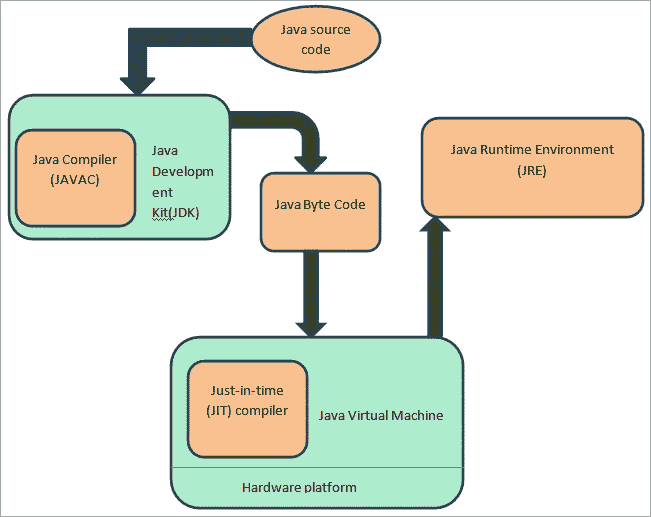
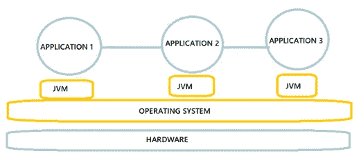
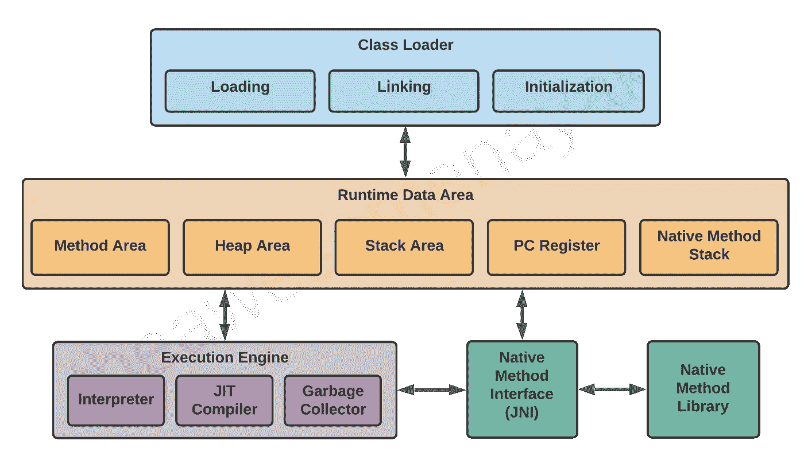

# Java 虚拟机(JVM)架构

> 原文：<https://medium.com/nerd-for-tech/java-virtual-machine-jvm-architecture-87b5bdd47403?source=collection_archive---------0----------------------->

无论您是否使用过 Java 编写程序，您可能在某个时候听说过 Java 虚拟机(JVM)。对于 Java 开发人员来说，理解 Java 虚拟机(JVM)的体系结构和 Java 的工作方式非常重要，这样才能及时充分地利用它。

在本文中，我们将学习更多关于 JVM 的知识，它是如何工作的，以及组成它的各种组件。

虚拟机（Java Virtual Machine 的缩写）

在 JVM 之前，我们先来了解一下 Java。

# Java 是什么？

Java 是一种强大的通用编程语言。它用于开发桌面和移动应用程序、大数据处理、嵌入式系统等等。据拥有 Java 的甲骨文公司称，Java 在全球 30 亿台设备上运行，这使得 Java 成为最受欢迎的编程语言之一。

## **Java 的组件**

了解 Java 的组成部分是学习 Java 的必要条件。这些组件有助于高效开发各种 Java 解决方案。用 Java 写完程序后，必须把它转换成机器语言，这样它才能被计算机理解和执行。

Java 组件

> 1.Java 开发工具包。
> (JDK)2。Java 运行时环境。
> (JRE)3。Java 虚拟机。(JVM)

## Java 运行时环境与 Java 开发工具包

Java 运行时环境(JRE)和 Java 开发工具包(JDK)是两种最常见的 Java 发行版。Java 运行时环境(JRE)由 Java 虚拟机(JVM)和 Java 类库组成。这些提供了运行 Java 程序所需的能力。JDK 还包括编写 Java 程序所需的开发工具。JDK 由三部分组成:Java 编译器、Java 虚拟机和 Java 类库。

# 什么是虚拟机？

在我们进入 JVM 之前，让我们回顾一下虚拟机(VM)的概念。一台物理机可以运行多个虚拟机，每个虚拟机都有自己的操作系统和应用程序。这些虚拟机相互隔离。

VM 中主要有两个类别，如下图所示:

虚拟机类型

1.  **基于系统的虚拟机(SVM)**——这为你创造了一个为多个用户或多个实例工作的环境。这些环境是完全独立的。
2.  **基于应用的虚拟机(AVM)或基于进程的虚拟机**——在这里，它将允许你在主机上运行一个应用程序。您可能有帮助我们运行其他程序的软件或应用程序。
    eg -JVM，CLR-公共语言运行时→Helps。net 来创建虚拟机。，
    PVM-鹦鹉虚拟机→创建动态语言环境。没有硬件，但它创造了一个平台或环境来运行某种语言作为输入，并将其转换为其他人可以理解的不同语言或不同输出。

# 什么是 Java 虚拟机？

Java 虚拟机(JVM)是一个为 Java 程序提供运行时环境的引擎。它将 Java 字节码转换成机器码。Java 虚拟机(JVM)是 Java 运行环境(JRE)的组成部分。JVM 完全是一个规范。

当你下载 JRE 时，JVM 也随之而来。当您安装 JRE 时，它将部署可以创建 JVM 的所有代码。如果我们在 windows 机器上安装 JRE，它将部署代码，这将需要为 windows 环境创建 JVM。如果我们在 mac 环境上安装 JRE，它将部署代码来创建用于 mac 环境的 JVM。

将为每个程序构建一个 Java 虚拟机(JVM)实例。结果，在程序完成后，JVM 实例被销毁。JVM 还将创建一个非守护进程(用户线程)线程来执行 Java 程序。

## **Java 虚拟机的生命周期**

*   当 java 应用程序启动时，会创建一个 JVM 运行时实例。当应用程序完成时，实例终止。
*   如果在同一台计算机上同时启动三个 java 应用程序，将会有三个 java 虚拟机实例在运行
*   每个 java 应用程序都在自己的 java 虚拟机中运行。

每个应用程序的 JVM

JVM 将在两种情况下被销毁，例如:

1.  如果没有运行非守护线程。此时，JVM 将强制终止所有活动的守护进程线程。
2.  如果 Java app 杀了自己(通过调用 System.exit()方法)。

而且很明显，JVM 一旦崩溃就会被摧毁。

## JVM 的组件

JVM 由三个组件组成，它们是

1.  类加载器——加载类文件
2.  内存区域-存储类
3.  执行引擎-执行/提供运行时环境

JVM 组件

让我们更深入地了解一下每个组件。

# 1.类装入器

它负责以下三项活动

1.  装货
2.  连接
3.  初始化

## 装货

该组件将为您加载类。引导类加载器、扩展类加载器、应用程序类加载器是三个有助于实现它的类加载器。

JVM 的类加载器子系统负责加载类文件(。类)存储到内存中。当我们运行一个 Java 程序时，类装入器首先装入它。当 JVM 加载一个类时，它在方法区域存储以下信息。

*   加载的类的完全限定名。
*   加载的类的直接父类。(如果没有父类，JVM 会将加载的类作为父类)
*   是否该”。“class”文件是一个类、接口或枚举。
*   关于修饰符、变量和方法信息的细节，等等。

加载点类文件后，JVM 立即在堆内存上为加载的类创建一个类型为 **java.lang.Class.** 的对象。该类类型对象是 java.lang 包中预定义的类对象。程序员可以使用 Class 类对象来获取关于类的方法、变量和构造函数等信息。

## 连接

1.  验证-字节码验证器将验证生成的字节码是否正确，如果验证失败，我们将得到验证错误。
2.  prepare-对于所有静态变量，内存将被分配并赋予默认值。
3.  resolve-所有符号内存引用都被替换为方法区域中的原始引用。

## **初始化**

这是类加载过程的最后一步，所有静态变量都被赋予它们的初始值，静态块被执行。

# 2.**记忆区**

JVM 的内存区域是存储数据的地方。方法区、堆区、堆栈、程序计数器(PC)寄存器和本机方法区是 JVM 内存区的五个子区。

JVM 的内存区域

**类区**-每个类的类级数据都存储在这里，比如运行时常量池、字段和方法数据，以及方法代码。

**Heap**——堆区是在虚拟机启动时创建的，从这里为所有类实例和数组分配内存，代表运行时数据区。

**堆栈**——在 Java 中，堆栈内存用于静态内存分配和线程执行。这是专为每根线打造的。当线程启动时，JVM 创建一个单独的运行时堆栈，在其中存储方法调用。对于每个方法调用，将产生一个帧并将其推入运行时堆栈的存储中。当一个框架的方法调用完成时，它被销毁。

**程序计数器寄存器-** 每个线程都有自己的 PC 寄存器，用来存储当前执行指令的地址。一旦指令完成，PC 寄存器将被下一条指令更新。

**本地方法区-** 这将存储关于本地方法的信息，这些方法是用 Java 以外的语言编写的，比如 C 或 C++。每个新线程都有自己的本地方法堆栈，就像堆栈和 PC 寄存器一样。

# 3.执行引擎

执行引擎将运行分配给内存区域的字节码。执行引擎逐个读取字节码并执行它。它将包含三个部分。

**解释器**-读取字节，解释它们，然后逐个执行。解释器的基本缺点是，当同一个方法被多次调用时，每次都需要一个新的解释，因此会降低系统的性能。JIT 编译器就是为它提供的解决方案。

**JIT 编译器(即时编译器)**-运行时环境包括即时(JIT)编译器。通过在运行时将字节码编译成机器码，它有助于 Java 应用程序的性能。

**垃圾收集器**——顾名思义，就是收集不用的材料的工具。垃圾收集会在 JVM 上处理这个问题。它跟踪 JVM 堆区域中的每个项目，并删除不需要的项目。
标记和清扫是垃圾收集器使用的两个简单步骤:

> 标记——垃圾收集器在这里识别哪个内存块正在使用，哪个没有被
> 清除——它删除在“标记”阶段识别的对象

# 参考

1.  2021，Java 虚拟机架构讲解，【视频】-【https://www.youtube.com/watch?v=jnpuRvRdTgI 
2.  2020，Java 架构与组件，[文档]-[https://www . lsraheja . org/WP-content/uploads/2020/04/SYBSCIT-SEM-IV-Core-Java-Unit-I-ii . pdf](https://www.lsraheja.org/wp-content/uploads/2020/04/SYBSCIT-SEM-IV-Core-Java-Unit-I-II.pdf)
3.  2016，什么是 JVM，【视频】-[https://www.youtube.com/watch?v=bUtIIWbaFKc](https://www.youtube.com/watch?v=bUtIIWbaFKc)