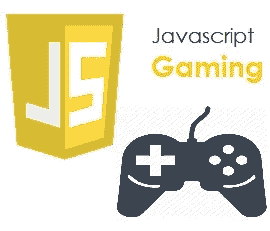
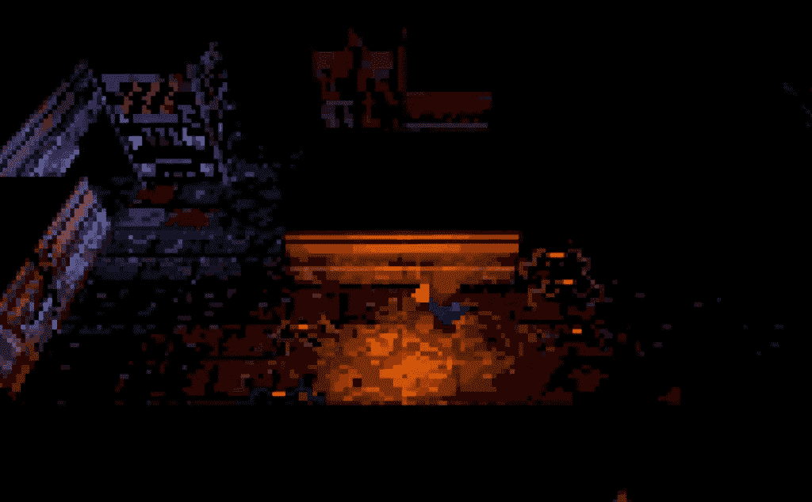
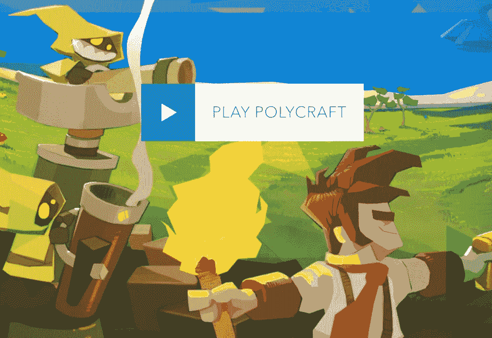

# JavaScript 和游戏产业

> 原文：<https://medium.com/nerd-for-tech/javascript-and-the-gaming-industry-3d2ff7f102e9?source=collection_archive---------4----------------------->

avaScript 是一种有趣而灵活的编程语言。它是 web 开发的核心技术之一，可以用在前端和后端。您可能每天都会用到的 JavaScript 的常见示例包括亚马逊上的搜索框、嵌入在《纽约时报》上的新闻摘要视频，或者刷新您的 Twitter feed。

加入 JavaScript 通过将网页从静态页面转换成交互式页面来改善用户体验。概括地说，JavaScript 向网页添加了**行为**。

# JavaScript 是用来做什么的？

JavaScript 主要用于基于 web 的应用程序和 web 浏览器。但是 JavaScript 也在网络之外的软件、服务器和嵌入式硬件控制中使用。

以下是 JavaScript 的一些基本用途:

## 1.向网页添加交互行为

JavaScript 允许用户与网页交互。使用 JavaScript 在网页上可以做的事情几乎没有限制——这里只是几个例子:

*   通过单击按钮显示或隐藏更多信息
*   当鼠标悬停在按钮上时改变按钮的颜色
*   在主页上浏览一系列图片
*   放大或缩小图像
*   在网站上显示计时器或倒计时
*   在网页中播放音频和视频
*   显示动画
*   使用下拉汉堡菜单

## 2.创建 web 和移动应用程序

开发人员可以使用各种 JavaScript 框架来开发和构建 web 和移动应用程序。JavaScript 框架是 JavaScript 代码库的集合，为开发人员提供了用于日常编程功能和任务的预写代码——字面意思是一个构建网站或 web 应用程序的框架。

流行的 JavaScript 前端框架有 React、React Native、Angular、Vue 等。许多公司使用 Node.js，这是一个基于 Google Chrome 的 JavaScript V8 引擎构建的 JavaScript 运行时环境。一些著名的例子包括贝宝，领英，网飞和优步！

## 3.构建 web 服务器和开发服务器应用程序

除了网站和应用程序，开发人员还可以使用 JavaScript 构建简单的 web 服务器，并使用 Node.js 开发后端基础设施。

## 4.游戏开发

当然，你也可以使用 JavaScript 来创建浏览器游戏。这些是初学者练习 JavaScript 技能的好方法。

# JavaScript 的特性:

*   多功能且坚固耐用
*   前端友好
*   后端友好
*   启用 web 应用程序
*   游戏开发
*   移动应用

# JavaScript 和游戏产业

JavaScript 可用于使用各种平台和工具制作游戏。2d 和 3d 库都可以与 JavaScript 结合使用，在浏览器或外部游戏引擎平台上创建成熟的游戏。

需要注意的是，大多数 JavaScript 游戏开发都集中在创建用于浏览器的游戏上。这本身就造成了一些限制。

常见的游戏方面，如**碰撞检测**或其他渲染任务通常需要使用 GPU 计算进行繁重的计算。然而，由于我们局限于浏览器，计算能力不如其他游戏渲染引擎和技术强大。

因此，JavaScript 目前还不足以成为制作 AAA 游戏的工具。缺乏渲染管道，真正的面向对象和先进的内存管理阻碍了它的这些类型的标题。

此外，由于大多数 JavaScript 游戏框架也以浏览器为目标。这些游戏本质上不会是本地的。然而，仅仅因为大多数游戏是针对浏览器的，并不意味着一些 JavaScript 游戏努力实现的范围和功能不合法。

毕竟，浏览器的功能逐年显著增强。他们能提供媲美其他游戏平台的体验只是时间问题。

有一个坚固的框架是必要的，以创造一个特殊的游戏。多个游戏改进框架现在可以大量使用，它们更好地被称为游戏引擎。

## 让我们来看一些游戏引擎的例子:

*   [三个。Js](https://threejs.org/) (酷炫的 Javascript 游戏引擎)
*   [法莫。Us](https://github.com/Famous/engine) (Javascript 游戏引擎开源)
*   [Goo 引擎](https://github.com/GooTechnologies/goojs) (Javascript 3D 游戏引擎)
*   [CooperLicht](https://www.ambiera.com/copperlicht/) (基于 Javascript 的游戏引擎)
*   [体素。Js](https://www.npmjs.com/package/voxel/) (安卓 Javascript 游戏引擎)
*   [Godot](https://godotengine.org/) (游戏引擎便于编码)
*   [Unity](https://unity.com/) (带 IDE 的 2D 游戏引擎)
*   [Allegro](http://liballeg.org/) (Javascript 游戏引擎)

## 与 JavaScript 框架一起使用的一些外部工具/框架包括:

*   [HTML5 画布](https://developer.mozilla.org/en-US/docs/Web/API/Canvas_API)
*   [WebGL](https://get.webgl.org/)
*   [相位器](https://phaser.io/)
*   [Impact.js](https://impactjs.com/)
*   [斧头](https://haxe.org/)
*   [Melonjs](http://www.melonjs.org/)
*   [PixiJS](https://www.pixijs.com/)
*   [三个 j](https://threejs.org/)

## 使用 JavaScript 进行移动游戏开发的一些最流行的框架包括:

*   [离子型](https://ionicframework.com/)
*   [PhoneGap](https://phonegap.com/)
*   [框架 7](https://framework7.io/)
*   [森查](https://www.sencha.com/products/extjs/#overview)

## 使用 JavaScript 构建的各种游戏的几个例子是:

*   HEXGL- [HexGL](http://hexgl.bkcore.com/) 是一款主要用 HTML5、JavaScript 和 WebGL 打造的快节奏赛车游戏。
*   Underun - [Underrun](https://js13kgames.com/games/underrun/index.html) 是另一个时尚的作品，展示了可以在 JavaScript 游戏中使用的艺术视觉。

*   cross code——很可能是目前最全面的 JavaScript 游戏。 [CrossCode](http://www.cross-code.com/en/start) 是使用 HTML 和 ImpactJS 创建的。
*   PolyCraft- [Polycraft](http://polycraftgame.com/) 提供资源收集，3d 塔防游戏。这可能是目前最完美的 JavaScript 游戏之一，它在大多数网络浏览器中都能流畅运行。

# 结论:

总的来说，显然 JavaScript 游戏仍处于其生命周期的早期。这些游戏的深度注定会随着时间的推移而演变。尤其令人印象深刻的是可用于构建创造性浏览器体验的工具。

尽管游戏的深度还处于起步阶段，低估 JavaScript 游戏开发可能是非常不明智的。在谷歌、微软、Mozilla 和苹果工作的开发人员的天赋将确保基于浏览器的开发变得更加可行，特别是考虑到移动游戏市场一直是多么有利可图。

随着浏览器的强大，JavaScript 游戏也将向前迈进一步。这是一个有趣的领域，因为 JavaScript 游戏的潜在影响力只受到不能使用现代浏览器的设备的限制。