# Javascript —简介

> 原文：<https://medium.com/nerd-for-tech/javascript-basics-9ff0513fc1ab?source=collection_archive---------12----------------------->

从 Javascript 开始的一些基础知识

> **Javascript 简介:**

**Javascript** (简称“JS”)是一种脚本语言，常用于在 web 浏览器内创建交互效果。它最初是由**网景**开发的，作为一种给网站添加动态和互动元素的手段。JS 在客户端和服务器端都被使用，以使我们的网页更加有效和具有交互性。HTML 和 CSS 是网页的结构和风格，而 Javascript 是为用户创造动态交互体验的逻辑。

Javascript 基本上是一种非常通用且对初学者友好的语言。随着更多的实践和经验，你很快就能创建游戏，动画 2D 和三维图形，全面的数据库驱动的应用程序，等等！

—您可以通过以下方法将 Javascript 添加到 HTML 中:

1.  中的 Javascript
2.  中的 Javascript
3.  外部 Javascript

**JS bin** 编译器最适合在线练习。点击下面的链接，开始练习 Javascript 吧！！

[http://jsbin.com](http://jsbin.com/?html,css,js,output)

→<头>中的**Javascript:**

在这种类型中，Javascript 被添加到 HTML 文件的头部。

当点击按钮时，调用函数 **moreInfo()** 。

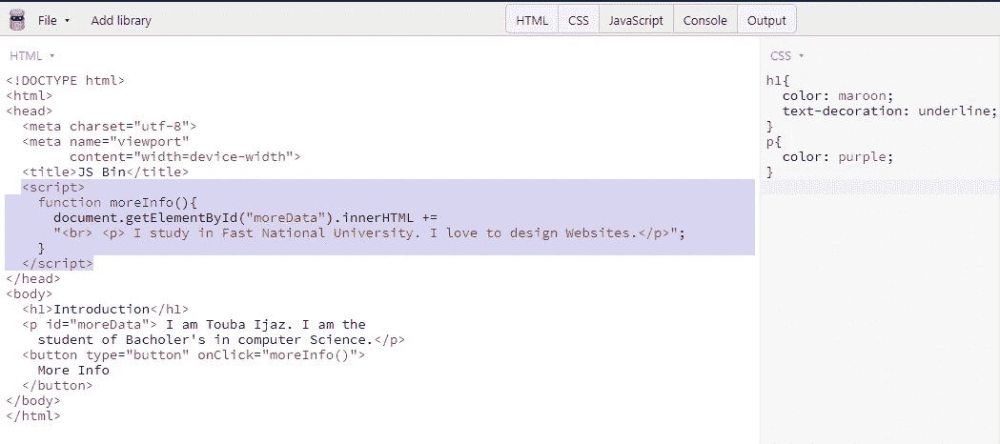

点击**更多信息**按钮前的输出:

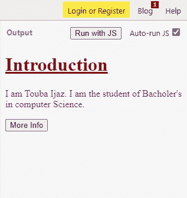

点击**更多信息**按钮后的输出:使用 Javascript 将选中的段落添加到介绍页面。

→<正文>中的**Javascript:**

在这种类型中，Javascript 被添加到 HTML 文件的主体中。

点按“更多信息”按钮之前的输出:

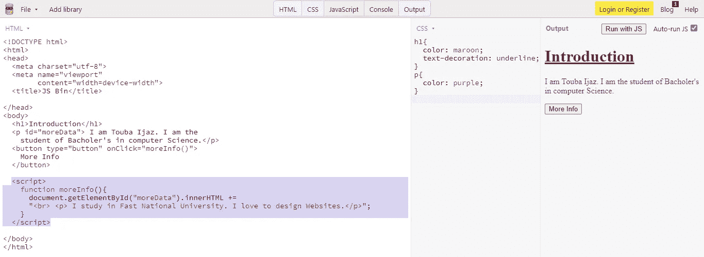

点按“更多信息”按钮后的输出:

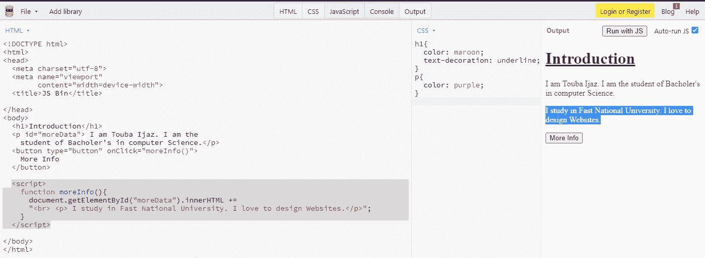

→ **外部 Javascript:**

在这种类型中，我们创建一个外部 javascript 文件(。js 扩展)并使用下面的代码行将其与中的 HTML 文档链接起来。在 src 属性中，我们将编写我们的。js 文件名。

点按“更多信息”按钮之前的输出:

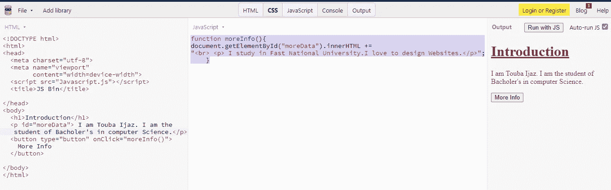

点按“更多信息”按钮后的输出:

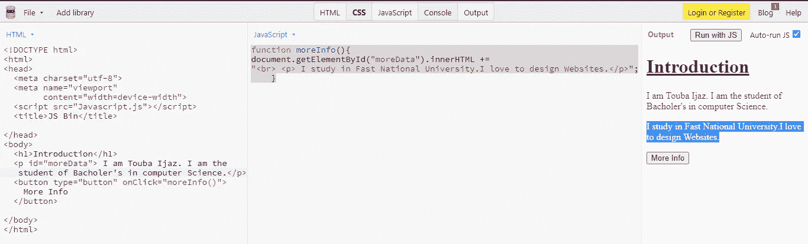

您可以在下面的链接中找到代码:

 [## toubaijaz 19/addTextUsingJavascript

### 通过在 GitHub 上创建一个帐户，为 toubaijaz 19/addTextUsingJavascript 开发做贡献。

github.com](https://github.com/toubaijaz19/addTextUsingJavascript) 

> 正在安装节点:

首先，使用下面的链接在你的系统中安装 nodejs。

[https://nodejs.org/en/download/](https://nodejs.org/en/download/)

在 Javascript 中， **console.log()** 函数用于打印任何类型的已定义变量或需要显示给用户的消息。

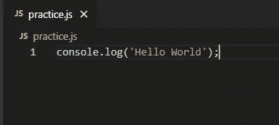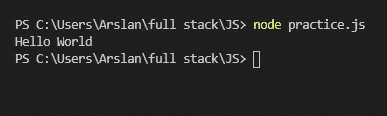

在终端中运行此命令

**变量—** 变量是一个值的容器，我们可能会在句子或计算中用到它。我们通过使用 3 个关键字来定义变量

1.  在 2015 年之前，var → var 关键字是声明 JavaScript 变量的唯一方式。
2.  **let** → let 关键字用于定义限定范围的变量。
3.  **const** → const 关键字定义不能重新分配的变量。

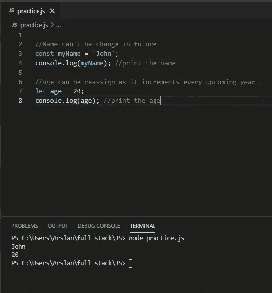

**数据类型—** Javascript 主要有两种数据类型

1.  原始数据类型→数字、字符串、布尔值
2.  非原始数据类型→对象、数组、函数

**数字**:数字是原始数据类型。在 Javascript 中，每个数字无论是整数还是浮点数都被认为是一个**数字**数据类型。 ***typeof*** 函数显示变量的数据类型。

**字符串:**字符串是原始数据类型。它是一组也可以包含空格和数字的字符。在 Javascript 中，我们可以用三种方式初始化字符串

1.  *单引号字符串* →我们使用单引号进行字符串初始化。
2.  *双引号字符串* →我们使用双引号进行字符串初始化。
3.  *模板文字* →模板文字用反斜杠(` `)括起来。这些由美元符号和花括号(`${expression}`)表示。

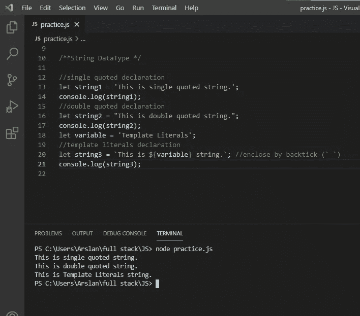

Boolean:它是一个基本数据类型。布尔数据类型是一种值为真或假的类型。

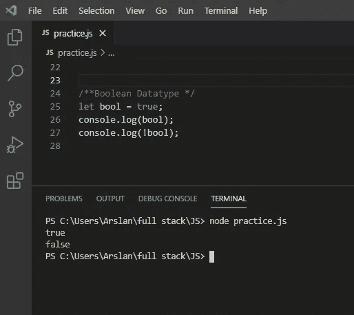

**对象:**一个**对象**是属性的集合，属性是一个名称(或者键)和值的关联。属性的值可以是变量或函数，称为方法。花括号{}用于包含对象项。

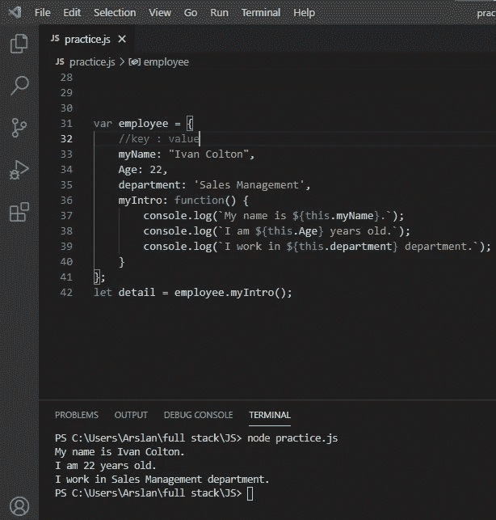

**数组:**数组基本上是一个包含多个项的容器，项可以是相同的数据类型，也可以是不同的数据类型。在 Javascript 中，我们可以在一个数组中列出不同的数据类型变量。数组是非原始数据类型，任何非原始数据类型都是对象。方括号[]用于包含数组项。

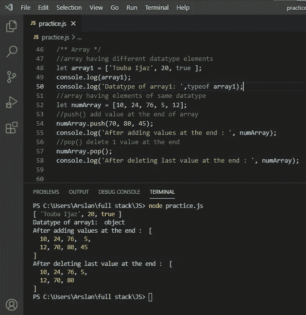

您可以从以下链接找到 practice.js 代码:

[https://github.com/toubaijaz19/javascriptBasicsPractice](https://github.com/toubaijaz19/javascriptBasicsPractice)