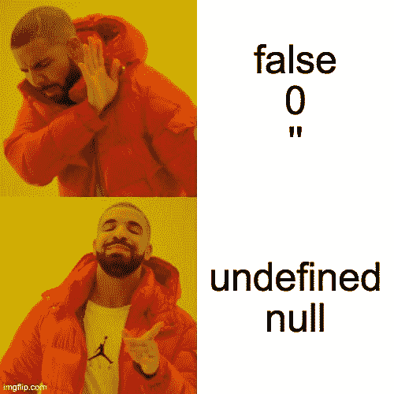
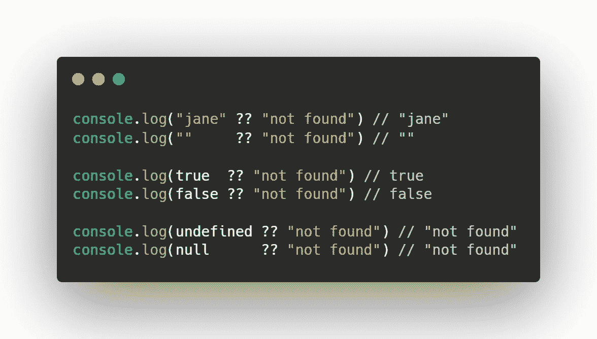
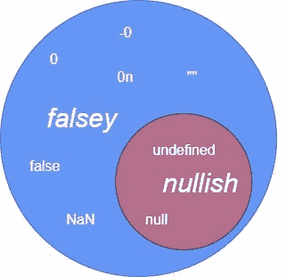

# JavaScript —检查空值的更好方法

> 原文：<https://medium.com/nerd-for-tech/javascript-better-way-to-check-for-nullish-values-395d08ffe2b1?source=collection_archive---------5----------------------->


在这篇文章中，我们将看到**一个无效的合并操作符(？？)和一个逻辑或(||)**

但是在继续之前，让我们用 Javascript 中一个非常常见的概念来刷新一下自己，那就是，**什么是真/假值**。

在 JavaScript 中，有 6 个值被认为是 **falsy** :

*   不明确的
*   空
*   圆盘烤饼
*   0
*   " "(空字符串)
*   错误的

所有其他 JavaScript 值将产生**真**，因此被视为**真**。

这里有几个例子👇

```
const value1 = 1;
const value2 = 2;const result = value1 || value2;console.log(result); // 1
```

value1 和 value2 都是真值，因此 JavaScript 将打印它遇到的第一个真值。

```
const value1 = 0;
const value2 = 2;const result = value1 || value2;console.log(result); // 2
```

因为这里 value1 是 0，所以将检查 value2，因为它是真值，所以整个表达式的结果将是 value2。

**TL；DR —** 如果这六个值(false，undefined，null，空字符串，NaN，0)中的任何一个是||，那么我们将得到第二个操作数作为结果。

# 为什么是“无效合并运算符”？

||(OR)操作符工作得很好，但有时我们只希望在第一个操作数为空或未定义时计算另一个表达式。

因此，ES11 增加了 nullish 合并运算符。



那个？？运算符可用于在另一个值为空或未定义的情况下提供回退值。它有两个操作数，写成这样:

```
value ?? fallbackValue
```

如果左操作数为空或未定义，则？？表达式计算出右操作数:



# 将 nullish 合并运算符与可选的链接运算符相结合

可选的链接运算符(？。)允许我们访问嵌套的属性，而无需显式检查链中的每个对象是否存在。

我们可以将 nullish 合并操作符与可选的链接操作符结合起来，从而安全地为缺失属性提供一个除 undefined 之外的值。这里有一个例子:

```
const country = {
    obj: {
        name: null
    }
};
const region = country?.obj?.name??"France";
console.log(region);    // France
```

# 结论

我们已经看到，当您只关心任何变量的`null`或`undefined`值时，nullish 合并运算符非常有用。

Nullish 合并操作符的要点是区分 nullish (null，undefined)和 false 但已定义的值(false，0 等)。)

For ||(逻辑 OR)null 值和 falsey 值相同。



# 从 Web 开发开始？

查看 [**HTML 反应:终极指南**](https://gumroad.com/a/316675187)

这本电子书是一个全面的学习指南，通过大量易于理解的例子和经过验证的路线图，它将教你成为一个自信的 web 开发者所需要知道的一切

有了这个链接，就可以拿到**六折。**

[](https://gumroad.com/a/316675187)

HTML 反应:完整的网络开发电子书

*(原载于*[*apoorvtyagi . tech*](https://apoorvtyagi.tech/nullish-coalescing-operator-vs-logical-or-javascript)*)*