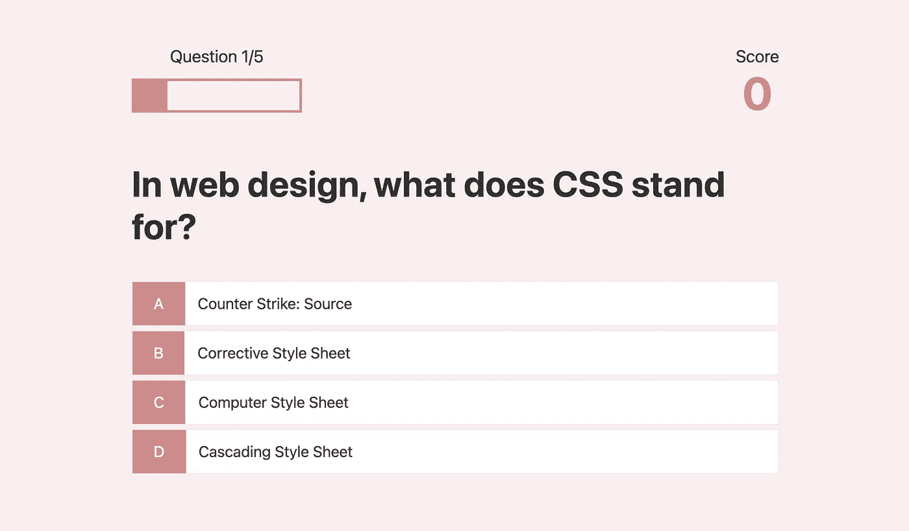

# JavaScript —构建一个测验应用程序

> 原文：<https://medium.com/nerd-for-tech/javascript-build-quiz-application-f6ee0a235417?source=collection_archive---------6----------------------->



这是 Wecode 预备课程的第三周！本周，我们继续学习 JavaScript 的各种概念。由于过去和本周的学习计划完全取决于我们个人，我决定参加一个短期的在线课程，使用 HTML、CSS 和 JavaScript 创建一个测验应用程序。

总的来说，我喜欢我的应用程序，也非常喜欢这个由 James Quick 在 Udemy 上开设的课程。在这个课程上我学到了很多，还有很多要复习，重复，提醒。我向大家强烈推荐这门课程。下面提供了链接:

[](https://www.udemy.com/course/build-a-quiz-app-with-html-css-and-javascript/) [## 免费的 Web 开发教程——用 HTML、CSS 和 JavaScript 构建一个测验应用程序

### James 是一名开发人员、演讲者和教师，对 web 开发、设计和开发工具充满热情。他有…

www.udemy.com](https://www.udemy.com/course/build-a-quiz-app-with-html-css-and-javascript/) 

# **我做了什么竞猜 app？**

因此，我创建了一个测验应用程序，让您解决随机生成的计算机/编程相关问题。当你在玩游戏的时候，它会让你知道你在哪个问题(问题计数器)上，如果你答对了，每个问题有 10 分。当你点击选项来回答时，颜色(绿色和红色)会让你知道你回答的是对还是错。

在游戏结束时，它会让你知道总分，你可以输入你的用户名来注册高分。您的分数存储在本地存储器中，并且只在高分板上显示前 5 名的分数。

我的问答 app 链接如下:【https://jessywlee.github.io/quiz-app-with-HTML-CSS-JS/】T3

# HTML 和 CSS

*   **Emmet 文档**

首先，我对在 VSC 上使用埃米特的一些片段有点熟悉了。这确实节省了很多时间，因为你不必键入所有的标签，打开和关闭它们。我还了解了 emmet 文档备忘单，它似乎会有很大帮助。

*   **使用 rem**

我第一次在 CSS 上使用 rem。本课程的讲师(James Quick)介绍了如何使用它。首先，在根部设置字体大小为 62.5%。62.5%意味着 10px，因为默认值设置为 16px。然后，1 rem 设置为 10px，可以相对使用。比如 1.8 雷姆会是 18px。我很喜欢使用这个方法，因为它简单又容易。

*   **装箱尺寸**

我意识到将框尺寸设置为 border-box 非常方便，因为填充尺寸将包含在框尺寸中，这样您在应用和修改尺寸时就不会感到困惑。

*   **按钮悬停效果**

```
*.btn:hover {
cursor: pointer;
box-shadow: 0 0.4rem 1.4rem 0 rgba(86, 185, 235, 0.5);
transform: translateY(-0.1rem);
transition: transform 150ms;
}*
```

我学到了一个不错的按钮悬停效果，我希望在我的项目中使用很多时间。上面的设置允许当你在按钮上移动光标时，阴影将被应用，并且 translateY 使按钮稍微向上移动，以便它可以给出一些 3D 效果。

*   **定心元件**

我不太清楚居中元素如何与 CSS 一起工作。上周创建“关于我”页面时，我想我在尝试不同的东西时已经明白了，所以我需要更多的澄清。这一次我澄清了自己的观点，即**对齐内容应用于主轴，对齐项目应用于横轴**。当对齐 flex 容器中的项目时，justify-content 沿水平主轴移动，而 align-items 沿垂直横轴移动，因为默认情况下 flex 容器设置为 row。

这意味着当 flex 容器设置为 column 时，主轴变成垂直的，反之亦然。

# Java Script 语言

*   **抓取 API**

起初，我使用硬编码的问题在应用程序上生成。后来我从开放琐事题数据库学会了使用 web API。此处提供链接:

 [## 打开琐事数据库

### 免费使用，用户贡献的琐事题库。

opentdb.com](https://opentdb.com/) 

```
*fetch(“https://opentdb.com/…")
.then(res => {
return res.json();
})*
```

我了解到 **fetch()** 出于安全考虑并不适用于本地路径，所以需要 https URL 方案。如果你使用本地路径，你可以使用本地开发服务器(我下载了 live 服务器，它是 VSC 的扩展)。

**fetch()** 会返回一个承诺。我不能完全理解为什么我需要返回 res.json()以及它意味着什么。根据 MDN，json()方法接受一个响应并读取它直到完成。换句话说，当获取成功时，我们使用 json()读取并解析数据。然后它返回一个解析为 JS 对象的承诺。🤯

*   **地图()**

```
*.then( loadedQuestions => {
questions = loadedQuestions.results.map( loadedQuestion => {
const formattedQuestion = {
question: loadedQuestion.question};*
```

**map()** 方法从调用数组中给出一个新数组。获取的 API 具有生成的问题、正确答案和错误答案的数组。 **map()** 获取这些数组并返回一个新的对象 **formattedQuestion** ，该对象具有 **question** 键和值。

*   **拼接()**

```
*const answerChoices = […loadedQuestion.incorrect_answers];
formattedQuestion.answer = Math.floor(Math.random() * 4) + 1;**answerChoices.splice(formattedQuestion.answer-1, 0,
loadedQuestion.correct_answer);*
```

在获取的 json 文件中，正确答案和错误答案是分开的元素。为了让它们在同一个数组中，不正确答案的数组被分配给 answerChoices。

一个从 1 到 4 的随机数被分配给 formattedQuestion.answer .然后， **splice()** 方法被用于将正确答案添加到 answerChoices 数组中。 **splice()** 中的第一个参数代表**开始索引**。应用-1 是因为数组的索引从 0 开始。第二个参数表示 **deleteCount** ，它是要从起始索引中删除的元素的数量。第三个参数是要添加的**元素。**

假设答案是 4。splice()从 answerChoices 数组(为空)中找到索引 3。0 元素被删除，正确答案被添加到数组中，所以数组有包括答案在内的四个元素。

*   **forEach()**

```
*answerChoices.forEach((choice, index) => {
formattedQuestion[“choice” + (index + 1)] = choice;
});*
```

**forEach()** 对数组的每个元素执行一个函数。它将**回调函数**和**当前值**作为执行函数的元素。**索引**是可选参数。answerChoices 数组的每个元素被分配给具有“choice1~4”键名的 **formattedQuestion** 对象。

*   **属性访问—点号还是方括号？**

对于何时使用点符号或方括号符号来访问对象的属性，我有点困惑。我了解到，当使用点符号时，符号后的名称应该是有效的变量名，并直接命名属性。Object.x 获取属性键“x”的值。当使用方括号符号时，会计算方括号之间的表达式，并使用结果来获取属性名(键)。因此，方括号符号允许使用不能用于点符号的字符。

# 下一步是什么？

我觉得我需要更多的时间来完全理解和消化这个项目中涉及的所有功能、方法和语法。虽然我可以在观看课程的时候写代码，但在我完成项目后，我很难重新阅读和理解它。一旦我再次审查该项目，我计划将该应用程序添加到我的“关于我”页面。我将改变 CSS，使其与我的页面一致，并更新问题，使其更有趣。

就个人而言，我终于在上周五辞职了😀我真的很享受当了一年多英语老师的经历。离开教室真是苦乐参半。我会想念我的学生。另一方面，我感觉很棒，因为我终于有更多的时间来专心学习了。总的来说，对即将到来的非常兴奋！