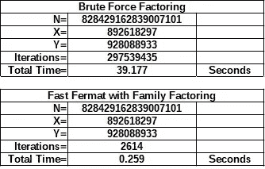

# 快速费马整数族分解的 JAVASCRIPT 代码

> 原文：<https://medium.com/nerd-for-tech/javascript-code-for-fast-fermat-integer-family-factoring-74b738b1db7d?source=collection_archive---------9----------------------->

## **第六部分:整数因式分解基础**

```
*There is no better way to spawn creativity,
Than to think that your manuscript is finished.*
```



整数因子分解例程的比较

# **前言**

这篇文章提供了我最喜欢的几个简单的**整数分解例程**的 JavaScript 代码，以及**增强型费马**和**快速费马整数族分解**的原型。该软件是功能性的(在一定程度上),用于演示**整数族分解**中涉及的数学可以整合到工作软件中。请注意，这个软件没有通过任何类似的全面测试，可能有(很多)未解决的错误。无论你是否选择运行这个软件，它对于你的教育和学习都是存在的。所以，享受吧！

有关**整数因式分解算法**的一般信息，请访问:

[https://en . Wikipedia . org/wiki/Category:Integer _ factorization _ algorithms](https://en.wikipedia.org/wiki/Category:Integer_factorization_algorithms)

和

[https://en.wikipedia.org/wiki/Integer_factorization](https://en.wikipedia.org/wiki/Integer_factorization)

以下文章讨论了**整数因子分解族**的基础知识:

[https://jbjo 1956 . medium . com/introduction-to-integer-factoring-families-DCE 2152 FBA 81？source = friends _ link&sk = 382 a4 fef 0 EAC 9 c 47673 c 550 db 9560761](https://jbjo1956.medium.com/introduction-to-integer-factoring-families-dce2152fba81?source=friends_link&sk=382a4fef0eac9c47673c550db9560761)

和

[https://jbjo 1956 . medium . com/integer-number-families-the-next-generation-3f 298d 347 b5c？source = friends _ link&sk = 1c 3 b 14 de 8c 950 BF 6588 C4 c 114 e 60 AC 95](https://jbjo1956.medium.com/integer-number-families-the-next-generation-3f298d347b5c?source=friends_link&sk=1c3b14de8c950bf6588c4c114e60ac95)

和

[https://jbjo 1956 . medium . com/fast-Fermat-integer-family-factoring-e2c 277943727？source = friends _ link&sk = a 685 a 442 c 14 a5 fc 7d 8715 a 4d 449 a 94 cf](https://jbjo1956.medium.com/fast-fermat-integer-family-factoring-e2c277943727?source=friends_link&sk=a685a442c14a5fc7d8715a4d449a94cf)

此时，我将不讨论所涉及的数学原理，因为它们在这些文章中已经有了充分的介绍。我将提供的是我个人用来学习整数分解和质数的 JavaScript 代码。我还会提供如何操作这个软件的说明，虽然我可能应该为这些说明产生的任何混乱道歉。(不是故意的…老实说！)

特别感谢 D·豪对我的疯狂表现出的兴趣和支持。

本文是“整数分解基础”系列文章的一部分。如果您查看我的[关于](https://jbjo1956.medium.com/about)的数据，可以看到所有其他文章的列表。

# **第二章——如何安装**

通过突出显示**附录 3** 中代码块的内容并执行复制来转移 JavaScript 代码。创建一个文本文件，即 **Something-or-other.txt** ，粘贴到文本文件中。我把我的叫做“ **Fast Fermat —整数族分解— JavaScript 代码**”现在，重命名为**。txt** 文件为**。html** "并且您已经准备好执行各种类型的*整数分解*。只要点击它，在你的浏览器中调出程序。

此时，有几个问题需要解决。首先，有一些琐碎但令人沮丧的细节需要解决。如果显示窗口的大小不适合您的电脑，该怎么办？如果您有编辑文本文件的经验，那么您将找到代码**TEXTAREA NAME = " the report "**，并将**行**和**列**的值更改为更适合您的值。请记住，在进行代码修复之前，您可能需要备份该文件。

**。html** "不是文本文件。我该怎么编辑？重命名为**。html** 文件为**。txt** "并进行编辑。然后重命名为**。txt** "文件回"**。html** "然后你又开始行动了。

如果我编辑了程序，但它现在无法运行，该怎么办？切换到您的备份副本或从互联网上获得一个新版本，并删除坏文件。

其次，还有潜在的严重问题。启动软件进入一个冗长的因式分解循环真的很容易，例如输入一个 50 或更多位数的数字。(按下**【停止】**按钮有时会关闭过程，但这不是保证。)请熟悉如何关闭 rouge 程序。提示，在互联网上搜索“我如何停止冻结的程序？”如果你不介意等几分钟，浏览器可能会自动给你一个机会停下来。可能最简单的方法就是按下标签上的“X ”,关闭标签，然后重启程序。

最后，JavaScript 需要在你的浏览器上启用，否则什么也做不了。它究竟是如何被关闭的可能是个谜，但它最有可能是多个用户(或猫)使用计算机的结果。再次上网搜索“如何在我的 ***【浏览器名称】*** 浏览器上启用 JavaScript [](https://www.google.com/url?q=http://www.ctimls.com/Support/KB/How%2520To/Enable_JavaScript_in_Browser.htm&sa=U&ved=2ahUKEwi7wqTrluvvAhWFWc0KHRPfAw4QFjANegQICBAB&usg=AOvVaw27MST8k3YHrXlipNJ8RFbJ)”

# **第 3 章——如何使用**

JavaScript 代码的主要功能是执行整数分解。如果您按下**【运行】**按钮，您将启动一个计算程序。您可以输入自己选择的值或使用默认值。如果要创建一个复合数字，请使用星号(*)启动输入中元素的乘法运算。如果你想创建一个 2 + 1 的*幂的试验，使用向上箭头(^)后跟指数。每次输入函数运行时，它都会显示一个新的默认值。如果需要不同的默认值，请输入加号(+)。要重复最后一个值，请输入减号(-)。使用**【取消】**按钮完全停止输入过程。*

按下**【帮助】**按钮，获取程序使用的帮助版本。

按下**【测试】**按钮检查一系列数字。在*测试模式*中，您可以选择新的默认开始和结束值。每次**【运行】**执行时，都会出现一个更新的默认值。如果要跳过默认值，请输入加号(+)。要重复最后一个值，请输入减号(-)。使用**【取消】**停止输入过程。使用**【设置】**选项 2；3;或 4 来排除不需要的值。例如，关闭 2 和 3 将导致测试只显示质数和合数。

按下**【重启】**按钮，以默认设置重新加载程序。您也可以简单地刷新浏览器窗口。

按**【退出】**按钮退出程序，或者直接按选项卡上的“X”关闭选项卡。

按下**【设置】**按钮，调出设置菜单。

# **第 4 章—设置选项**

**选项 D:显示诊断菜单:**

允许查看工作数据。

```
 — 0: Show Prime Number Array
 — 1: Show All Excluded Input Factors
 — 2: Show All PreCheck Factors
 — 3: Show All Sieve Values
 — 4: Set a Break Point
```

**选项 0:计算模式:**

允许更改保理方法。(有什么比一直做同一件事更无聊的？)

```
 — 0 = Calculate Square Root
 — 1 = Factoring Using Sieve
 — 2 = Brute Force Factoring
 — 3 = Classic Fermat Factoring
 — 4 = Enhanced Fermat with Family Factoring
 — 5 = Fast Fermat with Family Factoring
```

**选项 1:允许大整数:**

允许使用包含 100 位数字的数字。此功能并非在所有浏览器中都可用。如果可用，该选项可以在**【重启】**期间重置。

**选项 2:允许偶数:**

允许计算可被 2 整除的数字。如果不活动，**【运行】**将拒绝这些因素。

**选项 3:允许被三整除的数字:**

允许计算可被 3 整除的数。如果不活动，**【运行】**将拒绝这些因素。

**选项 4:排除输入因子的上限:**

排除可被小于极限值整除的数字。**【运行】**遇到这些因素会拒绝。设置为 1 时，计算所有数字。请注意，该功能可以覆盖选项 2 & 3。使用诊断菜单查看*所有排除的输入因素*。

**选项 5:运行测试模式:**

交替启动和停止**【测试】**。

**选项 6:预检系数上限:**

预检查因子强制在常规因子分解例程之前对输入值进行增量扫描。当设置为值 1 时，没有预检查。对于某些保理模式，有必要运行预检，因为保理例程无法处理某些保理业务。发生这种情况时，一个特殊值将覆盖默认限制。使用**诊断菜单**查看*所有预检因素*。

**选项 7:使用自动预检:**

允许自动预检，这将减少 Fermat 类型例程的因子分解时间。

**选项 8:扫描平方根:**

在例程开始时检查平方根。

**选项 9:分解所有因素:**

允许多次搜索以查找所有因素。

**选项 10:允许通用分解:**

报告所有因子，包括有效的重复因子。否则，仅报告找到的所有唯一因子。分解关闭时不活动。

**选项 11:筛值上限:**

允许改变因子分解筛的尺寸。

**选项 12:间接费用系数的值:**

允许改变开销系数的大小。一些计算可能太大而无法处理。如果可以的话，大整数将解决这个问题，否则开销因子停止运行时错误。(事实上，我不确定是否还有人在使用它……)

**选项 13:安全试验限值:**

允许更改安全试用限制的大小。这是输入值的安全限制。超过限制的值可能需要很长时间才能运行。一些计算甚至可能需要数年时间。超过限制将产生警告。你可以一直继续。如果您改变主意，请使用**【停止】**按钮退出该程序。

**选项 14:要显示的迭代次数:**

限制显示多少行输出。几百万次迭代并不少见。超过几百的值会导致严重的拥塞。

**选项 15:重启后显示次数:**

当分解所有因子开始新的迭代时，限制显示多少行输出。

**选项 16:刷新事件之间的秒数:**

我使用的浏览器不喜欢连续运行代码。几分钟后，监视器会停止执行。套路可以继续，但可能又踢出去了。我不认为关闭监视器是一个好主意，所以我使用在监视器动作之前停止的时间循环。短暂停顿后，时间循环重新开始。更改该值可能会也可能不会加快执行速度。

# **第 5 章—功能**

当主功能**【运行】**执行时，要求用户输入一个整数值进行检查。我们将以整数*4742594831699*(*9901 x 479001599*)为例。它可以作为 *4742594831699* 或 *9901*479001599* 输入，这取决于您是要求解因式分解还是要验证例程。数据输出会有几条无关的线，主要与诊断功能有关，即我不相信例程能正常工作，我希望它们“显示它们的工作”这是你现在的例行公事，所以你可以随意减少你认为合适的输出。

实际的保理信息显示在每个**循环**的底部。如果**分解所有因素**激活，可能需要几个**循环**。

汇总数据行可以是:

```
**4742594831699=9901x479001599:237328001x@550.634sec**or**4742594831699=9901x479001599:A:237328001x@550.634sec**
```

翻译为值 *4742594831699* 因子乘以 *237328001* 中的 *9901* 乘以 *479001599* 总迭代需要 *550.634* 秒的总时间。如果运行**增强型费马**或**快速费马**， **A** 或 **B** 表示这是第一条**路径**还是第二条**路径**。

缩写:

```
**Auto=Use Automatic PreCheck
ABI=Allow Big Integers
PCM=Pre-Check Minimum
DAF=Decompose All Factors
AGD=Allow Generic Decomposition
TLSV=Top Limit of Sieve Value
SIU=Sieve In Use
VOF=Value of Overhead Factor
SBRE=Seconds between Refresh Events
OH=Overhead Time in Seconds
Run=Execution Time in Seconds**
```

**(A)** 如果在**模式下计算平方根**，输出只有一个**循环**。

```
**N = 4742594831699; Series = 5; 13 Digits
Iteration: 1 (Square Root NOT found)
Xn=2177750
SquareRoot = 2177750; Test = 4742595062500 is high
SquareRoot-1 = 2177749; Test = 4742590707001 is low**
```

在这种情况下，我们得到两个整数值，上面的平方根和下面的平方根是我们要分解的值。原因是实际的平方根是一个实数，而不是整数:

```
**2177749.9470092979432867628370216 …**
```

如果你打开了**大整数**功能，你可以尝试一些更有挑战性的东西:*1234567890123456789 * 1234567890123456789*。

```
**N = 1524157875323883675019051998750190521; Series = 3; 37 Digits
Iteration: 1 (Square Root found)
Xn=1234567890123456789**
```

**(B)** 如果在**模式下使用筛子**进行分解，输出有 *3* **个循环**。第一个循环因子 *4742594831699，*第二个**循环**因子中间因子 *9901* ，第三个**循环**因子中间因子 *479001599* 。

```
**N = 4742594831699; Series = 5; 13 Digits
Total Time=0.24; OH=0; Run=0.24 Seconds
4742594831699=9901x479001599:1222x@0.223sec
9901=1x9901:1249x@0.223sec
479001599=1x479001599:3827x@0.24sec
2 Prime Factors Found=9901:479001599
Auto=false:ABI=true:DAF=true:AGD=true:TLSV=100:SBRE=10**
```

从技术上讲，这种保理业务被称为厄拉多塞的**筛**。更多信息请访问:

[https://en.wikipedia.org/wiki/Sieve_of_Eratosthenes](https://en.wikipedia.org/wiki/Sieve_of_Eratosthenes)

(C)如果在模式**强力分解**中，输出再次具有*3*循环。第一个循环因子 *4742594831699，*第二个**循环**因子中间因子 *9901* ，第三个**循环**因子中间因子 *479001599* 。

```
**N = 4742594831699; Series = 5; 13 Digits
Total Time=0.413; OH=0; Run=0.413 Seconds
4742594831699=9901x479001599:3303x@0.206sec
9901=1x9901:3339x@0.206sec
479001599=1x479001599:10638x@0.413sec
2 Prime Factors Found=9901:479001599
Auto=false:ABI=true:DAF=true:AGD=true:SBRE=10**
```

从技术上讲，这种类型的保理业务被称为**审判庭**。更多信息请访问:

[https://en.wikipedia.org/wiki/Trial_division](https://en.wikipedia.org/wiki/Trial_division)

**(D)** 如果处于模式**经典费马因式分解**，输出再次具有*3*循环。第一循环因子 *4742594831699，*第二**循环**因子中间因子 *9901* ，第三**循环**因子中间因子 *479001599* 。

```
**N = 4742594831699; Series = 5; 13 Digits
Total Time=1094.373; OH=0; Run=1094.373 Seconds
4742594831699=9901x479001599:237328001x@550.634sec
9901=1x9901:237332853x@550.845sec
479001599=1x479001599:476811767x@1094.373sec
2 Prime Factors Found=9901:479001599
Auto=false:ABI=true:DAF=true:AGD=true:SBRE=10**
```

从技术上讲，这种类型的因式分解被称为**费马因式分解法**。更多信息请访问:

[https://en.wikipedia.org/wiki/Fermat's_factorization_method](https://en.wikipedia.org/wiki/Fermat's_factorization_method)

**(E)** 如果在**模式下使用家族因子**增强费马，输出现在有 *2* **路径**和 *6* **循环**。第一个路径和循环不能分解 *4742594831699，*第二个**路径**运行 *5* **循环**分解中间因子 *9901* 和 *479001599* 为每一个取两个路径。

```
**N = 4742594831699; Series = 5; 13 Digits
Total Time=68.399; OH=0; Run=68.399 Seconds
<Path 1>
4742594831699=9901x479001599:A:19777336x@44.184sec
9901=1x9901:A:19777425x@44.185sec
9901=1x9901:B:19777514x@44.185sec
479001599=1x479001599:A:26428494x@56.366sec
479001599=1x479001599:B:33079474x@68.187sec
<Path 2>
4742594831699=1x4742594831699:B:33079476x@68.399sec
2 Prime Factors Found=9901:479001599
Auto=false:ABI=true:PCM=3:DAF=true:AGD=true:SBRE=10**
```

除了我自己的论文，我没有这种类型的参考文献。如果有人已经在网上找到了这个算法的文档，请告诉我。我将很高兴包括适当的参考。(我将同样乐意停止写作，简单地阅读这是如何工作的。这是一个冗长的记录过程！)

**(F)** 如果在**模式下快速费马与家庭因式分解**，输出再次为*2*路径和*6*循环。第一条路径和循环不能分解 *4742594831699，*第二条**路径**运行 *5* **循环**分解中间因子 *9901* 和 *479001599* 为每条路径取两条路径。

```
**N = 4742594831699; Series = 5; 13 Digits
Total Time=6.264; OH=0.128; Run=6.136 Seconds
<Path 1>
4742594831699=9901x479001599:A:1590810x@4.659sec
9901=1x9901:A:1590816x@4.684sec
9901=1x9901:B:1590823x@4.705sec
479001599=1x479001599:A:1966981x@5.371sec
479001599=1x479001599:B:2343139x@6.047sec
<Path 2>
4742594831699=1x4742594831699:B:2343141x@6.264sec
2 Prime Factors Found=9901:479001599
Auto=false:ABI=true:PCM=3:DAF=true:AGD=true:SBRE=10**
```

同样，除了我自己的文章，我没有这种类型的参考文献。

对于那些真正读过这本书的人来说，你会注意到**快速费马**比**使用筛子**或**强力分解**要慢。这是因为当分解因数较小的数字时，例如 *5x610943414095673、*，值 *5* 将是非费马过程中的早期试验。当因素之间的差异很小时，费马程序效果最佳，例如 *892618297x928088933。*

```
***Log Entry:  Brute Force Factoring...18 Digits
828429162839007101=892618297x928088933:297539435x@39.177sec******Log Entry:  Fast Fermat with Family Factoring...18 Digits
828429162839007101=892618297x928088933:A:2614x@0.259sec***
```

因此，在这个例子中， **Fast Fermat** 要快得多，为*0.259 秒，而*为 39.177 秒*。如果关注的是拥有一个全面的快速例程，它将需要一个使用两种类型的因子分解的混合因子分解例程。打开**使用自动预检**将在有限的容量内完成这项工作，但是要注意预检有一个任意的上限，因为代码没有为此进行优化。那些想要挑战的人可以自由地实现他们自己的版本。*

# **第 6 章—最终注释**

在我不得不听人们从报告窗口转录信息或诉诸屏幕截图的恐怖故事之前，最后一点要注意。将光标放在报告窗口中，然后右键单击。选择**【全选】**，左键点击。该窗口应该以蓝色等背景色突出显示。再次右键单击报告窗口。选择**【复制】**，左键点击。创建一个文本文件，如**快速费马(4742594831699 = 9901 x 479001599)。txt** "并粘贴到文本文件中保存文件。

我预计大多数人使用这个工具的处理时间会比我在这里发布的快得多。我有一台旧电脑。

一如既往，我希望这篇文章和代码能在人们进入数学世界的旅程中提供一些有益的启发。

# **附录 1 —标准定义和等式**

*   …*^…*——提高到的幂
*   √ *[…]* —平方根函数
*   *An* —基根值因子: *An ≥ √[N]*
*   *N’*—整数素数:*N’= N’×1≠N*
*   *N* —复合整数因式分解:*N = xn×Yn≠N’*
*   *N* —费马因式分解:*N = An Bn =(An Bn)(An+Bn)*
*   *N* —级数因式分解:*N = Si+6sn =(Sa+6Sx)(s b+ 6Sy)*
*   *Si* —复合 *N:* *Si = 5* 或 *7* 的系列标识
*   *Sa*—*Xn:**Sa = 5*或 *7* 的系列标识
*   *Sb*—*Yn:**Sb = 5*或 *7* 的系列标识
*   *Xn*—*N 的较小整数因子:Xn = anbn*其中 *1 < Xn ≤ Yn*
*   *Yn*—*N 的较大整数因子:Yn = An + Bn* 其中 *Yn ≥ Xn > 1*

# **附录 2 —缩写**

```
Auto=Use Automatic PreCheck
ABI=Allow Big Integers
PCM=Pre-Check Minimum
DAF=Decompose All Factors
AGD=Allow Generic Decomposition
TLSV=Top Limit of Sieve Value
SIU=Sieve In Use
VOF=Value of Overhead Factor
SBRE=Seconds between Refresh Events
OH=Overhead Time in Seconds
Run=Execution Time in Seconds
```

# **附录 3 —源代码清单**

```
<html>
<head>
<style type= "text/css">
body{background-color:#22B14C;}
</style>
<script>var ProgramName="Fast Fermat 13 - Integer Family Factoring";
var ProgramVersion="2.55";
var ProgramCopyRight="(c) Copyright 2021, JB Johnson";//-- Calculation Modes
var SetModeInUse=5; //-- Default: Calculation Mode
//+"   -- 0 = Calculate Square Root\n"
//+"   -- 1 = Factoring Using Sieve\n"
//+"   -- 2 = Brute Force Factoring\n"
//+"   -- 3 = Classic Fermat Factoring\n"
//+"   -- 4 = Enhanced Fermat with Family Factoring\n"
//+"   -- 5 = Fast Fermat with Family Factoring\n"//-- Fermat Key Length
//-- var TheFFKeyLength=33; //-- 33 with 31 Binary Bits = 1023
//-- var TheFFKeyLength=105; //-- 3x5x7 with 31 Binary Bits = 3255
var TheFFKeyLength=1155; //-- 3x5x7x11 with 31 Binary Bits = 35805
//-- var TheFFKeyLength=15015;
 //-- 3x5x7x11x13 with 31 Binary Bits = 465465
//-- var TheFFKeyLength=255255;
 //-- 3x5x7x11x13x17 with 31 Binary Bits (OH>1000 secs)//-- Default Program Values
var OnAutoCheckOk=false; //-- Default: Use Automatic PreCheck
var OnSetBIF=true; //-- Default: Allow Big Integers
var OnSetEvenOk=true; //-- Default: Allow Even Numbers
var OnSetThreeOk=true;//-- Default: Allow Numbers Divisible by Three
var OnSetTest=false; //-- Default: Test Mode
var OnSetScanForSQR=true; //-- Default: Scan for Square Roots
var OnSetRunAll=true; //-- Default: Decompose All Factors
var OnSetFeedAll=true; //-- Default: Allow Generic Decomposition
var SetAutoCheckTo=90;
 //-- Default: Percent Limit of Automatic PreCheck
var SetCyclesShown=20; //-- Default: Number of Iterations to Display
var SetCyclesMore=4; //-- Default: Number of Displays after Restarts
var SetExcludeLo=1;var SetExcludeTo=1;
 //-- Default: Top Limit of Excluded Input Factors
var SetOverheadLo=1;var SetOverheadHi=10000;
var SetOverheadTo=1; //-- Default: Value of Overhead Factor
var SetPreCheckLo=1;var SetPreCheckHi=1000000;
var SetPreCheckMinEF=3;
 //-- Default Min PreCheck Used by Enhanced Fermat
var SetPreCheckMinFF=3;
 //-- Default Min PreCheck Used by Fast Fermat
var SetPreCheckTo=1; //-- Default: Top Limit of PreCheck Factors
var SetSafeCapMin=100000;
var SetSafeCap=1000000001; //-- Default:  Value of Safe Trial Limit
var SetSieveValueLo=1;
var SetSieveValueCap=100; //-- Default: Top Limit of Sieve Value
var SetTimeRefresh=10; //-- Default: Seconds between Refresh Events
var SetTimeRefreshLo=5;var SetTimeRefreshHi=60;
var SetTrialMin=2; //-- Default: Starting Factor
var SetTrialMax=0; //-- Generated Value
var SetTrialTo=49; //-- Always use this value on first trialvar I=0;var J=0;var K=0;var L=0;var CycleAt=0;
var CycleBreakAt=0; //-- Check Calculation at this iteration
var CycleGap=0;var CycleGoal=0;
var CyclesMore=SetCyclesMore;var CyclesShown=SetCyclesShown;var InputDefault="None";var InputExcludeCap=0;
var InputLast=SetTrialTo.toString();var InputMin=0;
var InputMax=0;var InputQuery="?"; //-- Changed as neededvar MenuDiagTop=0; //-- Generated Value
var MenuModeIsAt=SetModeInUse; //-- Mode Menu Pointer
var MenuModeTop=0; //-- Generated Value
var MenuSetUpTop=0; //-- Generated Valuevar An1Group=0; var An2Group=0;var NSeries=0;var On2xFix=false;var OnAnyInput=true;var OnAutoCheck=true;
var OnBIFInput=false;var OnDiagnostics=false;
var OnDiagnosticsEF=true;var OnDiagnosticsFF=true;var FFSlot=0;
var OnDiagnosticsFF2=false;
var OnDiagnosticsFF3=0; //-- Number of Loop Restarts to Show
//var OnDiagnosticsFF3=2;var OnDoExcludes=true;
var OnDone=false;var OnEnd=false;var OnError=false;
var OnEvenOk=true;var OnFeedAll=OnSetFeedAll;var OnFindAll=false;
var OnSkip=false;var OnOnlyOnce=false;var OnPickInput=true;
var OnRepeatLast=false;var OnRunAll=OnSetRunAll;
var OnScanForSQR=true;var OnSpecialInput=false;var OnStop=false;
var OnTest=OnSetTest;var OnThreeOk=true;var SieveArraySize=100;var SieveList="2";var SieveElement=0;
var SieveValueTop=0; //-- Generated Value
var SieveValueCap=SetSieveValueCap;var TestDefault=SetTrialMin;
var TestList=""
+"11755:16207:52033:16769023:479001599:487560223:677152319"
+":787109376:892618297:928088933:1785236594:2395007995:6657302131"
+":100000000001:999999999999:4742594831699:99999999999999"
+":610943414095673";
var TestMin=SetTrialMin;var TestMax=SetTrialMin+100;
var TestLoop=0;var TestValue=0;var TextAdd="";
var TextDash=
"------------------------------------------------------------\n";
var TextBIF="Big Integer Function";var TextBinary="0";
var TextBoolean="Boolean";var TextBrowser=navigator.appName;
var TextCNIU="Currently Not in Use";
var TextError=""; //-- TextError="Error Test...";ShowError();return;
var TextFactors=""; //-- List of Unique Factors Found
var TextFinished="Finished...";var TextHelp="";var TextInput="";
var TextReady="Ready...";var TextOut="";var TextPick="Pick";
var TextSetUp="";var TextSummary="";
var TextSVIU="Special Value in Use";var TextTime="";
var TextTypeA="";var TextTypeB="";var TextValue="Value";
var TextWarn="";var TheBaseBig=0;var TheBaseIncr=0;var TheBaseLoop=0;
var TheBlockLoop=0;
var TheCount=1; //-- Total Values Examined
var TheDiagIsAt=0; //-- Diagnostic Menu Pointer
var TheFactors=1; //-- Total Factors Found
var TheFeedList="";var TheFFArrayMax=TheFFKeyLength; //-- Fermat Array Size
var TheFFDepthMax=1; //-- Fermat Array Depth
var TheFFFeedTops=TheFFKeyLength.toString()+":31";
 //-- Fermat Array Top Values
var TheFFBinaryLoopTop=0; //-- Binary Loop Top
var TheFFBinaryMax=TheFFKeyLength; //-- Binary Array Size
var TheFFIndex=0;
var TheFFKeyLoopMax=0; //-- Fermat Key Loop Max Size
var TheFFKeyLoopAdd=0; //-- Fermat Key Loop Increment Size
var TheFFKeyLoopTop=0; //-- Fermat Key Loop Top
var TheFFSave1=0;var TheFFSave2=0;var TheFFSaveSlot=0;
var TheFFBase=0;var TheAvgIncr=0;var TheKeyAt=0;
var TheLastCycle=0;var TheLastTime=0;var TheLoopIs="";
var TheModeInUse=SetModeInUse;var TheOverhead=SetOverheadTo;
var ThePath=1; //-- The Path Count
var ThePathMax=1; //-- How many Paths Allowed
var ThePointer=0;var ThePreCheck=SetPreCheckTo;
var TheSafeCap=SetSafeCap;
var TheSetUpIsAt=0; //-- SetUp Menu Pointer
var TheSize=0; //--Digits of N
var ThePreCheckMin=0; //-- Special PreCheck Minimum
var TheRangePerSecond=0;
var TheSieveInUse=0; //-- Special Sieve in Use
var TheTrialStatus=0; //-- Estimated Percent Complete
var TheTrialCap=0; //-- Generated Valuevar UseFFKeyLength=TheFFKeyLength;
var UseFFArrayMax=TheFFKeyLength;
var UseFFFeedTops=TheFFKeyLength.toString()+":31";
var UseFFBinaryMax=TheFFKeyLength;var TimeExec=0;var TimeLast=0;var TimeNow=0;
var TimeRefresh=SetTimeRefresh;var TimeOver=0;var TimeOverZero=0;
var TimeStamp="";var TimeUsed=0;var TimeZero=0;//-- Binaries
var BIMax=32;var BIUse=31;var BI=new Array(32);
for(I=BIMax;I>=0;I=I-1){BI[I]=Math.pow(2,I);};
var BIMask=BI[BIMax]-1;
if(SetTrialTo>0){TestList=SetTrialTo.toString()+":"+TestList}//-- Can we run the BigInt?
var OnBIF=OnSetBIF;var OnBIFOk=true;
try{var BigTest=BigInt(1234);}catch(err)
 {OnBIF=false;OnBIFOk=false;};
if(OnBIF&&confirm("To turn on Big Inegers, press OK."))
 {OnBIF=true;}else{OnBIF=false;};
if(OnBIF)
 {
 var I0=BigInt(0);var I1=BigInt(1);var I2=BigInt(2);
 var I3=BigInt(3);var I4=BigInt(4);var I5=BigInt(5);
 var I6=BigInt(6);var I7=BigInt(7);var I10=BigInt(10);
 var I12=BigInt(12);var I18=BigInt(18);var I24=BigInt(24);
 var I36=BigInt(36);var I72=BigInt(72);var TheAutoCheck=I0;
 var BInputValue=I0;var N=I0;var NSave=I0;var NRepeat=I0;
 var TheTry=I0;var TheTryIncr=I0;var TheTryIncrA=I0;
 var TheTryIncrB=I0;var TheTryMax=I0;var Xn=I0;var Yn=I0;
 var An=I0;var Bn=I0;var An1=I0;var An2=I0;var AnLast=I0;
 var AnSave=I0;var AnWas=I0; var TheFFBitSize=BigInt(BIUse);
 var Ri=I0;var TheBase=I0;
 var TheRoot=I0;var LowRoot=I0;var HighRoot=I0;
 }
else
 {
 var I0=0;var I1=1;var I2=2;var I3=3;var I4=4;var I5=5;var I6=6;
 var I7=7;var I10=10;var I12=12;var I18=18;var I24=24;var I36=36;
 var I72=72;var TheAutoCheck=0;var InputValue=0;
 var N=0;var NSave=0;var NRepeat=0;var TheTry=0;var TheTryIncr=0;
 var TheTryIncrA=0;var TheTryIncrB=0;var TheTryMax=0;
 var Xn=0;var Yn=0;var An=0;var Bn=0;
 var An1=0;var An2=0;var AnLast=0;var AnSave=0;var AnWas=0;
 var TheFFBitSize=BIUse;var Ri=0;var TheBase=0;
 var TheRoot=0;var LowRoot=0;var HighRoot=0;
 };//-- Arrays
var TheFFKeyArrayUsed=TheFFBinaryMax*Number(TheFFBitSize);
var TheKey=new Array(TheFFKeyLength);
var TheKeyBase=new Array(TheFFDepthMax);
var TheKeyIncr=new Array(TheFFDepthMax);
var TheKeyMakeAll=new Array(TheFFBinaryMax);
var TheFFKeyArray=new Array(TheFFKeyArrayUsed);
var TheKeyBinaryArray=new Array(TheFFDepthMax);
var TheKeySetArray=new Array(TheFFDepthMax);
var TheKeyBinaryArrayNext=new Array(TheFFDepthMax);
for (I=0;I<=TheFFDepthMax;I=I+1)
 {
 TheKeyBinaryArray[I]=new Array(TheFFBinaryMax);
 TheKeySetArray[I]=new Array(TheFFArrayMax);
 };
var SieveArray=new Array(SieveArraySize);//-- Mode Settings
var AtModeSR=MenuModeTop;
MenuModeTop=MenuModeTop+1;var AtModeFS=MenuModeTop;
MenuModeTop=MenuModeTop+1;var AtModeBF=MenuModeTop;
MenuModeTop=MenuModeTop+1;var AtModeCF=MenuModeTop;
MenuModeTop=MenuModeTop+1;var AtModeEF=MenuModeTop;
MenuModeTop=MenuModeTop+1;var AtModeFF=MenuModeTop;
var TheModeName=new Array(MenuModeTop);
var OnModeOk=new Array(MenuModeTop);
I=AtModeSR;TheModeName[I]="Calculate Square Root";
I=AtModeFS;TheModeName[I]="Factoring Using Sieve";
I=AtModeBF;TheModeName[I]="Brute Force Factoring";
I=AtModeCF;TheModeName[I]="Classic Fermat Factoring";
I=AtModeEF;TheModeName[I]="Enhanced Fermat with Family Factoring";
I=AtModeFF;TheModeName[I]="Fast Fermat with Family Factoring";//-- Diagnostic Settings
var AtDiagArray=MenuDiagTop;
MenuDiagTop=MenuDiagTop+1;var AtDiagExcl=MenuDiagTop;
MenuDiagTop=MenuDiagTop+1;var AtDiagPC=MenuDiagTop;
MenuDiagTop=MenuDiagTop+1;var AtDiagSieve=MenuDiagTop;
MenuDiagTop=MenuDiagTop+1;var AtDiagBreak=MenuDiagTop;
var TheDiagName=new Array(MenuDiagTop);
I=AtDiagArray;TheDiagName[I]="Show Prime Number Array";
I=AtDiagExcl;TheDiagName[I]="Show All Excluded Input Factors";
I=AtDiagPC;TheDiagName[I]="Show All PreCheck Factors";
I=AtDiagSieve;TheDiagName[I]="Show All Sieve Values";
I=AtDiagBreak;TheDiagName[I]="Set a Break Point";//-- SetUp Settings
var AtMode=MenuSetUpTop;
MenuSetUpTop=MenuSetUpTop+1;var AtBIF=MenuSetUpTop;
MenuSetUpTop=MenuSetUpTop+1;var AtEvenOk=MenuSetUpTop;
MenuSetUpTop=MenuSetUpTop+1;var AtThreeOk=MenuSetUpTop;
MenuSetUpTop=MenuSetUpTop+1;var AtExclude=MenuSetUpTop;
MenuSetUpTop=MenuSetUpTop+1;var AtTest=MenuSetUpTop;
MenuSetUpTop=MenuSetUpTop+1;var AtPreCheck=MenuSetUpTop;
MenuSetUpTop=MenuSetUpTop+1;var AtAutoCheck=MenuSetUpTop;
MenuSetUpTop=MenuSetUpTop+1;var AtScanForSQR=MenuSetUpTop;
MenuSetUpTop=MenuSetUpTop+1;var AtRunAll=MenuSetUpTop;
MenuSetUpTop=MenuSetUpTop+1;var AtFeedAll=MenuSetUpTop;
MenuSetUpTop=MenuSetUpTop+1;var AtSieveCap=MenuSetUpTop;
MenuSetUpTop=MenuSetUpTop+1;var AtOverhead=MenuSetUpTop;
MenuSetUpTop=MenuSetUpTop+1;var AtSafeCap=MenuSetUpTop;
MenuSetUpTop=MenuSetUpTop+1;var AtCyclesShown=MenuSetUpTop;
MenuSetUpTop=MenuSetUpTop+1;var AtCyclesMore=MenuSetUpTop;
MenuSetUpTop=MenuSetUpTop+1;var AtTimeRefresh=MenuSetUpTop;
var SetUpIs=new Array(MenuSetUpTop);
var SetUpMin=new Array(MenuSetUpTop);
var SetUpMax=new Array(MenuSetUpTop);
var SetUpNA=new Array(MenuSetUpTop);
var SetUpName=new Array(MenuSetUpTop);
var SetUpType=new Array(MenuSetUpTop);window.onload=function()
{
var ThisTrialMax=9;document.getElementById("ProgramStatusLine").value=ProgramName
+" "+ProgramVersion+" - "+ProgramCopyRight;
if(OnBIF)
 {SetTrialMax=999999999999999;TheTrialCap=999999999999999;}
else
 {
 while(ThisTrialMax<ThisTrialMax+1)
  {SetTrialMax=ThisTrialMax;ThisTrialMax=ThisTrialMax*10+9;};
 ThisTrialMax=ThisTrialMax*10;
 while(ThisTrialMax<ThisTrialMax+1)
  {SetTrialMax=ThisTrialMax;ThisTrialMax=ThisTrialMax*10+1;};
 TheTrialCap=SetTrialMax/TheOverhead;
 };
SetUpStack();SetUpBuild();ShowHelp();
if(confirm(TheModeName[TheModeInUse]+" Routine\n"
+"Start Factoring Routine Now")){MainLoop();};
};function ARunBreak()
{TextOut=TextOut+"...\n\n";CyclesShown=CycleAt+CyclesMore;};function ARunFinish()
{
var ThisTemp=I0;var ThisFeedAll=OnFeedAll;var ThisRunAll=OnRunAll;
if(OnError){return;};
if(SetUpNA[AtRunAll]=="*"){ThisRunAll=false;};
if(SetUpNA[AtFeedAll]=="*"){ThisFeedAll=false;};
if(CycleAt>CyclesShown)
 {TextOut=TextOut+"...\n\n";ARunText();TextOut=TextOut+TextAdd;};
if(Xn>Yn){ThisTemp=Yn;Yn=Xn;Xn=ThisTemp;};
if(On2xFix)
 {
 On2xFix=false;N=N/I2;
 if(Yn%I2==0)
  {Yn=Yn/I2;}
 else
  {if(Xn%I2==0){Xn=Xn/I2;};
 };
};if(Xn>I1&&N==Xn*Yn&&!ThisFeedAll)
 {
 if((":"+TextFactors+":").indexOf(":"+Xn.toString()+":")<0
 &&(":"+TheFeedList+":").indexOf(":"+Xn.toString()+":")<0)
  {TextAdd=":";if(TheFeedList==""){TextAdd="";};
 TheFeedList=TheFeedList+TextAdd+Xn.toString();
 };if((":"+TextFactors+":").indexOf(":"+Yn.toString()+":")<0
&&(":"+TheFeedList+":").indexOf(":"+Yn.toString()+":")<0)
 {
 TextAdd=":";
 if(TheFeedList==""){TextAdd="";};
 TheFeedList=TheFeedList+TextAdd+Yn.toString();
 };
};if(OnModeOk[AtModeSR]){ASRRunFinish();};
if(OnModeOk[AtModeFS]){AFSRunFinish();};
if(OnModeOk[AtModeBF]){ABFRunFinish();};
if(OnModeOk[AtModeCF]){ACFRunFinish();};
if(OnModeOk[AtModeEF]){AEFRunFinish();};
if(OnModeOk[AtModeFF]){AFFRunFinish();};
TextOut=TextOut+"Scan Finished at "
+(Math.floor(TheTrialStatus*10000)/100).toString()+"%\n";
};function ARunLoop()
{
if(OnError){return;};if(OnDone){return;}
if(OnSkip){OnDone=true;return;};
if(OnModeOk[AtModeSR]){ASRRunLoop();};
if(OnModeOk[AtModeFS]){AFSRunLoop();};
if(OnModeOk[AtModeBF]){ABFRunLoop();};
if(OnModeOk[AtModeCF]){ACFRunLoop();};
if(OnModeOk[AtModeEF]){AEFRunLoop();};
if(OnModeOk[AtModeFF]){AFFRunLoop();};
};function ARunPrep()
{
var ThisOver=0;if(OnError){return;};
TheTime();TimeOverZero=TimeNow;ShowN_Series_Max();
if(OnDone){return;};
if(OnModeOk[AtModeSR]){ASRRunPrep();};
if(OnModeOk[AtModeFS]){AFSRunPrep();};
if(OnModeOk[AtModeBF]){ABFRunPrep();};
if(OnModeOk[AtModeCF]){ACFRunPrep();};
if(OnModeOk[AtModeEF]){AEFRunPrep();};
if(OnModeOk[AtModeFF]){AFFRunPrep();};
TheTime();TimeOver=TimeOver+TimeNow-TimeOverZero;TimeOverZero=0;
};function ARunText()
{
if(OnError){return;};
if(OnModeOk[AtModeSR]){ASRRunText();};
if(OnModeOk[AtModeFS]){AFSRunText();};
if(OnModeOk[AtModeBF]){ABFRunText();};
if(OnModeOk[AtModeCF]){ACFRunText();};
if(OnModeOk[AtModeEF]){AEFRunText();};
if(OnModeOk[AtModeFF]){AFFRunText();};
};function ABFRunFinish() //-- Brute Force Factoring Subroutines
{var ThisValue=TheTry*TheTry;CheckStatus(ThisValue,N);};function ABFRunLoop()
{
var ThisLoop=TextReady;var ThisTest=I0;var ThisTry=I0;
while(ThisLoop==TextReady)
 {
 CycleAt=CycleAt+1;
 if(N%TheTry==0)
  {Xn=TheTry;Yn=N/TheTry;if(Yn<TheTry){Xn=Yn;n=TheTry;};
 OnDone=true;};
 if(TheTry>TheTryMax){OnDone=true;};
 if(CycleBreakAt==CycleAt){ARunBreak();};
 if(CycleAt<=CyclesShown){ARunText();};
 if(OnDone){return;};
 ThisTry=TheTry;TheTry=TheTry+TheTryIncr;
 if(TheTryIncr==I4||TheTry<I7){TheTryIncr=I2;}else{TheTryIncr=I4;}
 if(CycleAt>CycleGoal){CheckStatus(ThisTry*ThisTry,N);return;};
 };
};function ABFRunPrep()
{
if(OnBIF){TheTry=BigInt(SetTrialMin);}
else{TheTry=SetTrialMin;};
TheTryIncr=I1;
};function ABFRunText()
{
TextAdd="";TextAdd=TextAdd+"Iteration: "+CycleAt.toString()+"\n";
TextAdd=TextAdd+"Xn="+TheTry.toString()+"\n\n";
if(CycleAt<=CyclesShown){TextOut=TextOut+TextAdd;};
};function ACFRunFinish() //-- Classic Fermat Subroutines
{CheckStatus(An,HighRoot);};function ACFRunLoop()
{
var ThisDone=false;var ThisLoop=TextReady;var ThisSquared=I0;
var ThisTest=I1;
while(ThisLoop==TextReady)
 {
 CycleAt=CycleAt+1;ThisSquared=An*An;
 if(ThisSquared==ThisSquared+I1)
  {
  CyclesShown=CycleAt;ARunText();TextOut=TextOut+"\n";
  TextError="Integer Overflow:"+"\n"
  +"An="+An.toString()
  +" is too large when squared.\n"
  +"Square  = "+ThisSquared.toString()+"\n"
  +"MaxRoot = "+SetTrialMax.toString();
  ShowError();return;
  };
 Ri=ThisSquared-N;
 if(OnBIF){RunSquareRoot(Ri);TheTry=TheRoot;}
 else{TheTry=Math.ceil(Math.sqrt(Ri));};
 if(N+TheTry*TheTry==ThisSquared)
  {Xn=An-TheTry;Yn=An+TheTry;OnDone=true;};
 if(An>=HighRoot){OnDone=true;};
 if(CycleBreakAt==CycleAt){ARunBreak();};
 if(CycleAt<=CyclesShown){ARunText();};
 if(OnDone){return;};
 An=An+TheTryIncr;
 if(OnOnlyOnce){return;};
 if(CycleAt>CycleGoal){CheckStatus(An,HighRoot);return;};
 };
};function ACFRunPrep()
{SetUpFermat();TheTryIncr=I1;};function ACFRunText()
{
var ThisIsOk=false;
if((An-TheTry)*(An+TheTry)==N){ThisIsOk=true;};
TextAdd="";TextAdd=TextAdd+"Iteration: "+CycleAt.toString()+"\n";
TextAdd=TextAdd+"An="+An.toString()+"; "
+"Xn="+(An-TheTry).toString()+"; "
+"Yn="+(An+TheTry).toString()+"; "+ThisIsOk+"\n\n";
if(CycleAt<=CyclesShown){TextOut=TextOut+TextAdd;};
};function AEFRunFinish() //-- Enhanced Family Fermat Subroutines
{};function AEFRunLoop()
{ACFRunLoop();};function AEFRunPrep()
{SetUpFermat();SetUpEnhancedFermat();};function AEFRunText()
{
var ThisIsOk=false;
if((An-TheTry)*(An+TheTry)==N){ThisIsOk=true;};
TextAdd="";TextAdd=TextAdd+"Iteration: "+CycleAt.toString()+"\n";
TextAdd=TextAdd+"An="+An.toString()+"; "
+"Xn="+(An-TheTry).toString()+"; "
+"Yn="+(An+TheTry).toString()+"; "+ThisIsOk+"\n\n";
if(CycleAt<=CyclesShown){TextOut=TextOut+TextAdd;};
};function AFFRunFinish() //-- Fast Fermat with Family Factoring
{
//TextOut=TextOut
//+"*** THIS ROUTINE IS UNDER DEVELOPMENT ***"+"\n\n";
};function AFFRunLoop()
{
var ThisAnd=0;var ThisAt=0;var ThisBack=0;var ThisLoop=true;
var ThisOne=0;var ThisTry=0;var ThisSlot=0;var ThisSquared=I0;
var ThisZero=false;
if(TheFFIndex<0)
 {
 MakeNewBlock();TheKeyMakeAll[0]=0;
 TheFFBinaryLoopTop=TheFFKeyLoopAdd;
 TheFFIndex=1;TheBase=AnSave;AnWas=AnSave;
 //-- ValidateCalc(); //-- Future Function
 if(OnBIF){An=TheBase+BigInt(TheFFKeyArray[TheFFIndex]);}
 else{An=TheBase+TheFFKeyArray[TheFFIndex];};
 TheFFIndex=TheFFIndex+1;
 };
while(!OnDone)
 {
 CycleAt=CycleAt+1;ThisSquared=An*An;
 if(ThisSquared==ThisSquared+I1)
  {
  CyclesShown=CycleAt;ARunText();TextOut=TextOut+"\n";
  TextError="Integer Overflow:"+"\n"+"An="+An.toString()
  +" is too large when squared.\n"
  +"Square  = "+ThisSquared.toString()+"\n"
  +"MaxRoot = "+SetTrialMax.toString();
  ShowError();return;
  };
 Ri=ThisSquared-N;
 if(OnBIF){RunSquareRoot(Ri);TheTry=TheRoot;}
 else{TheTry=Math.ceil(Math.sqrt(Ri));};
 if(N+TheTry*TheTry==ThisSquared)
  {Xn=An-TheTry;Yn=An+TheTry;OnDone=true;};
 if(An>=HighRoot){OnDone=true;};
 if(CycleBreakAt==CycleAt){ARunBreak();};
 if(CycleAt<=CyclesShown){ARunText();};
 if(OnDiagnosticsFF3>0)
  {
  if(TheFFIndex+2==TheFFKeyLoopTop){AnWas=An;};
  if(TheFFIndex+1==TheFFKeyLoopTop)
   {ARunBreak();OnDiagnosticsFF3=OnDiagnosticsFF3-1;};
  };
 if(OnDone){return;};
 if(TheFFIndex>TheFFKeyLoopTop)
  {
  TheFFIndex=1;
  if(OnBIF){TheBase=AnSave+BigInt(TheFFBinaryLoopTop);}
  else{TheBase=AnSave+TheFFBinaryLoopTop;};
  TheFFBinaryLoopTop=TheFFBinaryLoopTop+TheFFKeyLoopAdd;
  };
 if(OnBIF){An=TheBase+BigInt(TheFFKeyArray[TheFFIndex]);}
 else{An=TheBase+TheFFKeyArray[TheFFIndex];};
 TheFFIndex=TheFFIndex+1;
 if(CycleAt>CycleGoal){CheckStatus(An,HighRoot);return;};
 };
};function AFFRunPrep()
{TheFFBinaryLoopTop=0;SetUpFermat();SetUpEnhancedFermat();
SetUpFermatArray();TheBaseBig=0;TheBaseIncr=0;TheBaseLoop=0;
TheBlockLoop=0;TheFFBase=0;TheFFIndex=-1;TheFFSave2=0;
TheFFSaveSlot=0;TheKeyAt=0;ThePointer=1;};function AFFRunText()
{
var ThisIsOk=false;
if((An-TheTry)*(An+TheTry)==N){ThisIsOk=true;};
TextAdd="";TextAdd=TextAdd+"Iteration: "+CycleAt.toString()
+"; Incr="+(An-AnWas).toString()+"\n";
AnWas=An;TextAdd=TextAdd+"An="+An.toString()+"; "
+"Xn="+(An-TheTry).toString()+"; "
+"Yn="+(An+TheTry).toString()+"; "+ThisIsOk+"\n\n";
if(CycleAt<=CyclesShown){TextOut=TextOut+TextAdd;};
};function AFSRunFinish() //-- Factoring Using Sieve Subroutines
{var ThisValue=TheTry*TheTry;CheckStatus(ThisValue,N);};function AFSRunLoop()
{
var ThisDone=false;var ThisLoop=TextReady;var ThisTest=I0;
var ThisTry=I0;
while(ThisLoop==TextReady)
 {
 CycleAt=CycleAt+1;
 if(N%TheTry==0)
  {Xn=TheTry;Yn=N/TheTry;if(Yn<TheTry){Xn=Yn;Yn=TheTry;};
 OnDone=true;};
 if(TheTry>TheTryMax){OnDone=true;};
 if(CycleBreakAt==CycleAt){ARunBreak();};
 if(CycleAt<=CyclesShown){ARunText();};
 if(OnDone){return;};
 ThisTry=TheTry;TheTry=TheTry+TheTryIncr;
 TheTryIncr=I2;ThisDone=false;
 while(!ThisDone)
  {
  ThisDone=true;
  for(I=1;I<=SieveArraySize;I=I+1)
   {
   if(SieveValueCap<SieveArray[I]){SieveElement=I;break;};
   if(OnBIF){ThisTest=BigInt(Number(SieveArray[I]));}
   else{ThisTest=Number(SieveArray[I]);};
   if(ThisTest>TheTry){SieveElement=I-1;break;};
   if(TheTry>ThisTest&&TheTry%ThisTest==I0)
    {TheTry=TheTry+I2;ThisDone=false;break;};
   };
  };
 if(CycleAt>CycleGoal){CheckStatus(ThisTry*ThisTry,N);return;};
 };
};function AFSRunPrep()
{if(OnBIF){TheTry=BigInt(SetTrialMin);}else{TheTry=SetTrialMin;};
SieveElement=0;SieveList="2";TheTryIncr=I1;};function AFSRunText()
{
SieveList="2";
for(I=1;I<=SieveElement;I=I+1)
 {SieveList=SieveList+":"+SieveArray[I].toString();};
TextAdd="";TextAdd=TextAdd+"Iteration: "+CycleAt.toString()+"\n";
TextAdd=TextAdd+"Xn="+TheTry.toString()+"\n";
TextAdd=TextAdd+"Sieve="+SieveList+"\n\n";
if(CycleAt<=CyclesShown){TextOut=TextOut+TextAdd;};
};function ASRRunFinish() //-- Square Root Subroutines
{};function ASRRunLoop()
{
var ThisIsOk=false;var ThisMatch="";var ThisTest=I0;
Xn=TheRoot;Yn=TheRoot;ThisTest=TheRoot*TheRoot;
if(N==ThisTest){ThisIsOk=true;ThisMatch="true";};
if(N>ThisTest){ThisMatch="low";};
if(N<ThisTest){ThisMatch="high";};
TextOut=TextOut+"SquareRoot = "+TheRoot.toString()
+"; Test = "+ThisTest.toString()+" is "+ThisMatch+"\n\n";
if(!ThisIsOk)
 {
 ThisTest=(TheRoot-I1)*(TheRoot-I1);
 if(N==ThisTest){ThisIsOk=true;ThisMatch="true";};
 if(N>ThisTest){ThisMatch="low";};
 if(N<ThisTest){ThisMatch="high";};
 TextOut=TextOut+"SquareRoot-1 = "+(TheRoot-I1).toString()
 +"; Test = "+ThisTest.toString()+" is "+ThisMatch+"\n\n";
 };
 OnDone=true;
};function ASRRunPrep()
{CycleAt=1;};function ASRRunText()
{};function CheckStatus(ThisTry,ThisGoal)
{
if(ThisTry>ThisGoal){TheTrialStatus=1;return;};
if(OnBIF)
 {
 var ThisSize=2;var ThisHi=ThisGoal.toString().length;
 var ThisLo=ThisTry.toString().length;var ThisGap=ThisHi-ThisLo;
 if(ThisGap>4){TheTrialStatus=0;}else
  {
  if(ThisHi<8){TheTrialStatus=Number(ThisTry)/Number(ThisGoal);}else
   {
   ThisLo=Math.min(ThisLo,ThisSize);ThisGap=ThisGap+ThisLo;
   TheTrialStatus=Number(ThisGoal.toString().substring(0,ThisGap));
   TheTrialStatus=Number(ThisTry.toString().substring(0,ThisLo))
   /TheTrialStatus;};
   };
  }
 else
  {TheTrialStatus=ThisTry/ThisGoal;
 };
};function ClearAll()
{ClearPath();CycleAt=0;On2xFix=false;OnDiagnostics=false;
OnDoExcludes=true;OnSkip=false;OnRepeatLast=false;
OnSpecialInput=false;OnStop=false;
TextError="There are no current errors...";TextFactors="";
TextSummary="";TextTime="";TextWarn="";TheAutoCheck=I0;
TheLastCycle=0;TheLastTime=0;TheLoopIs="";SettingsLoad();
TimeOver=0;TimeOverZero=0;};function ClearLoop()
{
OnDone=false;TheCount=TheCount+1;
TextOut=TextOut+TextDash+"{Loop "+TheCount.toString()+"} "+TheModeName[TheModeInUse]+" Routine\n";CyclesShown=CycleAt+CyclesMore;Xn=I0;Yn=I0;
};function ClearPath()
{OnDone=false;OnEnd=false;OnError=false;CycleGap=1000;
CycleGoal=1000;TheFeedList="";TheTrialStatus=0;NRepeat=I0;};function GetInput()
{
var ThisMaxText=InputMax.toString();var ThisOne=I0;
var ThisValue=I0;
if(OnBIFInput){ThisMaxText="999...999";};
TextInput=TextReady; InputQuery=InputQuery
+" ("+InputMin.toString()+"-"+ThisMaxText+"):";
while(TextInput==TextReady)
 {
 if(OnRepeatLast)
  {InputDefault=InputLast;OnRepeatLast=false;}
 else
  {
  if(OnPickInput)
   {
   if(OnTest&&TestValue>TestMax)
    {
    OnTest=false;SetUpIs[AtTest]=OnTest;
    alert("Test Mode is finished at"
    +TestMax.toString());return;
    };
   PickATestValue();
   };
  };
 TextInput=prompt(InputQuery,InputDefault);
 if(TextInput==null||TextInput=="")
  {
  if(OnTest)
   {
   if(confirm("Stop Testing?"))
     {OnTest=false;SetUpIs[AtTest]=OnTest;};
   };
  OnEnd=true;return;
 };
 TextInput=TextInput.toUpperCase();
 if(OnDiagnostics){TheDiagInput();};
 if(OnSpecialInput){SpecialInput();};
 if(TextInput=="?"){ShowInputHelp();};
 if(OnError||OnEnd){return;};
 if(TextInput!=TextReady)
  {
  if(OnAnyInput)
   {return;}
  else
   {
   if(OnBIFInput)
    {
    try{BInputValue=BigInt(TextInput);}catch(err)
     {TextError=TextInput+" can not convert to a Big Integer";
    ShowError();return;};
    }
   else
    {
    if(isNaN(TextInput))
     {
     TextError=TextInput
     +" is not a number.";ShowError();return;
     };
    InputValue=Math.floor(Number(TextInput));
    if(InputValue>InputMax)
     {
     TextError=InputValue.toString()
     +" is greater than maximum input of "
     +InputMax.toString()+".";
     ShowError();return;
     };
    };
   if(OnBIFInput)
    {ThisValue=BInputValue;}else{ThisValue=InputValue;};
   if(OnDoExcludes)
    {
    if(!OnEvenOk&&ThisValue%I2==I0)
     {
     TextError=ThisValue.toString()
     +" is an even number and not allowed.";
     ShowError();return;
     };
    if(!OnThreeOk&&ThisValue%I3==I0)
     {
     TextError=ThisValue.toString()
     +" is divisible by 3 and not allowed.";
     ShowError();return;
     };
    if(InputExcludeCap>0)
     {
     for(I=0;I<=SieveArraySize;I=I+1)
      {
      if(InputExcludeCap<SieveArray[I]){break;};
      if(OnBIFInput)
       {ThisOne=BigInt(Number(SieveArray[I]));}
      else{ThisOne=Number(SieveArray[I]);};
      if(ThisValue%ThisOne==I0)
       {
       TextError=ThisValue.toString()+" is divisible by "
       +SieveArray[I]+" and not allowed.";
       ShowError();return;
       };
      };
     };
    };
   OnDoExcludes=true;
   if(OnBIFInput)
    {ThisOne=BigInt(InputMin);}else{ThisOne=InputMin;};
   if(ThisValue<ThisOne)
    {
    TextError=ThisValue.toString()
    +" is less than minimum input of "+InputMin.toString()+".";
    ShowError();return;
    };
   if(OnBIFInput)
    {ThisOne=BigInt(TheSafeCap);}else{ThisOne=TheSafeCap;};
   if(ThisValue>ThisOne)
    {
    if(!confirm(ThisValue.toString()
    +" may require an extraordinary time to run.\n"
    +"Do you want to run it anyway?")){TextInput=TextReady;};
    };
   };
  };
 };
};function MainLoop()
{
ClearAll();TheTime();
TextOut=ProgramName+" "+ProgramVersion+" - "+TimeStamp+"\n";
var ThisReport = document.getElementById("ReportDisplay");
ThisReport.scrollTop=0;OnAnyInput=false;OnBIFInput=OnBIF;
OnPickInput=true;OnSpecialInput=true;
InputDefault=SetTrialTo.toString();InputMin=SetTrialMin;InputMax=TheTrialCap;
if(SetUpNA[AtOverhead]=="*"){InputMax=SetTrialMax;};
InputQuery="Input Number to Evaluate";
GetInput();if(OnError||OnEnd){return;};
InputLast=TextInput;TheSize=InputLast.length;
if(OnBIF){N=BInputValue;}else{N=InputValue;};
Xn=I0;Yn=I0;
NSave=N;TheTime();TimeZero=TimeNow;TheCount=0;ThePath=0;
MainLoopDoPath();
};function MainLoopDoPath()
{
ThePath=ThePath+1;
if(ThePath>ThePathMax){return;};
N=NSave;TextOut=TextOut+TextDash;TheCount=TheCount+1;
TextOut=TextOut+"{Loop "+TheCount.toString()+"} "
+TheModeName[TheModeInUse]+" Routine\n\n";
if(ThePathMax>1)
 {
 ClearPath();CyclesShown=CycleAt+CyclesMore;
 TextOut=TextOut+"*** Run Path "+ThePath.toString()+" ***\n\n";
 TextSummary=TextSummary+"   <Path "+ThePath.toString()+">\n";
 if(ThePath==1){TheLoopIs=":A";}else{TheLoopIs=":B";};
 };
ARunPrep();
if(ThePath==1)
 {
 if(ThePathMax>1)
  {
  AnLast=An1;An=An1;TheTryIncr=TheTryIncrA;
  TextOut=TextOut+TextTypeA;
  };
 }
else
 {
 if(An2==AnLast){OnSkip=true;};
 if(ThePathMax>1)
  {An=An2;TheTryIncr=TheTryIncrB;TextOut=TextOut+TextTypeB;};
 };
AnSave=An;AnWas=An;
document.getElementById("ReportDisplay").value=TextOut;
NextLoop();
};function MainLoopEnd()
{
var ThisFeedAll=OnFeedAll;var ThisRunAll=OnRunAll;var ThisValue=0;
if(SetUpNA[AtRunAll]=="*"){ThisRunAll=false;};
if(SetUpNA[AtFeedAll]=="*"){ThisFeedAll=false;};
TheTime();
if(OnError)
 {
 document.getElementById("ReportDisplay").value=
 "Calculating...ERROR"+" @"+TimeUsed.toString()
 +" Seconds\n\n"+TextOut+TextError+"\n";
 return;
 };
ARunFinish();
TextOut=TextOut+"\n"+"Total Iterations:  "+CycleAt.toString()+"\n";
if(OnStop)
 {
 TimeOut();
 document.getElementById("ReportDisplay").value=
 "Calculating...STOP"+" @"+TimeUsed.toString()
 +" Seconds\n\n"+TextOut;
 return;
 };
if(Xn>I1)
 {
 if(N==Xn*Yn)
  {
  NRepeat=I0;
  TextOut=TextOut+"Xn = "+Xn.toString()+"; "
  +"Yn = "+Yn.toString()+"\n";
  TextOut=TextOut+"\nVerify: N = "+N.toString()
  +" & Xn x Yn = "+(Xn*Yn).toString()+" OK\n\n";
  if(ThisFeedAll) //-- Normal Feed
   {
   if(ThePath==1)
    {
    TextAdd=":";if(TheFeedList==""){TextAdd="";};
    TheFeedList=TheFeedList+TextAdd+Xn.toString()+":"
    +Yn.toString();
    }
   else
    {
    if((":"+TextFactors+":").indexOf(":"+Xn.toString()+":")<0
    &&(":"+TheFeedList+":").indexOf(":"+Xn.toString()+":")<0)
     {
     TextAdd=":";if(TheFeedList==""){TextAdd="";};
     TheFeedList=TheFeedList+TextAdd+Xn.toString();
     };
    if((":"+TextFactors+":").indexOf(":"+Yn.toString()+":")<0
    &&(":"+TheFeedList+":").indexOf(":"+Yn.toString()+":")<0)
     {
     TextAdd=":";if(TheFeedList==""){TextAdd="";};
     TheFeedList=TheFeedList+TextAdd+Yn.toString();
     };
    };
   };
  if(!ThisRunAll) //-- Decompose All
   {
   if(ThePath==1)
    {
    TextFactors=TextFactors+Xn.toString();
    if(ThisFeedAll)
     {TextFactors=TextFactors+":"+Yn.toString();}
    else
     {
     if(Xn!=Yn)
      {TextFactors=TextFactors+":"+Yn.toString();}
     };
    }
   else
    {
    if((":"+TextFactors+":").indexOf(":"+Xn.toString()+":")<0)
     {TextFactors=TextFactors+Xn.toString();};
    if((":"+TextFactors+":").indexOf(":"+Yn.toString()+":")<0)
     {
     if(ThisFeedAll)
      {TextFactors=TextFactors+":"+Yn.toString();}
     else
      {
      if(Xn!=Yn)
       {TextFactors=TextFactors+":"+Yn.toString();}
      };
     };
    };
   };
  }
 else
  {
  if(OnModeOk[AtModeSR])
   {TextOut=TextOut+"No Integer Square Root Exists\n\n";}
  else
   {
   TextError="Xn = (?)"+Xn.toString()+"; "
   +"Yn = (?)"+Yn.toString()+"\n"
   +"Error in calculation: N = Xn x Yn\n"
   +N.toString()+" is NOT EQUAL to "+(Xn*Yn).toString();
   ShowError();return;
   };
  };
 }
else
 {
 Xn=I1;Yn=N;
 if((ThePath==1&&ThePathMax>1&&N==NSave)
 ||(TextFactors!=""&&N==NSave)||(NRepeat>I0))
  {TextOut=TextOut+"\n";}
 else
  {
  TextOut=TextOut+N.toString()+" is a Prime Number\n\n";
  TextAdd=":";if(TextFactors==""){TextAdd="";};
  TextFactors=TextFactors+TextAdd+Yn.toString();
  };
 };
TimeOut();ShowLog();
document.getElementById("ReportDisplay").value=TextOut;
if((TheFeedList==""||TheFeedList=="1")&&NRepeat==I0)
 {MainLoopDoPath();}
else
 {if(OnFindAll){NextFeed();};};
};function MainStop(){OnStop=true;};function NextFeed()
{
if((TheFeedList==""||TheFeedList=="1")&&NRepeat==I0)
{OnFindAll=false;return;};//-- Test Point for Feedlist; comment out to run normal
//-- if(!confirm(TheFeedList)){OnFindAll=false;return;};ClearLoop();
if(ThePathMax>1&&NRepeat>I0)
 {
 N=NRepeat;NRepeat=I0;TheLoopIs=":B";ARunPrep();
 An=An2;TheTryIncr=TheTryIncrB;TextOut=TextOut+TextTypeB;
 }
else
 {
 var ThisArray=TheFeedList.split(":");var ThisFeed=I0;
 if(OnBIF){ThisFeed=BigInt(ThisArray[0]);}
 else{ThisFeed=Number(ThisArray[0]);};
 TheFeedList="";
 for(I=1;I<=ThisArray.length-1;I=I+1)
  {
  TextAdd=":";if(TheFeedList==""){TextAdd="";};
  TheFeedList=TheFeedList+TextAdd+ThisArray[I];
  };
 N=ThisFeed;if(ThePathMax>1){TheLoopIs=":A";};
 ARunPrep();
 if(ThePathMax>1)
  {NRepeat=N;An=An1;TheTryIncr=TheTryIncrA;
 TextOut=TextOut+TextTypeA;};
 };
AnSave=An;NextLoop();
};function NextLoop()
{
while(!OnDone&&!OnStop&&!OnError)
 {
 var ThisTime=0;var ThisX=1;ARunLoop();
 if(CycleAt>CycleGoal)
  {
  TheTime();ThisTime=TimeUsed-TimeLast;
  if(ThisTime<5*TimeRefresh/5){ThisX=1.05;};
  if(ThisTime<4*TimeRefresh/5){ThisX=1.25;};
  if(ThisTime<2*TimeRefresh/5){ThisX=2.5;};
  if(ThisTime<TimeRefresh/5){ThisX=5;};
  if(ThisTime>5*TimeRefresh/5){ThisX=.95;};
  if(ThisTime>6*TimeRefresh/5){ThisX=.8;};
  if(ThisTime>7*TimeRefresh/5){ThisX=.7;};
  if(ThisTime>10*TimeRefresh/5){ThisX=.5;};
  if(ThisTime>20*TimeRefresh/5){ThisX=.25;};
  CycleGap=ThisX*CycleGap;
  CycleGoal=CycleAt+CycleGap;
  if(OnStop){return;};
  document.getElementById("ReportDisplay").value="Calculating..."
  +"{Loop "+TheCount.toString()+"} "
  +(Math.floor(TheTrialStatus*10000)/100).toString()
  +"% @"+TimeUsed.toString()+" Seconds\n\n"+TextOut;
  TimeLast=TimeUsed;
  setTimeout(function()
   {
   NextLoop();
   }, 200);
  return;
  };
 };
MainLoopEnd();
};function PickATestValue()
{
var ThisArray=TestList.split(":");var ThisDone=false;
var PickInput=TextReady;
while(PickInput==TextReady)
 {
 PickInput=TextFinished;
 if(OnTest)
  {TestDefault=TestValue;}
 else
  {
  if(TestLoop<=ThisArray.length-1)
   {TestDefault=Number(ThisArray[TestLoop]);TestLoop=TestLoop+1;}
  else
   {TestDefault=Math.floor(Math.random()*TheSafeCap);};
  };
 while(!ThisDone)
  {
  ThisDone=true;
  if(!SetUpIs[AtEvenOk]&&TestDefault%2==0){ThisDone=false;};
  if(!SetUpIs[AtThreeOk]&&TestDefault%3==0){ThisDone=false;};
  for(I=0;I<=SieveArraySize;I=I+1)
   {
   if(InputExcludeCap<SieveArray[I]){break;};
   if(TestDefault%Number(SieveArray[I])==0)
    {ThisDone=false;break;};
   };
  if(!ThisDone){TestDefault=TestDefault+1;};
  };
 if(OnTest){TestValue=TestDefault+1;}; //-- For next loop
 InputDefault=TestDefault.toString();
 };
};function ProgramExit()
{
var ThisIsOk=true;
ThisIsOk=confirm("Ready to Exit Program"
+"\n"+"Do you want to continue?");
if(ThisIsOk)
 {
 window.opener=window.open('','_self','');
 window.opener.close();
 if(TextBrowser=="Netscape")
  {document.location.href="about:blank";};
 };
};function MakeNewBlock()
{
var H=0;var M=0;TheTime();TimeOverZero=TimeNow;
TheFFKeyLoopMax=UseFFBinaryMax*Number(TheFFBitSize);
TheFFKeyLoopAdd=TheFFKeyLoopMax*Number(TheTryIncr);
TheFFBinaryLoopTop=TheFFKeyLoopAdd;
for(I=1;I<=1;I=I+1) //-- Key for 31
 {
 TheKeyBinaryArrayNext[I]=TheFFKeyLoopMax%TheKeySetArray[I][0];
 H=TheKeyBinaryArrayNext[I];
 for(J=1;J<=1;J=J+1)
  {
  M=0;TheKeyBinaryArray[I][J]=0;ThisOk=false;
  while(!ThisOk)
   {
   for(K=1;K<=TheKeySetArray[I][0];K=K+1)
    {
    if(K<=H){continue;}else{H=0;};
    if(TheKeySetArray[I][K]==1)
     {TheKeyBinaryArray[I][J]=TheKeyBinaryArray[I][J]+BI[M];};
    M=M+1;
    if(M==BIUse)
     {
     M=0;H=K;
     if(H>=TheKeySetArray[I][0]){H=0;}
     ThisOk=true;break;
     };
    };
   };
  };
 };
for(I=0;I<=0;I=I+1) //-- Regular Key
 {
 TheKeyBinaryArrayNext[I]=TheFFKeyLoopMax%TheKeySetArray[I][0];
 H=TheKeyBinaryArrayNext[I];
 for(J=1;J<=UseFFBinaryMax;J=J+1)
  {
  TheKeyBinaryArray[1][J]=TheKeyBinaryArray[1][1];
  M=0;TheKeyBinaryArray[I][J]=0;ThisOk=false;
  while(!ThisOk)
   {
   for(K=1;K<=TheKeySetArray[I][0];K=K+1)
    {
    if(K<=H){continue;}else{H=0;};
    if(TheKeySetArray[I][K]==1)
     {TheKeyBinaryArray[I][J]=TheKeyBinaryArray[I][J]+BI[M];};
    M=M+1;
    if(M==BIUse)
     {
     M=0;H=K;
     if(H>=TheKeySetArray[I][0]){H=0;}
     ThisOk=true;break;
     };
    };
   };
  };
 };
TheKeyMakeAll[0]=0;
for(J=1;J<=UseFFBinaryMax;J=J+1)
 {
 TheKeyMakeAll[J]=TheKeyBinaryArray[0][J];
 for(I=1;I<=TheFFDepthMax;I=I+1)
  {
  if(TheKeyMakeAll[J]==0){continue;};
  TheKeyMakeAll[J]=TheKeyMakeAll[J]&TheKeyBinaryArray[I][J];
  };
 };
MakeNewBlockCompress();TheBlockLoop=TheBlockLoop+1;
TheTime();TimeOver=TimeOver+TimeNow-TimeOverZero;TimeOverZero=0;
};function MakeNewBlockCompress()
{
var ThisBack=0;var ThisBase=I0;var ThisI=I0;var ThisJ=I0;
var ThisOne=0;var ThisSlot=0;var ThisTry=0;
K=0;TheFFKeyLoopTop=0;
for(ThisJ=I1;ThisJ<=UseFFBinaryMax;ThisJ=ThisJ+I1)
 {
 J=Number(ThisJ);ThisSlot=TheKeyMakeAll[J];ThisTry=(J-1)*BIUse;
 if(OnBIF){ThisBase=BigInt(ThisTry);
 }
else{ThisBase=ThisTry;};
for(ThisI=I0;ThisI<=BIUse;ThisI=ThisI+I1)
 {
 if(ThisSlot==0){break;};ThisOne=ThisSlot;
 ThisSlot=ThisSlot>>>1;ThisBack=ThisSlot<<1;
 if(ThisOne==ThisBack) //-- Found a Zero
  {continue;}
 else
  {
   K=K+1;
   if(K>TheFFKeyArrayUsed)
    {
    TextError="TheFFKeyArray Overflow:"+"\n"
    +"Index = "+K.toString()+" exceeds limit.\n"
    +"Limit = "+TheFFKeyArrayUsed.toString();
    ShowError();return;
    };
   TheFFKeyArray[K]=Number((ThisBase+ThisI)*TheTryIncr);
   };
  };
 };
TheFFKeyLoopTop=K;
if(OnDiagnosticsFF)
 {
 TextOut=TextOut+"Key Size: "+UseFFKeyLength
 +"; Key Loop Top: "+TheFFKeyLoopTop.toString()
 +"/"+TheFFKeyLoopMax.toString()+"\n";
 TextOut=TextOut+"Key Data=";
 for(K=1;K<=10;K=K+1)
  {TextOut=TextOut+TheFFKeyArray[K]+":";};
 TextOut=TextOut+"\n  ..."+TheFFKeyArray[TheFFKeyLoopTop-1]+":"
 +TheFFKeyArray[TheFFKeyLoopTop]+"\n\n";
 };
};function ProgramRestart()
{
var ThisIsOk=true;
ThisIsOk=confirm("Ready to Reload the Program"
+ "\n" + "Do you want to continue?");
if(ThisIsOk){window.location.reload(true);};
};function RunDiagnotics()
{
ClearAll();ShowDiagMenu();
document.getElementById("ReportDisplay").value=TextSetUp+"\n\n";
OnAnyInput=false;OnBIFInput=false;OnDoExcludes=false;
OnPickInput=false;InputDefault=TheDiagIsAt.toString();
InputMin=0;InputMax=MenuDiagTop;
InputQuery="Input Diagnostic Desired";
GetInput();if(OnError||OnEnd){return;};
TheDiagIsAt=InputValue;
if(TheDiagIsAt==AtDiagBreak){SetABreakPoint(); return;};
ShowSieve(TheDiagIsAt);
};function RunPreCheck(ThisInput)
{
var ThisDone=true;var ThisLoop=0;var ThisTest=0;var ThisTry=0;
if(ThisInput<2){return;};
TheTime();TimeOver=TimeOver+TimeNow-TimeOverZero;TimeOverZero=0;
TextOut=TextOut+"Begin PreCheck("+ThisInput.toString()+"): "
+"N = "+N.toString()+"\n";
while(ThisTry<ThisInput&&!OnDone)
 {
 CycleAt=CycleAt+1;
 if(ThisLoop<=SieveArraySize)
  {ThisTry=SieveArray[ThisLoop];ThisLoop=ThisLoop+1;}
 else
  {
  ThisTry=ThisTry+2;ThisDone=false;
  while(!ThisDone)
   {
   ThisDone=true;
   for(I=1;I<=SieveArraySize;I=I+1)
    {
    ThisTest=SieveArray[I];
    if(ThisTest>ThisTry){break;};
    if(ThisTry%ThisTest==0)
     {ThisTry=ThisTry+2;ThisDone=false;break;};
    };
   };
  };
 if(OnBIF){TheTry=BigInt(ThisTry);}
 else{TheTry=ThisTry;};
 if(!OnDone)
  {
  TextAdd="Divisible by "+TheTry.toString();
  if(N%TheTry==I0)
   {Xn=TheTry;Yn=N/TheTry;OnDone=true;}
  else
   {TextAdd="Not "+TextAdd;};
  if(CycleAt<=CyclesShown)
   {TextOut=TextOut+"Iteration: "+CycleAt.toString()+"; "
   +TextAdd+"\n";};
  };
 if(OnDone)
  {TheTime();TimeOverZero=TimeNow;TextOut=TextOut+"\n"; return;};
 };
if(!OnDone)
 {TextOut=TextOut+"End PreCheck@"+TheTry.toString()
 +"; Iteration = "+CycleAt.toString()+"\n";};
TheTime();TimeOverZero=TimeNow;
if(TheTry==I2){TheTry=TheTry+I1;}
else{TheTry=TheTry+I2;};
CyclesShown=CycleAt+CyclesMore;TextOut=TextOut+"\n";
};function RunSquareRoot(ThisN)
{
var ThisFix=I0;var ThisIsOk=false;var ThisLast=I0;var ThisLoop=true;
var ThisMatch="";var ThisRoot=I0;var ThisRootX=0;var ThisTest=I0;
var ThisSize=Math.floor(ThisN.toString().length/2);
var ThisSizeOk=false;TheRoot=I1;
if(OnBIF)
 {
 if(BigInt(SetTrialMax)>ThisN){ThisSizeOk=true;};
 if(ThisSizeOk)
  {
  ThisRootX=Number(ThisN);
  ThisRootX=Math.ceil(Math.sqrt(ThisRootX));
  TheRoot=BigInt(ThisRootX);
  }
 else
  {
  ThisLast=I1;
  for(I=1;I<=ThisSize;I=I+1){ThisLast=ThisLast*I10;};
  while(ThisLast>=I1)
  {
  ThisFix=ThisLast;ThisRoot=TheRoot+ThisFix;
  while(ThisRoot*ThisRoot<ThisN)
   {TheRoot=ThisRoot;ThisRoot=ThisRoot+ThisFix;};
  ThisLast=ThisLast/I10;
  };
 if(ThisN>ThisTest){TheRoot=TheRoot+I1;};};
 }
else
 {TheRoot=Math.ceil(Math.sqrt(ThisN));};
};function RunTest()
{
ClearAll();OnAnyInput=false;OnBIFInput=OnBIF;OnDoExcludes=false;
OnPickInput=false;InputDefault=TestMin.toString();
InputMin=SetTrialMin;InputMax=TheSafeCap;
InputQuery="Input Starting Value";
GetInput();if(OnError||OnEnd){return;};
TestValue=InputValue;TestMin=InputValue;OnDoExcludes=false;
InputDefault=(TestMin+100).toString();InputMin=TestMin+1;
InputQuery="Input Ending Value";
GetInput();if(OnError||OnEnd){return;};
TestMax=InputValue;OnTest=true;SetUpIs[AtTest]=OnTest;
if(confirm("Start Test Now")){MainLoop();};
};function SetABreakPoint()
{
ClearAll();OnAnyInput=false;OnDoExcludes=false;OnPickInput=false;
InputDefault="0";InputMin=0;InputMax=100000000;
InputQuery="Input Iteration Value to use as Break Point";
GetInput();if(OnError||OnEnd){return;};
CycleBreakAt=InputValue;ShowDiagMenu();
document.getElementById("ReportDisplay").value=TextSetUp+"\n\n";
};function SettingsEdit()
{
var ThisIsOk=true;ClearAll();ShowSettings();
document.getElementById("ReportDisplay").value=TextSetUp+"\n\n";
OnAnyInput=false;OnBIFInput=false;OnDiagnostics=true;
OnDoExcludes=false;OnPickInput=false;InputDefault=TheSetUpIsAt.toString();InputMin=0;
InputMax=MenuSetUpTop;InputQuery="Input Setting to Change";
GetInput();if(OnError||OnEnd){return;};
if(TextInput=="H"){ShowSettingsHelp();return;};
if(TextInput=="D"){RunDiagnotics();return;};
TheSetUpIsAt=InputValue;
TextAdd="Sorry, this setting can not be changed.\n";
if(OnBIFOk&&AtBIF==TheSetUpIsAt)
 {
 alert(TextAdd+SetUpName[TheSetUpIsAt]
 +" can only be reset during  RESTART.");
 ThisIsOk=false;
 };
if(ThisIsOk&&SetUpNA[TheSetUpIsAt]=="*")
 {
 alert(TextAdd+SetUpName[TheSetUpIsAt]+" is "
 +TextCNIU.toLowerCase()+".");
 ThisIsOk=false;
 };
if(ThisIsOk)
 {
 if(SetUpType[TheSetUpIsAt]==TextBoolean)
  {
  if(SetUpIs[TheSetUpIsAt])
   {SetUpIs[TheSetUpIsAt]=false;}
  else
   {SetUpIs[TheSetUpIsAt]=true;}
  if(TheSetUpIsAt==AtTest&&SetUpIs[AtTest]){RunTest();return;};
  };
 if(SetUpType[TheSetUpIsAt]==TextPick)
  {SettingsMode();if(OnError||OnEnd){return;};};
 if(SetUpType[TheSetUpIsAt]==TextValue)
  {
  OnDoExcludes=false;InputMin=SetUpMin[TheSetUpIsAt];
  InputMax=SetUpMax[TheSetUpIsAt];
  InputDefault=SetUpIs[TheSetUpIsAt].toString();
  InputQuery="Input New Setting Value";
  GetInput();if(OnError||OnEnd){return;};
  SetUpIs[TheSetUpIsAt]=InputValue;
  if(TheSetUpIsAt==AtOverhead)
   {TheTrialCap=SetTrialMax/SetUpIs[AtOverhead];};
  if(TheSetUpIsAt==AtExclude)
   {InputExcludeCap=InputValue;ShowSieve(AtDiagExcl);return;};
  };
 };
ShowSettings();
document.getElementById("ReportDisplay").value=TextSetUp+"\n\n";
};function SettingsLoad()
{
ThePreCheckMin=0;TheSieveInUse=0;
if(OnModeOk[AtModeEF]){ThePreCheckMin=SetPreCheckMinEF;};
if(OnModeOk[AtModeFF]){ThePreCheckMin=SetPreCheckMinFF;};
CyclesMore=SetUpIs[AtCyclesMore];CyclesShown=SetUpIs[AtCyclesShown];
TheOverhead=SetUpIs[AtOverhead];TheSafeCap=SetUpIs[AtSafeCap];
SieveValueCap=SetUpIs[AtSieveCap];
OnBIF=SetUpIs[AtBIF];OnEvenOk=SetUpIs[AtEvenOk];
OnFeedAll=SetUpIs[AtFeedAll];OnRunAll=SetUpIs[AtRunAll];
OnScanForSQR=SetUpIs[AtScanForSQR];OnTest=SetUpIs[AtTest];
OnThreeOk=SetUpIs[AtThreeOk];InputExcludeCap=SetUpIs[AtExclude];
ThePreCheck=SetUpIs[AtPreCheck];OnAutoCheck=SetUpIs[AtAutoCheck];
TimeRefresh=SetUpIs[AtTimeRefresh];OnFindAll=SetUpIs[AtRunAll];
if(SetUpNA[AtRunAll]=="*"){OnFindAll=false;};
};function SettingsMode()
{
ShowModes();
document.getElementById("ReportDisplay").value=TextSetUp+"\n\n";
OnAnyInput=false;OnBIFInput=false;OnDoExcludes=false;
OnPickInput=false;InputDefault=MenuModeIsAt.toString();
InputMin=0;InputMax=MenuModeTop;
InputQuery="Input Desired Factoring Mode";
GetInput();if(OnError||OnEnd){return;};
MenuModeIsAt=InputValue;SetUpIs[TheSetUpIsAt]=InputValue;
ShowModes();
document.getElementById("ReportDisplay").value=TextSetUp+"\n\n";
};function SetUpBuild()
{
I=AtMode;SetUpIs[I]=SetModeInUse;SetUpType[I]=TextPick;
SetUpName[I]="Calculation Mode";
I=AtBIF;SetUpIs[I]=OnBIF;SetUpType[I]=TextBoolean;
SetUpName[I]="Allow Big Integers";
I=AtEvenOk;SetUpIs[I]=OnSetEvenOk;SetUpType[I]=TextBoolean;
SetUpName[I]="Allow Even Numbers";
I=AtThreeOk;SetUpIs[I]=OnSetThreeOk;SetUpType[I]=TextBoolean;
SetUpName[I]="Allow Numbers Divisible by Three";
I=AtExclude;SetUpIs[I]=SetExcludeTo;SetUpType[I]=TextValue;
SetUpName[I]="Top Limit of Excluded Input Factors";
SetUpMin[I]=SetExcludeLo;SetUpMax[I]=SieveValueTop;
I=AtTest;SetUpIs[I]=OnSetTest;SetUpType[I]=TextBoolean;
SetUpName[I]="Running Test Mode";
I=AtPreCheck;SetUpIs[I]=SetPreCheckTo;SetUpType[I]=TextValue;
SetUpName[I]="Top Limit of PreCheck Factors";
SetUpMin[I]=SetPreCheckLo;SetUpMax[I]=SetPreCheckHi;
I=AtAutoCheck;SetUpIs[I]=OnAutoCheckOk;SetUpType[I]=TextBoolean;
SetUpName[I]="Use Automatic PreCheck";
I=AtScanForSQR;SetUpIs[I]=OnSetScanForSQR;SetUpType[I]=TextBoolean;
SetUpName[I]="Scan for Square Roots";
I=AtRunAll;SetUpIs[I]=OnSetRunAll;SetUpType[I]=TextBoolean;
SetUpName[I]="Decompose All Factors";
I=AtFeedAll;SetUpIs[I]=OnSetFeedAll;SetUpType[I]=TextBoolean;
SetUpName[I]="Allow Generic Decomposition";
I=AtSieveCap;SetUpIs[I]=SetSieveValueCap;SetUpType[I]=TextValue;
SetUpName[I]="Top Limit of Sieve Value";
SetUpMin[I]=SetSieveValueLo;SetUpMax[I]=SieveValueTop;
I=AtOverhead;SetUpIs[I]=SetOverheadTo;SetUpType[I]=TextValue;
SetUpName[I]="Value of Overhead Factor";
SetUpMin[I]=SetOverheadLo;SetUpMax[I]=SetOverheadHi;
I=AtSafeCap;SetUpIs[I]=SetSafeCap;SetUpType[I]=TextValue;
SetUpName[I]="Value of Safe Trial Limit";
SetUpMin[I]=SetSafeCapMin;SetUpMax[I]=SetTrialMax;
I=AtCyclesShown;SetUpIs[I]=SetCyclesShown;SetUpType[I]=TextValue;
SetUpName[I]="Number of Iterations to Display";
SetUpMin[I]=0;SetUpMax[I]=1000;
I=AtCyclesMore;SetUpIs[I]=SetCyclesMore;SetUpType[I]=TextValue;
SetUpName[I]="Number of Displays after Restarts";
SetUpMin[I]=0;SetUpMax[I]=1000;
I=AtTimeRefresh;SetUpIs[I]=SetTimeRefresh;SetUpType[I]=TextValue;
SetUpName[I]="Seconds between Refresh Events";
SetUpMin[I]=SetTimeRefreshLo;SetUpMax[I]=SetTimeRefreshHi;
};function SetUpEnhancedFermat()
{
var ThisAn1st=I0;var ThisBn1st=I0;var ThisCheck=I0;var ThisOk=true;
var ThisText="";var ThisTop=I0;var ThisTypeA="";var ThisTypeB="";
if(OnDone){return;};
An1=An; An2=An;An1Group=Number(An1%I3); An2Group=Number(An2%I3);
if(TheLoopIs==":A")
 {
 if(NSeries==5) //-- Series 5; An1
  {
  ThisText="";
  if(An1Group==1){An1=An1+I2; ThisText=" (Reset)";};
  if(An1Group==2){An1=An1+I1; ThisText=" (Reset)";};
  ThisTypeA="Type I/Group=0;"+ThisText;
  }
 else
  {
  ThisText=""; //-- Series 7; An1
  if(An1Group==0){An1=An1+I1; ThisText=" (Reset)";};
  if(An1Group==2){An1=An1+I2; ThisText=" (Reset)";};
  ThisTypeA="Type III/Group=1;"+ThisText;
  }
 }
else
 {
 if(NSeries==5) //-- Series 5; An2
  {
  ThisText="";
  if(An2Group==1){An2=An2+I2; ThisText=" (Reset)";};
  if(An2Group==2){An2=An2+I1; ThisText=" (Reset)";};
  ThisTypeB="Type II/Group=0;"+ThisText;
  }
 else
  {
  ThisText=""; //-- Series 7; An2
  if(An2Group==0){An2=An2+I2; ThisText=" (Reset)";};
  if(An2Group==1){An2=An2+I1; ThisText=" (Reset)";};
  ThisTypeB="Type IV/Group=2;"+ThisText;
  };
 };
if(OnDiagnosticsEF){var ThisAn1=An1;var ThisAn2=An2;};
ThisOk=false;
if(TheLoopIs==":A")
 {
 if(NSeries==5) //-- Series 5; Even; An1
  {
  ThisAn1st=An1;ThisBn1st=I1;
  if(ThisAn1st%I2==I1){ThisAn1st=ThisAn1st+I3};
  ThisTop=ThisAn1st*ThisAn1st-ThisBn1st*ThisBn1st;
  if((ThisTop-N)%I12==0)
   {
   ThisCheck=(ThisTop-N)%I24;
   if(ThisCheck>I0)
    {ThisAn1st=ThisAn1st+I6*(I24-ThisCheck)/I12;};
   An1=ThisAn1st;TheTryIncrA=I12;ThisOk=true;
   if(OnDiagnosticsEF)
    {
    ThisText=NSeries+":Even:An1:"+ThisAn1+":"+ThisBn1st
    +":"+ThisTop+":"+ThisCheck+":"+An1+":"+TheTryIncrA;
    SetUpEnhancedFermatOut(ThisText);
    };
   };
  if(!ThisOk) //-- Series 5; Odd; An1
   {
   ThisAn1st=An1;ThisBn1st=I4;
   if(ThisAn1st%I2==I0){ThisAn1st=ThisAn1st+I3};
   ThisTop=ThisAn1st*ThisAn1st-ThisBn1st*ThisBn1st;
   if((ThisTop-N)%I12==0)
    {
    An1=ThisAn1st;TheTryIncrA=I6;
    if(OnDiagnosticsEF)
     {
     ThisText=NSeries+":Odd:An1:"+ThisAn1+":"+ThisBn1st
     +":"+ThisTop+":"+ThisCheck+":"+An1+":"+TheTryIncrA;
     SetUpEnhancedFermatOut(ThisText);
     };
    };
   };
  }
 else
  {
  ThisAn1st=An1; //-- Series 7; Even; An1
  ThisBn1st=I3;
  if(ThisAn1st%I2==I1){ThisAn1st=ThisAn1st+I3};
  ThisTop=ThisAn1st*ThisAn1st-ThisBn1st*ThisBn1st;
  if((ThisTop-N)%I12==0)
   {
   ThisCheck=(ThisTop-N)%I72;
   if(ThisCheck>I0)
    {ThisAn1st=ThisAn1st+I6*(I72-ThisCheck)/I12;};
   An1=ThisAn1st;TheTryIncrA=I36;ThisOk=true;
   if(OnDiagnosticsEF)
    {
    ThisText=NSeries+":Even:An1:"+ThisAn1+":"+ThisBn1st
    +":"+ThisTop+":"+ThisCheck+":"+An1+":"+TheTryIncrA;
    SetUpEnhancedFermatOut(ThisText);
    };
   };
  if(!ThisOk) //-- Series 7; Odd; An1
   {
   ThisAn1st=An1;ThisBn1st=I0;
   if(ThisAn1st%I2==I0){ThisAn1st=ThisAn1st+I3};
   ThisTop=ThisAn1st*ThisAn1st-ThisBn1st*ThisBn1st;
   if((ThisTop-N)%I12==0)
    {
     ThisCheck=(ThisTop-N)%I36;
     if(ThisCheck>I0)
      {ThisAn1st=ThisAn1st+I6*(I36-ThisCheck)/I12;};
     An1=ThisAn1st;TheTryIncrA=I18;
     if(OnDiagnosticsEF)
      {
      ThisText=NSeries+":Odd:An1:"+ThisAn1+":"+ThisBn1st
      +":"+ThisTop+":"+ThisCheck+":"+An1+":"+TheTryIncrA;
      SetUpEnhancedFermatOut(ThisText);
      };
     };
    };
   };
  }
 else
  {
  if(NSeries==5)
   {
   ThisOk=false; //-- Series 5; Even; An2
   ThisAn2st=An2;ThisBn2st=I5;
   if(ThisAn2st%I2==I1){ThisAn2st=ThisAn2st+I3};
   ThisTop=ThisAn2st*ThisAn2st-ThisBn2st*ThisBn2st;
   if((ThisTop-N)%I12==0)
    {
    ThisCheck=(ThisTop-N)%I24;
    if(ThisCheck>I0)
     {ThisAn2st=ThisAn2st+I6*(I24-ThisCheck)/I12;};
    An2=ThisAn2st;TheTryIncrB=I12;ThisOk=true;
    if(OnDiagnosticsEF)
     {
     ThisText=NSeries+":Even:An2:"+ThisAn2+":"+ThisBn2st
     +":"+ThisTop+":"+ThisCheck+":"+An2+":"+TheTryIncrB;
     SetUpEnhancedFermatOut(ThisText);
     };
    };
   if(!ThisOk) //-- Series 5; Odd; An2
    {
    ThisAn2st=An2;ThisBn2st=I2;
    if(ThisAn2st%I2==I0){ThisAn2st=ThisAn2st+I3};
    ThisTop=ThisAn2st*ThisAn2st-ThisBn2st*ThisBn2st;
    if((ThisTop-N)%I12==0)
     {
     An2=ThisAn2st;TheTryIncrB=I6;
     if(OnDiagnosticsEF)
      {
      ThisText=NSeries+":Odd:An2:"+ThisAn2+":"+ThisBn2st
      +":"+ThisTop+":"+ThisCheck+":"+An2+":"+TheTryIncrB;
      SetUpEnhancedFermatOut(ThisText);
      };
     };
    };
   }
  else
   {
   ThisOk=false; //-- Series 7; Even; An2
   ThisAn2st=An2;ThisBn2st=I3;
   if(ThisAn2st%I2==I1){ThisAn2st=ThisAn2st+I3};
   ThisTop=ThisAn2st*ThisAn2st-ThisBn2st*ThisBn2st;
   if((ThisTop-N)%I12==0)
    {
    ThisCheck=(ThisTop-N)%I72;
    if(ThisCheck>I0)
     {ThisAn2st=ThisAn2st+I6*(I6-(I72-ThisCheck)/I12);};
    An2=ThisAn2st;TheTryIncrB=I36;ThisOk=true;
    if(OnDiagnosticsEF)
     {
     ThisText=NSeries+":Even:An2:"+ThisAn2+":"+ThisBn2st
     +":"+ThisTop+":"+ThisCheck+":"+An2+":"+TheTryIncrB;
     SetUpEnhancedFermatOut(ThisText);
     };
    };
   if(!ThisOk) //-- Series 7; Odd; An2
    {
    ThisAn2st=An2;ThisBn2st=I0;
    if(ThisAn2st%I2==I0){ThisAn2st=ThisAn2st+I3};
    ThisTop=ThisAn2st*ThisAn2st-ThisBn2st*ThisBn2st;
    if((ThisTop-N)%I12==0)
     {
     ThisCheck=(ThisTop-N)%I36;
     if(ThisCheck>I0)
      {ThisAn2st=ThisAn2st+I6*(I3-(I36-ThisCheck)/I12);};
     An2=ThisAn2st;TheTryIncrB=I18;
     if(OnDiagnosticsEF)
      {
      ThisText=NSeries+":Odd:An2:"+ThisAn2+":"+ThisBn2st
      +":"+ThisTop+":"+ThisCheck+":"+An2+":"+TheTryIncrB;
      SetUpEnhancedFermatOut(ThisText);
      };
     };
    };
   };
  };
 An1Group=An1%I3; An2Group=An2%I3;
 TextTypeA=ThisTypeA+" Use An = "+An1.toString()
 +"; Group="+An1Group.toString()+"\n\n";
 TextTypeB=ThisTypeB+" Use An = "+An2.toString()
 +"; Group="+An2Group.toString()+"\n\n";;
};function SetUpEnhancedFermatOut(ThisText)
{
if(N!=NSave){return;};
var ThisTextSet=ThisText.split(":");ThisText="Data";for(I=0;I<=ThisTextSet.length-1;I=I+1)
 {
 TextAdd="";
 if(I==0){TextAdd="S=";}; //-- Series
 if(I==3){TextAdd="A=";}; //-- Initial Value of An
 if(I==4){TextAdd="B=";}; //-- Bn Used
 if(I==5){TextAdd="T=";}; //-- Top Value
 if(I==6){TextAdd="R=";}; //-- Remainder
 if(I==7){TextAdd="A=";}; //-- Final Value of An
 if(I==8){TextAdd="I=";}; //-- Increment
 ThisText=ThisText+":"+TextAdd+ThisTextSet[I];
 };
TextOut=TextOut+ThisText+"\n";
};function SetUpFermat()
{
var ThisSquared=I0;var ThisHiRoot=I0;var ThisIsOk=false;
var ThisPreCheck=Math.max(ThePreCheckMin,ThePreCheck);
if(OnDone){return;};
if(Number(TheAutoCheck)>ThisPreCheck)
 {ThisPreCheck=Number(TheAutoCheck);};
if(OnModeOk[AtModeCF])
 {if(N!=I2){if(N%I2==0&&N%I4!=0){N=I2*N;On2xFix=true};};};
Xn=I0; Yn=I0;
if(On2xFix){ThisPreCheck=ThisPreCheck*I2;};
if(OnBIF)
 {
 RunSquareRoot(N);An=TheRoot;
 ThisHiRoot=BigInt(ThisPreCheck*ThisPreCheck);
 ThisHiRoot=(N+ThisHiRoot)/(I2*BigInt(ThisPreCheck));
 }
else
 {
  An=Math.ceil(Math.sqrt(N));ThisHiRoot=ThisPreCheck*ThisPreCheck;
  ThisHiRoot=Math.ceil((N+ThisHiRoot)/(I2*ThisPreCheck));
 };
LowRoot=An;
if(OnBIF)
 {HighRoot=BigInt(ThisHiRoot);}
else
 {
 HighRoot=ThisHiRoot;ThisSquared=HighRoot*HighRoot;
 if(ThisSquared>SetTrialMax)
  {
  var ThisMayBe=Math.sqrt(SetTrialMax);
  ThisMayBe=Math.ceil((N+ThisMayBe)/(I2*ThisMayBe));
  ThisPreCheck=Math.max(ThisPreCheck,ThisMayBe);
  ThisHiRoot=ThisPreCheck*ThisPreCheck;
  ThisHiRoot=Math.ceil((N+ThisHiRoot)/(I2*ThisPreCheck));
  HighRoot=ThisHiRoot;
  };
 };
 TextOut=TextOut+"An = "+An.toString()+"; "
 +"HighRoot = "+HighRoot.toString()+"\n\n";
 if(An*An==N)
  {
  CycleAt=CycleAt+1;Xn=An;Yn=An;OnDone=true;ThisIsOk=true;
  TextAdd="";TextAdd=TextAdd+"Iteration: "+CycleAt.toString()+"\n";
  TextAdd=TextAdd
  +"An="+An.toString()+"; "
  +"Xn="+Xn.toString()+"; "
  +"Yn="+Yn.toString()+"; "+ThisIsOk+"\n\n";
  TextOut=TextOut+TextAdd;
  }
 else
  {RunPreCheck(ThisPreCheck);};
};function SetUpFermatArray()
{
var ThisAnArray=new Array(UseFFArrayMax);
var ThisBnArray=new Array(UseFFArrayMax);
var ThisDropArray=new Array(UseFFArrayMax);
var ThisFeed=UseFFFeedTops.split(":");var ThisIncrement=I0;
var ThisInterval=I0;var ThisOk=false;var ThisTemp=I0;
var ThisValue=-1;var ThisX=-1;
if(OnDone){return;};
var A=new Array(TheFFDepthMax);var B=new Array(TheFFDepthMax);
var C=new Array(TheFFDepthMax);var D=new Array(TheFFDepthMax);
for (I=0;I<=TheFFDepthMax;I=I+1)
 {
 A[I]=new Array(UseFFArrayMax);B[I]=new Array(UseFFArrayMax);
 C[I]=new Array(UseFFArrayMax);D[I]=new Array(UseFFArrayMax);
 };
for(I=0;I<=TheFFDepthMax;I=I+1)
 {
 for(J=0;J<=UseFFArrayMax;J=J+1)
  {
  A[I][J]=ThisX;B[I][J]=ThisX;C[I][J]=ThisX;D[I][J]=ThisX;
  TheKeySetArray[I][J]=ThisX;
  };
 };
for(I=0;I<=UseFFKeyLength;I=I+1){TheKey[I]=ThisX;};
for(I=0;I<=TheFFDepthMax;I=I+1)
 {
 A[I][0]=Number(ThisFeed[I]);B[I][0]=Number(ThisFeed[I]);
 C[I][0]=Number(ThisFeed[I]);D[I][0]=Number(ThisFeed[I]);
 TheKeySetArray[I][0]=Number(ThisFeed[I]);
 TheKeyBinaryArray[I][0]=TheKeySetArray[I][0];
 TheKeyBase[I]=0;TheKeyIncr[I]=0;TheKeyBinaryArrayNext[I]=1;
 };
ThisAnArray[0]=ThisX;ThisBnArray[0]=ThisX;ThisDropArray[0]=ThisX;
if(TheLoopIs==":A")
 {
 ThisAnArray[1]=Number(An1);
 if(NSeries==5) //-- Series 5; An1
  {
  if(ThisAnArray[1]%2==0)
   {ThisBnArray[1]=1;ThisInterval=24;}
  else
   {ThisBnArray[1]=4;ThisInterval=12;};
  }
 else //-- Series 7; An1
  {
  if(ThisAnArray[1]%2==0){ThisBnArray[1]=3;ThisInterval=72;}
  else{ThisBnArray[1]=0;ThisInterval=36;};
  };
 }
else
 {
 ThisAnArray[1]=Number(An2);
 if(NSeries==5) //-- Series 5; An2
  {
  if(ThisAnArray[1]%2==0){ThisBnArray[1]=5;ThisInterval=24;}
  else{ThisBnArray[1]=2;ThisInterval=12;};
  }
 else //-- Series 7; An2
  {
  if(ThisAnArray[1]%2==0){ThisBnArray[1]=3;ThisInterval=72;}
  else{ThisBnArray[1]=0;ThisInterval=36;};
  };
 };
 ThisIncrement=ThisInterval/2;
 for(I=1;I<=UseFFArrayMax;I=I+1)
  {
  if(I>1){ThisBnArray[I]=ThisBnArray[I-1]+6;};
  ThisDropArray[I]=(ThisBnArray[I]*ThisBnArray[I]
  -ThisBnArray[1]*ThisBnArray[1])/ThisInterval;
  if(I>1){ThisAnArray[I]=ThisAnArray[I-1]+ThisIncrement;};
  };
 for(I=0;I<=TheFFDepthMax;I=I+1)
  {
  for(J=1;J<=A[I][0];J=J+1)
   {A[I][J]=ThisDropArray[J]%A[I][0];};
  };
 for(I=0;I<=TheFFDepthMax;I=I+1)
  {
  for(J=0;J<B[I][0];J=J+1)
   {
   ThisValue=J;
   for(K=0;K<=UseFFArrayMax;K=K+1)
    {
    if(A[I][K]==ThisValue)
     {B[I][J+1]=K;break;};
    };
   };
  };
 for(I=0;I<=TheFFDepthMax;I=I+1)
  {
  for(J=1;J<=C[I][0];J=J+1)
   {
   if(OnBIF)
    {
    ThisTemp=BigInt(ThisAnArray[J])*BigInt(ThisAnArray[J])
    -BigInt(ThisBnArray[1]*ThisBnArray[1])-N;
    ThisTemp=ThisTemp
    %(BigInt(C[I][0]*ThisInterval))/BigInt(ThisInterval);
    C[I][J]=Number(ThisTemp);
    }
   else
    {
    C[I][J]=(ThisAnArray[J]*ThisAnArray[J]
    -ThisBnArray[1]*ThisBnArray[1]-N)
    %(C[I][0]*ThisInterval)/ThisInterval;
    };
   };
  };
 for(I=0;I<=TheFFDepthMax;I=I+1)
  {
  for(J=1;J<=TheKeySetArray[I][0];J=J+1)
   {
   K=C[I][J]+1;
   if(B[I][K]!=ThisX){TheKeySetArray[I][J]=1;};
   if(TheKeySetArray[I][J]<0){TheKeySetArray[I][J]=0;};
   };
  };
 if(OnDiagnosticsFF2)
  {
  K=FFSlot;TextOut=TextOut+"\nBn="; //-- Bn Table
  for(I=1;I<=UseFFArrayMax;I=I+1)
   {TextOut=TextOut+ThisBnArray[I]+":";};
  TextOut=TextOut+"\n";TextOut=TextOut+"\nDrop="; //-- Drop Table
  for(I=1;I<=UseFFArrayMax;I=I+1)
   {TextOut=TextOut+ThisDropArray[I]+":";};
  TextOut=TextOut+"\n";TextOut=TextOut+"\nMod="; //-- Mod Table
  for(I=0;I<=UseFFArrayMax;I=I+1)
   {TextOut=TextOut+A[K][I]+":";};
  TextOut=TextOut+"\n";
  TextOut=TextOut+"\nMX="; //-- Missing X Table
  for(I=0;I<=UseFFArrayMax;I=I+1)
   {TextOut=TextOut+B[K][I]+":";};
  TextOut=TextOut+"\n"; TextOut=TextOut+"\nAn="; //-- An Table
  for(I=1;I<=UseFFArrayMax;I=I+1)
   {TextOut=TextOut+ThisAnArray[I]+":";};
  TextOut=TextOut+"\n";
  TextOut=TextOut+"\nADN="; //-- Actual Drop Normalized Table
  for(I=0;I<=UseFFArrayMax;I=I+1)
   {TextOut=TextOut+C[K][I]+":";};
  TextOut=TextOut+"\n";
  TextOut=TextOut+"\nKeySet="; //-- Key Set Table
  for(I=0;I<=UseFFArrayMax;I=I+1)
   {TextOut=TextOut+TheKeySetArray[K][I]+":";};
  TextOut=TextOut+"\n";TextOut=TextOut+"\nKey="; //-- Key Table
  for(I=0;I<=UseFFArrayMax;I=I+1)
   {TextOut=TextOut+TheKey[I]+":";};
  TextOut=TextOut+"\n"; TextOut=TextOut+"\n";
 };
};function SetUpFix()
{
for(I=0;I<=MenuSetUpTop;I=I+1){SetUpNA[I]="";};
for(I=0;I<=MenuModeTop;I=I+1){OnModeOk[I]=false;};
TheModeInUse=SetUpIs[AtMode];OnModeOk[TheModeInUse]=true;
ThePathMax=1;OnOnlyOnce=false;if(SetUpIs[AtMode]==AtModeSR)
 {
 SetUpNA[AtPreCheck]="*";SetUpNA[AtAutoCheck]="*";
 SetUpNA[AtRunAll]="*";SetUpNA[AtFeedAll]="*";
 SetUpNA[AtSafeCap]="*";SetUpNA[AtCyclesShown]="*";
 SetUpNA[AtCyclesMore]="*";SetUpNA[AtSieveCap]="*";
 SetUpNA[AtOverhead]="*";SetUpNA[AtTimeRefresh]="*";
 };if(SetUpIs[AtMode]==AtModeFS)
 {
 SetUpNA[AtPreCheck]="*";SetUpNA[AtAutoCheck]="*";
 SetUpNA[AtOverhead]="*";
 };if(SetUpIs[AtMode]==AtModeBF)
 {
 SetUpNA[AtPreCheck]="*";SetUpNA[AtAutoCheck]="*";
 SetUpNA[AtSieveCap]="*";SetUpNA[AtOverhead]="*";
 };if(SetUpIs[AtMode]==AtModeCF)
 {
 SetUpNA[AtScanForSQR]="*";SetUpNA[AtSieveCap]="*";
 SetUpNA[AtOverhead]="*";
 };if(SetUpIs[AtMode]==AtModeEF)
 {
 SetUpNA[AtScanForSQR]="*";SetUpNA[AtSieveCap]="*";
 SetUpNA[AtOverhead]="*";ThePathMax=2;
 };if(SetUpIs[AtMode]==AtModeFF)
 {
 SetUpNA[AtScanForSQR]="*";SetUpNA[AtSieveCap]="*";
 SetUpNA[AtOverhead]="*";ThePathMax=2;OnOnlyOnce=true;
 };if(!OnBIF){SetUpNA[AtBIF]="*";};
if(OnBIF){SetUpNA[AtOverhead]="*";};
if(SetUpIs[AtAutoCheck]){SetUpNA[AtPreCheck]="*";};
if(SetUpIs[AtExclude]>=2){SetUpNA[AtEvenOk]="*";};
if(SetUpIs[AtExclude]<2){SetUpNA[AtEvenOk]="";};
if(SetUpIs[AtExclude]>=3){SetUpNA[AtThreeOk]="*";};
if(SetUpIs[AtExclude]<3){SetUpNA[AtThreeOk]="";};
if(!SetUpIs[AtRunAll])
 {SetUpNA[AtFeedAll]="*";SetUpNA[AtCyclesMore]="*";};
SettingsLoad();
};function SetUpStack()
{
var ThisDone=false;var ThisTest=0;var ThisTry=2;
SieveArray[0]=ThisTry;J=1;while(J<=SieveArraySize)
 {
 ThisDone=false;ThisTry=ThisTry+1;
 while(!ThisDone)
  {
  ThisDone=true;
  for(I=0;I<J;I=I+1)
   {
   ThisTest=SieveArray[I];
   if(ThisTry%ThisTest==0&&ThisTry>ThisTest)
    {ThisTry=ThisTry+1;ThisDone=false;};
   };
  };
 SieveArray[I]=ThisTry;J=J+1;
 };
SieveValueTop=SieveArray[SieveArraySize];
};function ShowBinary(ThisInput)
{
var ThisI=0;var ThisPow=0;var ThisValue=ThisInput;TextBinary="B";
if(ThisValue<0){ThisValue=ThisValue<<1;ThisValue=ThisValue>>1;};
for(ThisI=BIUse;ThisI>=0;ThisI=ThisI-1)
 {
 ThisPow=Math.pow(2,ThisI);
 if(ThisValue<ThisPow)
  {TextBinary=TextBinary+"0";}
 else
  {
  ThisValue=ThisValue-ThisPow;  TextBinary=TextBinary+"1";
  };
 };
};function ShowDiagMenu()
{
TextSetUp="Current Diagnostics:\n"
for(I=0;I<=MenuDiagTop;I=I+1)
 {
 TextAdd="  ";if(I>9){TextAdd=" ";};
 TextSetUp=TextSetUp+TextAdd+I.toString()
 +": "+TheDiagName[I];
 if(I==AtDiagBreak)
  {
  TextSetUp=TextSetUp+" at "+CycleBreakAt.toString()
  +" Iterations";
  };
 TextSetUp=TextSetUp+"\n";
 };
};function ShowError()
{
OnError=true;TextError="Error:  "+TextError;alert(TextError);
ShowHelp();
};function ShowHelp()
{
SetUpFix();TextHelp="";
if(TextError!="")
 {
 TextHelp=TextHelp+TextError
 +"\nMore information at bottom of display.\n\n";
 };
TextHelp=TextHelp+TheModeName[TheModeInUse]+" Routine\n";
TextAdd="is not";if(OnBIF){TextAdd="is";};
TextHelp=TextHelp+TextBIF+" "+TextAdd
+" available in this browser.\n";
if(OnBIFOk)
 {TextHelp=TextHelp+TextBIF+" can be reset during RESTART.\n";};
if(OnTest)
 {
 TextHelp=TextHelp+"Test Mode is running from "
 +TestMin.toString()+" to "+TestMax.toString()+".\n";
 };
TextHelp=TextHelp+"\n";
if(!OnBIF)
 {
 TextHelp=TextHelp
 +SetTrialMax.toString()+" appears to be the maximum integer\n"
 +"value this system supports.  ";
 if(SetUpNA[AtOverhead]!="*")
  {
  TextHelp=TextHelp
  +"In order to maintain overhead\n"
  +"for calculations, this value will be reduced by a factor\n"
  +"of "+TheOverhead.toString()+" to "+TheTrialCap.toString()
  +".\n\n";
 }
else
 {TextHelp=TextHelp+"\n\n";};
};
TextHelp=TextHelp
+"Use [RUN] to initiate a calculation routine.\n\n";
TextInputHelp();
TextHelp=TextHelp
+"Use [TEST] to examine a range of numbers.  In Test Mode,\n"
+"you can select the new default starting and ending value.\n"
+"Each time [RUN] executes, an updated default value will\n"
+"be presented.  If you want to skip a default value, enter\n"
+"the plus sign (+). To repeat the last value, enter the\n"
+"minus sign (-).  Use [Cancel] to stop the input process.\n"
+"Use [SETTINGS] options 2; 3; or 4 to exclude values that\n"
+"are undesired.  For example turning off 2 and 3 will cause\n"
+"the test to only present prime and composite numbers.\n\n";
TextHelp=TextHelp
+"Use [RESTART] to reload the program with the default\n"
+"settings.\n\n";
TextHelp=TextHelp+"Use [EXIT] to close the program completely.\n\n";
TextHelp=TextHelp
+"Use [STOP] to interrupt a calculation routine.  Note that it\n"
+"may require some time before the interrupt can take control.\n\n";
TextHelp=TextHelp
+"Use [SETTINGS] to change the program settings.\n\n"
+"Abbreviations:\n\n"
+"  Auto=Use Automatic PreCheck\n"
+"  ABI=Allow Big Integers\n"
+"  PCM=Pre-Check Minimum\n"
+"  DAF=Decompose All Factors\n"
+"  AGD=Allow Generic Decomposition\n"
+"  TLSV=Top Limit of Sieve Value\n"
+"  SIU=Sieve In Use\n"
+"  VOF=Value of Overhead Factor\n"
+"  SBRE=Seconds between Refresh Events\n"
+"  OH=Overhead Time in Seconds\n"
+"  Run=Execution Time in Seconds\n"
+"\n";
TextSettingsHelp();
ShowSettings();TextHelp=TextHelp+TextSetUp+"\n"+TextOut+"\n";
document.getElementById("ReportDisplay").value=TextHelp+"\n\n";
};function ShowInputHelp()
{
OnEnd=true;TextHelp="";
if(OnSpecialInput)
 {TextInputHelp();}
else
 {
 TextHelp=TextHelp
 +"Enter the Number or the Letter of the Desired Option\n\n"
 +TextSetUp;
 };
document.getElementById("ReportDisplay").value=TextHelp+"\n\n";
};function ShowSettingsHelp()
{
TextHelp="";TextSettingsHelp();ShowSettings();
TextHelp=TextHelp+TextSetUp+"\n"+TextOut+"\n";
document.getElementById("ReportDisplay").value=TextHelp+"\n\n";
};function ShowLog()
{
var ThisFeedAll=OnFeedAll;var ThisItem=0;var ThisWas=0;
var ThisMoved=1;var ThisRunAll=OnRunAll;
var OrderFactors=TextFactors.split(":");
TheFactors=OrderFactors.length;
if(SetUpNA[AtRunAll]=="*"){ThisRunAll=false;};
if(SetUpNA[AtFeedAll]=="*"){ThisFeedAll=false;};
TextAdd="s";if(TheSize==1){TextAdd="";};
var ThisLog="Log Entry:  "+TheModeName[TheModeInUse]
+"..."+TheSize.toString()+" Digit"+TextAdd+"\n"
+ProgramName+" "+ProgramVersion+" - "+TimeStamp+"\n";
ThisLog=ThisLog+"Total "+TextTime;
TextAdd=
" "+N.toString()+"="+Xn.toString()+"x"+Yn.toString()+TheLoopIs+":";
if(OnModeOk[AtModeSR]&&Xn*Yn!=N)
 {TextAdd=" "+N.toString()+" Has No Integer Square Root:"}
TextSummary=TextSummary
+TextAdd
+CycleAt.toString()+"x@"+TimeUsed.toString()+"sec\n";
ThisLog=ThisLog+TextSummary;
if(ThisRunAll&&TextFactors!="")
{
if(TheFactors>1)
 {
 while(ThisMoved>0)
  {
  ThisMoved=0;
  for(ThisItem=0;ThisItem<=TheFactors-1;ThisItem=ThisItem+1)
   {
   if(Number(OrderFactors[ThisItem])
   >Number(OrderFactors[ThisItem+1]))
    {
    ThisMoved=1;ThisWas=OrderFactors[ThisItem];
    OrderFactors[ThisItem]=OrderFactors[ThisItem+1];
    OrderFactors[ThisItem+1]=ThisWas;
    };
   };
  };
  TextFactors=OrderFactors[0];
  for(ThisItem=1;ThisItem<=TheFactors-1;ThisItem=ThisItem+1)
   {TextFactors=TextFactors+":"+OrderFactors[ThisItem];};
  };
 TextAdd="s";if(TheFactors==1){TextAdd="";};
 ThisLog=ThisLog+TheFactors.toString()+" Prime Factor"+TextAdd
 +" Found="+TextFactors+"\n";
 }
else
 {
 if(Xn>1){ThisLog=ThisLog
 +"Factors shown may not be Prime Numbers\n";};
 };
ThisLog=ThisLog+"Auto="+OnAutoCheck;
ThisLog=ThisLog+":"+"ABI="+OnBIF;
if(ThePreCheckMin>0)
 {ThisLog=ThisLog+":"+"PCM="+ThePreCheckMin;};
ThisLog=ThisLog+":"+"DAF="+ThisRunAll+":"+"AGD="+ThisFeedAll;
if(SetUpNA[AtSieveCap]!="*")
 {ThisLog=ThisLog+":"+"TLSV="+SieveValueCap;};
if(TheSieveInUse>0)
 {ThisLog=ThisLog+":"+"SIU="+TheSieveInUse;};
if(SetUpNA[AtOverhead]!="*")
 {ThisLog=ThisLog+":"+"VOF="+TheOverhead;};
if(SetUpNA[AtTimeRefresh]!="*")
 {ThisLog=ThisLog+":"+"SBRE="+TimeRefresh;};
TextOut=TextOut+ThisLog+"\n\n";
};function ShowModes()
{
SetUpFix();TextSetUp="Current Modes:\n";
for(I=0;I<=MenuModeTop;I=I+1)
 {
 TextAdd="  ";if(I>9){TextAdd=" ";};
 TextSetUp=TextSetUp+TextAdd+I.toString()+": "+TheModeName[I];
 if(TheModeInUse==I){TextSetUp=TextSetUp+" (Active)";};
 TextSetUp=TextSetUp+"\n";
 };
};function ShowN_Series_Max()
{
var ThisScanForSQR=OnScanForSQR;
if(SetUpNA[AtScanForSQR]=="*"){ThisScanForSQR=false;};
if(SetAutoCheckTo<0){SetAutoCheckTo=0;};
if(SetAutoCheckTo>100){SetAutoCheckTo=100;};
TextAdd="s";if(TheSize==1){TextAdd="";};
if(OnBIF){NSeries=Number(N%I6);}else{NSeries=Number(N%6);};
if(NSeries==1){NSeries=7;};
TextOut=TextOut+"N = "+N.toString()+"; Series = "+NSeries
+"; "+TheSize.toString()+" Digit"+TextAdd+"\n";
RunSquareRoot(N);TheTryMax=TheRoot;
TextOut=TextOut+"Max Xn Trial Value = "+TheTryMax.toString()+"\n\n";
TheAutoCheck=I0;
if(OnAutoCheck)
 {
 if(OnBIF)
  {
  TheAutoCheck=(TheRoot*BigInt(SetAutoCheckTo))/BigInt(100);
  if(TheAutoCheck>BigInt(SetPreCheckHi))
   {TheAutoCheck=BigInt(SetPreCheckHi);};
  }
 else
  {
  TheAutoCheck=TheRoot*SetAutoCheckTo/100;
  if(TheAutoCheck>SetPreCheckHi){TheAutoCheck=SetPreCheckHi;};
  };
 };
if(ThisScanForSQR)
 {
 TheAdd="";TheTry=TheTryMax;CycleAt=CycleAt+1;
 if(TheTry*TheTry==N)
  {Xn=TheTry;Yn=TheTry;OnDone=true;}
 else
  {TheAdd="NOT ";};
 TextOut=TextOut+"Iteration: "+CycleAt.toString()
 +" (Square Root "+TheAdd+"found)\n";
 TextOut=TextOut+"Xn="+TheTry.toString()+"\n\n";
 };
};function ShowSettings()
{
SetUpFix();
TextSetUp="Current Settings:\n"
+"  ?: Help\n"+"  D: Show Diagnostic Menu\n";
for(I=0;I<=MenuSetUpTop;I=I+1)
 {
 TextAdd="  ";if(I>9){TextAdd=" ";};
 TextSetUp=TextSetUp+TextAdd+I.toString()
 +": "+SetUpNA[I]+SetUpName[I]+"=";
 TextAdd=SetUpIs[I];
 if(SetUpType[I]==TextPick&&I==AtMode)
  {TextAdd=TheModeName[SetUpIs[I]];};
 if(I==AtEvenOk&&SetUpNA[I]=="*"){TextAdd=false;};
 if(I==AtThreeOk&&SetUpNA[I]=="*"){TextAdd=false;};
 if(I==AtRunAll&&SetUpNA[I]=="*"){TextAdd=false;};
 if(I==AtFeedAll&&SetUpNA[I]=="*"){TextAdd=false;};
 if(I==AtScanForSQR&&SetUpNA[I]=="*"){TextAdd=false;};
 if(I==AtExclude)
  {
  if(!SetUpIs[AtEvenOk]&&!SetUpIs[AtThreeOk])
   {TextAdd=TextAdd+"; **Also 2 and 3";}
  else
   {
   if(!SetUpIs[AtEvenOk])
    {TextAdd=TextAdd+"; **Also 2";}
   else
    {
    if(!SetUpIs[AtThreeOk])
     {TextAdd=TextAdd+"; **Also 3";};
    };
   };
  };
 if(I==AtPreCheck&&ThePreCheckMin>0)
  {
  if(ThePreCheckMin>Number(SetUpIs[I]))
   {TextAdd=ThePreCheckMin+"; **PreCheck Min="+ThePreCheckMin;};
  };
 if(I==AtSieveCap&&TheSieveInUse>0)
  {TextAdd=TextAdd+"; **Sieve In Use="+TheSieveInUse;};
 TextSetUp=TextSetUp+TextAdd+"\n";
 };
TextSetUp=TextSetUp+" *  "+TextCNIU+"\n";
TextSetUp=TextSetUp+" ** "+TextSVIU+"\n";
};function ShowSieve(ThisInput)
{
var ThisEnd=SieveValueTop;var ThisNote="";
TextSetUp="Prime Number Array:\n";
if(ThisInput==1)
 {
 TextSetUp="Excluded Factors:\n";ThisEnd=InputExcludeCap;
 if(!SetUpIs[AtEvenOk]){ThisEnd=Math.max(2,InputExcludeCap);};
 if(!SetUpIs[AtEvenOk]&&!SetUpIs[AtThreeOk])
  {ThisEnd=Math.max(3,InputExcludeCap);};
 if(SetUpIs[AtEvenOk]&&!SetUpIs[AtThreeOk]&&InputExcludeCap<2)
  {ThisEnd=-3;};
 };
if(ThisInput==2)
 {
 TextSetUp="PreCheck Factors:\n";ThisEnd=ThePreCheck;
 if(ThePreCheckMin>ThisEnd){ThisEnd=ThePreCheckMin;};
 if(ThePreCheck>SieveArray[SieveArraySize])
  {ThisNote="... "+ThePreCheck.toString();};
 };
if(ThisInput==3)
 {TextSetUp="Sieve Values:\n";ThisEnd=SieveValueCap;};
for(I=0;I<=SieveArraySize;I=I+1)
 {
 if(ThisEnd<0)
  {TextSetUp=TextSetUp+"(1) "+(-ThisEnd).toString()+"; ";break;};
 if(ThisEnd<SieveArray[I])
  {if(I==0){TextSetUp=TextSetUp+"None";};break;};
 TextSetUp=TextSetUp+"("+(I+1).toString()+") "+SieveArray[I]+"; ";
 };
TextSetUp=TextSetUp+ThisNote+"\n";
document.getElementById("ReportDisplay").value=TextSetUp+"\n";
};function SpecialInput()
{
var ThisOne=I0;var ThisPower=0;var ThisWas=I0;
if(TextInput.indexOf("^")==0)
 {
 var ThisArray=TextInput.split("^");
 if(isNaN(ThisArray[1]))
  {
  TextError=ThisArray[1]+" in "+TextInput+" is not a number.";
  ShowError();return;
  };
ThisPower=Math.floor(Number(ThisArray[1]));
if(ThisPower<0)
 {
 TextError=ThisArray[1]
 +" is not a proper exponent for this function.";
 ShowError();return;
 };
if(ThisPower%2==1)
 {
 if(confirm(ThisPower.toString()
 +" is odd.  Do you want to correct it?"))
  {ThisPower=ThisPower+1;};
 };
ThisWas=I1;
for(I=1;I<=ThisPower;I=I+1){ThisWas=ThisWas*I2;};
TextInput=(ThisWas+I1).toString();
};
if(TextInput.indexOf("*")>0)
 {
 var ThisArray=TextInput.split("*");
 for(I=0;I<=ThisArray.length-1;I=I+1)
  {
  if(OnBIFInput)
   {
   try{ThisOne=BigInt(ThisArray[I]);}catch(err)
    {
     TextError=ThisArray[I]+" in "+TextInput
     +" can not convert to a Big Integer";
     ShowError();return;
    };
   }
  else
   {
   if(isNaN(ThisArray[I]))
    {
    TextError=ThisArray[I]+" in "+TextInput+" is not a number.";
    ShowError();return;
    };
   ThisOne=Math.floor(Number(ThisArray[I]));
   };
   if(I==0){ThisWas=ThisOne;continue;};
   ThisWas=ThisWas*ThisOne;
  };
 TextInput=ThisWas.toString();
 };
if(TextInput=="-"){OnRepeatLast=true;TextInput=TextReady;};
if(TextInput=="+"){TextInput=TextReady;}
};function TextInputHelp()
{
TextHelp=TextHelp
+"Input Options:\n"
+"You may input a value of your choice or use the default\n"
+"value.  If you want to create a compound number use the\n"
+"asterisk (*) to initiate multiplication of elements in the\n"
+"input.  If you want to create a power of 2 + 1 trial, use\n"
+"the up arrow (^) followed by the exponent.  Each time\n"
+"the input function runs, it will present a new default\n"
+"value.  If you want a different default value, enter the\n"
+"plus sign (+). To repeat the last value, enter the minus\n"
+"sign (-).  Use [Cancel] to stop the input process.\n\n";
};function TextSettingsHelp()
{
TextHelp=TextHelp
+"Settings Options:\n\n"
+"D: Show Diagnostic Menu:\n"
+"   Allows viewing Working Data.\n"
+"   -- 0: Show Prime Number Array\n"
+"   -- 1: Show All Excluded Input Factors\n"
+"   -- 2: Show All PreCheck Factors\n"
+"   -- 3: Show All Sieve Values\n"
+"   -- 4: Set a Break Point\n"+"\n";TextHelp=TextHelp
+"0: Calculation Mode: "+TheModeName[SetUpIs[AtMode]]+"\n"
+"   Allows changing the Factoring Method.\n"
+"   -- 0 = Calculate Square Root\n"
+"   -- 1 = Factoring Using Sieve\n"
+"   -- 2 = Brute Force Factoring\n"
+"   -- 3 = Classic Fermat Factoring\n"
+"   -- 4 = Enhanced Fermat with Family Factoring\n"
+"   -- 5 = Fast Fermat with Family Factoring\n"+"\n";TextHelp=TextHelp
+"1: Allow Big Integers: "+SetUpIs[AtBIF]+"\n"
+"   Allows using numbers that can contain 100s of digits.\n"
+"   This feature may not be available in all browsers.\n"
+"   If available, this option can be reset during [RESTART].\n";
TextAdd="IS NOT";if(OnBIF){TextAdd="IS";};
TextHelp=TextHelp+"   "+TextBIF+" "+TextAdd
+" available in this browser.\n\n";TextHelp=TextHelp
+"2: Allow Even Numbers: "+SetUpIs[AtEvenOk]+"\n"
+"   Allows evaluation of numbers divisible by 2.\n"
+"   If not active, [RUN] will reject these factors.\n"+"\n";TextHelp=TextHelp
+"3: Allow Numbers Divisible by Three: "+SetUpIs[AtThreeOk]+"\n"
+"   Allows evaluation of numbers divisible by 3.\n"
+"   If not active, [RUN] will reject these factors.\n"+"\n";TextHelp=TextHelp
+"4: Top Limit of Excluded Input Factors= "+SetUpIs[AtExclude]+"\n"
+"   Excludes numbers divisible by values less than limit.\n"
+"   [RUN] will reject these factors when encountered.\n"
+"   When set to 1, all numbers are evaluated.\n"
+"   Note that this feature can override Options 2 & 3.\n"
+"   Use Diagnostic Menu to view All Excluded Input Factors.\n"
+"\n";TextHelp=TextHelp
+"5: Running Test Mode: "+SetUpIs[AtTest]+"\n"
+"   Alternate manner to start and stop [TEST].\n"+"\n";TextHelp=TextHelp
+"6: Top Limit of PreCheck Factors="+SetUpIs[AtPreCheck]+"\n"
+"   PreCheck Factors force an incremental scan of input\n"
+"   values prior to the regular factoring routines.\n"
+"   When set to the value of 1, there is no precheck.\n"
+"   For some factoring modes, there is a valid need to\n"
+"   run a precheck because the factoring routines\n"
+"   can not process some factors.  When this occurs, a\n"
+"   Special Value will override the default limit.\n"
+"   Use Diagnostic Menu to view All PreCheck Factors.\n"+"\n";TextHelp=TextHelp
+"7: Use Automatic PreCheck="+SetUpIs[AtAutoCheck]+"\n"
+"   Allows an Automated PreCheck that will reduce\n"
+"   the factoring times for Fermat type routines.\n"+"\n";TextHelp=TextHelp
+"8: Scan for Square Roots="+SetUpIs[AtScanForSQR]+"\n"
+"   Check for Square Roots at start of routine.\n"+"\n";TextHelp=TextHelp
+"9: Decompose All Factors="+SetUpIs[AtRunAll]+"\n"
+"   Allows multiple searchs to find all factors.\n"+"\n";TextHelp=TextHelp
+"10: Allow Generic Decomposition="+SetUpIs[AtFeedAll]+"\n"
+"   Reports all factors, including duplicates, if active.\n"
+"   Otherwise, only reports all unique factors found.\n"
+"   Not active when decomposition is turned off.\n"+"\n";TextHelp=TextHelp
+"11: Top Limit of Sieve Value="+SetUpIs[AtSieveCap]+"\n"
+"   Allows changing the size of the Factoring Sieve.\n"+"\n";TextHelp=TextHelp
+"12: Value of Overhead Factor="+SetUpIs[AtOverhead]+"\n"
+"   Allows changing the size of the Overhead Factor.\n"
+"   Some calculations may be too large to handle.\n"
+"   If available, Big Integers will solve this problem,\n"
+"   otherwise the Overhead Factor stops run-time errors.\n"+"\n";TextHelp=TextHelp
+"13: Value of Safe Trial Limit="+SetUpIs[AtSafeCap]+"\n"
+"   Allows changing the size of the Safe Trial Limit.\n"
+"   This is the safe limit for the input value.\n"
+"   Values above the limit may need a long time to run.\n"
+"   Some calculations might even take years to run.\n"
+"   Exceeding the Limit will generate a warning.\n"
+"   You may always continue.  If you change your mind,\n"
+"   use the [STOP] button to escape the routine.\n"+"\n";TextHelp=TextHelp
+"14: Number of Iterations to Display="+SetUpIs[AtCyclesShown]+"\n"
+"   Limits how many lines of output are displayed.\n"
+"   It is not uncommon to have millions of interations.\n"
+"   Values above a few hundred can cause serious congestion.\n"
+"\n";TextHelp=TextHelp
+"15: Number of Displays after Restarts="+SetUpIs[AtCyclesMore]+"\n"
+"  Limits how many lines of output are displayed\n"
+"  when decomposing all factors starts a new iteration.\n"+"\n";TextHelp=TextHelp
+"16: Seconds between Refresh Events="+SetUpIs[AtTimeRefresh]+"\n"
+"  The browsers I use do not like continuously running code.\n"
+"  After a few minutes, a monitor will stop the execution.\n"
+"  The routine can be continued, but it may kick out again.\n"
+"  I do not think turning the monitor off is a good idea,\n"
+"  so I use time loops that stop before the monitor acts.\n"
+"  Then after a brief pause, the time loops restart.\n"
+"  Changing this value may or may not speed up execution.\n"+"\n";
};function TheDiagInput()
{
if(TextInput=="D"){OnAnyInput=true;};
if(TextInput=="?"){TextInput="H";OnAnyInput=true;};
};function TheTime()
{
var ThisTime=new Date();TimeNow=ThisTime.getTime()/1000;
TimeUsed=Math.floor((TimeNow-TimeZero)*1000)/1000;
TimeStamp=ThisTime.getMonth()+1;
TimeStamp=TimeStamp+"/"+ThisTime.getDate()
+"/"+ThisTime.getFullYear();
};function TimeOut()
{
var ThisValue=0;TheTime();
TimeOver=Math.floor(TimeOver*1000)/1000;
TimeExec=Math.floor((TimeUsed-TimeOver)*1000)/1000;
TextTime="Time="+TimeUsed.toString()+"; OH="
+TimeOver.toString()+"; Run="+TimeExec.toString()+" Seconds\n";
if(MenuModeIsAt<3)
 {TextOut=TextOut+"Finish "+TextTime+"\n";}
else
 {
 ThisValue=Number(An-AnSave);
 TheAvgIncr=Math.floor(ThisValue*10/(CycleAt-TheLastCycle))/10;
 TheRangePerSecond=ThisValue;
 if(TimeUsed-TimeOver-TheLastTime>.001)
  {TheRangePerSecond
  =Math.floor(ThisValue/(TimeUsed-TimeOver-TheLastTime));};
 TheLastTime=TimeUsed-TimeOver;
 TheLastCycle=CycleAt;
 TextOut=TextOut+"Finish "+TextTime
 +"Avg Incr="+TheAvgIncr.toString()
 +"; Range/Sec="+TheRangePerSecond.toString()+"\n\n";
 };
};function ValidateCalc() //-- Future Function
{
var ThisFindA=I0;var ThisFindX=I0;var ThisFindY=I0;
var ThisFindZ=0;var ThisOk=false;
ThisFindZ=Number(prompt("N="+N+": Restart Xn","1"));
if(ThisFindZ>0)
 {
 if(OnBIF)
  {ThisFindX=BigInt(ThisFindZ);}
 else
  {ThisFindX=ThisFindZ;};
 ThisFindY=N/ThisFindX; ThisFindA=(ThisFindX+ThisFindY)/I2;
 TextOut=TextOut+"Restart An="+ThisFindA+"; "+N
 +"="+ThisFindX+"x"+ThisFindY+"\n\n";
 TheFFBinaryLoopTop=Number(ThisFindA-AnSave)
 -Number(ThisFindA-AnSave)%TheFFKeyLoopAdd;
 if(OnBIF){TheBase=AnSave+BigInt(TheFFBinaryLoopTop);}
 else{TheBase=AnSave+TheFFBinaryLoopTop;};
 TheFFBinaryLoopTop=TheFFBinaryLoopTop+TheFFKeyLoopAdd;
 };
};</script>
</head>
<body>
<Input Text
ID="ProgramStatusLine"
Size=80
Value="No Status Data Available"
ReadOnly
>
<form name="TheForm">
<input type="button" value="RUN" onclick="MainLoop()">
<input type="button" value="TEST" onclick="RunTest()">
<input type="button" value="SETTINGS" onclick="SettingsEdit()">
<input type="button" value="HELP" onclick="ShowHelp()">
<input type="button" value="RESTART" onclick="ProgramRestart()">
<input type="button" value="EXIT" onclick="ProgramExit()">
<input type="button" value="STOP" onclick="MainStop()">
</form>
<TEXTAREA NAME="TheReport" ID="ReportDisplay" ROWS="22" COLS="60">
No Data...
</TEXTAREA>
<noscript>
<B><Table
ID="No_JavaScript_Warning"
Style="Background-Color:Red;Width:300px;Font-size:20px;
Color:White;Text-Align:Center;Position:Absolute;
Top:150px;Left:50px;Z-Index:999;Visibility:Visible;"
><TD>JavaScript is not active!</TD>
</Table></B>
</noscript>
</body>
</html>
```