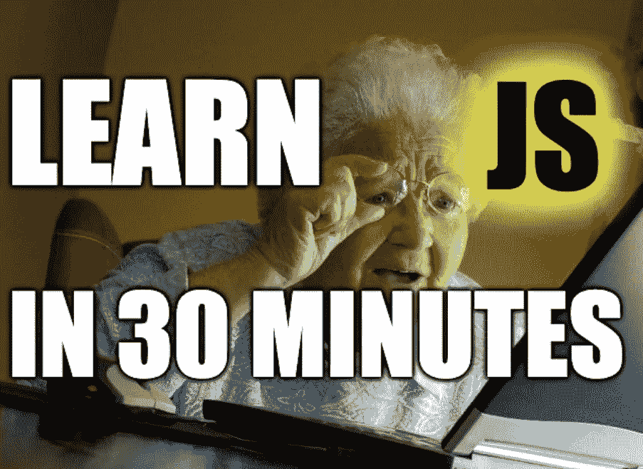

# 面向傻瓜的 Javascript 分钟学会 JS

> 原文：<https://medium.com/nerd-for-tech/javascript-for-dummies-learn-js-in-30-minutes-59114a4aec8e?source=collection_archive---------3----------------------->

Javascript 编程语言扩展介绍

# 关于笔记

我开发移动应用已经有 6 年多了，使用跨平台框架开发应用也有 2 年多了。现在我通过 React、Angular、React Native 和 Cordova 框架开始熟悉 JS。