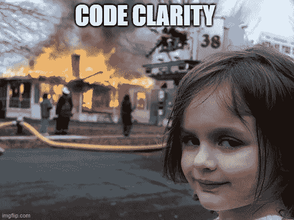

# 编写干净代码的 JavaScript 指南

> 原文：<https://medium.com/nerd-for-tech/javascript-guidelines-for-writing-clean-code-687bbe86ef3?source=collection_archive---------7----------------------->

你听说过你的代码对别人来说不可读或者不清楚，而你猜不出为什么吗？如果是的话，那么这篇文章适合你。

在用任何编程语言编写代码时，您都会面临的一个问题是编写可读的代码。这意味着你应该从现在起一年后写你能理解的代码。此外，代码应该清晰易读，其他团队成员也可以理解。

**那么我们所说的干净代码是什么意思呢:**

当我们写一个干净的代码时，我们应该注意缩进、逗号、变量名、函数名、注释和代码的整体外观。没有唯一的规则可循。以下是最流行的标准:

*   [谷歌 JavaScript 风格指南](https://google.github.io/styleguide/jsguide.html)。
*   [标准 JS](https://standardjs.com/) 。
*   [惯用风格宣言](https://github.com/rwaldron/idiomatic.js)。

您可以在编写代码时选择其中之一。作为一个团队，你们可以就编写代码的标准达成一致。这里我们将描述编写可读代码的最通用的规则。

# 让我们深入挖掘一下:

1.  变量命名:

变量的名称应该描述它们所代表的内容。例如，不要使用像`A, B`这样的变量名。使用有意义的变量名。同样，有多个部分的变量应该遵循`camelCase` 规则。当我们定义一个常量变量时，我们把它的所有字母都大写。
下面是一个好的命名示例:

2.空间:

空格会严重影响代码的外观。这就是为什么你应该一直关注他们。以下是一些有用的提示:

2.1 花括号:

*   花括号应该和关键词在同一行，比如:`if, for, while, etc.`
*   括号和左括号之间应该有空格。
*   块代码应该在下一行，与关键字的开头相隔一个制表符的距离。
*   始终将右括号放在不同的行上，与关键字的开头对齐。

2.2 定义函数时:函数名和括号之间没有空格。圆括号和参数之间也没有空格。如果有多个参数，我们只需要空格，如下所示:

2.3 通过你的代码，我们需要在变量定义和下一个逻辑之间加一个空格。总是在逻辑之间切换的时候，我们需要它们之间有一行空格。

2.4 在条件子句中，我们将`else`单词放在 if 条件的右括号旁边，并在它们之间用空格隔开:

2.5 参数之间和操作符周围也有空格。

3.功能

写函数名的时候，尽量做一个描述性的名字。通过函数的名字来知道它是做什么的。还有一点，尽量让每个功能做一个工作。函数中的所有逻辑和变量都应该从函数的开头缩进一个制表符(2 个空格)，右括号应该与函数名缩进相同。

4.线长度

参考资料建议拆分一个长横线。通常，该行的长度在 80 到 120 个字符之间。作为一个团队，你们可以就不同的考虑达成一致。

5.评论

我们使用注释来解释代码如何工作以及为什么工作。好的注释有助于轻松维护代码。

注释可以是单行的:以//和 multiline: /* … */开头。

一般来说，优秀的代码会有较少的注释或者根本没有注释。你可以通过为函数和变量写一个描述性的命名来达到这个目的。此外，通过将代码分割成小代码块，每个代码块只做一件事。

评论一下还是不错的:

*   这段不清楚的代码。
*   如果一个特定的问题有不同的解决方案，选择其中一个作为最佳方案，你应该解释你为什么做出这样的选择。
*   您需要对函数用法进行注释。有一个特殊的语法 [JSDOC](https://en.wikipedia.org/wiki/JSDoc) 来记录这些函数。
*   如果你在网上找到了部分代码的解决方案，在评论中添加一个 URL 会很有帮助。

**有用的扩展:**

有很多扩展可以为你做上面的工作，并自动格式化你的代码。我将提到其中一些:

1.  [Es-lint](https://eslint.org/) 。
2.  [格式化英雄](https://marketplace.visualstudio.com/items?itemName=Wscats.qf)。
3.  [更漂亮](https://marketplace.visualstudio.com/items?itemName=esbenp.prettier-vscode)。

W 说唱起来。这些是在编写代码时需要注意的几点。所以你的代码会更容易阅读和理解。

有关更多信息，请查看此链接:

*   J [avaScript 信息代码质量](https://javascript.info/code-quality)。