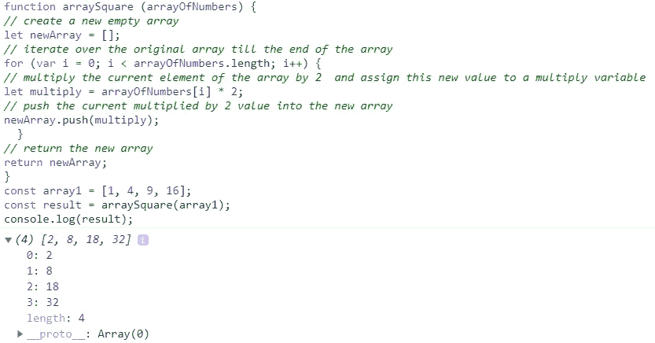
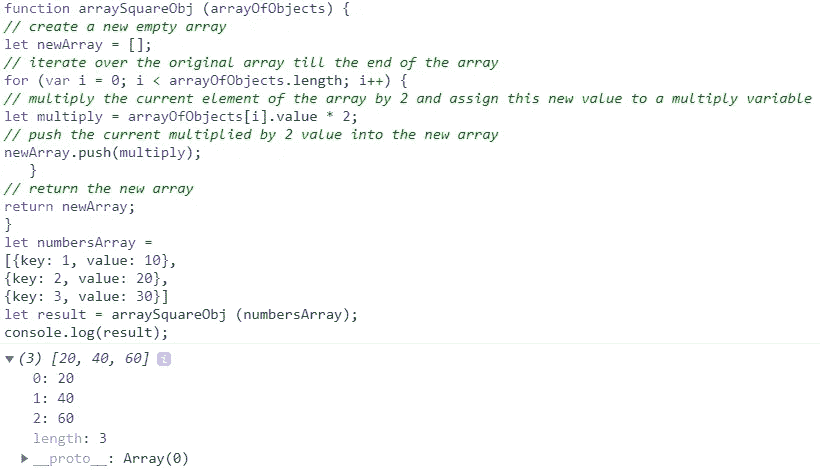
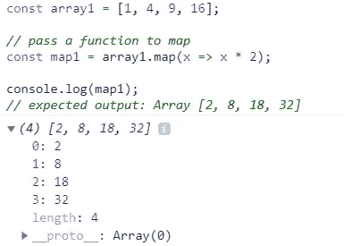
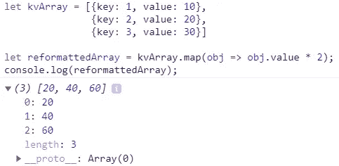

# JavaScript 映射数组。Map()方法。

> 原文：<https://medium.com/nerd-for-tech/javascript-mapping-arrays-map-method-a650c014fe7?source=collection_archive---------5----------------------->

在我的上一篇文章中，我提到了 [**Filter()**](https://roxvemm2014.medium.com/javascript-filtering-arrays-filter-method-ac582e4594e2) 方法，这是一个内置的原生数组方法，它遍历一个数组，将每个元素传递给一个提供的回调函数，并返回一个新数组，该数组由回调函数返回了一个 *true* 值的元素组成。


尼尔·贝茨在 [Unsplash](https://unsplash.com?utm_source=medium&utm_medium=referral) 上拍摄的照片

现在来说说另一个很常见也很常用的内置数组方法 **Map()** 。该方法基于一些定义的逻辑将原始数组的每个元素转换/修改为另一个值。例如，它可以用来对数字数组中的每个值求平方:[1，2，3，4]->，[1，4，9，16]。与 **Filter()** 方法类似， **Map()** 方法采用回调函数，并将每个元素依次传递给回调函数。 **Map()** 方法返回一个新数组，该数组的长度与元素被修改的原始数组的长度相同。

如果我们在寻找这个 **Map()** 方法的官方定义，让我们看看 [MDN Web Docs 网站](https://developer.mozilla.org/en-US/docs/Web/JavaScript/Reference/Global_Objects/Array/map):

> Map()方法创建一个新的数组，其中填充了对调用数组中的每个元素调用所提供的函数的结果。

让我们像在之前[所做的那样分解这个定义！](https://roxvemm2014.medium.com/javascript-filtering-arrays-filter-method-ac582e4594e2)

*   它创建了一个新数组
*   它遍历原始数组的每个元素
*   它基于一些定义的逻辑将原始数组的每个元素转换/修改为另一个值
*   它将转换/修改后的值推入新数组
*   它返回用转换/修改后的值填充的新数组

首先让我们使用普通的 JavaScript / *for 循环*来解决一个问题“将数字数组中的每个值乘以 2 ”,然后应用 **Map()** 方法来解决相同的问题。

你会得到一组数字:

```
const array1 = [1, 4, 9, 16];
```

我们需要将该数组的每个值相乘，并返回一个包含所有这些相乘值的新数组，或者预期输出为:

```
[2, 8, 18, 32];
```

这里有一个伪代码和代码本身的问题。请阅读，然后复制并粘贴到您的控制台。

```
function arraySquare (arrayOfNumbers) {// create a new empty array
let newArray = [];// iterate over the original array till the end of the array
for (var i = 0; i < arrayOfNumbers.length; i++) {// multiply the current element of the array by 2  and assign this new value to a multiply variable
let multiply = arrayOfNumbers[i] * 2;// push the current multiplied by 2 value into the new array
newArray.push(multiply);
  }// return the new array
return newArray;
}const array1 = [1, 4, 9, 16];
const result = arraySquare(array1);
console.log(result);
```

以下是输出:



为了更有趣，让我们迭代一组数字对象。我们有一系列这样的物体:

```
let numbersArray = [
{key: 1, value: 10},
{key: 2, value: 20},
{key: 3, value: 30}]
```

我们需要将该对象数组的每个值乘以 2，并返回一个包含所有这些相乘值的新数组，或者预期输出为:

```
[{key: 1, value: 20},
{key: 2, value: 40},
{key: 3, value: 60}]
```

相同的普通 JavaScript 和循环的*可以用来解决这个问题。这里有一个伪代码和代码本身的问题。请阅读，然后复制并粘贴到您的控制台。*

```
function arraySquareObj (arrayOfObjects) {// create a new empty array
let newArray = [];// iterate over the original array till the end of the array
for (var i = 0; i < arrayOfObjects.length; i++) {// multiply the current element of the array by 2 and assign this new value to a multiply variable
let multiply = arrayOfObjects[i].value * 2;// push the current multiplied by 2 value into the new array
newArray.push(multiply);
   }// return the new array
return newArray;
}let numbersArray = 
[{key: 1, value: 10},
{key: 2, value: 20},
{key: 3, value: 30}]let result = arraySquareObj (numbersArray);
console.log(result);
```

以下是输出:



这些解决方案仍然有效，并展示了我们如何通过使用循环的*来解决这样的问题。JavaScript 已经内置了数组方法 **Map()** ，我们真的需要写这么多行代码吗？我觉得是时候我们换个话题，说说这个 **Map()** 方法了。*


照片由[詹姆斯·刘易斯](https://unsplash.com/@jamesplewis?utm_source=medium&utm_medium=referral)在 [Unsplash](https://unsplash.com?utm_source=medium&utm_medium=referral) 上拍摄

让我们在 [MDN Web Docs](https://developer.mozilla.org/en-US/docs/Web/JavaScript/Reference/Global_Objects/Array/map) 中查看 **Map()** 语法:

```
// Arrow function
map((element) => { ... } )
map((element, index) => { ... } )
map((element, index, array) => { ... } )// Callback function
map(callbackFn)
map(callbackFn, thisArg)// Inline callback function
map(function callbackFn(element) { ... })
map(function callbackFn(element, index) { ... })
map(function callbackFn(element, index, array){ ... })
map(function callbackFn(element, index, array) { ... }, thisArg)
```

并使用 [**Map()** 方法](https://developer.mozilla.org/en-US/docs/Web/JavaScript/Reference/Global_Objects/Array/map)解决同样的两个问题:

```
const array1 = [1, 4, 9, 16];
// pass a function to mapconst map1 = array1.map(x => x * 2);console.log(map1);
// expected output: Array [2, 8, 18, 32]
```

在这个例子中，我们在给定的数组上调用 **Map()** 方法，并使用一个 arrow 函数表达式将这个数组的每个元素乘以 2。以下是输出:



对于第二个问题/数字对象的数组，我们的 **Map()** 代码将如下所示:

```
let kvArray = 
[{key: 1, value: 10},
{key: 2, value: 20},
{key: 3, value: 30}]let reformattedArray = kvArray.map(obj => obj.value * 2);
console.log(reformattedArray);
```

以下是输出:



要点类似于我在我的 [JavaScript 过滤数组中所写的。Filter()方法](https://roxvemm2014.medium.com/javascript-filtering-arrays-filter-method-ac582e4594e2)教程但是因为“熟能生巧”l 在这里再列一次，使用 **Map()** 方法的好处:

*   我们不需要创建 for 循环来迭代/或使用任何其他循环
*   在每次迭代中，当前元素存储在一个变量中，因此我们不需要使用元素的索引值来访问元素
*   所有迭代结束后，一个新的数组会自动创建并返回，所以我们不需要在开始时创建一个空数组并将元素放入其中
*   只有几行代码比较了普通 JavaScript / *for loop* 方法
*   易于阅读和理解/适合所有用户

如果你觉得这些信息有用，请随时关注我。希望您喜欢这篇关于 JavaScript 中 Map()方法的简短指导，请保持关注！