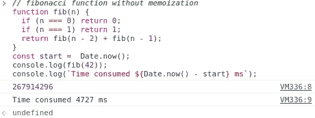
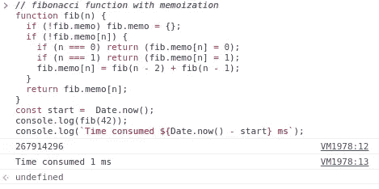
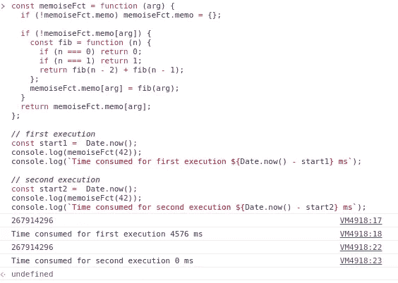
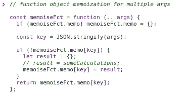
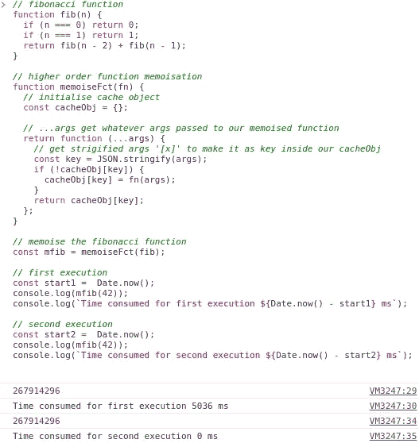
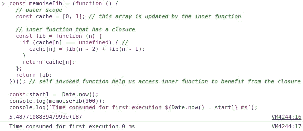

# JavaScript 记忆模式

> 原文：<https://medium.com/nerd-for-tech/javascript-memoization-patterns-f0438f96a696?source=collection_archive---------7----------------------->

## 什么是记忆化？

记忆化是一种优化技术，它基于记忆用相同参数调用的函数返回的结果。

如果我们有一个消耗大量计算的纯函数，那么我们可以使用记忆化。

记忆将帮助我们存储已经获得的输出值，然后下一次使用相同的输入值调用该函数时，它可以简单地返回存储的值，而无需进行所有的计算。

## 记住斐波那契

没有**记忆**计算量过大，以下函数耗时 4727 ms:

多亏了**记忆**，我们在性能上获得了很大的提升，消耗的时间减少到了 1 毫秒；

## 记忆模式

实现**记忆**有两种模式:

*   作为一个对象运行
*   高阶函数
*   [关闭](https://thelbouffi.medium.com/easy-way-to-grasp-javascript-closures-7dc45fe998d9)

## 作为一个对象运行

函数作为一个对象(实际上就是这样)，我们在其中存储缓存的值(而不是使用全局变量)是我们第一种**内存化**的方式，如下例所示:

我们看到，只要进程还活着，结果就会缓存在函数中。

斐波那契函数也是如此

同样的行为，当我们有多个论点时

## 高阶函数记忆

**高阶函数**是**记忆**的第二种方式，正如我们在这个例子中看到的，我们将函数**记忆**放在一个**高阶函数**中:

## 封闭记忆化

我们可以使用的第三种记忆方法也是最快的方法是使用 [**闭包**](https://thelbouffi.medium.com/easy-way-to-grasp-javascript-closures-7dc45fe998d9) 。例如，我们可以从第一次调用开始**记忆**一个递归函数，将它设置为一个内部函数，这个内部函数将有一个 [**闭包**](https://thelbouffi.medium.com/easy-way-to-grasp-javascript-closures-7dc45fe998d9) 。

我们可以在这里找到上面例子[中使用的代码。](https://gist.github.com/thelbouffi/e2dfc4639cbdfc5a8ef5779651c21f8b)