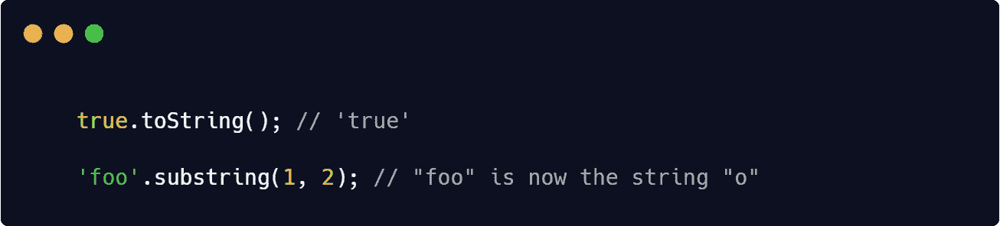
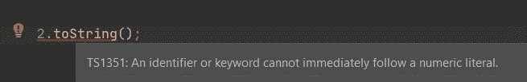

# Javascript Mindf*k: toString()

> 原文：<https://medium.com/nerd-for-tech/javascript-mindf-k-tostring-5e22aea1ffcc?source=collection_archive---------9----------------------->

# 在 JavaScript 中，并不是所有东西都是对象。

您经常与之交互的许多东西(字符串、数字、布尔值)都是原语，而不是对象。与对象不同，原始值是不可变的。

由于这些原语确实有对象包装器(`String`、`Number`和`Boolean`)，情况变得复杂了；这些对象有方法和属性，而原语没有，但是原语看起来有方法，因为当代码试图访问原语的任何属性时，JavaScript 会悄悄地创建一个包装器对象

## 幕后:

1.  从`'foo'`创建一个包装器`String`对象，相当于使用`new String('foo')`
2.  使用步骤 1 返回的`String`对象的适当参数调用`substring()`方法
3.  处理掉`String`物体
4.  返回步骤 2 中的字符串(原语)。

# 但是为什么这不起作用呢？

你可能认为***【number】***类型不像其他原始类型那样被包装。
数字文字不能用作对象是一个常见的误解**。**

这是因为 JavaScript 的解析器存在缺陷。它试图将数字上的点符号解析为浮点文字。

# **这里有几个变通办法:**

## **注:**

> 这不仅限于 toString()。
> 
> toString()仅用作示例

在[***Linkedin***](https://www.linkedin.com/in/chedyhm/)上与我联系，了解更多有趣的科技内容！

非常感谢您的关注。