# JavaScript:原始数据类型

> 原文：<https://medium.com/nerd-for-tech/javascript-primitive-data-types-63993054314f?source=collection_archive---------20----------------------->

## JavaScript 基本数据类型初学者指南

很有可能，即使您刚刚开始探索 JavaScript，您已经开始使用或者至少看到了一个原始数据类型。在本文中，我们将深入了解什么是原始数据类型，以及 JavaScript 拥有的六种类型；BigInt、Boolean、数字、字符串、符号和未定义。让我们不要再浪费时间，直接投入进去吧！

**什么是原始数据类型？**

在我们深入各种数据类型的本质之前，让我们快速讨论一下什么是原始数据类型。根据定义，根据 [Mozilla 的](https://developer.mozilla.org/en-US/docs/Web/JavaScript/Data_structures) great documentation，“不是对象也没有方法的数据”。这到底是什么意思？如果你对这些数据类型中的任何一个调用操作符，它会简单地告诉你它是什么数据类型。这些数据类型没有方法的原因是因为它们是不可变的，这意味着它们不能被直接改变。这可能看起来有点混乱，因为你不应该把你的实际值和一个被赋值的变量相混淆。为了搞清楚，我们将从我们的第一个数据类型来回顾这两个概念，但是如果你想继续下去，你可以在这里找到回购[的副本](https://github.com/TheRealKevBot/JSDataTypes)。那么，让我们来看看我们的第一个数据类型…

**字符串**

简单地说，字符串是用单引号或双引号括起来的任意数量的文本内容。请务必仔细检查您的报价，因为它不是混合和匹配。在下面的例子中，我创建了一个名为 string 的变量，其中包含 Hello World 的字符串。

现在，如果我们在控制台日志中对字符串变量使用操作符类型，它将返回一个字符串。为了不让你觉得我有什么锦囊妙计，我们还会返回一个实际字符串的类型。

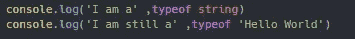

将返回:

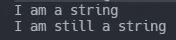

快速介绍字符串主题，以及其他原始数据类型，它们是如何不可变的。在下面的例子中，我们将对字符串变量调用 to upper case 方法，试图将字符串中的每个字母大写。

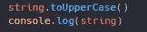

发生了什么事？老实说，什么也没发生，它打印到控制台，就像我们最初声明变量 string 一样。

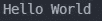

但是，如果我们决定用调用它的大写方法将变量 string 重新赋值给 string，会发生什么呢？好吧，那我们可能真的有所进展了。

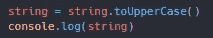

这是因为在这种情况下，我们将字符串或原始值重新分配给了同一个变量。我们不能直接改变字符串，但是我们可以通过重新分配来改变变量。下面的代码是一个实际例子。

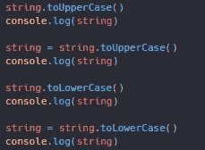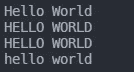

正如你在这两个场景中所看到的，直到原始变量被重新赋值，这些方法才会真正坚持下去，做它们应该做的事情。第一种情况是将字符串中的每个字母都大写，第二种情况则完全相反。

**数字**

正如你可能已经猜到的那样，一个数字就是一个介于负 9007199254740991 和正 9007199254740991 之间的数字。对于大于这两个值的任何数字或整数，将在下一节中讨论。检查这一点的简单方法是对数据类型 number 调用 max 或 min safe integer。

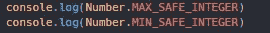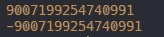

与我们的字符串一样，我们将创建一个名为 number 的变量，其中包含数字 123。数字不使用引号，如果你使用引号，你的数字变量将只是一个字符串。如果我们也有 console.log 类型，我们将会得到一个和我们想象的完全一样的数字。

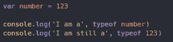

现在，如果我们不先赋值或重新赋值，就试图调用我们号码上的方法，我们的方法将不会完成。

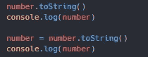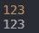

控制台以不同的颜色显示字符串和数字。橙色代表数字，白色代表字符串。

**BigInt**

也称为大整数，你可能已经猜到它是一个非常大的数字。这是您在处理大于或小于常规数字数据类型的数字时需要用到的。大整数和普通利息或数字之间唯一区别是它必须以小写的 n 结尾。这表示它是一个大整数。以下面的代码为例。

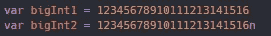

我们的变量 bigInt1 的数字存储为常规整数，而 bigInt2 存储为实际的大整数。他们的回报真的会有多大差别？

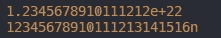

哎哟，第一个数字不容易处理，因为它需要另一个转换来显示整个数字。而我们声明的大整数被返回。我们的整数被返回。

**布尔**

现在这一个可能看起来比前三个有点困难，因为它不是那么不言自明。布尔值有且只能返回两个值，true 或 false。虽然向用户返回 true 或 false 通常只适用于此类问题，但我们经常在代码逻辑中使用布尔值。如果这个条件为真，那么我们的程序执行这个函数，否则，我们的程序需要执行一个不同的函数。以下代码显示了如何为变量设置布尔值。

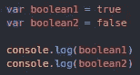

一旦登录控制台，就可以看到保存布尔值的两个变量。虽然这更高级一点，但是数字也可以保存布尔值。任何大于或小于零的数字都将保持真值并返回 true。如果该值为零，布尔值将为假。这也是另一个如何设置布尔值的例子。

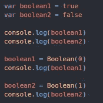

退货:

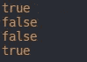

如你所见，我们通过重新分配两个布尔变量，颠倒了布尔值。

**符号**

符号有点像它们听起来的样子，除了在 JavaScript 中它们都是唯一的，并且被用作 JS 对象的键或标识符。在这篇文章中，我们不会详细讨论 JavaScript 对象是什么，只是知道它们是用于这个目的的。此外，为了证明所有符号都是唯一的，我们将创建两个包含相同内容的符号变量。

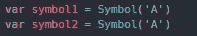

它们看起来是一样的，唯一的区别是变量的名字。所以，它们应该返回相同的值，对吗？好吧，如果我们要控制台记录我们的两个符号变量，那么是的，从技术上讲，它们都返回相同的东西，它们的内容。但是有内容相等吗？让我们来看看

三重等于不仅比较类型，还比较值。

通过我们严格的比较运算符，我们能够看出，事实上它们并不相等。两个变量可能包含完全相同的东西，符号(' A ')，但是如上所述，即使命名完全相同，每个符号都是唯一的，彼此不同。

*如果你也一直在关注，你会注意到我们收到了一个布尔值作为我们的答案。*

**未定义**

Undefined 其实就是它本来的样子，undefined。当一个变量被声明但从未被赋予实际值时，这种情况通常不会发生。以这两个变量为例

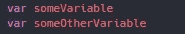

我们已经声明它们实际上都是有名字的变量，但是它们不包含任何数据类型。当控制台记录时，我们的两个变量将返回

不明确的

如果你想查看这些例子的副本，或者只是作为参考，你可以在这里找到 GitHub Repo [的链接](https://github.com/TheRealKevBot/JSDataTypes)。

我要感谢你的阅读，并希望你学到了新的东西！请关注未来更多文章！