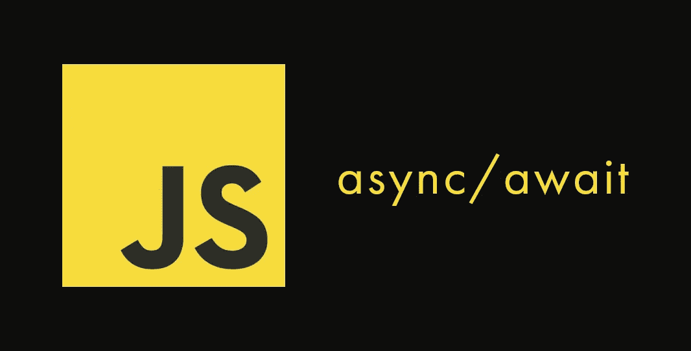
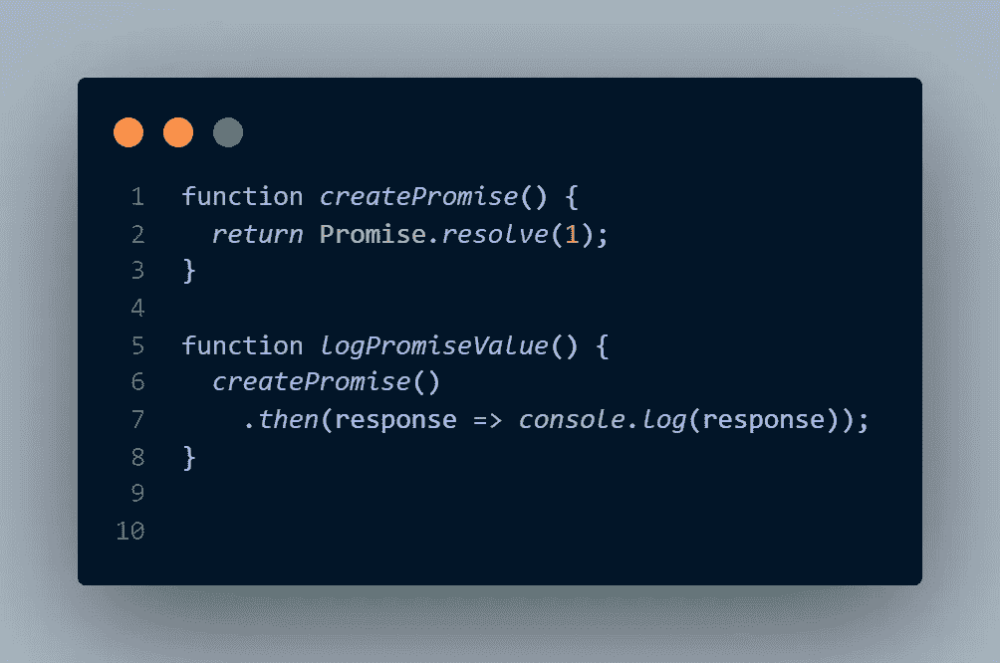
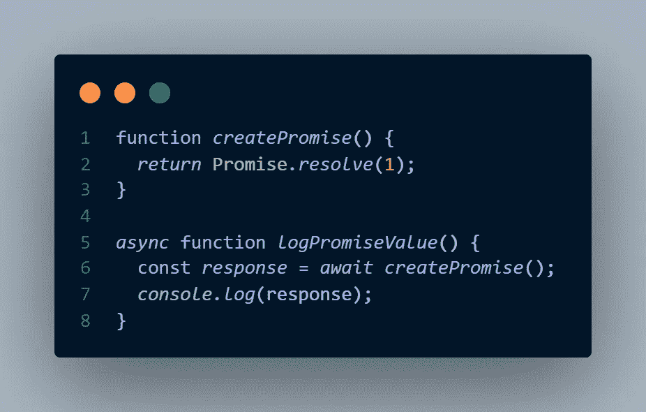
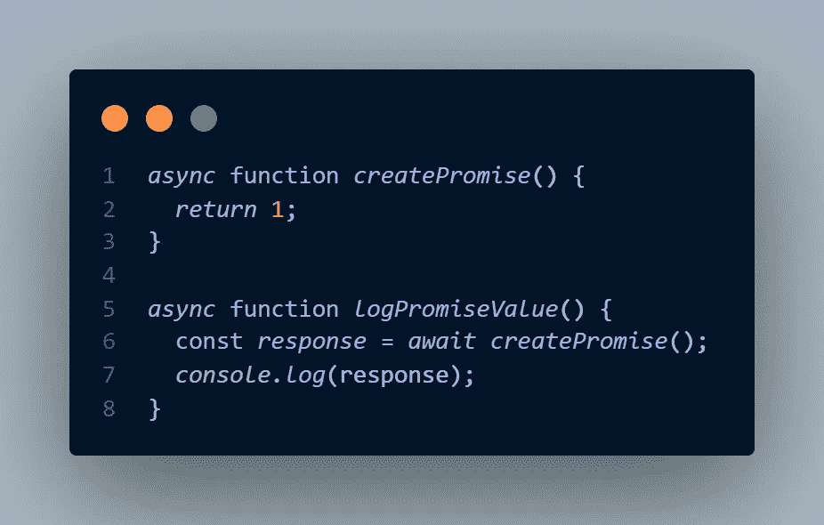

# JavaScript 承诺——最后一部分。异步/等待

> 原文：<https://medium.com/nerd-for-tech/javascript-promises-final-part-async-await-5500fbf4d336?source=collection_archive---------11----------------------->

这是这个系列的最后一部分。

为了理解 async/await，你必须理解承诺的基础和[承诺链](/nerd-for-tech/javascript-promises-part-3-promise-chaining-707ab6f1bbfc)。一旦你理解了这两个概念，这篇文章就变得非常简单了。

TLDR

> async/await 是 javascript 承诺的语法糖

这意味着，使用 async/await，我们将能够避免 JS 承诺的样板语法，并更容易地处理它们。

我们将从一个简单的例子开始，一旦我们理解了基础知识，我们将看一个更实际的例子。
看看下面的函数。第一个创建了一个承诺，该承诺解析为值 1。第二个函数消耗并记录解析的值。

这里的问题是，我们的业务逻辑被包装在 promise 语法中，很难阅读代码。一旦你开始将多个承诺串联起来，事情就会变得更加困难。我们的逻辑被分解成不同的部分。

为了避免这种情况，我们可以使用 async/await。使用 async/await 关键字重写上述函数，它们变成:

这样不是更好看更好理解吗？现在让我们了解发生了什么。

当在 function 关键字之前应用`async`关键字时，该函数被称为异步函数。异步函数有两个区别于普通函数的特征:

1.  异步函数总是返回一个承诺。
2.  您可以在异步函数中使用`await`关键字。

`await`关键字应用于返回承诺的函数之前。并且，`await`关键字让 JavaScript 一直等到承诺兑现。只有在承诺兑现后，才会恢复正常执行。

因此，在我们的例子中，第 7 行不会执行，直到从函数`createPromise`(第 6 行)返回的承诺被解析。

现在，由于异步函数总是返回一个承诺，我们不必显式地将返回值包装在承诺中。我们只需要返回该值，它将自动被包装在一个承诺中。
所以，我们可以进一步简化第一个函数:

使用 async/await，我们有类似 synchronous 的语法，可以处理异步代码。

现在，让我们看一个实际的例子。让我们以我们在[承诺链](/nerd-for-tech/javascript-promises-part-3-promise-chaining-707ab6f1bbfc)中使用的例子为例:

我们获取所有用户，然后将他们登录到控制台。为此，我们必须使用如上所示的承诺链。如你所见，我们的逻辑被分成不同的块，很难阅读。

使用 async/await 重写上述函数变成:

看出区别。代码变得更加易读，我们的业务逻辑也在一个地方。

我们的函数是用关键字`async`定义的。我们`await`来自 API 的响应，在第 3 行。一旦解决了这个问题，我们`await`将第 4 行的响应体读作 JSON。
每行在前一行结束后执行。

要明白，幕后没有魔法。我们实际上是在和承诺本身一起工作。但是，使用 async-await 关键字要容易得多，因为我们不必担心 JS 承诺的样板语法。

**错误处理**

为了处理`promise`中的错误，我们使用了`catch`块。由于 async-await 完全消除了块的使用，我们将如何处理错误呢？

为此，我们可以在 JavaScript 中使用`try…catch`语法。

信不信由你，`try…catch`语法不是最近在 JS 中引入的，它从 ES3 开始就存在了。

要使用它，将可能抛出错误的语句放在一个`try`块中，并添加一个`catch`块来处理错误。

将`try-catch`添加到我们的示例中，就变成了

> async/await 是 JS 承诺的语法糖。它们帮助我们编写类似同步的语法来处理异步代码。

如果你觉得这篇文章有帮助，一定要鼓掌分享。你可以在这里找到我所有的文章[，包括这个系列的其他部分。如果你有任何建议/意见，请告诉我。请务必关注我，以免错过任何文章。](http://abdu-manaz.medium.com/)