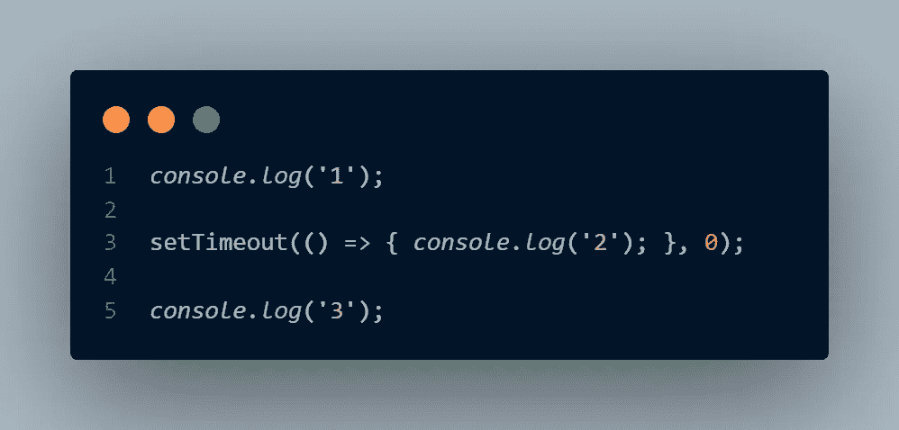
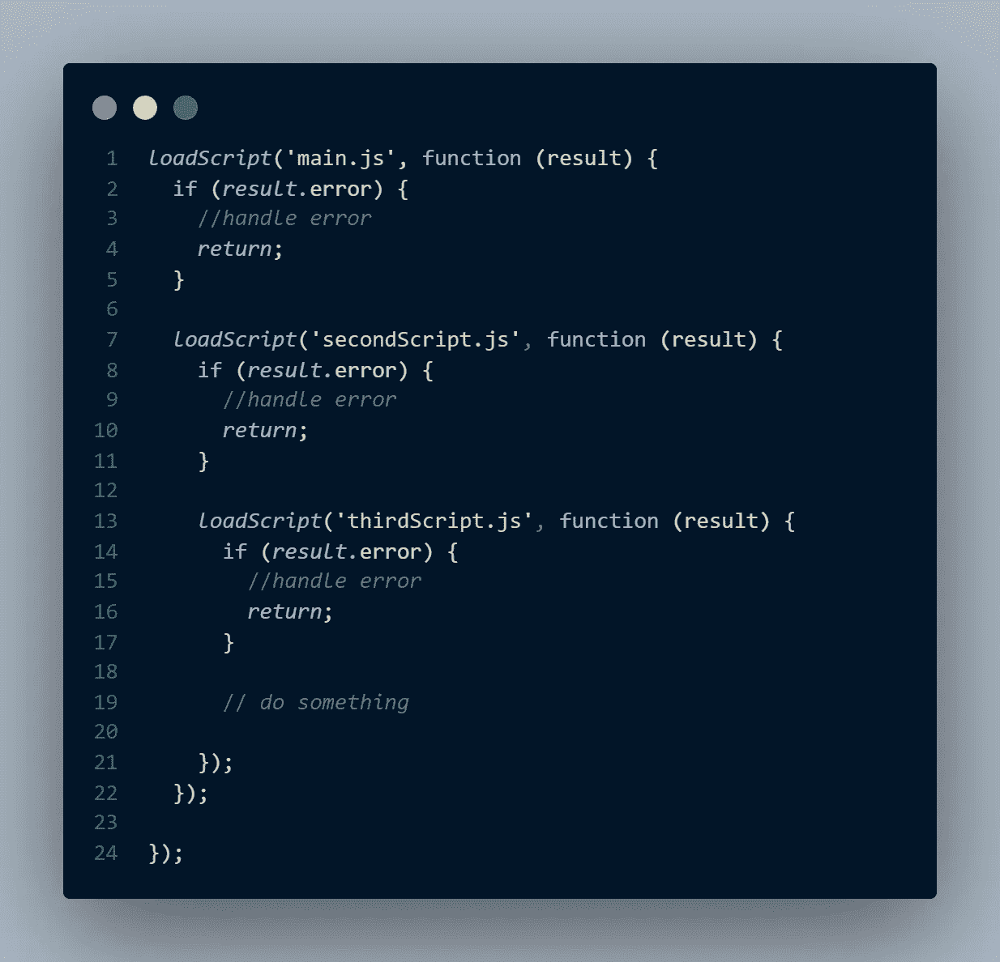

# JavaScript 承诺。第 1 部分—为什么承诺？

> 原文：<https://medium.com/nerd-for-tech/javascript-promises-part-1-why-promises-d54ed05bdc9f?source=collection_archive---------9----------------------->

照片由 [Cytonn 摄影](https://unsplash.com/@cytonn_photography?utm_source=medium&utm_medium=referral)在 [Unsplash](https://unsplash.com?utm_source=medium&utm_medium=referral) 上拍摄

想要精通 JavaScript，学习异步 JS 势在必行。你在异步 JS 中听到的第一个词是承诺。

不可能在一篇文章中解释所有的关键概念。因此，这将是一个 4 部分系列，帮助你奠定承诺的主要概念的基础。

本文将解释为什么引入承诺，以及它为异步 JS 世界提供了什么。如果您已经熟悉“为什么”,或者想直接进入基础部分，请单击此处的[进入本系列的第二部分。](https://abdu-manaz.medium.com/javascript-promises-part-2-fundamentals-e51e36c42fac)

所以让我们开始吧。

## 异步 JavaScript

下面代码的输出会是什么？

1 2 3 还是别的？
调用 0 毫秒延时的 setTimeout，不会有任何延时。所以接下来应该印 2 对吗？

实际产量是 1 3 2。

为什么？

异步 JS 就是这样工作的。当 JavaScript 引擎遇到一个不是马上就要执行的函数，而是在未来的某个时间点，而不是在那个时间点等待/阻塞线程，它会将该函数排队。而到了执行函数的时候，JS Engine 会把它从队列中取出来执行。
因此，setTimeout 将被排队，而不管它的延迟，其余的代码将被执行。一旦等待时间结束，setTimeout 中的函数将从队列中取出并执行。

我就不细说了。那是另一天的话题。但我希望基本思路是清楚的。这和你可能会问的承诺有什么关系？这是异步 JS 的基础，为了理解下一个主题，你必须理解它

## 回调和回调地狱

回调函数是作为参数传递给另一个函数的函数，并将在其中执行。

在前面的例子中，带有简单的`console.log`的箭头函数被传递给了`setTimeout`函数，实际上是一个回调函数。在指定的等待时间后，回调(箭头函数)被执行。

那么什么是回调地狱呢？

假设我们有一个从服务器加载脚本的函数。

`*loadScript*(fileName, callBack);`

`fileName`是要加载的文件的名称。而`callBack`是一旦文件被加载或者出现错误时将被执行(回调)的函数。

加载完第一个文件后，如果没有错误，我们需要加载第二个脚本文件。代码应该是这样的

看到这个你会感到不安。如果没有，假设我们必须加载 10 或 15 个文件，函数将被嵌套，这将类似于所谓的“末日金字塔”。并且在所有这些文件之后执行的代码将位于所有嵌套代码之下，这不仅难以维护，而且很难理解/阅读代码。这被称为“回调地狱”。

从这些例子中可以理解，需要一种更好的方法来处理异步代码。

输入承诺

既然我们已经理解了“为什么”,那么让我们来学习“如何”。点击[此处](https://abdu-manaz.medium.com/javascript-promises-part-2-fundamentals-e51e36c42fac)进入下一部分，解释如下。

如果你觉得这篇文章很有帮助，请鼓掌并分享给你的朋友。请务必关注我，了解更多简化的解释。