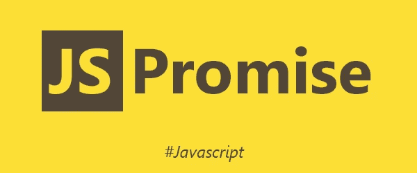
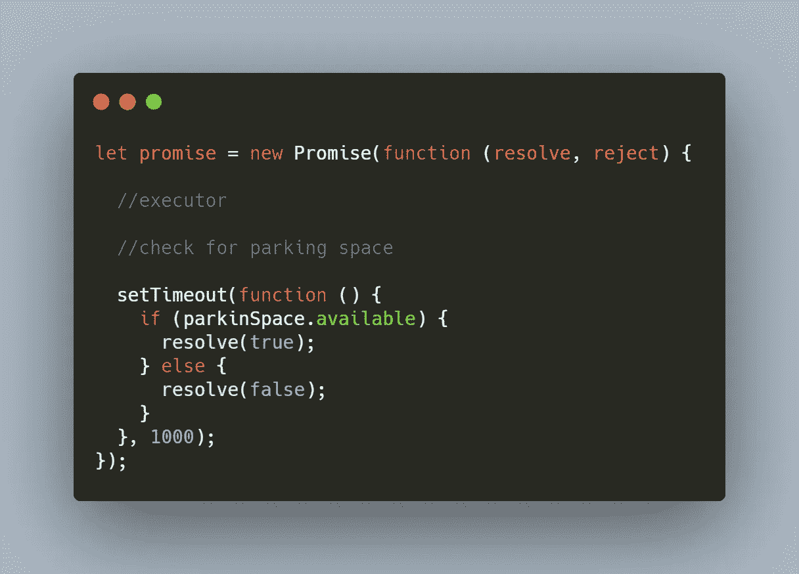
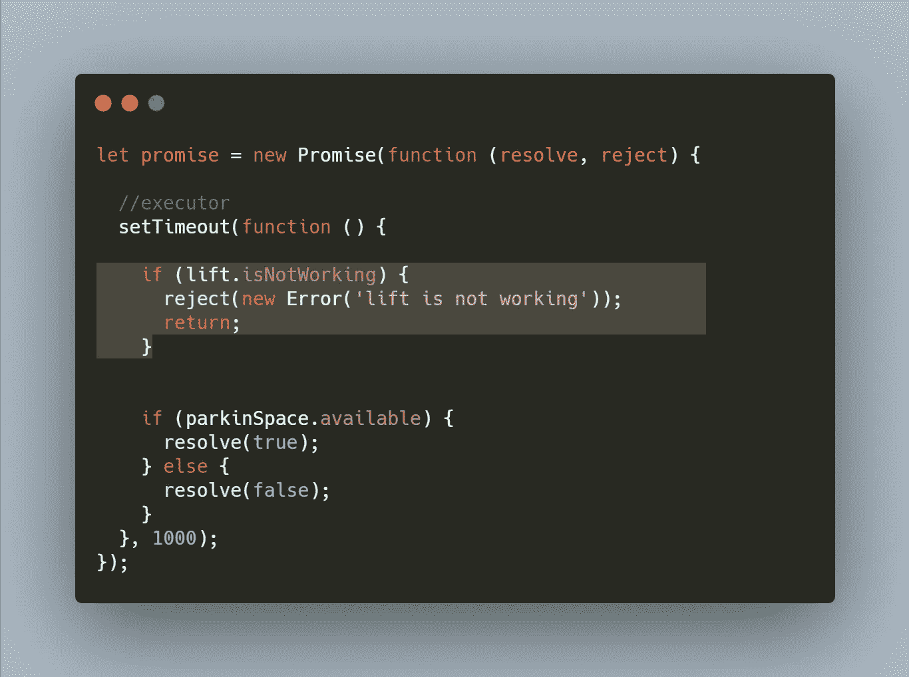
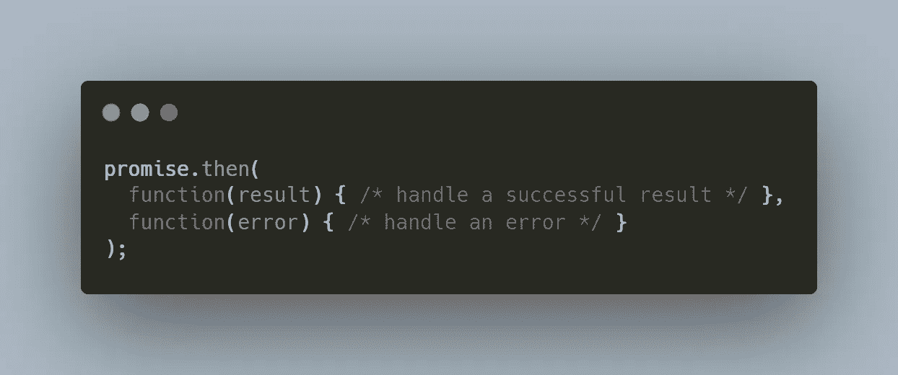
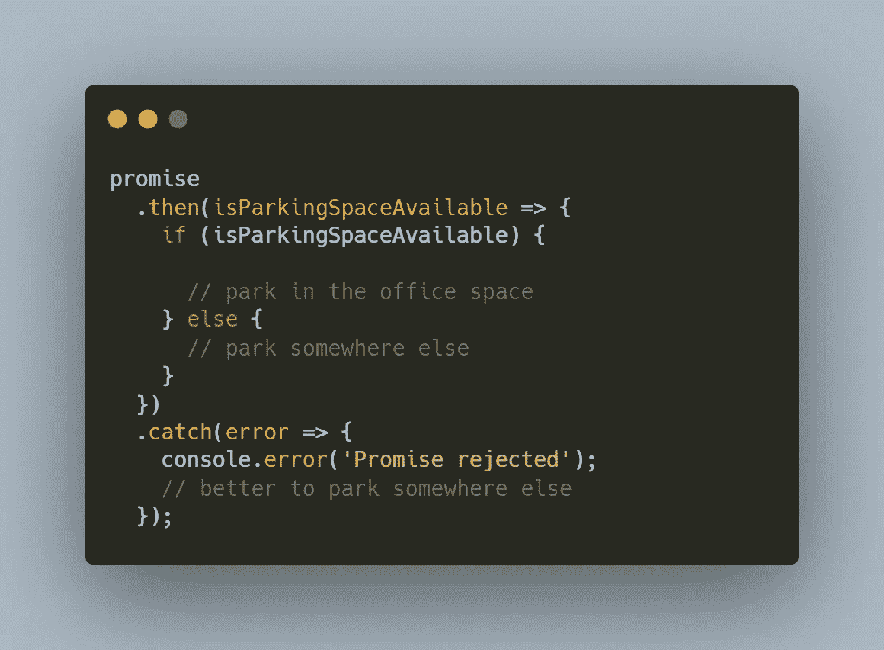
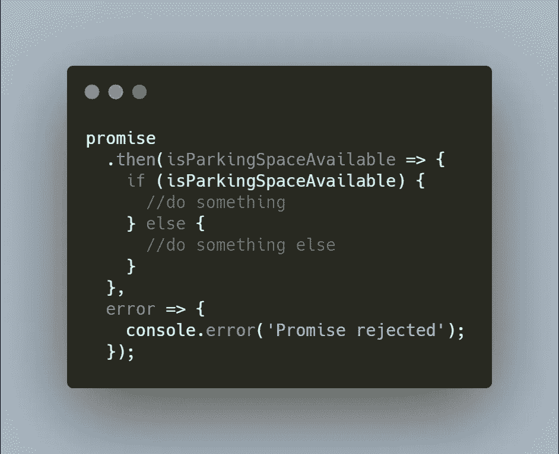
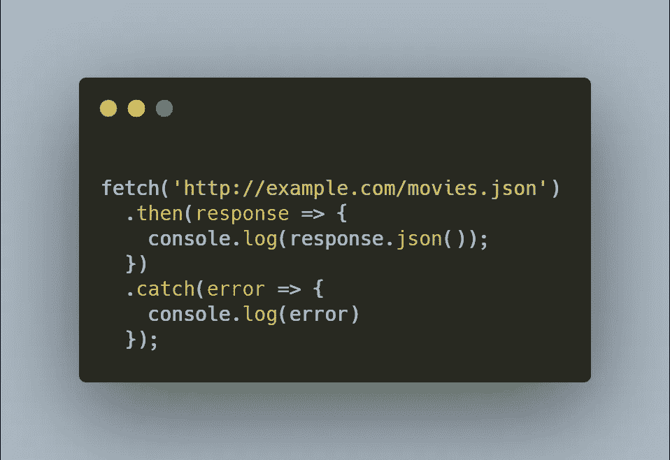

# JavaScript 承诺。第 2 部分—基础知识

> 原文：<https://medium.com/nerd-for-tech/javascript-promises-part-2-fundamentals-e51e36c42fac?source=collection_archive---------8----------------------->

在本系列的[第 1 部分](/nerd-for-tech/javascript-promises-part-1-why-promises-d54ed05bdc9f)中，我们已经理解了为什么要引入承诺。我们知道 Promise API 是作为处理异步 JS 的更好范例而引入的。在这里，我们将通过一个简单的例子来理解什么是承诺以及如何做出承诺，稍后，我们将看一个更实际的例子。

那么什么是承诺呢？

想象一下，一天早上上班时，你的同事打电话给你，让你帮个忙。他需要你去办公室停车场看看是否有空位。由于停车位有限，如果没有停车位，他不必浪费时间，可以把车停在别的地方。

你**答应**你会这么做。

你去停车场找一个空位。

可能会出现哪些不同的情况？

要么有空位，要么没有。你打电话给你的同事，让他知道。

无论如何，你的承诺已经**兑现**。

有没有另一种情况？想象一下，当你在去停车场的路上，电梯坏了。你的办公室在大楼的顶层。如果你像我一样，那么你下楼梯没有问题，但是上来……那完全是另一回事。所以你打电话给你的同事，让他知道你实际上无法找到一个开放的停车位，因为电梯坏了。

在这种情况下，你对同事的承诺**落空了**。

虽然很粗糙，但这就是承诺的本质。

现在，让我们使用上面的例子进入技术层面。

根据 MDN:

> Promise 对象表示异步操作的最终完成(或失败)及其结果值。

我们已经谈到了异步函数。并且您知道一个异步函数将被排队并最终被执行(完成)。一旦你的异步函数完成，它将返回一个结果，如果有的话。这就是许诺对象所代表的。

在我们的例子中，这意味着什么？

这里的*承诺*对象是指你对同事做出的实际承诺，让他去查一个空车位。

您去停车场、检查开放空间、回叫您的同事让他知道停车位的可用性的任务可以被认为是异步操作。根据空间的可用性，结果值可以是真/假。

它在代码中会是什么样子？让我们来看看

我们来分解一下

您可以使用`new`关键字创建一个`Promise`对象。

传递给构造函数的函数叫做**执行器**。
创建新承诺时，执行程序会自动运行。它包含最终应该产生结果的代码。在我们的例子中，去停车场找一个空地。

我们将**执行器**包装在一个`setTimout` 函数中，以便异步执行。

**执行器**有两个参数**分别是解决**和拒绝**的。它们是回调函数，一旦我们的 executor 函数有了结果，它们就会被执行。根据我们的例子:一旦你明白一个位置是否可用。**

根据停车位的可用性，您可以呼叫`resolve(true)`或`resolve(false)`。这意味着，你去了停车场，带着结果回来了。你已经实现了你的承诺。

但是正如我们已经讨论过的，还有第三种选择，你的承诺可能会落空。让我们来看一下代码

在这种情况下，您没有返回结果。相反，您会抛出一个错误。所以，你的承诺被**拒绝了。**

调用`new Promise`构造函数返回的`promise` 对象有两个内部属性:

1.  **状态:**初始状态为**待定**。基于哪个回调被调用，或者**解决** / **拒绝**，状态将分别变为**完成/拒绝**。
2.  **结果**:传递给回调的值。在我们的例子中，对/错。

> 需要注意的是，承诺只能解决或拒绝
> 
> 此外，任何状态更改都是最终的，所有进一步的 resolve 和 reject 调用都将被忽略。

这意味着，如果我们在上面的例子中省略 return 语句，执行器将执行到最后一条语句，(即 resolve(true)或 resolve(false))。但不管怎样，承诺的**状态**仍将是**拒绝**并且**结果**将是**错误对象**被创建。

好了，我们已经学会了创造承诺。我们知道 promise 对象表示我们的异步操作最终完成所返回的值(从上面复制粘贴；) ).但是这种价值如何被消费呢？

在我们的例子中，消费者是我们的同事，他要求我们执行整个任务。一旦承诺被兑现**/**被拒绝**，他将如何消费？**

为了创建一个消费者，我们使用了`then/catch/finally`方法。

`then`的语法如下:

`then`方法有 2 个参数。两者都是功能。

第一个函数在承诺完成时运行。
第二个函数在承诺被拒绝时运行。
`result/error` 将是承诺返回的值。

`catch`方法只有一个参数，如果承诺被拒绝，将执行该方法。

迷惑？我们来看看我们的消费函数会怎么写。

正如我们所看到的，我们已经将方法`then`和`catch`应用于`promise`对象(之前的例子)。

一旦**执行器**完成并且**解析** / **拒绝**并给出一个值，基于调用的回调，将执行`then`或`catch`。

如果我们可以检查停车位，**承诺**将**解决**对/错。在这种情况下，将执行**中的第一个功能，然后执行**方法。

如果电梯坏了，**承诺**将被**拒绝**并返回一个错误对象。在这种情况下，将执行 **catch** 方法中的函数。

您也可以完全省略 catch 块，然后使用**和**方法本身来处理这两种情况。看起来像这样

是使用`catch` 块，还是在`then`块中处理错误，取决于我们的需求和承诺是否链接在一起。我们将在下一节深入探讨承诺链。现在，只要记住有可能处理`then`块本身的错误。

现在，让我们以一个实际的例子来结束

**获取 API** 允许我们发出网络请求。来自 **fetch()** 的响应将是一个**承诺**，其中**值**是从服务器发送的响应。

如果我们从服务器得到一个有效的响应，那么**中的函数将被执行**方法，如果服务器以一个错误响应，那么 **catch** 方法中的函数将被执行。

Promise 是一个强大的 API，我希望你对它有一个基本的了解。有很多内容要介绍，比如 **Promise chaining** 和不同的方法，比如 **Promise.all()** 、 **Promise.any()** ，我们将在接下来的部分中看到。

[点击此处](/nerd-for-tech/javascript-promises-part-3-promise-chaining-707ab6f1bbfc)进入下一部分，我们将了解**承诺链。**

如果你觉得这篇文章很有帮助，请鼓掌并分享给你的朋友。请务必跟随我，因为我**承诺**提供更简单的解释；)