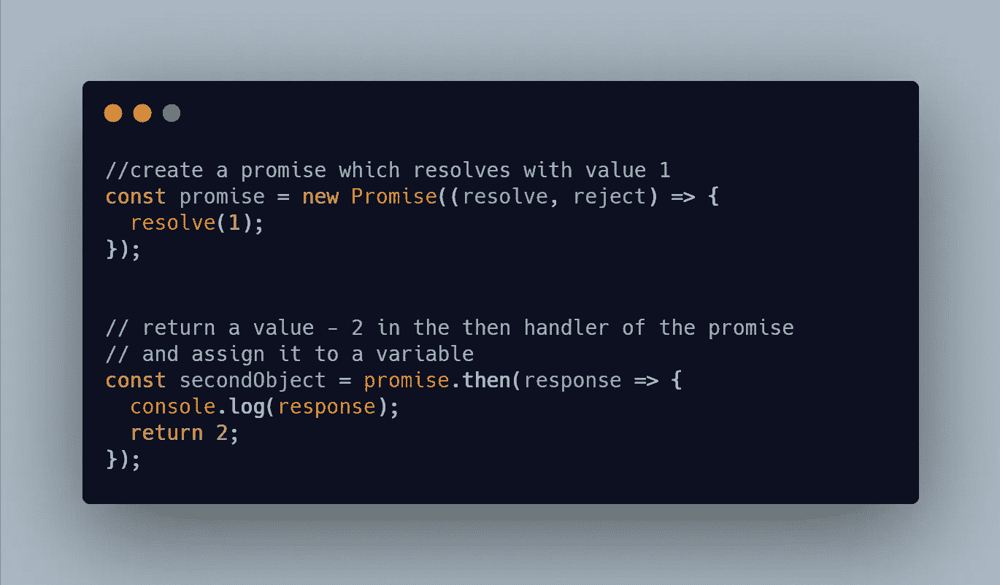
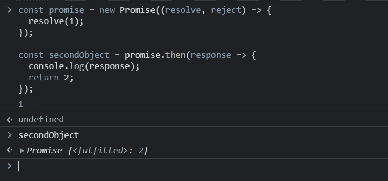
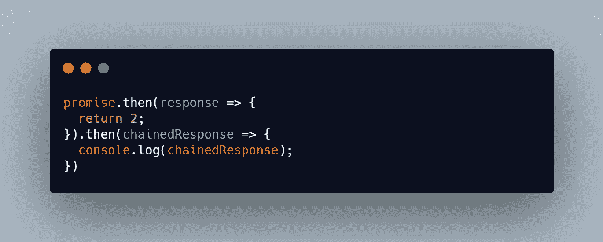
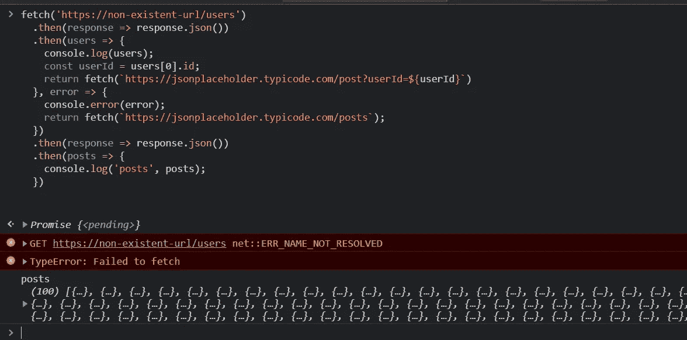
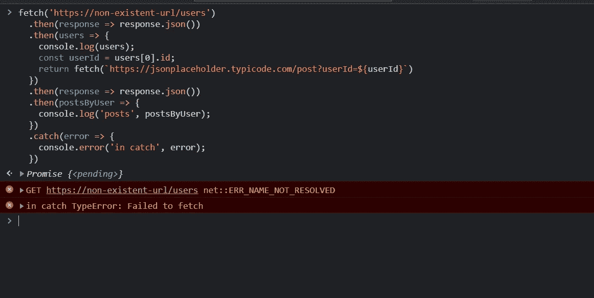

# JavaScript 承诺。第 3 部分—承诺链

> 原文：<https://medium.com/nerd-for-tech/javascript-promises-part-3-promise-chaining-707ab6f1bbfc?source=collection_archive---------6----------------------->

照片由 [Aida L](https://unsplash.com/@aidamarie_photography?utm_source=medium&utm_medium=referral) 在 [Unsplash](https://unsplash.com?utm_source=medium&utm_medium=referral) 上拍摄

在本系列的第 [1](/nerd-for-tech/javascript-promises-part-1-why-promises-d54ed05bdc9f) 和 [2](/nerd-for-tech/javascript-promises-part-2-fundamentals-e51e36c42fac) 部分中，我们了解了为什么要引入承诺，承诺是什么，以及如何创建承诺。在这一部分中，我们将通过理解如何将多个承诺链接在一起或简单地**承诺链接**来建立这一点。

这是一个需要理解的重要概念，它是进一步异步 JS 概念的基础，如 **async/await** 。

到目前为止，我们只讨论了正在执行的单个异步任务。但是，如果我们必须连续执行多个异步任务，并且每个任务都是在前一个任务完成之后执行的，那该怎么办呢？

为了理解这一点，我们必须绝对清楚一件事

> 从承诺的处理程序返回的任何值都将被包装为承诺

这意味着，如果我们从类似于`then`、`catch`或`finally`的承诺处理器返回一个值，它将被包装成一个承诺。

让我们试一个例子。尝试在控制台中编写以下代码摘录。

尝试在控制台中记录变量`secondObject`，以检查其类型。您将获得以下输出

从这个例子可以清楚地看出，`secondObject`不是一个数字，事实上是一个承诺，重申了我们之前的观点:

> 从承诺的处理程序返回的任何值都将被包装为承诺

那么，我们如何消费处理程序返回的承诺呢？简单。就像我们用`then/catch/finally`处理程序消费任何其他承诺一样。

因此，如果我们想从前面的例子中得到值 2，那么就对 promise `secondObject`应用另一个`then`处理程序，或者更好的方法是，简单地将新的`then`处理程序添加到前面的`then`处理程序中，如下所示

现在将打印 2。

将多个承诺链接在一起的过程称为**承诺链接。**

使用**承诺链**，我们可以处理多个连续的异步操作，因为每个处理程序只有在它的前一个完成后才会被执行。

让我们看一个真实世界的例子。

假设您正在构建一个社交媒体应用程序，用户可以在其中创建帖子、添加评论。有点像脸书。但没有毒性:d .作为管理员用户，您希望在您的仪表板中看到系统中的所有用户和第一个用户的所有帖子。

你必须连续做两件事:

1.  获取所有用户
2.  获取与第一个用户相关的所有帖子

我们将使用`fetch` API 来发出 HTTP 请求，并且我们将使用`[https://jsonplaceholder.typicode.com/](https://jsonplaceholder.typicode.com/)'作为这个例子的 API 提供者。

要获取所有用户，我们可以使用下面的代码

很正常的东西。我们将检索用户列表的 URL 传递给`fetch`方法。`fetch`进行网络调用并返回一个承诺，我们使用`then`处理程序访问该承诺。

但是请注意我们在这里是如何使用承诺链的。
这是因为来自`fetch` API 的响应将属于[响应](https://developer.mozilla.org/en-US/docs/Web/API/Response)类型。
为了从响应中提取 JSON 主体内容，我们使用了`[.json()](https://developer.mozilla.org/en-US/docs/Web/API/Body/json)`方法，该方法返回一个承诺，包装 JSON 主体。所以我们的`users`数组将在第二个`then`处理程序中可用。

现在让我们看一下用户访问不同帖子的代码

类似于前面的代码。唯一的区别是在箭头函数中使用了隐式返回。

现在我们有两个独立的承诺链，它们执行两种不同的异步操作。我们需要将它们结合在一起以实现我们的目标。你是怎么做到的？

在我们的第二个 then 处理程序中，我们将获取操作返回给用户获取帖子(第 6 行)。通过使用这个简单的步骤，我们可以连续地链接和执行多个异步操作。

# 错误处理

出了问题怎么办？如何处理承诺链中的错误？

记得在本系列的第二部分[中，我们已经提到过。如果你还没看过，就去看看吧。](/nerd-for-tech/javascript-promises-part-2-fundamentals-e51e36c42fac)

> 是否使用`catch` 块，或者在`then`块中处理错误，取决于我们的需求和承诺是否链接在一起。我们将在下一节深入探讨承诺链。现在，只要记住在`then`块本身中处理错误是可能的。

在一个承诺链中，如果在一个`then`块中出现错误，可以在一个 `then`块之后的**或一个`catch`块中处理。但是应该选哪个呢？这取决于问题的答案**

> 错误应该打破整个承诺链吗？

如果错误不会中断链，则在以下`then`块之一中处理错误。
如果错误导致链中断，不要在`then` 模块中添加故障处理程序，而是提供一个`catch`模块。

让我们看看两者的实际应用

首先，让我们产生一个错误。用一个不存在的 URL 替换我们之前的承诺链中的 URL。因此初始提取本身会失败。执行代码。您将得到以下错误。

我们没有处理错误，所以在错误发生后，不会执行任何`then`处理程序。

现在让我们来处理错误。

## 通过不打破承诺链来处理错误

如果在获取用户时发生错误，那么不是由第一个用户获取帖子，而是您想要获取系统中的所有帖子。换句话说，如果在此之前发生了错误，我们希望承诺链从某一点恢复。你是怎么做到的？

我们添加一个函数(第 7 行)来处理链中第 2 个`then`(第 3 行)的错误情况。

如果您观察，错误不会在直接的`then`块中处理。也就是说，如果 promise 链中发生了错误(在我们的例子中是在获取用户时)，错误将会在整个链中传播，直到到达错误处理函数(如果有的话)，然后执行该函数并恢复正常的链执行。

执行代码，您将看到正常的链执行被恢复。

## 通过打破承诺链来处理错误

但是，如果一旦发生错误，我们不希望任何块被执行，该怎么办呢？
为此，在链的末尾添加一个 catch 块，作为 promise 链的全局错误处理程序。

这里，我们在链的末端使用 catch 块来处理 promise 链中的任何错误。

执行代码，一旦出现错误，就会看到链断开。

在本文中，我们学习了什么是承诺链，如何将承诺链在一起，以及承诺链中不同的错误处理方法。

如果你觉得这篇文章很有帮助，请鼓掌并分享给你的朋友。如果你有任何建议/意见，请告诉我。请务必关注我，因为我们将通过了解不同的承诺方法 **Promise.any()** 、 **Promise.all()** 以及 **async/await** 来构建这个平台。