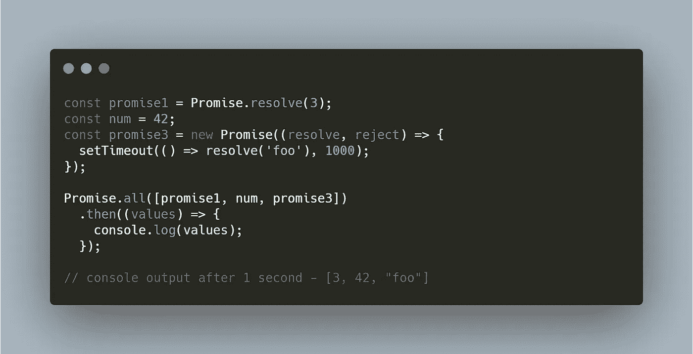
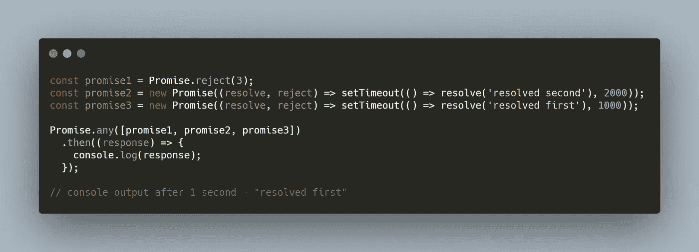
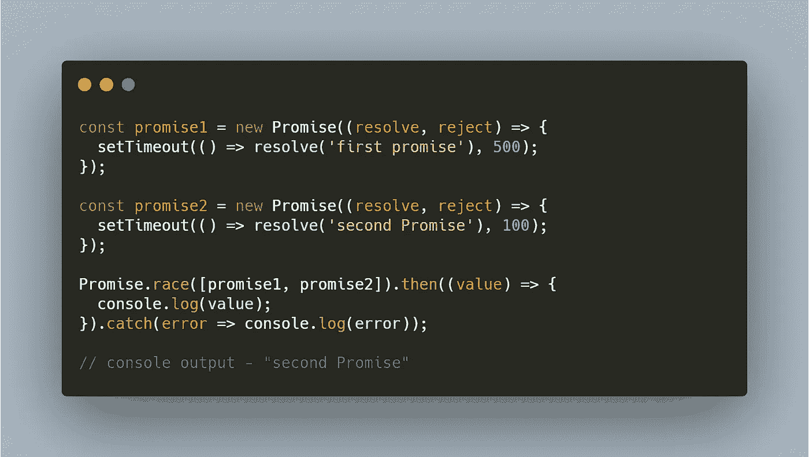
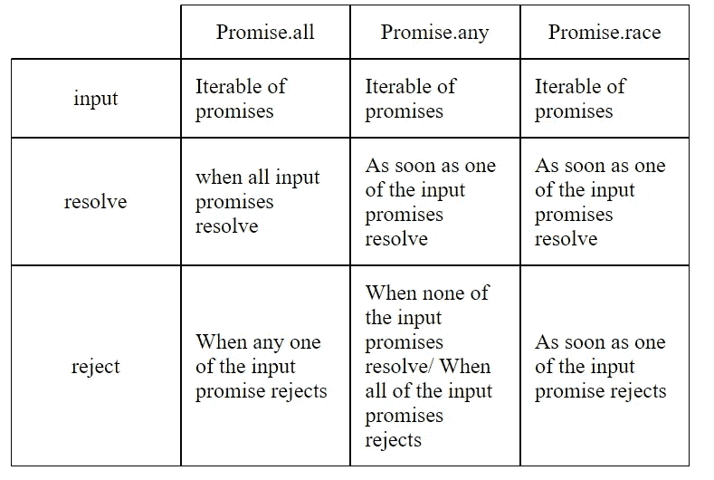

# JavaScript 承诺。第 4 部分— Promise.all、Promise.any 和 Promise.race

> 原文：<https://medium.com/nerd-for-tech/javascript-promises-part-4-promise-all-promise-any-and-promise-race-eeeceb3ee94e?source=collection_archive---------10----------------------->

到目前为止，我们已经了解到

1.  [为什么要推出承诺？](/nerd-for-tech/javascript-promises-part-1-why-promises-d54ed05bdc9f)
2.  [承诺基本面。如何创造和消费承诺？](/nerd-for-tech/javascript-promises-part-2-fundamentals-e51e36c42fac)
3.  [承诺链](/nerd-for-tech/javascript-promises-part-3-promise-chaining-707ab6f1bbfc)

现在我们将研究 Promise API 中的一些其他方法以及何时使用它们。

## 承诺。所有

`**Promise.all()**`方法接受一个可迭代的承诺作为输入，并返回一个`Promise`

这个返回的承诺只有在所有输入承诺都已解析时才会解析，其值将是输入承诺结果的数组。

如果任何输入承诺拒绝或抛出错误，返回的承诺将立即拒绝该错误/消息。

在上面的例子中，我们将 3 个变量传递给了`Promise.all`方法。

1.  将立即以值 3 解决的承诺
2.  这不是承诺。这意味着我们也可以将非承诺值传递给`Promise.all`方法。
3.  承诺 1 秒钟后用值`foo`解决。

如果执行上面的代码，1 秒后会得到一个响应— `*[3, 42, "foo"]*` 。

为什么是 1 秒？

因为`Promise.all`只有在所有输入承诺都解决后才会解决。这里，第三个承诺(使用`setTimeout`)需要 1 秒来解决。这是最后的承诺。所以`Promise.all`1s 后解析。

从示例中可以理解，响应是输入承诺的结果数组。

> **Promise.all** 用于当你有多个异步操作需要并行运行，并且一旦**这些操作的所有**完成，你想要执行一些操作。

## 承诺。任何

**Promise.any** 可以认为是 **Promise.all** 的功能反义词。

这也将一个可迭代的承诺作为输入，并返回一个`Promise`

一旦其中一个输入承诺实现(解析)，返回的承诺就会解析。

如果任何输入承诺拒绝，返回的承诺**不会拒绝**。

但是，如果没有一个输入承诺被解析，那么返回的承诺将被拒绝，并带有一个`[AggregateError](https://developer.mozilla.org/en-US/docs/Web/JavaScript/Reference/Global_Objects/AggregateError)`

在这个例子中，我们有 3 个承诺

1.  用值 3 立即拒绝的承诺
2.  承诺将在 2 秒后以值'【T1]'解决
3.  承诺将在 1 秒后解决，值为'【T2 ' '

当您执行上面的代码时，您将在 1 秒钟后得到输出'`resolved first`'(第一个解决的承诺)，即使第一个输入的承诺立即拒绝。

> **Promise.any** 用于当你有多个异步操作需要并行运行，并且一旦**任何一个**输入承诺解决，你必须执行某个操作，而不考虑其他输入承诺的状态。

**无极.竞**

**诺言.竞赛**类似于**诺言.任何**

与 Promise.any 等待任何输入承诺解析不同，这个方法`resolves/rejects`在一个输入承诺解析/拒绝后立即执行。

如果你愿意的话，这是一场承诺的竞赛，第一个解决/拒绝的人就是赢家。

正如您从示例中可以理解的，输出将是— `second Promise`，因为它比第一个承诺解决得更快。

将第二个承诺中的`resolve`改为`reject`，则`catch`块将被执行。

> **Promise.race** 当您有多个异步操作需要并行运行，并且您需要在任何一个输入解析/拒绝后立即执行操作时使用。

摘要

在本文中，我们了解了不同的 promise APIs。具体来说，**无极**、**无极**和**无极.竞**。

要阅读该系列的最后一篇文章，关于**异步/等待**，点击[此处](/nerd-for-tech/javascript-promises-final-part-async-await-5500fbf4d336)。

如果你觉得这篇文章很有帮助，请鼓掌并分享给你的朋友。如果你有任何建议/意见，请告诉我。一定要关注我，这样才不会错过任何文章。