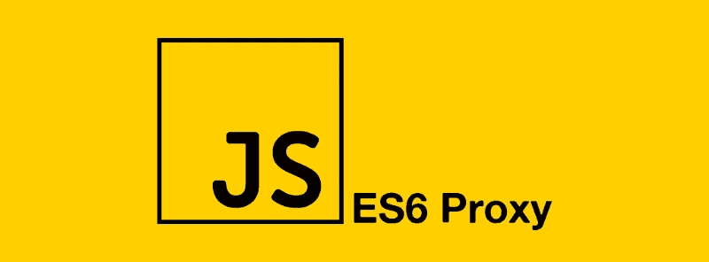

# JavaScript 代理:什么和为什么？

> 原文：<https://medium.com/nerd-for-tech/javascript-proxy-what-and-why-fca16f6e0088?source=collection_archive---------11----------------------->



EcmaScript 2015 引入了另一个尚未广泛使用的特性。JavaScript 代理允许我们用一个层来包装现有的对象。该层可以为我们提供诸如拦截属性和方法之类的功能。即使属性不存在，也可以做到这一点！

那是什么意思？

JavaScript 代理让我们能够改变对象和函数的底层行为。它们可以被认为是 JavaScript 对象的中间件。它允许我们覆盖内部操作，比如对象属性查找、赋值、枚举、函数调用、生成器行为、迭代等等。

在我们开始声明 JavaScript 代理之前，让我们先了解一下术语。

# 随身行李

我们可以覆盖的内部方法被称为陷阱。JavaScript 代理 API 允许我们覆盖以下内容:

# 对象方法:

getPrototypeOf()
setPrototypeOf()
isExtensible()
prevent extensions()
getOwnPropertyDescriptor()
ownKeys()

# 属性获取器/设置器:

has()
get()
set()
delete property()

# 函数方法:

apply()
构造()

# 目标

需要覆盖其属性的对象称为目标。它可以是我们想要的任何物体。这意味着它可以是一个常规的 JS 对象，或者是一个第三方模块，一个函数，或者是一个代理本身。

# 处理者

由于一个对象上有多个陷阱，因此我们可以为单个对象设置多个配置。因此，代理配置被称为处理程序。它可以有多个陷阱。读取目标属性的 get 陷阱，写入目标属性的 set 陷阱，等等。

# 定义 JavaScript 代理

现在我们知道了术语，让我们定义一个 JavaScript 代理！

```
let proxy = new Proxy(target, handler);
```

现在，每当我们在代理上执行操作时，JavaScript 将在内部引用处理程序。如果代理上存在相应的陷阱，它将被调用。否则将在目标上执行操作。

如果我们要创建一个在处理程序上没有任何陷阱的代理，

```
let proxy = new Proxy(target, {});
```

代理是目标对象周围的透明包装。

代理本身没有任何属性。在我们开始拦截处理程序之前，让我们看一下处理程序方法是什么时候被触发的。

**get:** 读取一个属性
**set:** 写入一个属性
**has:** in 运算符
**deleteProperty:** 删除运算符
**apply:** 函数调用
**construct:** new 运算符
**getPrototypeOf:**object . getPrototypeOf
**set prototypeof:**object . setPrototypeOf..在，Object.keys/values/entries
**ownKeys:**object . getownpropertymanames，object . getownpropertymodals，for..在 Object.keys/values/entries

现在我们已经知道了 JavaScript 代理的所有细节，让我们来看一些例子吧！

# 使用获取陷阱分配默认值

让我们为未定义的属性指定一个默认值。

```
const handler = {
	get: (obj, property) => 
  	property in obj ? obj[property] : 'you forgot to assign a value to this property bruh'
}

const objectWithDefaultValue = new Proxy({}, handler);

objectWithDefaultValue.foo = 'bar';

console.log(objectWithDefaultValue.foo); // bar
console.log(objectWithDefaultValue['hello there']); // you forgot to assign a value to this property bruh
```

我们定义的 get 陷阱会覆盖查找行为。如果对象有已定义的属性，我们返回值。否则我们返回我们的自定义消息。

# 使用设置的陷阱执行验证

JavaScript 在集合陷阱上有一个不变量。也就是说，这个内部方法需要满足一个条件。如果值写入成功，处理程序必须返回 true。否则它会返回 false 或抛出错误。

让我们在设置 age 属性之前创建一个代理来验证它。

```
let handler = {
  set: function(obj, property, value) {
    if (property === 'age') {
      if (!Number.isInteger(value)) {
        throw new TypeError('Age is not an integer');
      }
      if (value > 200) {
        throw new RangeError('Age is invalid, enter value less than 200');
      }
    }

    // Default behavior of storing the value
    obj[prop] = value;

    return true;
  }
};

const person = new Proxy({}, handler);

person.age = 18;
console.log(person.age); // 18
person.age = 'old';    // Throws exception: Age is not an intege
person.age = 250;        // Throws exception: Age is invalid, enter value less than 200
```

# 使用 HAS、OWNKEYS、SET、GET 和 DELETE 陷阱的私有属性

```
const hidePrivateFields = (target, prefix = "_") {
  return new Proxy(target, {
    has: (target, prop) => {
      if(typeof prop === "string" && prop.startsWith(prefix)){
        return false;
      }
      return prop in target
    },
    ownKeys: target => {
      return Reflect.ownKeys(target).filter(
        prop => typeof prop !== "string" || !prop.startsWith(prefix)
      )
    },
    get: (target, prop) => {
      if(typeof prop === "string" && prop.startsWith(prefix)){
        return undefined;
      }
      return target[prop];
    },
    deleteProperty(target, prop) { 
      if (prop.startsWith('_')) {
        return true;
      } else {
        delete target[prop];
        return true;
    }
  },

  });
}

let userInfo = hidePrivateFields({
  firstName: 'Saransh',
  _password: 'password'
})

userInfo._password           // undefined
('_password' in userInfo)    // false
Object.keys(userInfo)        // ['firstName']
delete userInfo._password    // returns true, but does not delete the password
```

# 结论

我们关于 JavaScript 代理的帖子到此结束！

在我们结束这篇文章之前，有几个问题:

*   目前，IE 中不支持代理。
    并且没有完整的聚合填充可用🙁
*   没有办法确定一个对象是否是代理。
*   一旦定义，就不可能改变目标或处理程序对象。
*   代理性能相对较慢。
*   目标必须是对象，代理不能应用于基本体。

让我们知道您的使用体验，或者您是否面临任何问题。你打算创建什么样的代理？请在下面留言，让我们知道。

*原载于 2021 年 2 月 16 日 https://www.wisdomgeek.com**T42*[。](https://www.wisdomgeek.com/development/web-development/javascript/javascript-proxy-what-and-why/)