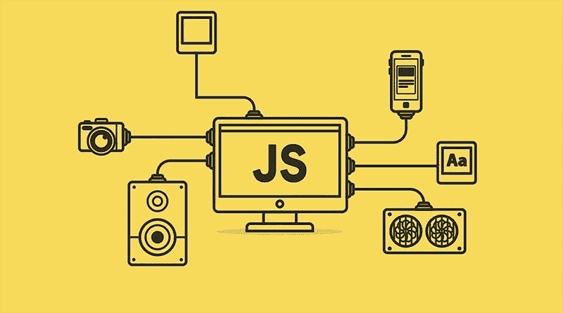

# 十大 JavaScript 特性

> 原文：<https://medium.com/nerd-for-tech/javascript-summary-222c3cbbcc31?source=collection_archive---------9----------------------->

一些重要的 javascript 特性

如果你想成为一名 JavaScript 程序员，你必须知道这些事情。

**01。数字:**如果一个变量的值是用数字来表示的，那么就称为数字型变量。如果该值无法转换，则显示 NaN。JavaScript number 有很多类型:isNaN()、parseInt()、parseFloat()等。

**Number.isNaN():** 此方法用于检查某物是否不是数字，其类型是否为数字。

示例:

**Number.parseInt():** 这个方法将一个字符串转换成一个整数(一个整数)。

示例:

**Number.parseFloat():** 这个方法将一个字符串转换成一个点数。

示例:

**02。String:** 如果一个变量的值是用一个或多个字母来表示的，那么就称为 String 型变量。当我们表达一个或多个价值字母时，那么这个东西将以引用开始，以引用结束。JavaScript 字符串有很多类型:concat()、replace()、indexof()、toUppercase()、toLowercase()等。

**Concat():** 这个方法将两个或更多的字符串组合起来，并返回一个新的字符串。

示例:

**trim():** 这个方法删除了字符串左右两边的空白。

示例:

**03。Math:** 这个方法是一个对象，提供了几个方法和属性来执行数学运算 JavaScript math 对象有很多类型:abs()、ceil()、floor()、random()等。

**Math.abs():** 这个方法提供一个给定数字的绝对值。可以写成:math . ABS(y)；[其中 y 是一个数字]。

示例:

**Math.floor():** 此方法给出一个小于或等于给定整数的较大数字。

示例:

**Math.random():** 这个方法返回一个介于 0 和 1 之间的随机数。

示例:

04 年。数组:当一个变量有不止一个值时，那么就叫做数组。要写一个数组，我们首先需要在两个值之间加一个逗号。然后，我们要给一个方括号，把所有的值放在一个盒子里。JavaScript 数组有很多类型:foreach()、shift()、map()、find()、filter()、join()等。

**joint():** 这个方法将数组中的所有元素连接成一个字符串。

例子；

这个方法移除并返回一个数组的第一个元素。

示例:

05。布尔::如果一个变量的值用 true 或 false 来表示，那么它就叫做布尔型变量。

示例:

**06。变量:**变量是指数据存储的位置。要声明一个变量，我们得写 JavaScript 的保留关键字 var。然后我们必须给这个变量取一个名字。这意味着它是什么变量，是人还是物等等。那么我们必须给出一个等号。然后，我们要写一个值，这意味着任何人都可以有一个名字，年龄，身高，和任何物体的名称等。然后，我们要给出一个分号。记住，变量名必须有意义。Javascript 有三个保留的关键字用于声明变量:let 和 cost。

示例:

**07。Switch:**‘Switch’很像 if-else，但两者还是有一些区别的。有效地说，如果我们想在某个东西上应用条件，那么我们将使用 switch 方法。

示例:

**08。While-Loop:** While 循环是一个条件循环。只要条件允许，就会执行。要编写 while 循环，我们必须编写 JavaScript 的保留关键字 while。然后我们要给括号()。然后，我们需要在圆括号里写一个条件。最后，我们必须给出一个花括号{}。

示例:

09 年。函数:当我们一遍又一遍的做同样的事情却又想随心所欲的改变它的时候，那么我们就要用函数的方法了。通过应用函数方法，我们可以在不同的地方使用相同的函数。首先我们会键入 javascript 的 function 关键字来写一个函数。然后，我们将给出两个带函数名的括号和两个花括号。

示例:

**10。闭包:**当一个函数能够记住并访问它的词法作用域时，即使这个函数在其词法作用域之外执行。

示例: