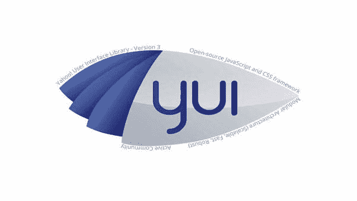

# JavaScript YUI 测试框架

> 原文：<https://medium.com/nerd-for-tech/javascript-yui-test-framework-6bd6f0d5c2fd?source=collection_archive---------22----------------------->

**简介**

JavaScript YUI 测试框架是最伟大的标准 JavaScript 单元测试框架之一。这是雅虎的股份。用户界面(YUI)。它可以用来测试任何独立的 JavaScript 代码。那不是 YUI 图书馆的做法。YUI 测试为创建 JavaScript 测试用例提供了一个简单的语法。这些也可以从浏览器或命令行运行。它们同样为测试异步(Ajax)JavaScript(https://www . technologiesinindustry 4 . com/2021/07/JavaScript-jasmine-a-strong-unit-testing-framework . html)代码提供了一种全新的机制。

如果我们习惯于 xUnit 框架(例如 JUnit)的语法，我们会发现自己熟悉 YUI 测试语法。YUI 测试中显示测试结果的方法有所改变。我们可以在浏览器控制台中显示测试结果，或者开发我们的定制测试运行程序页面来显示测试结果。由于一些浏览器不支持控制台对象，所以最好开发可接受的自定义测试运行程序页面，以便在所有浏览器中显示测试结果。控制台对象在以下系统中受支持:

*   安装了 Firebug 的 Firefox
*   Safari 3+
*   Internet Explorer 8+
*   铬

**描述**

雅虎的 YUI 图书馆项目！是托马斯·沙创作的。它是由雅虎内部赞助的！联合创始人杨致远。图书馆的开发者支持 YUIBlog。YUI 社区在其社区论坛中讨论该库及其应用。

YUI 测试可以作为基于浏览器的 JavaScript 解决方案的测试框架。通过使用 YUI 测试，我们可以很容易地将单元测试添加到 JavaScript 解决方案中。YUI 测试确实从 nUnit 和 JUnit 中产生了一些特性，尽管事实上它不是任何特定 xUnit 框架的直接移植。

**特色**

YUI 图书馆在其网站上有完整的文档。库下载附带了完整的 API 文档。它有六种模块:

*   YUI 核心
*   公用事业
*   用户界面控件
*   CSS 组件
*   开发者工具
*   构建工具

***YUI 核心***

YUI 核心是一套用于事件管理和 DOM 操作的轻量级工具。

**YUI 全局对象**

YUI 全球目标包括

*   语言实用程序，
*   脚本加载程序
*   YUI 的其他基础设施。

**Dom 集合**

支持常见的 DOM 脚本任务，具有元素定位和 CSS 样式管理。

**事件实用程序**

让开发人员能够轻松安全地访问浏览器事件。它同样提供了用于发布和承诺自定义事件的自定义事件对象。

***实用工具***

**动画**

通过动画显示页面元素的位置、大小、模糊度或其他特征来创建效果的优势。

**浏览器历史管理器**

支持 web 应用程序使用浏览器的后退按钮和书签功能。

**连接管理器**

帮助以跨浏览器的方式管理 XMLHttpRequest 事务。它集成了表单发布、错误处理、回调和文件上传功能。

**曲奇**

允许我们通过一个简单的 API 来管理浏览器 cookie 和子 cookie。

**数据源**

为其他组件提供一个通用的可配置接口，以便与不同类型的数据进行交互。

**拖拽**

YUI 拖放实用程序创建了一个宽松的拖放对象，使元素可以拖动，并使拖放目标可以响应拖动事件。

**元素**

为 DOM 中的 HTML 元素提供包装。它简化了常见的任务，例如添加侦听器、操作 DOM、设置和获取属性。

**获取**

Get 实用程序有助于数据的异步加载。它支持脚本节点的脚本和外部 CSS 文件的动态加载。

**图像加载器**

YUI 的图像加载器允许我们让位于图像的加载。在页面加载时，这些图像在视窗中是不可见的。这可能会带来巨大的性能提升。

**JSON**

JSON 实用程序提供了验证传入 JSON 数据的方法。这是为了确认将 JavaScript 数据转换成 JSON 格式的字符串是安全的和有效的。这些方法是基于道格拉斯·克洛克福特在 JSON 的工作。

**调整大小**

允许我们调整任何块级 HTML 元素的大小。

**选择器**

YUI 选择器工具使我们能够通过 CSS3 选择器语法引用 HTML 元素。

**YUI 装载机**

YUI 装载机是一个客户端装载机引擎。它可以动态地加载任何 YUI 组件和依赖项。

**控件*控件*控件**

**自动完成**

为涉及文本输入的用户交互提供自动完成功能。它有助于各种数据源格式。它同样通过 XMLHttpRequest 支持服务器端数据源。

**按钮**

允许创建丰富的图形按钮。这些功能就像传统的 HTML 表单按钮。

**日历**

用于日期选择的生动的图形控件。

**图表**

图表控件通过 DataSource 实用程序保存数据。它们以各种常见的图表格式显示数据。

**颜色选择器**

颜色选择器控件为颜色选择提供了丰富的图形界面。

**容器**

帮助各种 DHTML 窗口模式。这些包括工具提示、面板、对话框、简单对话框、模块和覆盖。

**数据表**

适度到目前为止有影响力的 API，在网页上显示屏幕阅读器可访问的表格数据。独特的结构包括可排序的列、分页、滚动、行选择、可调整大小的列和行内编辑。

**影像裁剪师**

ImageCropper 提供了用户界面。它共享客户端图像裁剪器的元素。

**版面经理**

通过给定一个覆盖顶部、底部、左侧、右侧和中央布局单元的固定布局，使我们能够毫不费力地制作跨浏览器、像素完美的布局。

**菜单**

提供了一个简单的 API 来制作弹出菜单、菜单栏和上下文菜单。

**富文本编辑器**

富文本编辑器是一个经典的客户端文本处理器。它是模块化的，高度可配置的，适合任何开放式文本输入条件。

**滑块**

提供通用滑块元素。该元素允许用户在一个或两个轴的有限值范围内进行选择。

**选项卡视图**

提供可导航的选项卡式内容视图。它们支持通过 XMLHttpRequest 动态加载选项卡内容。

**树形视图**

生成一个内容树，其节点可以延长和缩短。

**上传者**

允许通过上传进度反馈进行多文件上传。

***CSS 资源***

**CSS 基础**

重置后使用 Base 为 web 开发人员熟悉的普通浏览器 CSS 规则提供一致的跨浏览器备用。

**CSS 网格**

七个基本的页面线框和子模块，帮助超过 1000 种不同的页面布局。

**CSS 字体**

一致的跨浏览器字体系列和大小版本。

**CSS 复位**

CSS 声明消除了边距。它们规范通用元素的跨浏览器呈现。

***开发者工具***

**记录器**

提供了一种快速简便的方法将日志消息写入屏幕控制台。

**剖析器**

一个跨浏览器、非可视化的 JavaScript 代码分析器。

**profiler 查看器**

用于与 Profiler 一起分组，以提供我们的分析数据的丰富可视化

***构建工具***

**YUI 压缩机**

YUI 压缩器是一个无害的缩小 JavaScript 和 CSS 的工具。

**YUIDoc**

YUIDoc 是一个用 JavaScript 编写的工具。它创建 JavaScript 代码的可搜索 API 文档。它自然被用作构建过程的一部分。YUIDoc 是评论驱动的。它们兼容多种编码风格和编程语言。

更多详情请访问:[https://www.technologiesinindustry4.com](https://www.technologiesinindustry4.com)