# 詹金斯

> 原文：<https://medium.com/nerd-for-tech/jenkins-50c79a775a62?source=collection_archive---------2----------------------->

**定义**

Jenkins 是一个开源自动化服务器。有了 Jenkins，组织可以通过自动化来加速软件开发过程。Jenkins 在整个生命周期中管理和控制软件交付过程，包括构建、文档、测试、打包、阶段、部署、静态代码分析等等。

你可以设置 Jenkins 来观察 GitHub、Bitbucket 或 GitLab 等地方的任何代码变化，并使用 Maven 和 Gradle 等工具自动进行构建。您可以利用 Docker 和 Kubernetes 等容器技术，启动测试，然后在生产中采取回滚或前滚等措施。

**历史**

詹金斯项目于 2004 年由 [Kohsuke Kawaguchi](https://www.cloudbees.com/team/kohsuke-kawaguchi) 启动，当时他在太阳微系统公司工作。Kohsuke 是 Sun 的一名开发人员，他厌倦了每次他的代码破坏构建时招致团队的愤怒。他创建了 Jenkins 作为执行持续集成的一种方式——也就是说，在他实际提交到存储库之前测试他的代码；可以肯定一切都很好。一旦他的队友看到他在做什么，他们都想用詹金斯。Kohsuke 开源了它，创建了 Jenkins 项目，很快 Jenkins 的用法就传遍了全世界。

**CloudBees 和詹金斯社区**

CloudBees 是 Jenkins 社区的积极参与者，在支持该项目方面发挥了重要作用。CloudBees 雇佣了许多 Jenkins 项目的关键贡献者。为了支持该社区，CloudBees 是 Jenkins 社区年度用户大会 [DevOps World | Jenkins World](https://www.cloudbees.com/jenkinsworld) 的主要赞助商。Jenkins World 使社区能够聚集在一起，培养社区意识，允许用户相互学习并支持社区发展。CloudBees 还在全球范围内支持了[Jenkins Area Meetups(JAMs)](https://jenkins.io/projects/jam/)的发展，最近还将 JAMs 捐赠给了 CDF，在那里他们可以继续发展。

来自 CloudBees 支持和产品团队的工程师定期为 Jenkins 项目贡献代码，积极参与 Jenkins 聊天和项目会议，并为 Jenkins 项目邮件列表做出贡献。CloudBees 已经开发的几个关键项目包括[詹金斯 X](https://jenkins-x.io/) 、詹金斯管道和[詹金斯 2](https://www.cloudbees.com/press/jenkins-2.0-advances-continuous-delivery-native-pipeline-support-and-usability-enhancements) 。此外，CloudBees 在开源代码中所做的所有修复都会反馈到该项目中，这有助于我们所有人享受更高质量的 Jenkins 体验。

CloudBees 还为 Jenkins 社区提供名为*持续信息的月度时事通讯。*它充满了社区提示和技巧、文章、演示、世界各地发生的事件和许多其他资源。

## 詹金斯和持续交付基金会

2019 年，持续交付基金会(CDF)在 Linux 基金会的保护伞下启动运营。CloudBees 与 Jenkins 和 Jenkins X 社区、Google、Linux 基金会等合作，领导了发布活动。

CDF 致力于开发、培育和推广与持续交付相关的开源项目、最佳实践和行业规范。CDF 包含各种开源项目，包括 Jenkins、Jenkins X、Spinnaker 和 Tekton。预计会有更多的项目加入进来，目标是将一个连续交付(CD)生态系统整合在一起，围绕可移植性和互操作性构建规范和项目。CloudBees 作为创始成员参与其中，并持续为该项目贡献技术和资源

# **在 WINDOWS 上安装**

**第一步**

前往链接[**https://www.jenkins.io/download/**](https://www.jenkins.io/download/)

**第二步**

单击通用 Java 包(。war):-这将下载一个(。war)文件

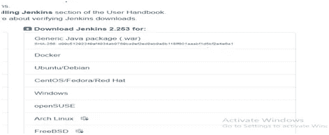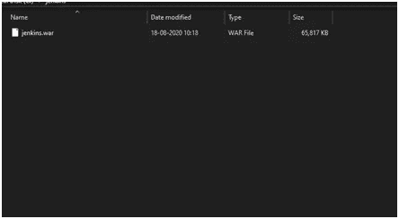

**第三步**

打开命令提示符并通过 CMD 转到 Jenkins 文件夹

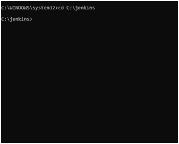

**第 4 步**

现在运行命令:—Java–jar Jenkins . war

注意:-您的系统应该有 JDK(版本 8 到 11 任何人)

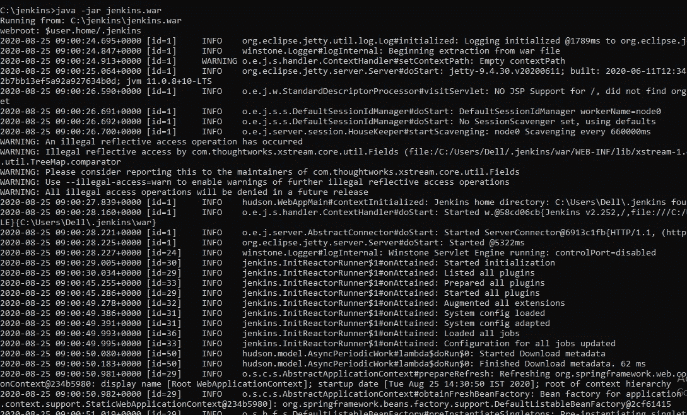

**第五步**

运行命令后，进入 chrome 并输入:— **localhost:8080**

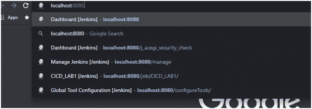

这将打开您的登录页面

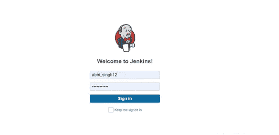

登录后，您的仪表板将可见

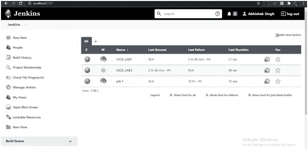

# **您的安装已完成！！！！！！！！！！**

# **通过詹金斯的管道**

**第一步**

点击新项目

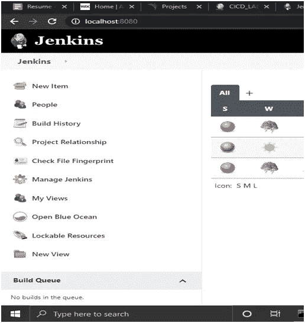

**第二步**

给你的项目命名，点击管道，然后点击确定

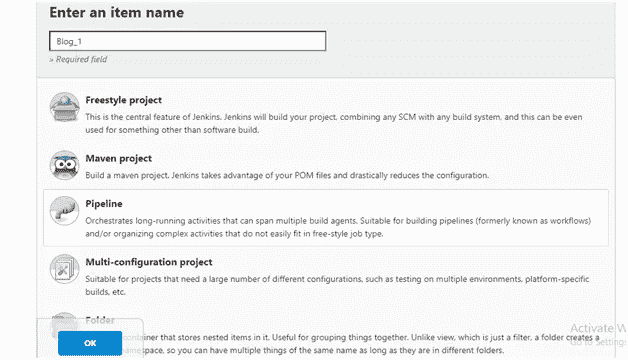

**第三步**

将管道定义更改为“来自 SCM 的管道脚本”

和 SCM 转换为“Git”

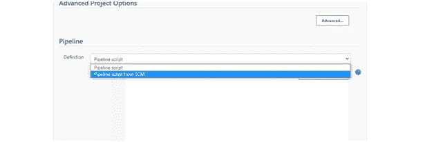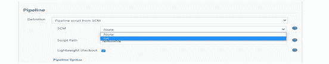

**第四步**

在 GitHub 上为该管道进行回购

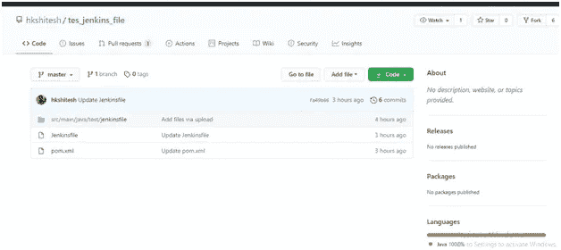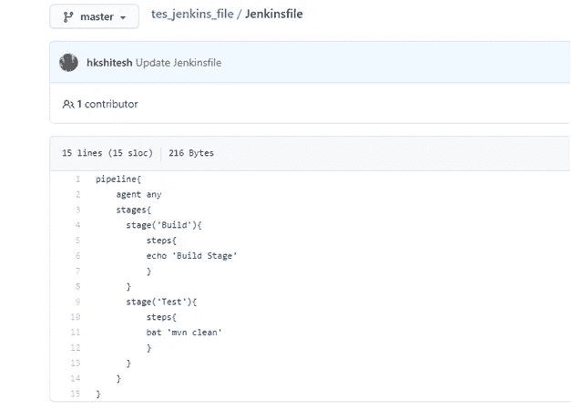

**第五步**

复制回购 URL，然后保存

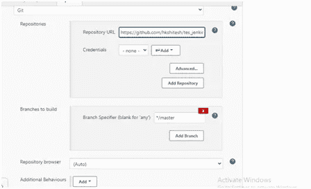

**第六步**

单击立即构建并检查控制台输出

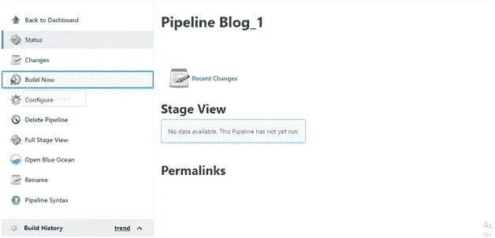

我们将获得成功！！！！

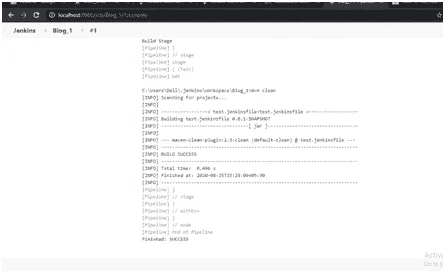

# **这里是管道**

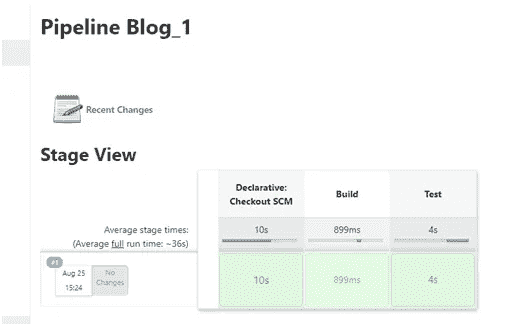