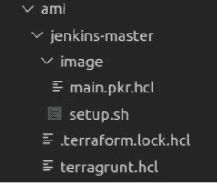

# 詹金斯是代码

> 原文：<https://medium.com/nerd-for-tech/jenkins-as-code-bfdbd8f3dff9?source=collection_archive---------2----------------------->


到目前为止，在我们的工程博客中，我们已经看到了一些不同的技术和功能，如 [Hashicorp 的 Vault](https://www.transifex.com/blog/2021/enhancing-security-applications-vault/) 和 [Kubernetes 的自动缩放](https://www.transifex.com/blog/2021/shoot-for-the-moon-with-spot-instances-in-aws/)。这一次，我们将回归基础，与 Jenkins 一起建立 CI/CD 渠道。

我认为可以肯定的是，大多数 DevOps 的工程师已经很熟悉 Jenkins 了，但是，为了以防万一，这是 Jenkins 在其[主页](https://www.jenkins.io/)上对自己的描述:

领先的开源自动化服务器 Jenkins 提供了数百个插件来支持任何项目的构建、部署和自动化。

所以，一言以蔽之，它是一个 CI/CD 工具。现在回到正题。

我们最近的任务是根据 [AWS 的最佳实践](https://docs.aws.amazon.com/controltower/latest/userguide/aws-multi-account-landing-zone.html)将我们的 Jenkins 实例迁移到不同的 AWS 帐户。作为基础设施即代码(IaC)的铁杆支持者，我们希望用正确的方式，即 Terragrunt 方式来做这件事。

# 那么我们要找的是什么样的设置呢？

1.  Jenkins 可能是一堆插件和依赖项。用代码记录它的初始设置可以很容易地看出使用了什么以及为什么使用。
2.  没有用户界面设置。这并不是说我们讨厌 ui，而是点击几下就能改变行为和组件的事情经常没有记录下来。这意味着，工程师们将会绞尽脑汁试图弄清楚这个设置。经常想到的一句话是:
    “当我设置这个的时候，只有上帝和我明白它做了什么……现在只有上帝知道了。”
3.  没有什么比用几个命令行命令来配置基础设施更好的了。

我们看到了这种方法的三个主要优势:

*   由于我们正在开发 AWS，并且我们不希望 Jenkins 生活在我们的 Kubernetes 集群中，我们需要一个通过[自动扩展组](https://docs.aws.amazon.com/autoscaling/ec2/userguide/AutoScalingGroup.html)部署的 Jenkins 服务器的 [AMI](https://docs.aws.amazon.com/AWSEC2/latest/UserGuide/AMIs.html) 。这将使我们能够以几乎零停机时间推出新版 Jenkins 服务器。
*   我们需要找到一种方法来提供 Jenkins 配置(存储库、作业、凭证和插件设置),而根本不需要访问 Jenkins UI。在启动 Jenkins 服务器以及更新配置时，应该加载此配置。

# 建立 AMI

因为我们知道 Jenkins 是行业中的常用工具，所以我们搜索了公共的 Jenkins AMIs。我们很快就同意使用 Bitnami 的 Jenkins AMI。

当然，仅仅部署特定的映像是不够的。我们希望所有的插件，我们将使用已经安装，以及其他事情。

为了重新包装 AMI，我们使用了哈希公司的另一种工具[打包机](https://www.packer.io/)。我们还想将这个过程集成到我们的 Terragrunt 代码中。最后，我们在 Terragrunt 存储库中提出了以下文件结构:



在 jenkins-master 文件夹中运行 terragrunt apply 应该会创建 AMI 并公开其属性，这样它就可以在其他模块中作为一个依赖项使用，比如在 Auto Scaling 组中。

为了在 terragrunt.hcl 文件中实现这一点，我们使用了一个简单的模块来实现 [Terraform 的 AMI 数据源](https://registry.terraform.io/providers/hashicorp/aws/latest/docs/data-sources/ami)。不过，重要的一步是实现一个“before_hook ”,在模块检索和公开 AMI 之前构建 AMI。

文件的内容最终看起来像这样:

terragrunt.hcl

```
terraform {
 source = "git::git@github.com:transifex/terraform-modules.git//modules/data-ami?ref=v0.1.44"
 before_hook "before_hook" {
   commands = ["apply"]
   execute = [
     "packer",
     "build",
     "-var", "assumed_role=${local.iam_role}",
     "-var", "vpc_id=${local.vpc_id}",
     "-var", "subnet_id=${local.public_subnet}",
     "image/main.pkr.hcl",
   ]
 }
}

locals {
 # These can / should be loaded as dependencies from other modules
 iam_role = "arn:aws:iam::xxxxxxxx:role/my_role"
 public_subnet = "vpc-xxxxxxx"
 public_subnet = "sub-xxxxxxx"
}

include {
 path = find_in_parent_folders()
}

inputs = {
 filter_names = ["jenkins-master"]
}
```

图像文件夹将保存打包程序配置和我们编写的供应脚本。

setup.sh

```
**#!/bin/bash**
## Install apt packages that are needed or wanted
apt-get install locate && updatedb

## Wait for jenkins to start
function wait_for_jenkins()
{
 until $(curl --output /dev/null --silent --head --fail http://localhost/jnlpJars/jenkins-cli.jar); do
   printf '.'
   sleep 5
 done
 echo "Jenkins launched"
}
wait_for_jenkins

## Change shell of jenkins user
usermod --shell /bin/bash jenkins

## Download the jenkins-cli.jar
su - jenkins -c "wget localhost/jnlpJars/jenkins-cli.jar -O /opt/bitnami/jenkins/jenkins_home/jenkins-cli.jar"

## Retrieve the default admin user password
userpass=$(cat /home/bitnami/bitnami_credentials | grep 'The default username and password is' | rev | cut -d' ' -f1 | cut -d'.' -f2 | sed "s/'//g" | rev)

## Install Jenkins plugins that are needed (and restart Jenkins)
/opt/bitnami/java/bin/java -jar /opt/bitnami/jenkins/jenkins_home/jenkins-cli.jar -s http://localhost:8080/ -auth user:$userpass install-plugin configuration-as-code blueocean ec2 slack github-autostatus metrics github-pullrequest role-strategy google-login job-dsl basic-branch-build-strategies parameterized-scheduler
```

main.pkr.hcl

```
variable "vpc_id" {
 type = string
}

variable "subnet_id" {
 type = string
}

variable "assumed_role" {
 type = string
}

source "amazon-ebs" "jenkins-master" {
 assume_role {
   role_arn = "${var.assumed_role}"
 }

 ami_name                = "jenkins-master"
 instance_type           = "t2.medium"
 region                  = "eu-west-1"
 source_ami              = "ami-0562a5f132869dd5a"
 ssh_username            = "bitnami"
 ami_description         = "Jenkins Master AMI"
 shutdown_behavior       = "terminate"
 spot_price              = "auto"
 spot_price_auto_product = "Linux/UNIX"

 ssh_pty               = true
 force_delete_snapshot = true
 force_deregister      = true

 // Vpc && subnet to launch the spot instance
 vpc_id    = "${var.vpc_id}"
 subnet_id = "${var.subnet_id}"

 // Associate public ip so packer can ssh to provision
 associate_public_ip_address = true
 // Use the public IP to connect
 ssh_interface = "public_ip"
}

build {
 sources = ["source.amazon-ebs.jenkins-master"]
 provisioner "shell" {
   execute_command = "echo '' | sudo -S su - root -c '{{ .Vars }} {{ .Path }}'"
   script          = "image/setup.sh"
 }
}
```

瞧啊！

通过一个简单的“terragrunt apply”命令，我们可以构建我们的映像，并且能够在未来的模块中加载它的属性。

# 詹金斯配置代码

在我们寻找自动化 Jenkins 配置的方法时(在 groovy 脚本中挣扎了几个小时之后)，我们遇到了下面的插件: [JCaC ( Jenkins 配置代码)](https://www.jenkins.io/projects/jcasc/)。是的，顾名思义。Jenkins 社区采用的一个插件，其唯一目的是提供在 YAML 文件中定义 Jenkins 和插件配置的能力。

这个文件可以放在 Jenkins 服务器中，也可以从 url 加载。最重要的是，您可以让 Jenkins 实例通过[点击特定的端点](https://github.com/jenkinsci/configuration-as-code-plugin/blob/master/docs/features/configurationReload.md)来重新加载配置文件。

我们很快接受了这项任务，并开始使用 YAML 格式配置我们的 Jenkins 和插件。end 文件太大，太具体，不适合我们在这里分享，但是你可以在 JCaC 提供的[演示中找到许多关于如何设置它的例子。](https://github.com/jenkinsci/configuration-as-code-plugin/tree/master/demos)

或者，如果你正在运行 Jenkins，你可以安装插件并[导出你当前的配置](https://github.com/jenkinsci/configuration-as-code-plugin/blob/master/docs/features/configExport.md)。一旦我们完成了配置文件的创建，为了让 Jenkins 可以使用它，我们决定将它添加到一个只有 Jenkins 可以访问的私有 S3 存储桶中。像往常一样，我们用 Terragrunt 来做这个。现在还剩两个项目:

1.  当发生更改时，让 Jenkins 重新加载文件
2.  在 Jenkins 的初始化中提供文件 url，以便可以在启动时发现它。

对于第一项，简单到在将文件上传到 s3 的“terragrunt apply”中添加一个“after_hook ”:

terragrunt.hcl

```
terraform {
 source = "git::git@github.com:terraform-aws-modules/terraform-aws-s3-bucket.git//modules/object?ref=v1.25.0"

 after_hook "after_hook" {
   commands     = ["apply"]
   execute      = ["curl", "-X", "POST", "jenkins.domain/reload-configuration-as-code/?casc-reload-token=xxxxxxxx"
 }
}...
```

这意味着每次我们更新配置文件时，都会向 Jenkins 发送一个重新加载配置的帖子。

为了确保 Jenkins 也会在初始化时加载该文件，我们返回到上一步中构建的 AMI，并更改了配置脚本以提供必要的配置:

main.pkr.hcl

```
...
build {
 sources = ["source.amazon-ebs.jenkins-master"]
 provisioner "shell" {
   environment_vars = [
     "jenkins_casc_token=${var.jenkins_casc_token}",
     "vpc_endpoint=${var.vpc_endpoint}"
   ]
   execute_command = "echo '' | sudo -S su - root -c '{{ .Vars }} {{ .Path }}'"
   script          = "image/setup.sh"
 }
}
```

setup.sh

```
...
## Jenkins configuration as code options
sed "s,\"javaOpts\": \"\",\"javaOpts\": \"-Dcasc.reload.token=$jenkins_casc_token -Dcasc.jenkins.config=$vpc_endpoint\",g" -i /root/.nami/registry.json
```

terragrunt.hcl

```
terraform {
 source = "git::git@github.com:transifex/terraform-modules.git//modules/data-ami?ref=v0.1.44"
 before_hook "before_hook" {
   commands = ["apply"]
   execute = [
     "packer",
     "build",
     "-var", "assumed_role=${local.iam_role}",
     "-var", "vpc_id=${local.vpc_id}",
     "-var", "subnet_id=${local.public_subnet}",
     "-var", "jenkins_casc_token=${local.casc_token"]}",
     "-var", "vpc_endpoint=${local.s3_endpoint}",
     "image/main.pkr.hcl",
   ]
 }
}

locals {
 # These can / should be loaded as dependencies from other modules
 iam_role = "arn:aws:iam::xxxxxxxx:role/my_role"
 public_subnet = "vpc-xxxxxxx"
 public_subnet = "sub-xxxxxxx"
 casc_token = "xxxxxxxxxxx"
 s3_endpoint = "xxxxxxxxxxx"
}

...
```

现在，有了这些更改，配置文件可以在启动时加载了！

# 播种你的工作

虽然 CasC 解决了我们的大部分配置问题，但有一件事它做不到，至少自己做不到，那就是创造我们的詹金斯工作岗位。为了实现这一点，你需要另一个插件， [job-dsl](https://plugins.jenkins.io/job-dsl/) ，它可以与 CasC 协同工作。

job-dsl 允许您在前面创建的 Jenkins 配置文件中定义编程作业。如果我在这里没有提到这不适合心脏虚弱的人，那我就失职了。虽然使用这个插件，您可以创建惊人的自动化，但文档在许多地方是缺乏的，并且需要大量的尝试和错误才能达到良好的效果。

在我们的例子中，我们希望提供我们的 github 组织和一些包含他们自己的 Jenkinsfiles 的精选存储库。为此，我们使用了一个[组织文件夹](https://jenkinsci.github.io/job-dsl-plugin/#method/javaposse.jobdsl.dsl.DslFactory.organizationFolder)。这是我们使用的脚本(与我们配置的其余部分一起位于 YAML 文件中)。

```
jobs:
 - script: >
     organizationFolder('Transifex') {
       description("Transifex organization folder configured with JCasC")
       displayName('Transifex')
       buildStrategies {
         buildChangeRequests {
           ignoreTargetOnlyChanges(true)
           ignoreUntrustedChanges(true)
         }
         skipInitialBuildOnFirstBranchIndexing()
       }
       triggers {}
       // "Projects"
       organizations {
         github {
           repoOwner("transifex")
           credentialsId("xxxxxxx")
           traits {
             // Discovers branches on the repository.
             gitHubBranchDiscovery {
               // Determines which branches are discovered.
               // 1 = Exclude branches that are also filed as PRs
               strategyId(1)
             }
             gitHubPullRequestDiscovery {
               // Determines how pull requests are discovered: Merging the pull request with the current target branch revision Discover each pull request once with the discovered revision corresponding to the result of merging with the current revision of the target branch.
               // 1 = Merging the pull request with the current target branch revision
               strategyId(1)
             }
             gitHubExcludeArchivedRepositories()
             sourceWildcardFilter {
               // Space-separated list of project (repository) name patterns to consider.
               includes("xxxxx yyyyyy zzzzzz")
               excludes("")
             }
           }
         }
       }
     }

...
```

# 最终注释

总而言之，我们不得不承认向 Jenkins 提供 IaC 原则对我们团队来说是一次令人厌倦的经历。许多项目没有记录或者记录得很差，我们的问题的答案从来都不明显。但是一旦完成，就很容易修改和跟踪。

假设我们未来需要一个新的 Jenkins，那么只需写几行代码和编辑几个文件就可以了。所有这些都将永远记录在我们的资料库中。我们希望这篇文章能为未来敢于探索这些道路的勇敢的工程师们提供一盏指路明灯。