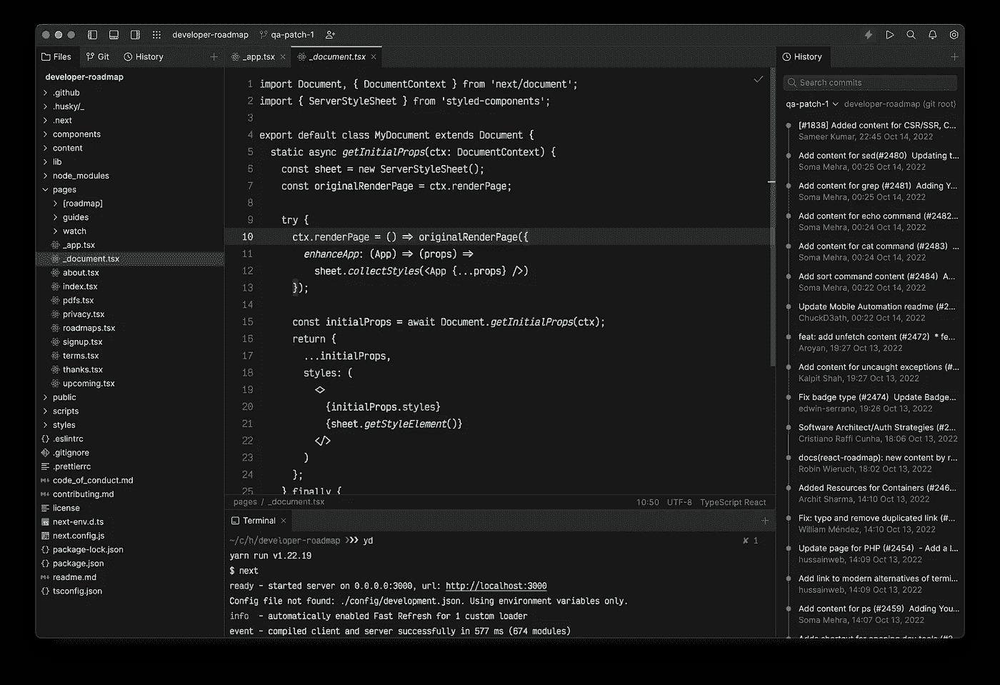
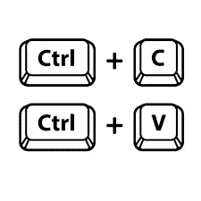
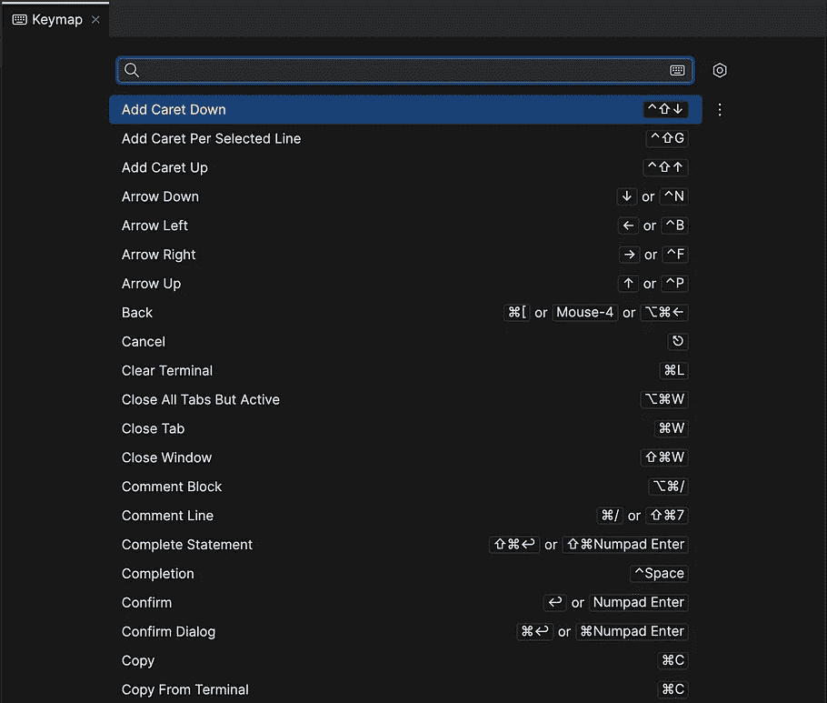
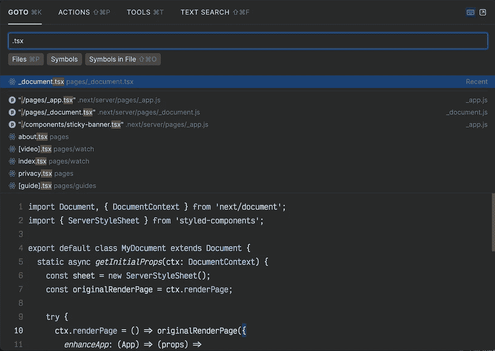
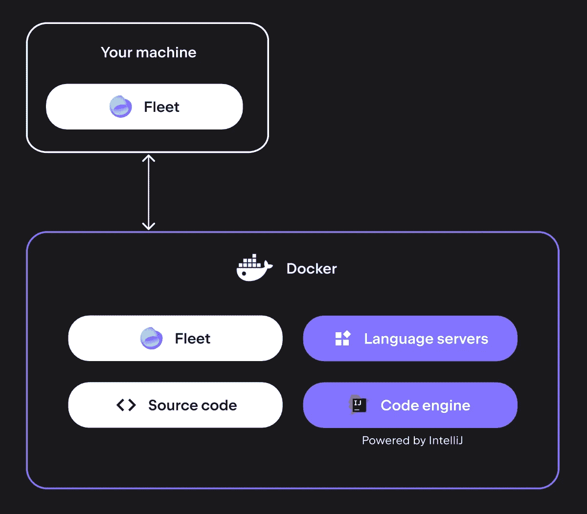
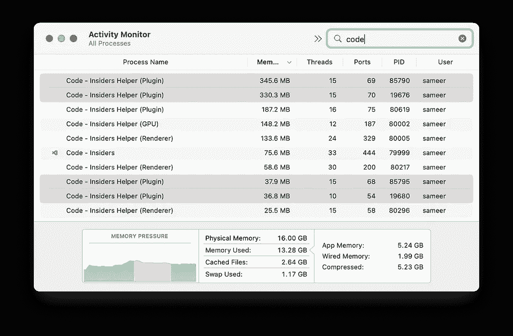

# JetBrains 舰队——VS 代码杀手？

> 原文：<https://medium.com/nerd-for-tech/jetbrains-fleet-a-vs-code-killer-f662f45f6478?source=collection_archive---------0----------------------->

## 来自 JetBrains 的一种极好的轻量级多种语言。


JetBrains 舰队 vs 代码。

etBrains 是纯粹的爱。使用哪种代码编辑器并不重要，但有些事情总是个人优先考虑的。对我来说，是审美，是速度，是智慧的建议。审美加分💛。

我曾经是一个长期的崇高文字迷。然后它渐渐被遗忘，我收拾好行李，转到 VS 代码，上面三个是升序排列的。尽管如此，没有什么比我在 JetBrains IDEs 上的体验更好的了，尤其是在我从事 ruby on rails 开发时的 RubyMine。唯一玷污这些华丽 ide 的是速度，主要是交互的时间。

> J etBrains 对大多数问题的答案是**舰队**。

Fleet 的目标是成为一个更智能的编辑器，而不是一个成熟的 IDE。我认为这是一件好事，因为在大多数情况下，我们不希望 ide 中包含的所有核心功能操纵几行代码并获得良好的智能感知。当我第一次安装 fleet 时，我有点怀疑，因为我认为我会失去 IDE 的所有好的部分，但在使用了几天后，我可以说所有这些功能在日常使用中并不需要。

# **❤️舰队中我喜欢的东西**

## **美学**



JetBrains 舰队编辑

如果你问我一件我不喜欢 VS 代码的事情，那就是外观和感觉。毫不奇怪，使用过多的扩展可以将 VS 代码定制到非常极端的程度，但对我来说仍然感觉非常不可靠。早些时候，我以为只有我这么想，但是当我问我的几个长期使用 JetBrains 的朋友时，他们也赞同 JetBrains IDEs 提供了更坚固的外观和感觉。

Fleet 汲取了旧 IDE 的灵感，并将其用现代设计语言表达出来。新的设计非常流畅，没有分心。应用程序本身分为四个窗格。

1.  第一个窗格位于左侧，分为三个选项卡，分别是**文件浏览器、版本控制和提交历史**。选择窗格后，可以使用键盘快捷键轻松导航这三个子部分。演示和导航感觉非常流畅，他们只是工作。
2.  第二个窗格在底部，可以容纳不同的视图，包括终端、运行日志、docker 等。可以从那里显示的下拉列表中选择。我们想看什么完全取决于我们，也许在未来，也会有自定义视图。
3.  第三个窗格位于右侧，可以包含与第二个窗格相同的视图。它可以用作第二面板，但在大多数情况下，我认为我还是没有它更好，当屏幕空间不是一个限制时，它很好。
4.  除此之外，主编辑器区域本身也是一个很容易让人分心的、容易访问的、看起来很干净的视图。从定制的角度来看，我们可以改变主题、字体和其他公共属性。应用程序主题与系统主题结合得很好，默认设置也设计得很好。

## **键盘映射**



车队键图

> “你应该离开你的编辑器，但不是你的键盘”

来自不同的编辑器，最大的挑战是让你的肌肉记忆键盘快捷键转移，但这里几乎一半的键盘快捷键已经与 VS 代码对齐，我花了大约 15 分钟来映射其他快捷键按照我的喜好。

作为一个键盘驱动的超级用户，我发现 ide 和 VS 代码中缺少了很多东西。我注意到的第一件事是不能使用命令和数字键移动到标签页，但我们只是在预览版，这些东西将在真正发布时集成，或者插件将解决它。

整个键盘导航非常灵敏，包括查找文件和操作部分，即使在包含数千个文件的大型项目中也是如此。但是，接下来是 JetBrains，他们的整个核心都致力于推动企业代码库。



舰队按键和调色板视图。

## **DX(开发经验)**


DX =快乐的开发者

它可以看起来和感觉都很好，但同时，如果没有扎实的开发经验，它也可能是一种浪费。谢天谢地，事情已经步入正轨。现在还不是评估成品的时候，因为它还没有完成，但是我们可以得到一个明确的方向，事情将会朝着这个方向发展。

默认情况下，编辑器关闭了 IntelliSense，从而获得了超快的体验，但只需单击右上角的螺栓，就可以启用它。


舰队编辑器中的智能模式。

它开始只是一个记事本，点击智能模式开关，它就能为你提供足够的力量，为中等体重的发展提供一些高质量的智能。我们可以做所有那些熟悉的事情，比如跳转到声明、查找用法、使用正则表达式进行全局查找等等。内容和控件映射的可视化表示受到 JetBrains 和 VS 代码用户的欢迎。



JetBrains 机队中支持云的功能。

舰队中一个更有价值的特征是它的远程后端。使用云中虚拟机的力量来构建您的应用程序，并与 IntelliJ 代码处理引擎一起运行 Fleet。它解决了“ *IntelliJ 太重，无法在我的小机器上运行*”的问题，通过将所有花哨的东西拉到云中，你只有本地的代码，同时在云中保留庞大的智能特性。


JetBrains 舰队编辑器的利与弊。

让我们在花园散步的时候休息一下，然后被一块叫做现实的砖头打在脸上。虽然它仍处于预览阶段，愿景还没有固化，但很少有事情是清晰的。我在下面列出了两件事，以我的拙见，它们可能对舰队的远景不利。

# 令人害怕的事情😱

## 不是自由和开放源码软件


开源软件。

这并不奇怪 JetBrains 会像它迄今为止开发的所有其他产品一样保持代码封闭。但是，这支舰队与创建高度专业化的企业级软件并不在同一条线上，这些软件为行业设定了基准。


车队扩展框架。

Jetbrains 本身不能使车队成为多语言系统，将工作卸载给专门从事特定语言和框架的社区将符合产品的最佳利益。到目前为止，还没有扩展框架，但是在最终发布之前它已经在管道中了。

但是，即使它登陆了，一个坐在付费墙后面的小型开发社区也无法创建一个像 vscode 这样丰富的生态系统。我们已经看到了 JetBrains 的其他 IDE 产品，扩展的范围非常低。


> 我不是在唱慈善歌曲，但如果竞争对手免费提供所有东西，转换的动机自然会降低。

## 没有标签上说的那么轻


JetBrains 舰队资源消耗。

JetBrains 环境运行如此之快是前所未闻的。当我用大代码库强调它的时候，我惊喜地发现一切都一样流畅。然后我查看了系统资源消耗，并没有什么值得骄傲的。你自己看看。



JetBrains 舰队 vs 代码性能基准。

对于上下文，我在两个编辑器中运行相同的中型 angular 应用程序，只打开两个文件，服务器在集成终端中运行。

正如所承诺的，舰队和它的后端是分开运行的。但是，内存消耗对它来说太高了。为了增加它，我在 VS 代码中添加了至少 30 个扩展，这支舰队是全新的。

我有一台结实的 MacBook M1 Pro，配置比普通用户高。因此，我不能证明在一台较弱的机器上，尽管使用了这样的资源，也能获得同样快的性能。

# 结论

既然我们已经看到双方都有同样的热情，那么用一个非自以为是的总结来总结这篇评论将是很好的。我必须说，舰队是我多年来想要的，但对其他人来说，它可能是另一个闪亮的物体。JetBrains 为几乎每种语言都提供了一个 IDE，而 Fleet 则是朝着多语言方向发展的一次尝试。由于这两者都是针对不同的社区，很容易将它们归入 android 与苹果的比较范畴。一方面，你会得到一些极其通用和灵活的东西，但另一方面，你会得到一个非常精炼和完善的产品，最适合现有的生态系统用户。

```
🤝 **Want To Connect?**LinkedIn: [https://www.linkedin.com/in/sameerkumar1612](https://www.linkedin.com/in/sameerkumar1612/)
```