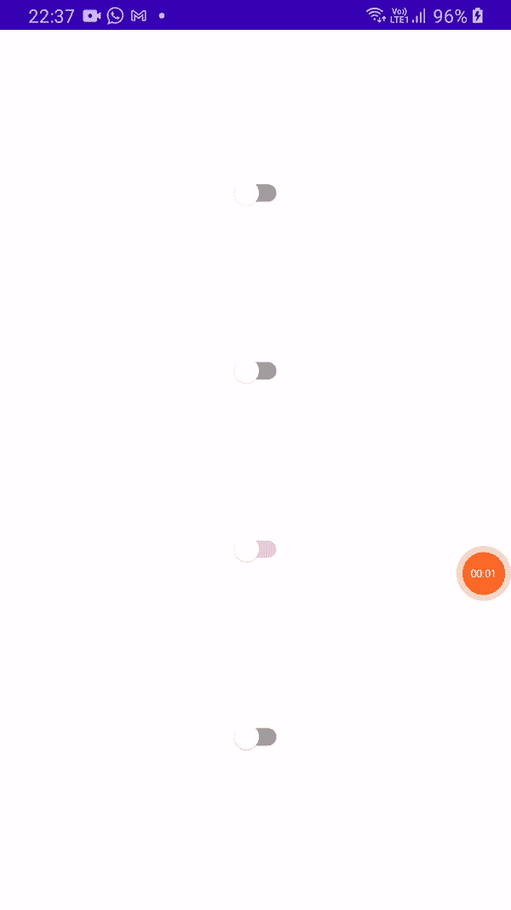

# Jetpack 撰写 Ep:11 —切换应用程序

> 原文：<https://medium.com/nerd-for-tech/jetpack-compose-ep-11-switch-app-829561337ba0?source=collection_archive---------5----------------------->

在本文中，我将简要介绍 Switch 组件的细节和属性，将它分解为多个函数。


Jetpack 撰写 Ep:11 —切换应用程序

为了完成你的基本工作，请访问我以前的文章，它们在下面给出:

*   [Jetpack 撰写剧集:1-只是文本应用](/kotlin-mumbai/jetpack-compose-series-1-basics-ep-1-just-text-app-4acb42f5d865)
*   [Jetpack 作曲第二集——卷轴 App](/kotlin-mumbai/jetpack-compose-series-1-basics-ep2-the-scroll-app-d1816a2eb3b3)
*   [Jetpack 作曲集:3 —按钮 App](/kotlin-mumbai/jetpack-compose-ep-3-button-app-1de33ffb885f)
*   [Jetpack 撰写剧集:4 —图标&图标切换按钮应用](/kotlin-mumbai/compose-studio-ep-4-icon-icon-toggle-button-app-9e3589d0bdb5)
*   [Jetpack 撰写剧集:5 —分割器应用](/@akshaysawant003/jetpack-compose-ep-5-divider-app-9b8131bc7cc4)
*   [Jetpack 作曲插曲:6 —悬浮动作按钮 App](/@akshaysawant003/jetpack-compose-ep-6-floating-action-button-app-fa14920ec638)
*   [Jetpack 撰写剧集:7 —扩展浮动动作按钮 App](/kotlin-mumbai/jetpack-compose-ep-7-extended-floating-action-button-app-b485681edc40)
*   [Jetpack 撰写剧集:8 —单选按钮应用](https://akshay-sawant.medium.com/jetpack-compose-ep-8-radio-button-app-c3188d2fed5a)
*   [Jetpack 撰写剧集:9 —进度指示器 App](https://akshay-sawant.medium.com/jetpack-compose-ep-9-progress-indicator-app-14b68fd87a1f)
*   [Jetpack 撰写剧集:10 —复选框应用](/nerd-for-tech/jetpack-compose-ep-10-checkbox-c79142e87268)

> *注:在* ***build.gradle(项目级)*** *文件中，****compose _ version****升级为****' 1 . 0 . 0-beta 01 '*******maven()****替换为* **依赖项也升级到类路径" com . Android . tools . build:gradle:7 . 0 . 0-alpha 08 "
> class path " org . jetbrains . kot Lin:kot Lin-gradle-plugin:1 . 4 . 30 "***
> 
> **和* ***build.gradle(模块级)*** *文件中，升级了以下依赖关系:**
> 
> **实现' com . Google . Android . material:material:1 . 3 . 0 '
> 实现' androidx . activity:activity-compose:1 . 3 . 0-alpha 03 '**

## *转换*

*它是可切换的组件，提供两种状态，即开或关。*

## *开关的属性*

*   *选中—布尔状态为开或关*
*   *onCheckedChange —当单击开关时调用，因此请求状态更改。如果这是动态的，它还可以依赖于更高级别的组件来控制“开”或“关”状态。*
*   *修饰符—要应用于开关的修饰符*
*   *启用—控制交换机的启用状态。如果为 false，此组件将不可选择，并显示在禁用的 ui 状态中*
*   *interactionSource —它用于表示交互流。MutableInteractionSource 可以根据我们的需要进行修改，并通过在不同的交互中定制该组件的外观或行为来将其传递给交换机*
*   *colors-Switch colors 将用于解析此开关在不同状态下使用的颜色。*

## *记住()*

*记住计算产生的价值。仅在合成期间评估计算。重新合成总是会返回合成产生的值。*

## *可变状态 Of()*

*返回一个新的 MutableState，用传入的值
初始化。MutableState 类是一个单值容器，它的读写由 Compose 观察。此外，对它的写入作为快照系统的一部分进行处理。*

## *MutableStateOf()的属性*

*   *值—可变状态的初始值*
*   *策略—控制如何在可变快照中处理更改的策略。*

## *SwitchDefaults.colors()*

*该功能用于表示开关在不同状态下使用的不同颜色。*

## *SwitchDefaults.colors()的属性*

*   *checkedThumbColor —当启用并选中开关时，它用于缩略图*
*   *checkedTrackColor —当启用并选中开关时，它用于轨迹*
*   *checkedtrackhal-它应用于 checkedTrackColor 和 disabledCheckedTrackColor*
*   *未选中 thumb color-当开关处于启用和未选中状态时，它用于缩略图*
*   *uncheckedTrackColor 在启用和取消选中开关时用于追踪*
*   *uncheckedTrackAlpha 它应用于 uncheckedTrackColor 和 disabledUncheckedTrackColor*
*   *disabledCheckedThumbColor —当开关被禁用和选中时，它用于缩略图*
*   *disabledCheckedTrackColor 它用于禁用和选中开关时的轨迹*
*   *disabledUncheckedThumbColor 当开关被禁用且未选中时，它用于缩略图*
*   *disabledUncheckedTrackColor 当开关被禁用且未选中时，它用于追踪*

## *简单开关()*

```
*@Composable
fun SimpleSwitch() {
    val mRemember = *remember* **{** *mutableStateOf*(false) **}** *Switch*(checked = mRemember.value, onCheckedChange = **{** mRemember.value = **it }**)
}*
```

## *启用开关()*

```
*@Composable
fun EnabledSwitch() {
    val mRemember = *remember* **{** *mutableStateOf*(false) **}** Switch(checked = mRemember.value, onCheckedChange = **{** mRemember.value = **it }**, enabled = true)
}*
```

## *禁用的开关()*

```
*@Composable
fun DisabledSwitch() {
    val mRemember = *remember* **{** *mutableStateOf*(false) **}** *Switch*(checked = mRemember.value, onCheckedChange = **{** mRemember.value = **it }**, enabled = false)
}*
```

## *CheckedThumbColorSwitch()*

```
*@Composable
fun CheckedThumbColorSwitch() {
    val mRemember = *remember* **{** *mutableStateOf*(false) **}** *Switch*(
        checked = mRemember.value,
        onCheckedChange = **{** mRemember.value = **it }**,
        enabled = true,
        colors = SwitchDefaults.colors(
            checkedThumbColor = Color.Cyan
        ),
        modifier = Modifier.*padding*(8.*dp*)
    )
}*
```

## *完全码*

```
*package com.akshay.switchapp

import android.os.Bundle
import androidx.activity.ComponentActivity
import androidx.activity.compose.setContent
import androidx.compose.foundation.layout.Arrangement
import androidx.compose.foundation.layout.Column
import androidx.compose.foundation.layout.fillMaxSize
import androidx.compose.foundation.layout.padding
import androidx.compose.material.Switch
import androidx.compose.material.SwitchDefaults
import androidx.compose.runtime.Composable
import androidx.compose.runtime.mutableStateOf
import androidx.compose.runtime.remember
import androidx.compose.ui.Alignment
import androidx.compose.ui.Modifier
import androidx.compose.ui.graphics.Color
import androidx.compose.ui.unit.dp
import com.akshay.switchapp.ui.theme.SwitchAppTheme

class MainActivity : ComponentActivity() {
    override fun onCreate(savedInstanceState: Bundle?) {
        super.onCreate(savedInstanceState)
        *setContent* **{** *SwitchAppTheme* **{** *// A surface container using the 'background' color from the theme
                Column*(
                    verticalArrangement = Arrangement.SpaceEvenly,
                    horizontalAlignment = Alignment.CenterHorizontally,
                    modifier = Modifier.*fillMaxSize*()
                ) **{** *SimpleSwitch*()
                    *EnabledSwitch*()
                    *DisabledSwitch*()
                    *CheckedThumbColorSwitch*()
                **}
            }
        }** }
}

@Composable
fun SimpleSwitch() {
    val mRemember = *remember* **{** *mutableStateOf*(false) **}** *Switch*(checked = mRemember.value, onCheckedChange = **{** mRemember.value = **it }**)
}

@Composable
fun EnabledSwitch() {
    val mRemember = *remember* **{** *mutableStateOf*(false) **}** Switch(checked = mRemember.value, onCheckedChange = **{** mRemember.value = **it }**, enabled = true)
}

@Composable
fun DisabledSwitch() {
    val mRemember = *remember* **{** *mutableStateOf*(false) **}** *Switch*(checked = mRemember.value, onCheckedChange = **{** mRemember.value = **it }**, enabled = false)
}

@Composable
fun CheckedThumbColorSwitch() {
    val mRemember = *remember* **{** *mutableStateOf*(false) **}** *Switch*(
        checked = mRemember.value,
        onCheckedChange = **{** mRemember.value = **it }**,
        enabled = true,
        colors = SwitchDefaults.colors(
            checkedThumbColor = Color.Cyan
        ),
        modifier = Modifier.*padding*(8.*dp*)
    )
}*
```

## *输出*

**

*Jetpack 撰写 Ep:11 —切换应用程序*

*如果有任何问题，请在评论区告诉我。*

*通过以下方式与我联系:*

*   *[推特](https://twitter.com/imAkshaySawant)*
*   *[领英](https://www.linkedin.com/in/akshay-sawant-a50a20137/)*
*   *[Github](https://github.com/Akshay-Sawant)*

*谢谢&快乐编码！*