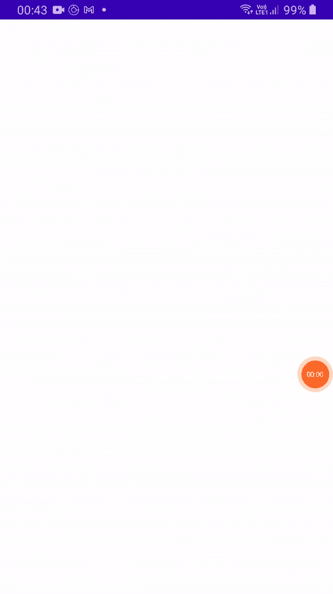

# Jetpack 撰写 Ep:8 —单选按钮应用程序

> 原文：<https://medium.com/nerd-for-tech/jetpack-compose-ep-8-radio-button-app-c3188d2fed5a?source=collection_archive---------4----------------------->

在这里，我们将通过将单选按钮分成多个部分来详细讨论它的属性。


Jetpack 撰写-单选按钮应用程序

为了完成你的基本工作，请访问我以前的文章，它们在下面给出:

*   [Jetpack 撰写剧集:1-只是文本应用](/kotlin-mumbai/jetpack-compose-series-1-basics-ep-1-just-text-app-4acb42f5d865)
*   [Jetpack 作曲第二集——卷轴 App](/kotlin-mumbai/jetpack-compose-series-1-basics-ep2-the-scroll-app-d1816a2eb3b3)
*   [Jetpack 作曲集:3 —按钮 App](/kotlin-mumbai/jetpack-compose-ep-3-button-app-1de33ffb885f)
*   [Jetpack 撰写剧集:4 —图标&图标切换按钮应用](/kotlin-mumbai/compose-studio-ep-4-icon-icon-toggle-button-app-9e3589d0bdb5)
*   [Jetpack 撰写剧集:5 —分割器应用](/@akshaysawant003/jetpack-compose-ep-5-divider-app-9b8131bc7cc4)
*   [Jetpack 作曲插曲:6 —悬浮动作按钮 App](/@akshaysawant003/jetpack-compose-ep-6-floating-action-button-app-fa14920ec638)
*   [Jetpack 撰写剧集:7 —扩展浮动动作按钮 App](/kotlin-mumbai/jetpack-compose-ep-7-extended-floating-action-button-app-b485681edc40)

> 注意:在 **build.gradle(项目级)**文件中， **compose_version** 升级为**‘1 . 0 . 0-beta 01’**， **maven()** 替换为 **mavenCentral()** 。依赖项也升级到类路径" com . Android . tools . build:gradle:7 . 0 . 0-alpha 08 "
> class path " org . jetbrains . kot Lin:kot Lin-gradle-plugin:1 . 4 . 30 "
> 
> *在* ***build.gradle(模块级)*** *文件中，下面的依赖项被升级:*
> 
> 实现' com . Google . Android . material:material:1 . 3 . 0 '
> 实现' androidx . activity:activity-compose:1 . 3 . 0-alpha 03 '

## 单选按钮

它是一个表示两种状态的组件，即选择或不选择。

## 单选按钮的属性

*   已选择—它是布尔状态，可以选择也可以不选择
*   onClick —单击 RadioButton 时调用的回调。如果为 null，则这是被动的，完全依赖于更高级别的组件来控制状态。
*   enabled —控制单选按钮的启用状态。如果为 false，此按钮将不可选择，并显示在禁用的 ui 状态中
*   修饰符—应用于单选按钮的修饰符
*   interactionSource 表示此 RadioButton 的交互流的 MutableInteractionSource。如果您想观察交互并在不同的交互中定制这个 RadioButton 的外观/行为，您可以创建并传入您自己记忆的 MutableInteractionSource。
*   colors-RadioButton colors 将用于解析此 radio button 在不同状态下使用的颜色。请参见单选按钮 Defaults.colors

## 记住()

记住计算产生的价值。仅在合成期间评估计算。重新合成总是会返回合成产生的值。

## 可变状态 Of()

返回一个新的 MutableState，用传入的值
初始化。MutableState 类是一个单值容器，它的读写由 Compose 观察。此外，对它的写入作为快照系统的一部分进行处理。

## MutableStateOf()的属性

*   值—可变状态的初始值
*   策略—控制如何在可变快照中处理更改的策略。

## RadioButtonDefaults.colors()

创建一个 RadioButtonColors，它将根据材质规范在所提供的颜色之间进行动画处理。它返回用于 RadioButton 的结果颜色

## RadioButtonDefaults.colors()的属性

*   selectedColor —单选按钮被选中并启用时使用的颜色。
*   unselect color—取消选中并启用单选按钮时使用的颜色。
*   disabledColor —单选按钮禁用时使用的颜色。

## 简单单选按钮

```
@Composable
fun SimpleRadioButton(mText: String) {
    val mRememberObserver = remember **{** *mutableStateOf*("") **}** RadioButton(
        selected = mRememberObserver.value == mText,
        onClick = **{** mRememberObserver.value = mText **}**)
}
```

## 禁用单选按钮

```
@Composable
fun DisabledRadioButton(mText: String) {
    val mRememberObserver = *remember* **{** *mutableStateOf*("") **}** *RadioButton*(
        selected = mRememberObserver.value == mText,
        onClick = **{ }**,
        enabled = false
    )
}
```

## 启用单选按钮

```
@Composable
fun EnabledRadioButton(mText: String) {
    val mRememberObserver = *remember* **{** *mutableStateOf*("") **}** RadioButton(
        selected = mRememberObserver.value == mText,
        onClick = **{** mRememberObserver.value = mText **}**,
        enabled = true
    )
}
```

## 禁用彩色单选按钮

```
@Composable
fun DisabledColouredRadioButton(
    mText: String
) {
    val mRememberObserver = *remember* **{** *mutableStateOf*("") **}** *RadioButton*(
        selected = mRememberObserver.value == mText,
        onClick = **{** */*TODO*/* **}**,
        enabled = false,
        colors = RadioButtonDefaults.colors(disabledColor = Color.Gray)
    )
}
```

## 启用彩色单选按钮

```
@Composable
fun EnabledColouredRadioButton(
    mText: String
) {
    val mRememberObserver = *remember* **{** *mutableStateOf*("") **}** *RadioButton*(
        selected = mRememberObserver.value == mText,
        onClick = **{** mRememberObserver.value = mText **}**,
        enabled = true,
        colors = RadioButtonDefaults.colors(selectedColor = Color.Blue)
    )
}
```

## 未选中的彩色单选按钮

```
@Composable
fun UnselectedColouredRadioButton(mText: String) {
    val mRememberObserver = *remember* **{** *mutableStateOf*("") **}** RadioButton(
        selected = mRememberObserver.value == mText,
        onClick = **{** mRememberObserver.value = mText **}**,
        enabled = true,
        colors = RadioButtonDefaults.colors(unselectedColor = Color.DarkGray)
    )
}
```

## 选择彩色单选按钮

```
@Composable
fun SelectedColouredRadioButton(mText: String) {
    val mRememberObserver = *remember* **{** *mutableStateOf*("") **}** *RadioButton*(
        selected = mRememberObserver.value == mText,
        onClick = **{** mRememberObserver.value = mText **}**,
        enabled = true,
        colors = RadioButtonDefaults.colors(selectedColor = Color.Red)
    )
}
```

## 分组单选按钮

```
@Composable
fun GroupedRadioButton(mItems: List<String>) {
    val mRememberObserver = *remember* **{** *mutableStateOf*("") **}** Column **{** mItems.*forEach* **{** mItem **->** *Row* **{** *RadioButton*(
                    selected = mRememberObserver.value == mItem,
                    onClick = **{** mRememberObserver.value = mItem **}**,
                    enabled = true,
                    colors = RadioButtonDefaults.colors(selectedColor = Color.Magenta)
                )
            **}** Text(text = mItem, modifier = Modifier.*padding*(start = 8.*dp*))
        **}
    }** }
```

## 带标签的单选按钮

```
@Composable
fun LabelledRadioButton(mText: String) {
    val mRememberObserver = *remember* **{** *mutableStateOf*("") **}** Row **{** *RadioButton*(
            selected = mRememberObserver.value == mText,
            onClick = **{** mRememberObserver.value = mText **}**,
            enabled = true,
            colors = RadioButtonDefaults.colors(selectedColor = Color.Yellow)
        )
        *Text*(text = mText, modifier = Modifier.*padding*(start = 8.*dp*))
    **}** }
```

## 完全码

```
package com.akshay.radiobuttonapp

import android.os.Bundle
import androidx.activity.compose.setContent
import androidx.appcompat.app.AppCompatActivity
import androidx.compose.foundation.layout.*
import androidx.compose.material.RadioButton
import androidx.compose.material.RadioButtonDefaults
import androidx.compose.material.Text
import androidx.compose.runtime.Composable
import androidx.compose.runtime.mutableStateOf
import androidx.compose.runtime.remember
import androidx.compose.ui.Alignment
import androidx.compose.ui.Modifier
import androidx.compose.ui.graphics.Color
import androidx.compose.ui.unit.dp
import com.akshay.radiobuttonapp.ui.theme.RadioButtonAppTheme

class MainActivity : AppCompatActivity() {
    override fun onCreate(savedInstanceState: Bundle?) {
        super.onCreate(savedInstanceState)
        *setContent* **{** *RadioButtonAppTheme* **{** *// A surface container using the 'background' color from the theme
                Column*(
                    verticalArrangement = Arrangement.SpaceEvenly,
                    horizontalAlignment = Alignment.CenterHorizontally,
                    modifier = Modifier.*fillMaxSize*()
                ) **{** *SimpleRadioButton*(mText = "Simple Radio Button")
                    DisabledRadioButton(mText = "Disabled Radio Button")
                    EnabledRadioButton(mText = "Enabled Radio Button")
                    DisabledColouredRadioButton(mText = "Disabled Coloured Radio Button")
                    EnabledColouredRadioButton(mText = "Enabled Coloured Radio Button")
                    UnselectedColouredRadioButton(mText = "Unselected Coloured Radio Button")
                    SelectedColouredRadioButton(mText = "Selected Coloured Radio Button")
                    GroupedRadioButton(
                        mItems = *listOf*(
                            "Grouped Radio Button 1",
                            "Grouped Radio Button 2",
                            "Grouped Radio Button 3"
                        )
                    )
                    LabelledRadioButton(mText = "Labelled Radio Button")
                **}
            }
        }** }
}

@Composable
fun SimpleRadioButton(mText: String) {
    val mRememberObserver = remember **{** *mutableStateOf*("") **}** RadioButton(
        selected = mRememberObserver.value == mText,
        onClick = **{** mRememberObserver.value = mText **}**)
}

@Composable
fun DisabledRadioButton(mText: String) {
    val mRememberObserver = *remember* **{** *mutableStateOf*("") **}** *RadioButton*(
        selected = mRememberObserver.value == mText,
        onClick = **{ }**,
        enabled = false
    )
}

@Composable
fun EnabledRadioButton(mText: String) {
    val mRememberObserver = *remember* **{** *mutableStateOf*("") **}** RadioButton(
        selected = mRememberObserver.value == mText,
        onClick = **{** mRememberObserver.value = mText **}**,
        enabled = true
    )
}

@Composable
fun DisabledColouredRadioButton(
    mText: String
) {
    val mRememberObserver = *remember* **{** *mutableStateOf*("") **}** *RadioButton*(
        selected = mRememberObserver.value == mText,
        onClick = **{** */*TODO*/* **}**,
        enabled = false,
        colors = RadioButtonDefaults.colors(disabledColor = Color.Gray)
    )
}

@Composable
fun EnabledColouredRadioButton(
    mText: String
) {
    val mRememberObserver = *remember* **{** *mutableStateOf*("") **}** *RadioButton*(
        selected = mRememberObserver.value == mText,
        onClick = **{** mRememberObserver.value = mText **}**,
        enabled = true,
        colors = RadioButtonDefaults.colors(selectedColor = Color.Blue)
    )
}

@Composable
fun UnselectedColouredRadioButton(mText: String) {
    val mRememberObserver = *remember* **{** *mutableStateOf*("") **}** RadioButton(
        selected = mRememberObserver.value == mText,
        onClick = **{** mRememberObserver.value = mText **}**,
        enabled = true,
        colors = RadioButtonDefaults.colors(unselectedColor = Color.DarkGray)
    )
}

@Composable
fun SelectedColouredRadioButton(mText: String) {
    val mRememberObserver = *remember* **{** *mutableStateOf*("") **}** *RadioButton*(
        selected = mRememberObserver.value == mText,
        onClick = **{** mRememberObserver.value = mText **}**,
        enabled = true,
        colors = RadioButtonDefaults.colors(selectedColor = Color.Red)
    )
}

@Composable
fun GroupedRadioButton(mItems: List<String>) {
    val mRememberObserver = *remember* **{** *mutableStateOf*("") **}** Column **{** mItems.*forEach* **{** mItem **->** *Row* **{** *RadioButton*(
                    selected = mRememberObserver.value == mItem,
                    onClick = **{** mRememberObserver.value = mItem **}**,
                    enabled = true,
                    colors = RadioButtonDefaults.colors(selectedColor = Color.Magenta)
                )
            **}** Text(text = mItem, modifier = Modifier.*padding*(start = 8.*dp*))
        **}
    }** }

@Composable
fun LabelledRadioButton(mText: String) {
    val mRememberObserver = *remember* **{** *mutableStateOf*("") **}** Row **{** *RadioButton*(
            selected = mRememberObserver.value == mText,
            onClick = **{** mRememberObserver.value = mText **}**,
            enabled = true,
            colors = RadioButtonDefaults.colors(selectedColor = Color.Yellow)
        )
        *Text*(text = mText, modifier = Modifier.*padding*(start = 8.*dp*))
    **}** }
```

## 输出:



Jetpack 撰写 Ep:8 —单选按钮应用程序

如果有任何问题，请在评论区告诉我。

通过以下方式与我联系:

*   [推特](https://twitter.com/imAkshaySawant)
*   [领英](https://www.linkedin.com/in/akshay-sawant-a50a20137/)
*   [Github](https://github.com/Akshay-Sawant)

谢谢&快乐编码！