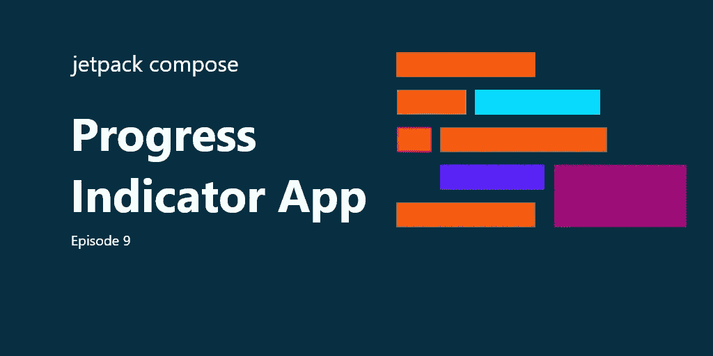
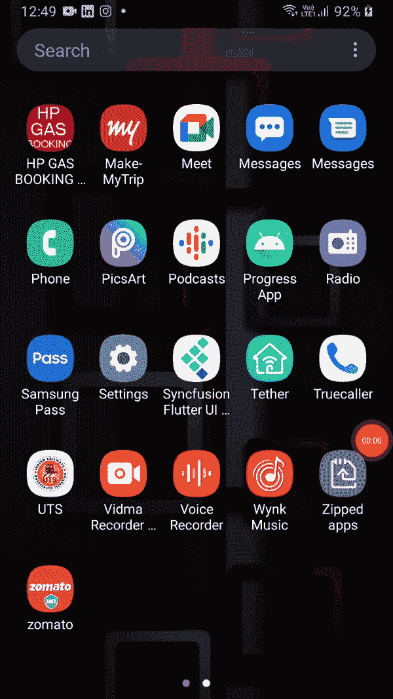

# Jetpack 撰写 Ep:9 —进度指示器应用程序

> 原文：<https://medium.com/nerd-for-tech/jetpack-compose-ep-9-progress-indicator-app-14b68fd87a1f?source=collection_archive---------3----------------------->

在这里，我们将了解进度指示器及其类型的属性。



Jetpack 撰写 Ep:9 —进度指示器应用程序

为了完成你的基本工作，请访问我以前的文章，它们在下面给出:

*   [Jetpack 撰写剧集:1-只是文本应用](/kotlin-mumbai/jetpack-compose-series-1-basics-ep-1-just-text-app-4acb42f5d865)
*   [Jetpack 作曲第二集——卷轴 App](/kotlin-mumbai/jetpack-compose-series-1-basics-ep2-the-scroll-app-d1816a2eb3b3)
*   [Jetpack 作曲集:3 —按钮 App](/kotlin-mumbai/jetpack-compose-ep-3-button-app-1de33ffb885f)
*   [Jetpack 撰写剧集:4 —图标&图标切换按钮应用](/kotlin-mumbai/compose-studio-ep-4-icon-icon-toggle-button-app-9e3589d0bdb5)
*   [Jetpack 撰写剧集:5 —分割器应用](/@akshaysawant003/jetpack-compose-ep-5-divider-app-9b8131bc7cc4)
*   [Jetpack 作曲插曲:6 —悬浮动作按钮 App](/@akshaysawant003/jetpack-compose-ep-6-floating-action-button-app-fa14920ec638)
*   [Jetpack 撰写剧集:7 —扩展浮动动作按钮 App](/kotlin-mumbai/jetpack-compose-ep-7-extended-floating-action-button-app-b485681edc40)
*   [Jetpack 撰写剧集:8 —单选按钮应用](https://akshay-sawant.medium.com/jetpack-compose-ep-8-radio-button-app-c3188d2fed5a)

> 注意:在 **build.gradle(项目级)**文件中， **compose_version** 升级为**‘1 . 0 . 0-beta 01’**， **maven()** 替换为 **mavenCentral()** 。依赖项也升级到类路径" com . Android . tools . build:gradle:7 . 0 . 0-alpha 08 "
> class path " org . jetbrains . kot Lin:kot Lin-gradle-plugin:1 . 4 . 30 "
> 
> *在* ***build.gradle(模块级)*** *文件中，下面的依赖项被升级:*
> 
> 实现' com . Google . Android . material:material:1 . 3 . 0 '
> 实现' androidx . activity:activity-compose:1 . 3 . 0-alpha 03 '

## 进度指示器

进度指示器是一个组件，它告诉用户当前正在进行的进程，如下载、处理、验证等。

在 Jetpack Compose 中，有两种类型的进度指示器，如下所示:

## 循环进度指示器

也称为*确定循环进度指示器*。它通过画一个**弧**来表示进度。圆弧范围从 **0 度到 360 度**。它不包含任何类型的默认动画。要在上面添加一些动画，我们可以使用**progression indicator defaults。ProgressAnimationSpec** 。这是推荐给它默认动画。

## 循环进度指示器的属性

*   进度—用于表示正在进行的进度，范围从 0.0(无进度)到 1.0(完全进度)。

> 注意:如果值超出给定范围，将被强制获取。

*   修饰符—它用于通过填充、填充大小等方式提供修改。
*   颜色—用于给进度指示器着色
*   strokeWidth 用于为其宽度提供描边

## 线性进度指示器

又称*确定性线性进度指示器*。它通过画一条水平的直线来表示进度。它不包含任何类型的默认动画。要在上面添加一些动画，我们可以使用**progression indicator defaults。ProgressAnimationSpec** 。这是推荐给它默认动画。

## 线性进度指示器的属性

线性进度指示器的属性只有一处更改，如下所示:

*   backgroundColor —背景色仅在线性进度指示器的进度完成之前(到达最末端)保持可见。

除了**行程宽度**在线性进度指示器中不可用外，其余与循环进度指示器的属性相同。

## 简单圆形进度指示器

```
@Composable
fun SimpleCircularProgressIndicator() {
    *CircularProgressIndicator*()
}
```


简单圆形进度指示器

## 特色循环进度指示器

```
@Composable
fun FeaturedCircularProgressIndicator() {
    *CircularProgressIndicator*(
        progress = 0.8f,
        modifier = Modifier.*padding*(8.*dp*),
        color = Color.Green,
        strokeWidth = 2.*dp* )
}
```


特色循环进度指示器

## 简单线性进度指示器

```
@Composable
fun SimpleLinearProgressIndicator() {
    *LinearProgressIndicator*()
}
```


简单线性进度指示器

## 特色线性进度指示器

```
@Composable
fun FeaturesLinearProgressIndicator() {
    *LinearProgressIndicator*(
        progress = 0.2f,
        modifier = Modifier.*padding*(8.*dp*),
        color = Color.Green,
        backgroundColor = Color.Red
    )
}
```


特色线性进度指示器

## 完全码

```
package com.akshay.progressapp

import android.os.Bundle
import androidx.activity.compose.setContent
import androidx.appcompat.app.AppCompatActivity
import androidx.compose.foundation.layout.Arrangement
import androidx.compose.foundation.layout.Column
import androidx.compose.foundation.layout.fillMaxSize
import androidx.compose.foundation.layout.padding
import androidx.compose.material.CircularProgressIndicator
import androidx.compose.material.LinearProgressIndicator
import androidx.compose.runtime.Composable
import androidx.compose.ui.Alignment
import androidx.compose.ui.Modifier
import androidx.compose.ui.graphics.Color
import androidx.compose.ui.unit.dp
import com.akshay.progressapp.ui.theme.ProgressAppTheme

class MainActivity : AppCompatActivity() {
    override fun onCreate(savedInstanceState: Bundle?) {
        super.onCreate(savedInstanceState)
        *setContent* **{** *ProgressAppTheme* **{** *Column*(
                    verticalArrangement = Arrangement.SpaceEvenly,
                    horizontalAlignment = Alignment.CenterHorizontally,
                    modifier = Modifier.*fillMaxSize*()
                ) **{** *SimpleCircularProgressIndicator*()
                    *FeaturedCircularProgressIndicator*()
                    SimpleLinearProgressIndicator()
                    FeaturesLinearProgressIndicator()
                **}
            }
        }** }
}

@Composable
fun SimpleCircularProgressIndicator() {
    *CircularProgressIndicator*()
}

@Composable
fun FeaturedCircularProgressIndicator() {
    *CircularProgressIndicator*(
        progress = 0.8f,
        modifier = Modifier.*padding*(8.*dp*),
        color = Color.Green,
        strokeWidth = 2.*dp* )
}

@Composable
fun SimpleLinearProgressIndicator() {
    *LinearProgressIndicator*()
}

@Composable
fun FeaturesLinearProgressIndicator() {
    *LinearProgressIndicator*(
        progress = 0.2f,
        modifier = Modifier.*padding*(8.*dp*),
        color = Color.Green,
        backgroundColor = Color.Red
    )
}
```

## 输出:



Jetpack Compose Ep:9—进度指示器

如果有任何问题，请在评论区告诉我。

通过以下方式与我联系:

*   [推特](https://twitter.com/imAkshaySawant)
*   [领英](https://www.linkedin.com/in/akshay-sawant-a50a20137/)
*   [Github](https://github.com/Akshay-Sawant)

谢谢&快乐编码！