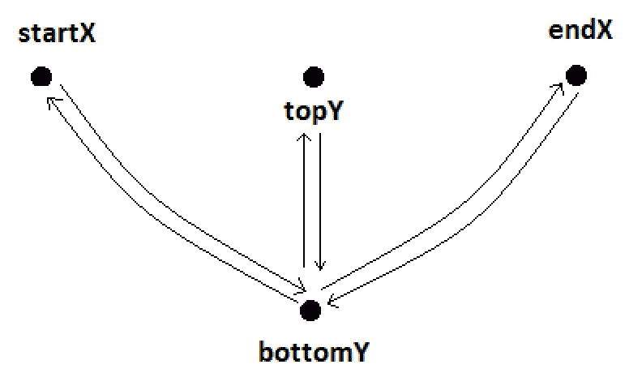

# 喷气背包组合——钟摆效应

> 原文：<https://medium.com/nerd-for-tech/jetpack-compose-pendulum-effect-72249685e6c6?source=collection_archive---------9----------------------->


在这篇文章中，我将向你展示如何在任何你想要的可组合物体上重现一个无限的**钟摆**效果。

为了使摆的想法简单，让我们这样想:



当一个钟摆摆动时，它基本上在 X 轴上从左到右运动，反之亦然，在 Y 轴上上下运动。

在这种情况下，我们只需要找到一种方法来在动画中表现这个从 **startX 到 endX** ，以及从 **topY 到 bottomY** 的运动。

正如你在我的 [**上一篇文章**](https://pauloaapereira.medium.com/jetpack-compose-pulsating-effect-4b9f2928d31a) 中看到的，我已经介绍了脉动效果动画，我们可以保持无限动画运行，同时改变**一个或多个**浮点值。

所以，如果我们把一个可组合的物体的 x 和 y 坐标做成动画，让它在我们希望钟摆摆动的范围内变化，我们就有了一个可工作的钟摆！

# 让我们开始工作:

让我们从声明我们将要使用的 infiniteTransition 开始。

> *infinite position 负责运行子动画。可以使用****infinite position . animate color****，****infinite position . animate float****或****infinite position . animate evalue****添加子动画。子动画一进入合成就开始运行，直到从合成中移除才会停止。*

```
val infiniteTransition = *rememberInfiniteTransition*()
```

然后，由于我们需要确定我们希望钟摆摆动的 x 和 y 范围，我们将使用一个名为“BoxWithConstraints”的可组合组件来访问它的 maxWidth 和 maxHeight。

现在，正如前面的图像示例中所确定的，我们需要定义变量 ***startX、endX、topY 和 bottomY*** 。

这些将以百分比形式对应于**位置，相对于**框中确定的最大宽度和最大高度**和约束**。

现在我们知道了钟摆摆动的范围，我们只需要激活它。

**X 值动画:**

钟摆的 X 坐标会摆动:

*   从**开始( *maxWidth * startX* )** 到**结束( *maxWidth * endX* )**
*   无限(***【无限重复】*** *)*
*   由一个特定的***【swing duration】***作为实参传递(如下所示)

**Y 值动画:**

摆锤的 Y 坐标会摆动:

*   从**顶部( *maxHeight * topY* )** 到**底部( *maxHeight * bottomY* )**
*   无限(**"*infinite repeatable "****)*
*   由一个特定的*作为实参传递过来(如下图所示)，**分成两半**。如果它没有被一分为二，它就不会像钟摆一样(会继续下降)，因为它需要与 X 轴相同的时间来反转方向。*

*然后，为了应用动画值，我们添加了另一个可组合的框，并使用它的偏移修改器函数来更改它的坐标。*

*在这个盒子里，我们的内容会像一个很酷的钟摆一样摆动！*

# ***用法:***

# *结果:*

**

***储存库:***

*[https://github . com/pauloaapereira/Medium _ JetpackCompose _ pendulum effect](https://github.com/pauloaapereira/Medium_JetpackCompose_PendulumEffect)*

***领英:**
[https://www.linkedin.com/in/paulo-pereira-001615153/](https://www.linkedin.com/in/paulo-pereira-001615153/)*

***推特:**
[https://twitter.com/pauloppereiraa](https://twitter.com/pauloppereiraa)*

*如果你喜欢，如果这对你有帮助，你也可以考虑请我喝杯咖啡。:]*

*谢谢大家！*