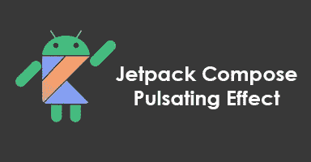
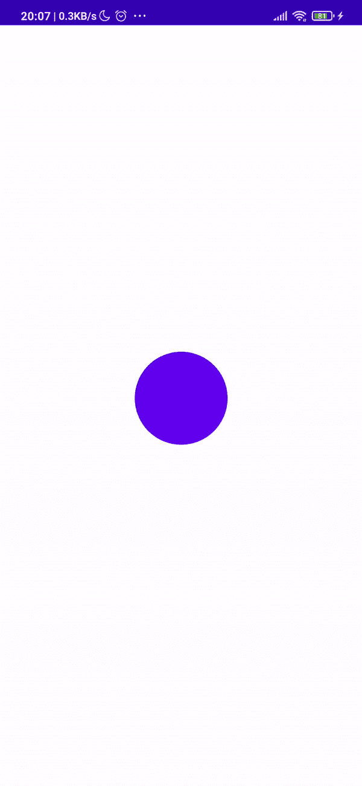

# 喷气背包组合—脉动效果

> 原文：<https://medium.com/nerd-for-tech/jetpack-compose-pulsating-effect-4b9f2928d31a?source=collection_archive---------5----------------------->



又见面了！

因此，自从 Android 团队发布了第一个测试版 [Jetpack Compose](https://developer.android.com/jetpack/compose) 以来，我一直在尽最大努力与所有的更新保持同步，关注 [Android 开发挑战](https://developer.android.com/dev-challenge)，并试图用它重现我的项目。

这一次，我将向您展示如何在您想要的任何可组合对象上再现无限的脉动效果。

“脉动”的概念非常简单。

脉动的东西，不时地增加和减少它的大小。

**为了修饰或改变组合 UI 元素的行为，我们可以使用修饰符。**

**修改器**接口，有一个扩展功能 **"scale"** :

```
fun Modifier.scale(scale: Float)
```

因此，从这里开始，我们已经知道了如何改变一个组合 UI 元素的大小/比例，我们只需要让它随着动画不断地增加和减少它的大小。

有一种特定类型的转换叫做**infinite position**，这正是我们正在寻找的。

> InfiniteTransition 负责运行子动画。可以使用**infinite position . animate color**、**infinite position . animate float**或**infinite position . animate value**添加子动画。子动画一进入合成就开始运行，直到从合成中移除才会停止。

从上面以粗体显示的动画的可能性来看，我们将使用 **animateFloat** ，它将在每个 ***重组*** 上返回一个浮点值，这是在重新绘制撰写 UI 元素时。

**在一个可组合的函数**中，我们可以以如下方式开始使用它:

这里，我们指定希望变量**“scale”**保持变化:

*   **在初始值 1f(构成 UI 元素大小的 100%)和目标值 1.2f(大小的 120%)之间**
*   **无限地(infiniteRepeatable)**
*   **每次运行持续 1000 毫秒(1 秒)【补间(1000)】**
*   **到达终点时反转(重复模式。反向)**

最终的实现将使用之前解释过的所有内容:

在最后的实现中，我们使用一个盒子，它将根据动画改变它的比例，来包围我们想要脉动的内容。

用法:

结果:



**仓库:**

[https://github . com/pauloaapereira/Medium _ JetpackCompose _ pulsing effect](https://github.com/pauloaapereira/Medium_JetpackCompose_PulsatingEffect)

**领英:**
https://www.linkedin.com/in/paulo-pereira-001615153/

**推特:**
[https://twitter.com/pauloppereiraa](https://twitter.com/pauloppereiraa)

如果你喜欢，而且这对你有帮助，你也可以考虑请我喝杯咖啡。:]

谢谢大家！