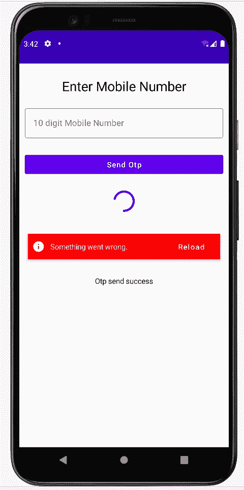

# 简化可组合屏幕的 Jetpack 组合状态管理。

> 原文：<https://medium.com/nerd-for-tech/jetpack-compose-state-management-for-composables-screen-made-simple-7817e5de7f0b?source=collection_archive---------1----------------------->

图片来自[https://kaaneneskpc . medium . com/state-management-in-jetpack-compose-7530 e 8490 d3d](https://kaaneneskpc.medium.com/state-management-in-jetpack-compose-7530e8490d3d)

大家好，😀

请进行第一天的 [**简介撰写&设置**](https://gondhalesatyam-28082.medium.com/1st-day-of-learning-jetpack-compose-db3865bc5ca4) [🏗️](https://emojipedia.org/building-construction/) 如果你还没有设置一个基本的合成项目。

我们已经知道， **Jetpack Compose** 现在被认为是 Android 的未来，是构建原生 UI 的现代工具包。主要的特点是，它用更少的代码、更强大的工具和更多的东西使你的应用变得生动。许多公司已经开始采用它或在 Compose 中迁移他们的旧东西。

在 Jetpack Compose 中，您会发现许多方法来管理 Web 上可组合屏幕的 Jetpack Compose 中的 [**状态。每个人都有不同的思维过程来用自己的实现管理可组合屏幕的状态。我提到了一个**](https://developer.android.com/jetpack/compose/state) **[**JetNews**](https://github.com/android/compose-samples/tree/master/JetNews) 示例项目思维过程，它使开发可组合屏幕时的状态管理变得容易。让我们借助一个在 99 %的应用中都能看到的屏幕的例子来讨论一下，在登机流程上的**-【OTP 验证】****

 [## SendOtp 可组合屏幕

### 此视频描述了 Jetpack 可组合屏幕的成功、失败和加载的不同 UI 状态。

youtube.com](https://youtube.com/shorts/OkDCKJ2TIdY?feature=share) 

这是屏幕的样子，有一个[**outlined textfield**](https://developer.android.com/jetpack/compose/text#enter-modify-text)， [**按钮**](https://satyamgondhale-writings.medium.com/3rd-day-of-learning-jetpack-compose-button-material-design-3-d1f3dae46e39) ， [**圆形进度指示器**](https://www.jetpackcompose.net/jetpack-compose-progress-indicator-progressbar) ，**错误视图**用于我们的示例**。**

图片来自 Android Studio 模拟器

## 这将如何工作？

1.  输入手机号码
2.  在正确的手机号码后启用发送 OTP 按钮
3.  模拟**加载**发送 OTP 的行为
4.  模拟发送 OTP **失败**的行为
5.  模拟发送 OTP **成功**的行为

**注意**:我们已经使用了 [**ViewModel**](https://developer.android.com/topic/libraries/architecture/viewmodel) 来处理可组合屏幕的业务逻辑，并将 VM 对象传递给可组合屏幕(在本文中，我们还没有介绍如何使用 MVVM 等来设置组合项目)

**send OTP 屏幕的可能状态&其表示**👇

1.  **初始**状态(当输入电话号码时，用户仅观察到 OutlinedTextField 的变化)
2.  **启用发送 Otp** 按钮状态(当输入正确的 10 位电话号码时)
3.  **发送 Otp** 状态(当用户按下发送 Otp 按钮时)
4.  **发送 Otp 失败**状态(任何情况下发生错误时)
5.  **发送 otp 成功**状态(当 Otp 发送成功时)

基于来自 VM 的 Api 响应(加载、成功、失败),我们将为我们的可组合屏幕获得更具体的 UI 状态👇

考虑 Api 失败状态示例工作👇

我们对失败状态的期望是应该禁用按钮，不应该显示加载状态，应该显示错误状态，不应该显示成功块。这就是 SendOtpUiState 类如何简单地进行管理😀

用于模拟行为和业务逻辑的视图模型代码👇

这就是关于 Compose 中**状态管理的基础知识。本文可能不会涵盖基于您的复杂实现用例的所有内容，但是您可以从这里开始。万事如意。[😃](https://emojipedia.org/grinning-face-with-big-eyes/)
您可以克隆此存储库进行基本设置。此外，源代码中所有概念都可以根据相同内容进行更新。(切换到分支**StateManagementOfCompose**)来实现。
[**https://github.com/SatyamGondhale/LearnCompose**](https://github.com/SatyamGondhale/LearnCompose)**

如果你认为这对你有帮助，请随意[👏🏻](https://emojipedia.org/clapping-hands-light-skin-tone/)【鼓掌】&分享。谢了。😄