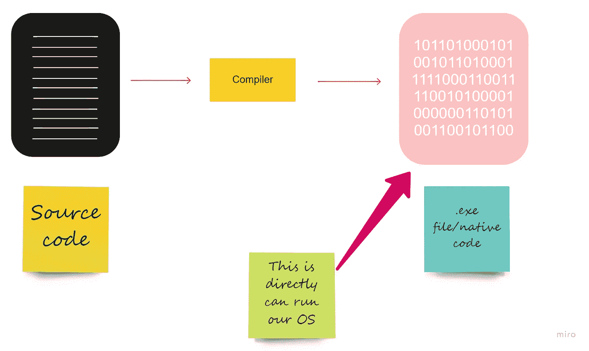
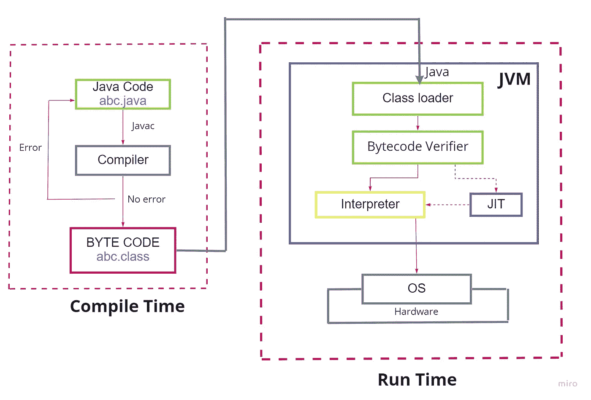
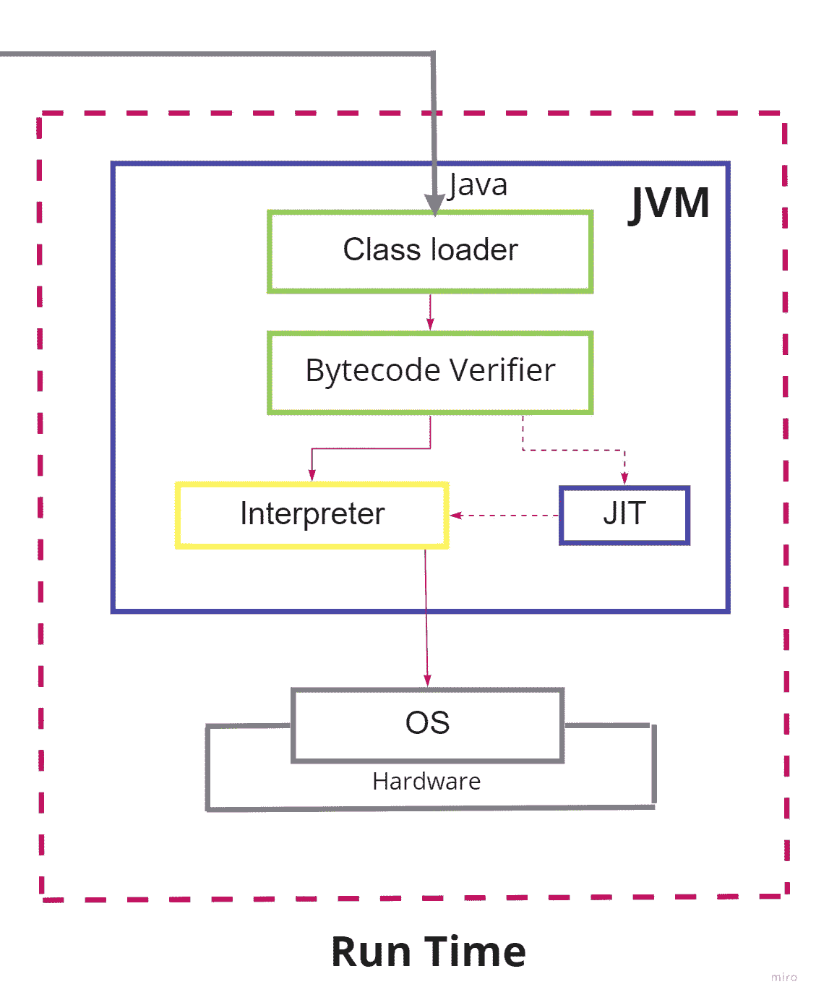
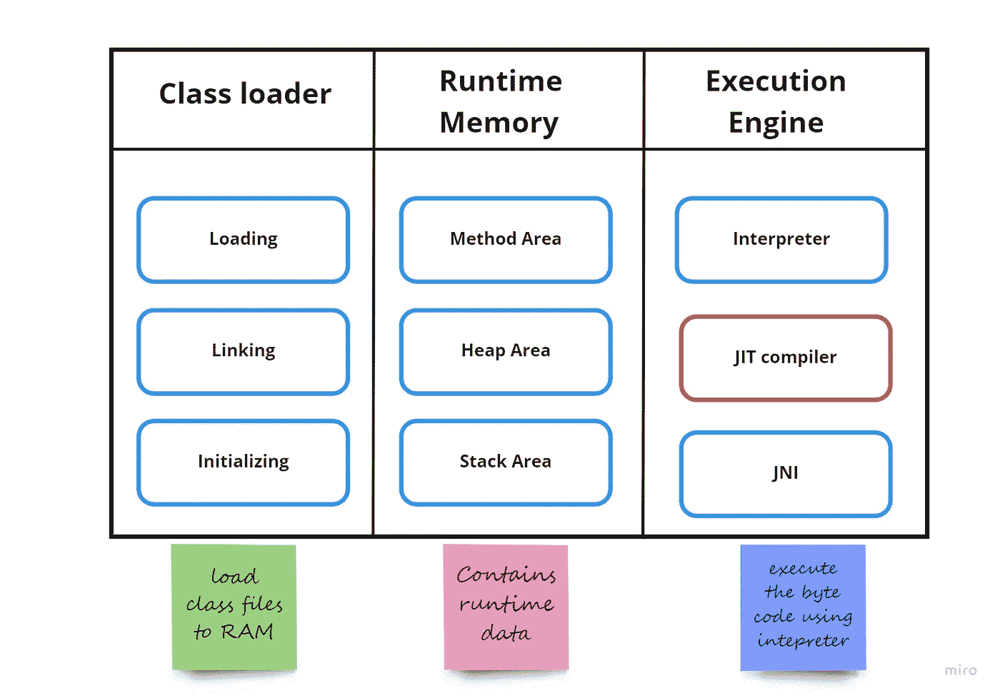
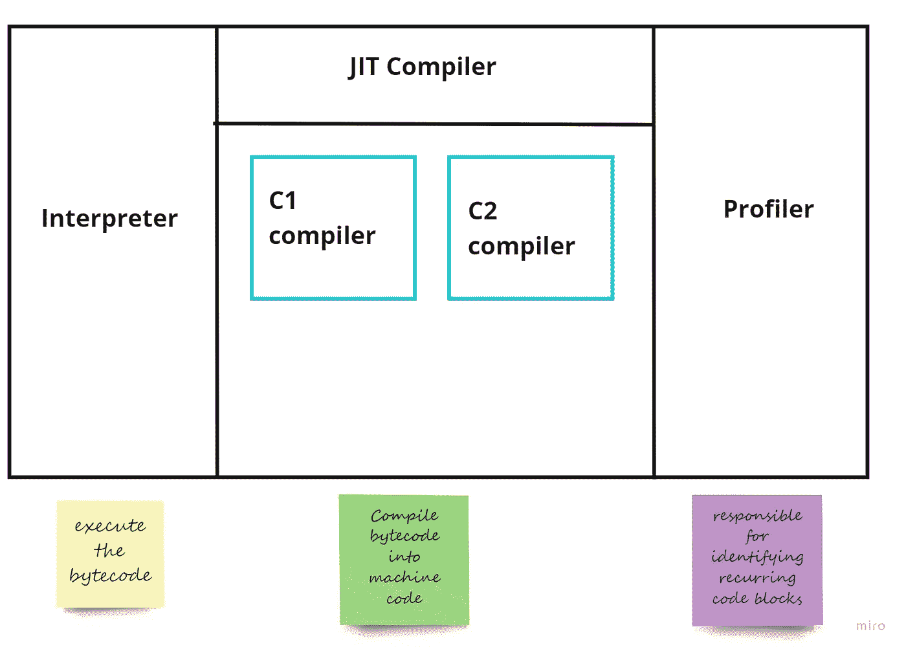

# JIT Java |实时(JIT)编译器

> 原文：<https://medium.com/nerd-for-tech/jit-java-just-in-time-jit-compiler-af1cc86fe53b?source=collection_archive---------3----------------------->


来自 [Pexels](https://www.pexels.com/photo/female-software-engineer-coding-on-computer-3861972/?utm_content=attributionCopyText&utm_medium=referral&utm_source=pexels) 的 [ThisIsEngineering](https://www.pexels.com/@thisisengineering?utm_content=attributionCopyText&utm_medium=referral&utm_source=pexels) 摄影

读者们，你们好！今天，我将在本文中讨论 Java JIT 编译器。其实这个 JIT 编译器是什么？和我们已经知道的正常编译一样吗？如果你很好奇，请务必阅读这篇文章。

在我们进入 JIT 编译器之前，理解一个程序如何在我们的计算机上运行是至关重要的。我们可以把程序在计算机上的运行分为两种类型。

1.  直接在我们的操作系统上执行程序。
2.  在我们的操作系统上运行的虚拟机上执行程序

让我们谈一谈直接在 OS 上执行程序的问题。

假设你正在写一个 C 程序。所以在你写完之后，你就有了 C 代码或者源代码。接下来，您将使用 cmd 或您的 IDE 运行该代码。在这种情况下，运行在操作系统上的 C 编译器会将源代码转换成. exe 文件。

> 编译器是一种软件程序，它将一种编程语言编写的计算机代码翻译成另一种语言。编译器用于将源代码从高级编程语言翻译成低级语言的程序。

所以我们终于有了一个可以直接运行我们操作系统的可执行文件。这个可执行文件是平台相关的。换句话说，如果您在 Linux 系统上运行 C 编译器，它将生成与 Linux 兼容的可执行文件。如果在 Windows 机器上执行，C 编译器会生成一个与 Windows 兼容的可执行文件。(所以，我们可以把这个命名为原生代码)。所以在程序执行之后，我们可以得到由我们的 OS 直接运行的可执行文件。



# 一个程序如何在虚拟机上运行？

我们将通过使用 Java 虚拟机(JVM)继续这一过程。



这是 Java 程序的完整执行。如你所见，与 C 程序不同，Java 程序是编译和解释的。首先，我们来看看 java 代码的编译。

编译时有 3 个步骤。

1.  编写 Java 代码(如图中的 abc.java)
2.  汇编
3.  编译后获取字节码(abc。如图中的类文件)


在这个过程中，我们将首先编写我们的 java 代码，并将其保存为一个. java 文件(abc.java)。因此，使用命令`javac abc.java`，接下来，我们将调用 javac 编译器，它将 java 代码转换成字节码。在这里我们可以得到。编译后的类文件(abc.class)。实际上，这个**字节码**不能被我们的操作系统直接理解。这只有我们 RAM 上的 Java 虚拟机才能理解。

按照这个类比，虚拟机就是一个程序，让你在这个机器上运行一个程序(字节码)，而不是直接在操作系统上运行。当我们直接在操作系统上运行代码时，我们称之为本机代码，当我们在虚拟机上运行代码时，我们称之为字节码。

这是 java 编译期的结束。现在接下来我们将转移到 java 程序的运行时间。



在编译结束时，我们得到的字节码是一个. class 文件。所以，接下来用`java abc`命令我们将加载**。类**文件/ **字节码**到 JVM 内部的**类加载器**中。

*了解一下 JVM(java 虚拟机)*

[](https://en.wikipedia.org/wiki/Java_virtual_machine) [## Java 虚拟机-维基百科

### Java 虚拟机(JVM)是一种虚拟机，它使计算机能够运行 Java 程序以及其他程序…

en.wikipedia.org](https://en.wikipedia.org/wiki/Java_virtual_machine) 

接下来，JVM 中的字节码验证器验证字节码，并确保它不会违反安全需求。紧接着，解释器或 JIT(即时)编译器的调用发生了。(在这一节之后，我们将更详细地讨论 JIT 编译器。)当我们谈到解释器时，它通过逐行读取将字节码转换成机器码(原生代码)。

编译器和解释器的主要区别在于，编译器一次将整个代码编译成机器码(本机代码)。而解释器通过逐行读取将代码转换成机器代码。所以我们可以说 Java 程序比其他语言如 C 慢，因为它在运行时使用解释器。

在解释程序解释完代码后，它被传送到操作系统并被执行。这就是程序如何在虚拟机中运行，而不是直接在操作系统上运行。

现在让我们进入主题，

# 实时(JIT)编译器

JIT 编译器将重复出现的字节码代码块转换成解释器可以立即使用的机器码。在 Java 中，JIT 是 JVM 的重要组成部分。与前一级相比，它将执行性能提高了 10 倍。换句话说，这是一个长期运行的计算机密集型应用程序，可以优化性能。它提高了 Java 应用程序在编译或执行过程中的性能。

JIT 编译器位于 JVM 内部。让我们看看 JVM 是如何组织的。



JVM 架构

java 虚拟机由 3 个组件组成

1.  类加载器
2.  运行时内存
3.  执行引擎

JIT 编译器位于执行引擎内部。在 JVM 中，执行引擎有几个子组件。对于 JIT 编译器的学习，我们只需要以下组件。

1.  解释者
2.  JIT 编译器
3.  仿形铣床

正如我前面提到的，JIT 编译器识别循环的程序块，并将它们转换成机器码。所以解释器不会一个接一个地转换那些重复出现的字节码。JIT 编译器将把循环字节码的机器码提供给解释器执行。同样，JIT 编译器优化了 Java 应用程序的性能。那么 JIT 编译器是如何识别循环代码块的呢？

为此，让我们看看执行引擎的组织。



正如您在图中看到的，profiler 是负责识别重复代码块的组件。让我们看一个例子。

```
public class Main {
  static void myMethod() {
    System.out.println("Hello World!");
  }public static void main(String[] args) { do{
             myMethod();
          }while(true);    
  }
}
```

在 javac 编译器编译了这个 java 代码之后，我们得到了字节码。上述代码的字节码由解释器逐行执行。所以我们可以看到`myMethod()`正在多次调用。在这种情况下，探查器会将它识别为整个程序中重复出现的代码块。执行机器中的分析器维护一个计数器，该计数器对方法调用的次数进行计数。当这个计数超过 JVM 中预定义的**阈值**时，JIT 编译器将其编译成本机代码，以便解释器在下一个`myMethod()`调用中使用该本机代码。如果特定的代码块通过了下一个阈值，JIT 编译器不会在此时停止，JIT 编译器会再次优化该代码块。这个过程分 4 个阶段进行。JIT 编译器为此提供了两个编译器。C1 和 C2 编译器是两种不同的编译器。对于 C1 编译器，我们称之为客户端编译器，对于 C2 编译器，我们称之为服务器编译器。

1 级、2 级和 3 级的编译和优化由 C1 编译器处理。第 4 级编译和优化由 C2 编译器处理。

然而，这并不是结束。JVM 做了更多的努力来减少完成一项任务所需的时间。存在称为代码缓存的内存部分。它类似于我们计算机的高速缓冲存储器。它的内存有限，JVM 标志可用于修改代码缓存。当一个代码块被多次调用时，JIT 编译器将该方法放在代码缓存中，以便解释器可以快速访问该代码块。但是，由于这是一种折衷，JIT 编译器不会将所有代码都添加到这个代码缓存中。JIT 编译器在这方面很聪明，因为它可以实现最高的效率。

简单来说，这就是 JIT 编译器优化 java 代码的方式。JIT 编译既有优点也有缺点。

# 优势:

*   JIT 编译器需要更少的内存。
*   程序启动后，JIT 编译器运行。
*   当代码运行时，可以对其进行优化。
*   可以最小化任何页面错误。
*   在同一页面上，一起使用的代码将被本地化。
*   可以使用不同级别的优化。

# 缺点:

*   您的计算机可能需要很长时间才能启动。
*   高速缓存被大量使用。
*   在 Java 应用程序中，这增加了复杂性。

所以我的文章到此结束。这是我到目前为止学到的 JIT 编译器的一个小描述。我希望你能在我的文章中找到有用的东西。非常感谢💖。